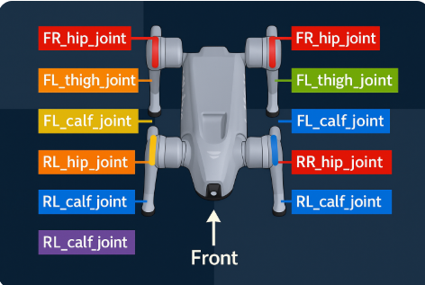
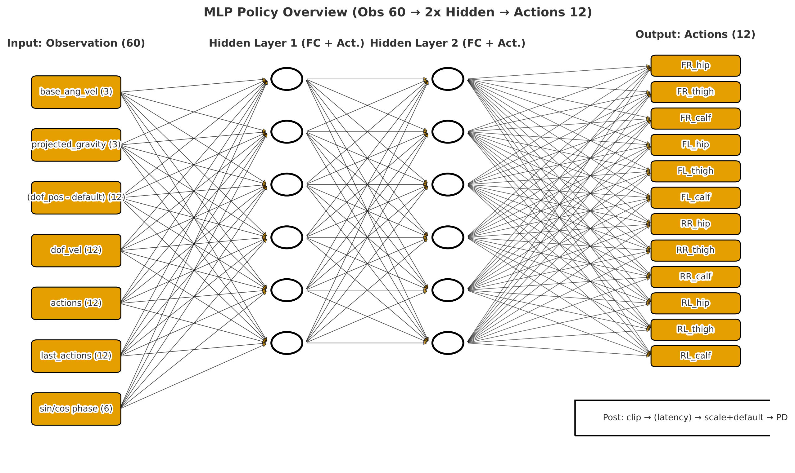
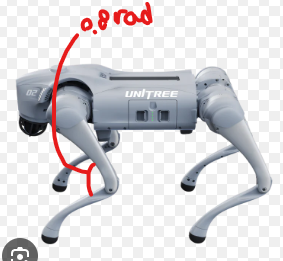
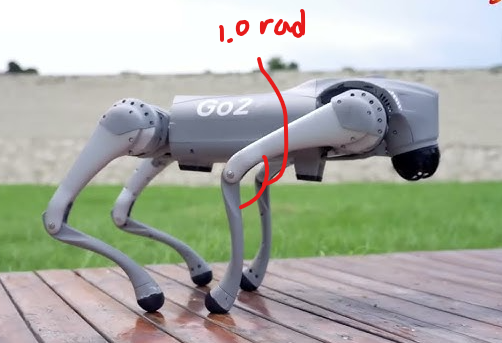

# 사족보행 Go2 Backflip 로봇 보고서
## 0. 초록(abstract)
- 본 보고서는 Genesis 시뮬레이터에서 동작하는 Go2 사족보행 로봇의 backflip 데모를 대상으로, 시뮬레이션의 흐름에 있어서 주요 사항 및 코드를 분석·정리 한다.
- 관측 60차원 -> 정책(MLP) -> 액션 12차원 -> PD 제어의 파이프라인을 도식화하고, 환경 설정/관측 설계/제어 스택/정책 구조/PPO 학습 개요/평가 프로토콜 및 결과를 체계적으로 기술한다.
- ai의 도움을 받되 확실하게 이해한 내용에 기반하여 정보를 기술한다.
## 1. 서론(Introduction)
- 문제 정의: 사전 학습된 정책을 사용하여 백플립 동작을 안정적으로 시연하고 구조를 설명하기
- 기여 요약
    1. 환경·관측·액션·제어 파이프라인의 정밀한 설명
    2. 60차원 관측 구성표 및 12관절 맵핑표 제공
    3. 신경망 출력 값들이 어떤 연산을 통해 어떻게 로봇에 적용되는 지에 대한 구체적인 설명
## 2. 시스템 개요(System Overview)
1. **정책 출력(actions, 12개)**
2. **클립**: 너무 큰 명령은 자름.
3. **지연 선택**: `simulate_action_latency=True`면 직전 스텝 값(`last_actions`)을 이번 스텝 실행값으로 사용.
4. **스케일 + 기본자세 더하기**  
   $$ q^* = (\mathrm{exec\_actions}) \cdot \mathrm{action\_scale} + \mathrm{default\_dof\_pos} $$
   → 이게 **목표 관절각(절대 위치)**.

5. **PD 제어(목표각 → 토크)**  
   현재 관절각 $q$·관절속도 $\dot{q}$를 읽어 **목표각 $q^*$**로 가도록 토크를 계산:  
   $ \tau = k_p \,(q^* - q) + k_d \,(\dot{q}^* - \dot{q}) $
   이 코드에선 **위치(각도) 제어**가 중점적이기에 $\dot{q}^*(목표 속도) = 0$ 로 둠.  
   → 결과: 각 관절에 줄 **토크(힘)** $\tau$ 생성

6. **물리 스텝 진행(토크 적용 → 상태 변화)**  
   - $\tau$를 각 관절에 적용하고 시뮬레이터를 $dt$만큼 전진.  
   - 몸 자세/각속도, 관절각/속도 등이 새 값으로 업데이트됨.

7. **새 관측(60) 생성 → 다음 스텝**  
   - 구성: base\_ang\_vel(3), projected\_gravity(3),  
     $(\mathrm{dof\_pos}-\mathrm{default})(12)$, dof\_vel(12),  
     actions(12), last\_actions(12), phase sin/cos(6)  
   - `last_actions ← actions` 갱신 후, **새 관측 60**을 정책 입력으로 사용.

---

**파이프라인 한 줄 요약**  

$$ \text{obs(60)} \\rightarrow\ \text{actions(12)} \\rightarrow\ \text{clip} \\rightarrow\ (\text{latency}) \\rightarrow\ q^* \\xrightarrow{\\text{PD}(k_p,k_d)\}\ \tau \\rightarrow\ \text{physics step} \\rightarrow\ \text{new obs(60)} \\rightarrow\\dots $$

## 3. 환경 설정(Environment Configuration)
### 3.1 핵심 파라미터 요약

| 파라미터 | 값 | 설명 |
|---|---:|---|
| `num_actions` | 12 | 액션 차원 = 관절 수 |
|$$ K_p, K_d $$| 70.0, 3.0 | (목표값-현재값)을 오차라고 할 때 이 오차값에 비례해 K_p가 토크를 더욱 강화, K_d는 그 힘을 억제 |
| `episode_length_s` | 기본 20.0 | 한 번의 동작을 몇 초 동안 보여줄지를 의미, 시간 제한을 거는 것 |
| `action_scale` | 0.5 | 정책 출력 → 관절 목표 스케일링 |
| `simulate_action_latency` | True | 1스텝 액션 지연 모사 |
| `clip_actions` | 100.0 | 액션 절대값 클리핑 |
| `base_init_pos` | [0, 0, 0.35] | 시작 높이 0.35 m |
| `base_init_quat` | [0, 0, 0, 1] | 무회전 시작, 죽 정면을 똑바로 보는 상태에서 출발(x,y,z,w) |
### 3.2 12개 관절 매핑

### 조인트 인덱스와 위치 매핑

| idx | 조인트 이름      | 위치 (Front/Rear, Left/Right) | 세그먼트 |
|---:|-------------------|-------------------------------|:-------:|
| 0  | FR_hip_joint      | 앞-오른쪽                      |  Hip(엉덩이)    |
| 1  | FR_thigh_joint    | 앞-오른쪽                      | Thigh(대퇴골)   |
| 2  | FR_calf_joint     | 앞-오른쪽                      |  Calf(종아리)  |
| 3  | FL_hip_joint      | 앞-왼쪽                        |  Hip    |
| 4  | FL_thigh_joint    | 앞-왼쪽                        | Thigh   |
| 5  | FL_calf_joint     | 앞-왼쪽                        |  Calf   |
| 6  | RR_hip_joint      | 뒤-오른쪽                      |  Hip    |
| 7  | RR_thigh_joint    | 뒤-오른쪽                      | Thigh   |
| 8  | RR_calf_joint     | 뒤-오른쪽                      |  Calf   |
| 9  | RL_hip_joint      | 뒤-왼쪽                        |  Hip    |
| 10 | RL_thigh_joint    | 뒤-왼쪽                        | Thigh   |
| 11 | RL_calf_joint     | 뒤-왼쪽                        |  Calf   |

- 해당 12개의 관절이 MLP의 결과물로서 출력됨
## 4. 관측 설계(Observation Design)
### 4.1. 60차원 구성표
| 항목                                 | 차원 | 스케일 | 성분/매핑                                                                                          | 쉬운 설명 |
|--------------------------------------|:----:|:------:|-----------------------------------------------------------------------------------------------------|-----------|
| base_ang_vel (base angular velocity) |  3   | x0.25  | **ωx**(roll: 전후축 회전속도), **ωy**(pitch: 좌우축 회전속도), **ωz**(yaw: 수직축 회전속도)        | 몸에 달린 **회전 속도계 3개**. 지금 얼마나 빠르게 끄덕/갸웃/회전하는지 |
| projected_gravity                    |  3   | x1.0   | **g_x**(앞뒤 성분), **g_y**(좌우 성분), **g_z**(위아래 성분, 서있으면 ≈−1, 뒤집히면 ≈+1) 예를들어 가만히 정면을 보고 있으면 (0,0,-1)         | 몸에 붙인 **수평계/나침반**. 중력이 몸 기준으로 어느 방향에서 끌어당기는지 |
| (dof_pos − default)                  | 12   | x1.0   | 12개 관절 편차: FR\_hip, FR\_thigh, FR\_calf, FL\_hip, FL\_thigh, FL\_calf, RR\_hip, RR\_thigh, RR\_calf, RL\_hip, RL\_thigh, RL\_calf | **기본자세에서 얼마나 더 굽혔/폈는지**를 나타내는 각도 차이 |
| dof_vel                              | 12   | x0.05  | 위 **12개 관절의 속도**(rad/s)                                                                     | 각 관절의 **속도계**. 지금 얼마나 빨리 움직이는지 |
| actions                              | 12   | x1.0   | 위 **12개 관절에 대한 현재 명령값**                                                                | 방금 부여된 **지시 메모**(무차원). 다음 판단에 **맥락** 제공 |
| last_actions                         | 12   | x1.0   | 위 **12개 관절에 대한 직전 명령값**                                                                | **한 템포 전 지시**. latency 켜지면 이번 스텝에 **이 값**이 실제로 적용되기도 함 |
| sin/cos phase                        |  6   | x1.0   | sin(φ), cos(φ), sin(φ/2), cos(φ/2), sin(φ/4), cos(φ/4)                                            |φ=π x (지금까지 지난 스텝수/전체 스텝 수)일 때 MLP가 현재 로봇의 동작을 유추하게끔 도와주는 값들 |
| **합계**                             | **60** |        |                                                                                                     |           |
## sin/cos phase — 이해가 안 됐던 개념 정리 (백플립 환경용)

### 1) 왜 `sin`과 `cos`를 함께 쓰나?
- 이 환경에선 위상을 **진행률 → φ ∈ [0, π]**로 매핑한다.  
- `sin(φ)`는 **시작(0)**과 **끝(π)**에서 값이 모두 **0**이라 **구분이 안 됨**.  
- `cos(φ)`를 함께 쓰면 **시작=+1, 끝=−1**로 **명확히 구분**된다.  
- 결과적으로 `(sin φ, cos φ)` **쌍**은 **[0, π] 구간에서 위상을 유일하게 표현**한다.

### 2) 왜 **여러 주파수**(φ, φ/2, φ/4)를 쓰나?
- **다중 스케일 타이밍**을 잡기 위해서다.  
  - `φ` : **큰 흐름**(이륙→공중→착지)  
  - `φ/2`, `φ/4` : **더 느린/긴 파형**으로 **세부 리듬**이나 **부분 반복**까지 포착  
- 여러 주파수를 함께 주면 MLP가 **시간적 특징을 더 풍부하게**(RNN 없이도) 학습한다.

### 3) 왜 **0→π**만 보나? (cos,sin의 주기인 2π가 아닌 이유)
- 백플립은 **한 번의 단발성 동작**(이륙→공중→착지)이고 끝나면 **리셋**된다.  
- 따라서 진행률을 **φ = π × (진행 스텝 / 전체 스텝)** 로 매핑해도 **타이밍 힌트**로 충분하다.  

---

### 작은 예시 (에피소드 100스텝 가정)
| 진행률 | φ        | sin(φ) | cos(φ) |
|:-----:|:--------:|:------:|:------:|
| 0%    | 0        | 0.00   | 1.00   |
| 50%   | π/2      | 1.00   | 0.00   |
| 100%  | π        | 0.00   | −1.00  |
## 5. 정책(MLP) 구조

## MLP 층 구성(총 7층)
- [1] Linear(60 → 512)

- [2] ELU 활성화

- [3] Linear(512 → 256)

- [4] ELU 활성화

- [5] Linear(256 → 128)

- [6] ELU 활성화

- [7] Linear(128 → 12) ← 최종 액션 출력
- 요약하자면 [Linear→ELU] × 3 + Linear(출력)의 구조
## Linear

- 역할
   - 
   - 입력 받은 변수들을 가중치를 통해 새 숫자들로 만든 후 바이어스(편향)을 더함
- 특징
   - 
   - y=wx + bias 와 같은 선형식의 계산이기에 이것만으론 복잡한 패턴은 못 만듦
## ELU
- 역할
   - 
   - Linear가 만든 숫자를 곡선으로 변형해줌
   - 양수는 거의 그대로 통과(거의 y=x)
   - 음수는 지수 곡선(α·(exp(x) − 1))으로 부드럽게 눌러줌 (보통 α=1)
- 특징
   - 
   - 비선형성을 주어 "언제 얼마나 다리를 펴라"와 같은 복잡한 패턴 표현 가능
   - 음수 이상치/노이즈를 -1에 가깝게 수렴시켜 완충해주는 역할을 함
## 6. MLP 출력 이후 과정 정리
### 6.1 클리핑(cliping)
- 목적: 목표값이 비정상적으로 커지는 것을 방지
- 보통 $a_{\min}=-1,; a_{\max}=1$와 같은 정규화 범위를 쓰지만 여기선 100으로 사실상 거의 상한선이 없다고 봐도 무방
### 6.2 지연(latency)
- True 혹은 False 값으로 조정
- 현실 하드웨어에도 통신/모터 지연이 존재, 이를 모사하면 명령이 즉각 반영되는 것이 아니기에 더 안정적으로 명령을 내리게 되고 미세 떨림/요동이 줄어드는 효과가 있음
- 예를 들어 latency가 true라면 t=100에서의 제어는 t=99때 냈던 값이 반영 됨
### 6.3 스케일(scale)
- 출력 값이 +0.4 rad이라면 여기에 스케일 값을 곱해 목표값을 줄이거나 키움
- 출력값이 음수인데 너무 점프가 약하다면?
   - action_scale을 조금 키워 더 구부리게 하기
- 출력값이 음수인데 점프가 너무 강해 불안정하다면?
   - action_scale을 낮춰 구부리는 정도를 완화하기
#### 예를 들어 기존 각도가 0.8rad(46도) 이고 MLP 출력값이 +0.4 , action_scale 값이 0.5라면?
   - 목표값=0.8+(0.4 x 0.5)=1.0
   - 즉 목표 각도가 1.0 rad이 되는 것  
   - 예시 이미지  

## 6.4 PD제어
- 토크 = kp x(목표각-현재각) - kd x (현재각속도)
   - kp(Proportional) : 오차값이 클 수록 더 세게 당김
      - 값이 커짐에 따라 목표에 더 빠르게 갈 수 있으나 발산할 수 있음
      - 값이 작으면 안정적이지만 목표에 느리게 감
   - kd(Derivative) : 과속을 눌러주는 힘
      - 현재 각속도에 비례해 토크 값에 브레이크를 걸어 안정적이게 바꿔줌
## 7. 이후 일어나는 일
### 1. 토크 적용 → 물리 한 스텝
   - PD제어로 만든 관절 토크가 로봇에 적용되고, 시뮬레이터가 0.02s만큼 전진
### 2. 센서/상태 갱신
- 위치,자세,속도,관절 각속도 등의 값들을 새로 읽어 버퍼에 저장시켜두고 이 값들을 다음 사이클에 사용
### 3. 종료 조건 점검
- 애피소드 길이 혹은 자세 등에서 한계를 초과하면 환경이 리셋
- 리셋 시 기본 자세/속도로 초기화되고, 에피소드 통계를 정리
### 4. 새 관측 60차원 벡터 구성 및 루프 진행
- 이후 과정은 위에 설명한 수순 반복

