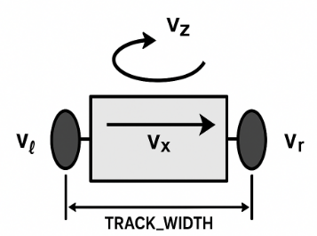
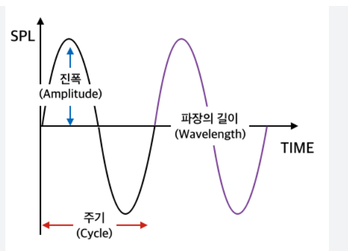
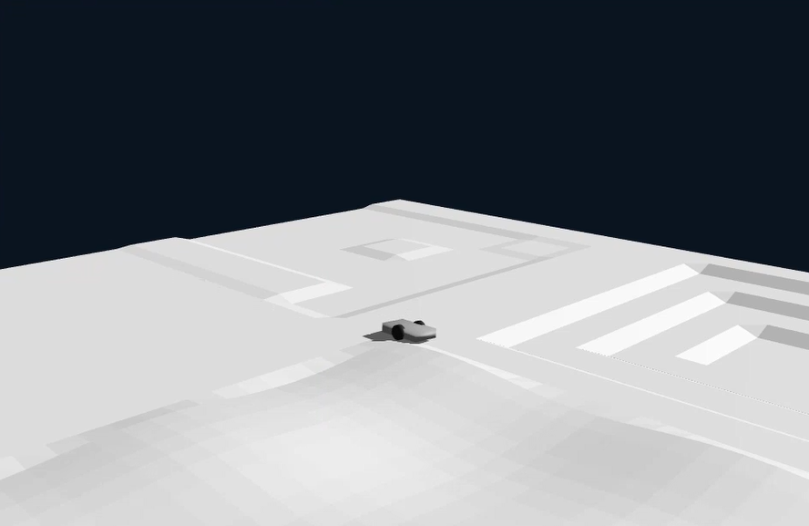
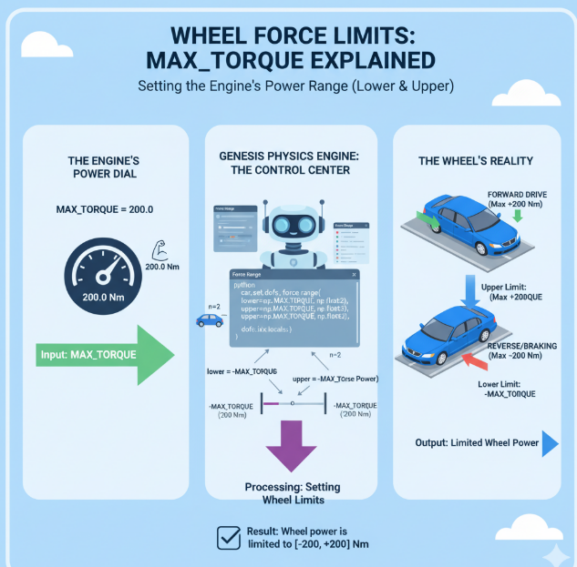
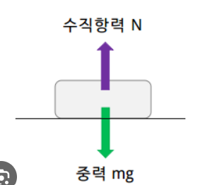

# Genesis_car_simulation report
## 0. 초록(abstract)
- 본 보고서는 Genesis 물리 시뮬레이션 엔진을 통한 자동차 시뮬레이션을 구현하고 구현 코드에 대한 주요함수를 그림과 함께 정리한다.
- genesis가 어떤 힘들을 계산하는지, 그 힘들이 코드에서 어떻게 적용됐는지를 기술한다.
- ai의 도움을 받되 이해한 내용을 바탕으로 작성한다.
## 1. 서론(Introduction)
- 문제 정의: genesis 물리 엔진을 이용하여 자동차 시뮬레이션을 돌려보고 주요 코드를 설명하기
- 목차
    - 주요 코드 정리
    - 시뮬레이션 루프
    - Genesis 엔진의 역할(물리적인 힘의 작용)
    - 시행 착오 정리 및 시뮬레이션
    
## 2. 주요 코드들 정리
### 1. diffdrive_cmd
- 직진 속도, 회전 중 직진 속도, 제자리 회전 속도 등의 값들을 받아 각 바퀴의 속도를 계산해주는 함수(직진 속도, 좌회전, 우회전 속도 등을 결정)  
    #### Q. 그럼 그 값들은 누가 주는가?
    - 코드에서 직접 입력 가능(이후 나올 예정)

```python
def diffdrive_cmd(vx: float, wz: float, dof_count: int) -> np.ndarray:
    v_l = (vx - 0.5 * wz * TRACK_WIDTH) / WHEEL_RADIUS
    v_r = (vx + 0.5 * wz * TRACK_WIDTH) / WHEEL_RADIUS
    if dof_count == 2:  return np.array([v_l, v_r], dtype=np.float32)
    if dof_count == 4:  return np.array([v_l, v_r, v_l, v_r], dtype=np.float32)
    return np.zeros(dof_count, dtype=np.float32)
```
- vx : 자동차가 앞으로 나아가는 속도(초당 몇 미터 가는지)
- wz : 자동차가 제자리에서 도는 속도(초당 몇 바퀴 도는지, 회전 속도)
- WHEEL_RADIUS : 바퀴의 반지름
- TRACK_WIDTH : 양쪽 바퀴 사이의 거리
- 4륜 구동인지 2륜 구동인지에 따라 반환하는 바퀴 속도의 개수가 달라짐
    - 이 값들을 기반으로 v_l(왼쪽 바퀴 속도)와 v_r(오른쪽 바퀴 속도)가 각각 얼마의 속도로 돌아야 하는지를 계산
    - 예를 들어 직진은 두 바퀴의 속도가 같고, 오른쪽으로 돌려면 오른쪽 바퀴보다 왼쪽 바퀴가 더 빨리 돌도록 명령

### 2. scene(가상 세계 생성) 과 terrain(지형 생성)
```python
scene = gs.Scene(
        sim_options=gs.options.SimOptions(dt=DT),
        viewer_options=gs.options.ViewerOptions(
            camera_pos=(7.5, -7.0, 3.5),
            camera_lookat=(0.0, 0.0, 0.4),
            camera_fov=40, max_FPS=60,
        ),
        show_viewer=True,
    )
```
- dt=DT(0.01), 즉 0.01초 마다 상황을 계산
- 카메라의 위치, 시선, 해상도, 최대 프레임 등을 결정
- 위와 같은 규칙과 함께 가상 세계를 만들어줌
```python
terrain = scene.add_entity(gs.morphs.Terrain(
        n_subterrains=N_SUBTERRAINS,
        subterrain_size=SUBTERRAIN_SIZE,
        horizontal_scale=0.25,
        vertical_scale=0.005,
        subterrain_types=SUBTERRAIN_TYPES,
    ))
```
- gs.morphs.Terrain : genesis에서 제공하는 지형 생성 툴
    - gs.morphs는 genesis에서 제공하는 다양한 도구
    - Terrain은 그 중에서도 지형을 의미
- N_SUBTERRAINS = (2,2)로 정의되었음
    - 지형을 2 by 2로 총 4개의 작은 지형을 만들겠다는 의미
- SUBTERRAIN_SIZE = (6.0,6.0)으로 정의되었음
    - 각 작은 구역의 크기를 6 by 6으로 설정
- horizontal_scale, vertical_scale
    - 각각 주파수의 주기, 주파수의 진폭이라고 이해하면 편함
    - 즉 horiaontal은 가로로 울퉁불퉁한 정도
    - vertical은 세로로 울퉁불퉁한 정도
      


### 3. car 불러오기
```python
car = scene.add_entity(gs.morphs.URDF(
        file=URDF_PATH,
        pos=(cx, cy, 0.25),
    ))
    # 접지 향상을 위해 마찰 조금 올리기(선택)
    try:
        car.set_friction(1.0)
    except Exception:
        pass
```
- URDF_PATH: 자동차의 설계도면(Unified Robot Description Format)
    #### URDF의 구성요소들
    1. 링크(link) : 자동차를 이루는 각각의 고정된 부품들(바퀴, 본체 등)
    2. 조인트(joint) : 두 개의 링크를 서로 연결하고, 어떻게 움직일 수 있는지를 정의(우리 몸의 관절과 비슷)
    - URDF 파일의 경우 아직 모르는 부분이 많아 필요시 더 자세히 학습하겠습니다.

- pos : 자동차의 생성 위치
    - cx,cy는 맵 정중앙을 의미 
    - z축 좌표를 0.25로 주어 자동차가 땅에 박히지 않게 살짝 띄워주기
- car.set_friction(1.0) : 이름 그대로 자동차 바퀴와 땅 사이의 마찰력을 1.0으로 설정한 것
### 4. dof 셋팅
```python
dofs = []
    for name in WHEEL_NAMES:
        try:
            dofs.append(car.get_joint(name).dof_idx_local)
        except Exception:
            print(f"[Error] Joint '{name}' not found in URDF: {URDF_PATH}")
            print(f"Hint) grep -oP '(?<=<joint name=\")[^\"]+' '{URDF_PATH}'")
            sys.exit(1)
    dofs = np.array(dofs, dtype=np.int32)
    n = len(dofs)
```
- dof: 자유도, 바퀴처럼 움직일 수 있는 부위를 의미
- WHEEL_NAMES = ["left_wheel_joint", "right_wheel_joint"]에서 바퀴 이름을 하나씩 꺼내 그 바퀴의 자유도 인덱스(Degree Of Freedom Index)를 dofs에 넣기
#### 이걸 하는 이유?
    - "왼쪽 바퀴는 0번, 오른쪽 바퀴는 1번"처럼 genesis가 자동차를 만들 때 매겨놓은 번호를 알아내는 것
    - 이 번호를 통해 genesis에게 "0번 바퀴를 움직여!" 와 같은 명령 내리기 가능
### 5. 바퀴에 힘 가하기
```python
car.set_dofs_kv(kv=np.full(n, KV, dtype=np.float32), dofs_idx_local=dofs)
    car.set_dofs_force_range(lower=np.full(n, -MAX_TORQUE, np.float32),
                             upper=np.full(n,  MAX_TORQUE, np.float32),
                             dofs_idx_local=dofs)
```
- KV: 바퀴의 속도 제어 민감도, kv값이 크면 목표속도에 도달하기까지의 시간이 매우 짧아짐
    - ex) KV가 크면 자동차가 엑셀에 민감하게 반응
    - 모든 바퀴에 민감도를 12로 적용
- force_range : 바퀴들이 낼 수 있는 토크(힘)의 범위
    - MAX_TOQUE는 위에 200으로 정의됨
    - 즉 이 자동차는 바퀴 하나당 최대로 200만큼의 힘을 낼 수 있음
        - lower는 뒤로 가게 하는 힘
        - upper는 앞으로 가게 하는 힘
      

## 3. 시뮬레이션 루프
```python
for t in range(STEPS):
        if t < 600:
            cmd = diffdrive_cmd(SPEED_STRAIGHT, 0.0, n)
        elif t < 1400:
            cmd = diffdrive_cmd(SPEED_TURN, YAW_TURN, n)
        else:
            cmd = zero
        car.control_dofs_velocity(cmd, dofs)
```
1. 처음 600번의 시간 간격은 SPEED_STRAGHT(2.5m/s)로 직진
2. 그 후 1400번 시간 간격 동안은 1.8m/s로 0.8만큼 회전
3. 그 후로는 정지
- 각 cmd 값은 car.control로 car 객체에게 전달
## 4. 물리적인 힘의 작용 & Genesis가 하는 일
- Genesis는 dt 시간 간격마다 시뮬레이션 세계에서 일어나는 모든 물리적인 상호작용을 계산함
1. 구동력 (Thrust Force): MAX_TOQUE 범위 내에서 명령받은 속도로 바퀴가 움직이고 이 때, 땅과의 마찰력(set_friction(1.0)) 덕분에 땅을 뒤로 밀어내고 자동차가 앞으로 나아감

2. 공기 저항 (Air Resistance): 자동차가 움직이는 속도에 비례해 바람의 저항을 받음
3. 마찰 저항 (Rolling Resistance): 바퀴가 지형 위를 굴러갈 때 발생하는 저항(울퉁불퉁한 길에서 저항이 더 커짐)
4. 중력 (Gravity Force): 자동차는 항상 아래로 잡아당겨짐
5. 수직 항력 (Normal Force): 중력으로 땅을 누르면, 땅이 자동차를 다시 위로 밀어내는 힘

- 이 모든 힘들을 계산해 자동차의 움직임을 예측, 업데이트함
- 자동차가 실제 물리 법칙으로 움직이는 것처럼 보임 
## 5. 시행 착오 정리
- 자동차가 생성이 되고 바퀴도 굴러가지만 제자리에서 움직이지 않는 문제 발생
- 코드의 주요 부분들을 읽고 이해하며 마찰력이 0인 것이 문제였음을 파악
    - car.set_friction(0.0)  
  

- car.set_friction(1.0)으로 수정 후 잘 동작하는 것을 확인  


- 깃허브에 mp4파일을 싣지 못 하는 관계로 실습실 pc 혹은 usb의 mp4 영상으로 전체 시뮬레이션 확인 가능
### 추가 사항
- Genesis github의 rigid_solver_decomp.py 파일에 자동차의 몸통, 바퀴들에 적용되는 중력, 마찰력, 토크 등을 받아서 어떻게 움직이고 속도가 어떻게 변하는지 등 모든 물리적인 움직임을 계산해주는 코드가 있는 것으로 확인
    - 약 6900줄 가량으로 필요시 더 학습해볼 예정
#### 그밖의 genesis 코드들
- 구속조건(바퀴가 차체에 고정)을 해결하는 constraint_solver_decomp.py
- 충돌을 감지하는 collider_decomp.py
- collider와 협력하여 더욱 정교하고 빠르게 충돌을 감지하는 세부 기술을 담은 gjk_decomp.py / mpr_decomp.py / support_field_decomp.py

- 자동차가 "미끄러지지 않는" 구속 조건을 다루는 constraint_noslip.py 등이 존재


