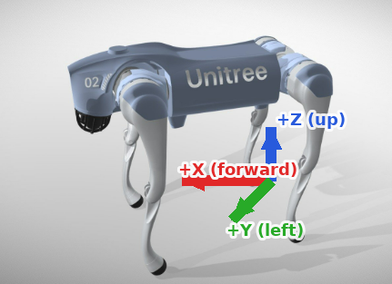
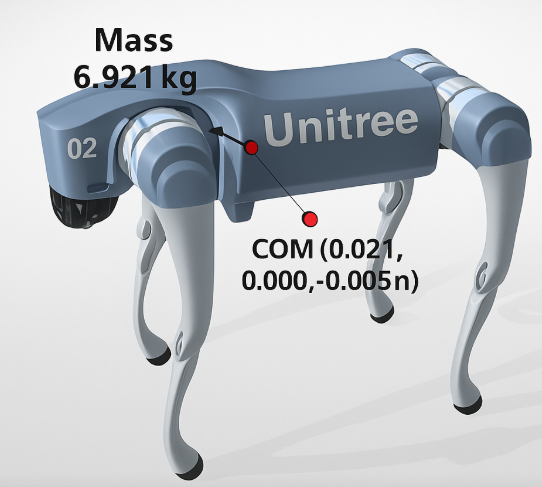
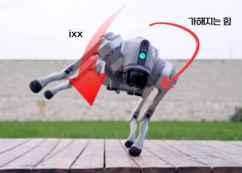
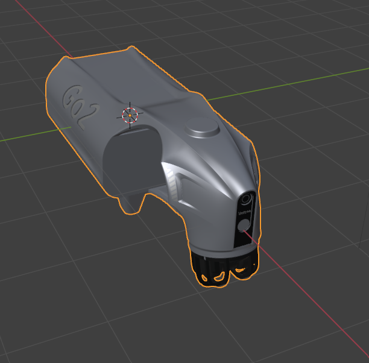
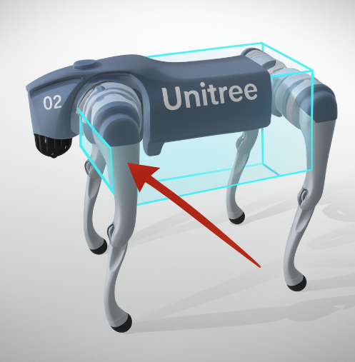
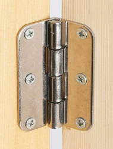
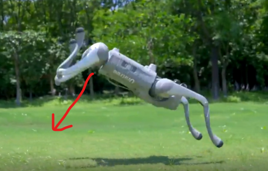
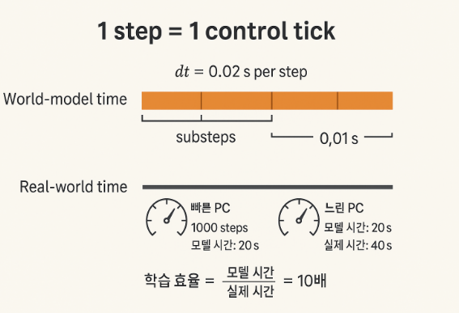

# backflip env,URDF 분석
## 좌표계 분석
- env.py 코드를 분석했을때, ROS 표준(NWU) (= 오른손 좌표계)를 사용함
    - + X = 전진(Forward)
    - + Y = 좌(Left)
    - + Z = 위(Up)


## 각 단위 맵핑
- ROS 표준에 따라 
    - xyz → 미터 (m)

    - rpy(roll,pitch,yaw) → 라디안 (rad)

    - mass → 킬로그램 (kg)

### 그 이유는?
```python
self.global_gravity = torch.tensor([0.0, 0.0, -1.0], ...)
```
- 중력 방향을 의미하는 코드 (env.py)
- (0,0,-1)로 중력이 작용하므로 +Z가 위쪽을 뜻함
2. +X가 전진, +Y가 좌측
```python
<joint name="FL_hip_joint" ...>
  <origin xyz="0.1934 0.0465 0" .../>
</joint>
<joint name="FR_hip_joint" ...>
  <origin xyz="0.1934 -0.0465 0" .../>
</joint>
```
- URDF의 앞다리 joint 코드
- 앞다리의 base가 +x 쪽에 있음
- 머리 또한 +x 쪽에 있고 뒷다리의 base는 -x 쪽에 있음
- 즉 + X축이 정면이라는 것!
```python
FL_hip_joint origin: xyz="0.1934 0.0465 0"   → y = +0.0465
RL_hip_joint origin: xyz="-0.1934 0.0465 0"  → y = +0.0465
```
- 마찬가지로 왼쪽 다리의 base가 + Y쪽에 있음
- base: 로봇의 몸통 중앙 좌표 (0,0,0)

## 1. 몸통(base)
```python
  <link
  name="base">
  <inertial>
    <origin
      xyz="0.021112 0 -0.005366"
      rpy="0 0 0" />
    <mass
      value="6.921" />
    <inertia
      ixx="0.02448"
      ixy="0.00012166"
      ixz="0.0014849"
      iyy="0.098077"
      iyz="-3.12E-05"
      izz="0.107" />
  </inertial>
```
- 로봇의 base 링크 주요 부분
- mass: 로봇 몸통의 무게(6.921kg)
- origin xyz: 로봇 몸통의 무게중심 위치 (base와 약간 다른 지점인걸 알 수 있음)



#### inertia
```scss
[ ixx  ixy  ixz ]
[ ixy  iyy  iyz ]   ← 대칭(윗삼각, 아랫삼각이 같음)
[ ixz  iyz  izz ]
```
- **ixx, iyy, izz**: 각 축(x, y, z)에 대한 기본 회전저항(대각 원소)
- **ixy, ixz, iyz**: 축들이 기울어져 있거나 물체가 한쪽으로 비대칭일 때 생기는 축 사이의 반응 정도
    - ixy면 x축 회전에 y축이 얼마나 참견하는지를 나타내는 값(=iyx)
- z축 회전저항이 가장 크기에 z축으로 돌릴 때 제일 둔하게 느껴질 것
- 예시: 질량 m, 가로 a(x), 세로 b(y), 높이 c(z):
- Ixx = (m/12) * (b² + c²)

- Iyy = (m/12) * (a² + c²)

- Izz = (m/12) * (a² + b²)
- 1/12는 ‘중심 기준으로 균일하게 퍼진 길이의 평균 제곱거리’에서 오는 상수



## 2. 시각(겉모습)
```python
  <visual>
    <origin
      xyz="0 0 0"
      rpy="0 0 0" />
    <geometry>
      <mesh
        filename="../dae/base.dae" />
    </geometry>
    <material
      name="">
      <color
        rgba="1 1 1 1" />
    </material>
  </visual>
```
- 화면에 보일 3D 모델 파일(dae)과 색상
    - 색상은 RGBA(0~1) = 1111이므로 **흰색**, 불투명 100%를 의미



- 3D 모델 파일을 찾아 Blender로 열어본 모습
## 3. 충돌(물리 계산용 모양)
```python
  <collision>
    <origin rpy="0 0 0" xyz="0 0 0" />
    <geometry>
      <box size="0.3762 0.0935 0.114" />
    </geometry>
  </collision>
</link>
```
- 물리엔진이 부딪힘을 계산할 때 쓸 단순한 상자 모양
- 진짜 복잡한 겉모습 대신, 계산이 쉬운 상자로 “몸통 크기”를 잡아주는 것



### 3-1. 힙 조인트_회전축/범위/힘
```python
<joint
  name="FL_hip_joint"
  type="revolute">
  <origin
    xyz="0.1934 0.0465 0"
    rpy="0 0 0" />
  <parent
    link="base" />
  <child
    link="FL_hip" />
  <axis
    xyz="1 0 0" />
  <limit
    lower="-1.0472"
    upper="1.0472"
    effort="23.7"
    velocity="30.1" />
</joint>
```
- 앞-왼쪽 다리(FL)와 힙 관절을 정의
    - base —(관절)— FL_hip 로 연결.
- "revolute" type



- revolute 타입은 문 경첩처럼 한 축으로만 돌아감

- base(몸통)을 기준으로 (0.1934,0.0465,0)에 달려있음
    - 즉 왼쪽 앞다리는 몸통 원점에서 앞으로 19.34cm, 왼쪽으로 4.65cm, 위/아래 0에 위치
- rpy(roll,pitch,yaw)는 없음
- 회전축이 (1,0,0)이므로 x축을 중심으로밖에 회전하지 못 함
    - 하지만 다리 전체는 다른 관절들이 있기에 여러 방향으로 움직일 수 있음

- ±1.0472 rad ≈ ±60° → 뒤로 최대 60°, 앞으로 최대 60°.
- effort(모터 최대 토크) = 23.7
- velocity(최대 각속도) = 30.1(rad/s)

[go2_robot_joint_compressed.mp4](Graphics_Study_Genesis_Ai/video/go2_robot_joint.mp4)


- 위 영상처럼 엉덩이,허벅지,종아리 관절 각각 한 축에 대해서만 움직임
    - 발은 고정된 형태
## 4. 센서
### 4.1 IMU 관성 센서
```python
<link name="imu">
  <inertial>  <!-- mass=0, inertia=0 -->  </inertial>
</link>
<joint name="imu_joint" type="fixed">
  <origin xyz="-0.02557 0 0.04232" rpy="0 0 0" />
  <parent link="base" />
  <child  link="imu"  />
</joint>
```
- 무게,관성이 0인 센서를 몸통에 회전,이동 없이 고정된 상태로 붙여두겠다는 코드
- IMU는 각속도와 가속도를 측정하는 역할을 수행
### 4.2 레이더(Radar)
```python
<link name="radar">
  <inertial>  <!-- mass=0, inertia=0 -->  </inertial>
</link>
<joint name="radar_joint" type="fixed">
  <origin xyz="0.28945 0 -0.046825" rpy="0 2.8782 0" />
  <parent link="base" />
  <child  link="radar" />
</joint>
```
- IMU와 마찬가지로 무게, 관성이 0이고 고정된 채 몸통에 붙어있는 센서
- 장애물 회피, 동적 물체 인식 등의 역할을 수행
#### 레이더 센서 특이한 점
- 전파를 쏘고 되돌아오는 신호로 주변 물체의 **거리**와 **상대 속도**를 재는 센서
- But 피치(Pitch)가 2.8rad 즉 약 165도 만큼 기울어져 있는 상태(후방 주시)
- 백플립 동작에서 지면과의 거리/상대 속도를 안정적으로 얻기 위한 것으로 보임



- 위 백플립은 사진처럼 후방 주시가 필요한 동작임
# Real World와 World-model space 사이의 시간
### Training에서 1 step의 의미
- 1 step = 1 control tick
    - 즉 행동 -> 계산 -> 업데이트 한 주기가 1 step
### 시간 단위
- self.dt = 0.02 -> 한번의 시뮬레이션 스텝이 0.02초 (=20ms) 진행
    - 실제 계산은 1step(substep 2개)에 2번일어남
    - 즉 매 step마다 1번의 검토과정을 거침
### Real World와의 시간 단위 차이는?
- 1 step = 0.02초는 시뮬레이션 세계에서의 시간
- 즉 현실의 시간과는 다를 수 있음
    - 이는 PC 성능에 따라 좌우됨
#### 예를들어 1000step을 도는 데 실제로 2초밖에 안 걸린다면?
- 학습효율 = 시뮬레이션 시간 / 실제 시간 = 10
- 즉 로봇이 10배 빠르게 학습한다는 뜻


# go2 로봇의 현실 스펙과 가상 스펙 비교
| 항목                              | 현실 스펙 (제조사 발표)                                                                | URDF/코드 해석                                                                          |
| ------------------------------- | ----------------------------------------------------------------------------- | ----------------------------------------------------------------------------------- |
| **무게**                          | 약 15 kg (배터리 포함)                                                              | 링크 질량 합 ≈ 15.3 kg → 현실과 거의 동일                                                       |
| **본체 크기**                       | 약 70 × 31 × 40 cm                                                             | 충돌박스 약 38 × 9 × 11 cm → **단순화 모델, 실제보다 작음**                                         |
| **조인트 개수**                      | 12자유도 (Hip, Thigh, Calf × 4다리)                                                | 12 자유도 정의  -> 동일                                                              |
| **앞다리 힙 관절 위치**                 | 몸체 앞쪽 좌우에 배치                                                                  | FL: 앞(+x)·왼쪽(+y), FR: 앞(+x)·오른쪽(-y) ->  동일                                                 |
| **뒷다리 힙 관절 위치**                 | 몸체 뒤쪽 좌우에 배치                                                                  | RL: 뒤(-x)·왼쪽(+y), RR: 뒤(-x)·오른쪽(-y)          ->  동일                                   |
| **다리 구조 (Thigh → Calf → Foot)** | 위에서 아래로 이어짐, 발끝이 지면 접촉                                                        | Hip→Thigh→Calf→Foot 순, z축 음수(-z) 방향으로 점점 아래쪽으로 이어짐 , 동일                            |
| **조인트 회전 범위**                   | Thigh: –200°\~+90° (–3.49\~+1.57 rad)<br>Calf: –156°\~–48° (–2.72\~–0.84 rad) | URDF Thigh: –1.57\~+3.49 rad<br>Calf: –2.72\~–0.84 rad → calf는 유사, thigh는 좌우 불일치 있음 |
| **최대 관절 토크**                    | 약 45 N·m (peak torque)                                                        | URDF effort: Hip/Thigh=23.7, Calf=35.55 → 현실보다 작게 설정됨                               |
| **관절 속도**                       | 약 30 rad/s (Hip/Thigh), 20 rad/s (Calf)                                       | URDF velocity=30.1 (Hip/Thigh), 20.07 (Calf) → 거의 동일                                |
| **제어 주기**                       | 50 Hz (20 ms)                                                                 | 코드 `dt=0.02 s` → 동일                                                                 |
| **IMU 위치**                      | 본체 상단·중심 근처                                                                   | URDF: 본체 중심에서 약간 뒤(-x)·위(+z)                                                        |
| **전방 센서 (레이더/카메라)**             | 앞쪽 머리 부분, 약간 아래 방향                                                            | URDF: 앞(+x)·아래(-z)·약간 기울어진채(rpy=0 2.87 0) 위치                                         |
### 스펙 요약
#### 유사한 부분
- 무게, 자유도, 제어 주기, 속도 리밋, 외형은 현실과 잘 맞음.
#### 다른 부분
1. 토크 effort 값은 현실 peak 토크(45 N·m)보다 낮게 세팅 → 안정성 위해 보수적 추정.

2. 조인트 범위(thigh) 좌우 다리 값이 완전히 대칭이 아님 → 실제론 좌우 동일해야 정상.

3. 센서 위치는 URDF에 들어있지만, 현실 정확도는 반드시 캘리브레이션 필요.

4. 본체 크기는 충돌 단순화 모델이라 현실보다 작게 잡혀 있음.


