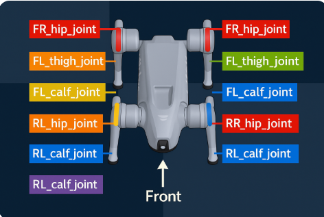

# 한 Rollout에서의 Data size
- 용어를 정리하다보니 데이터 사이즈와 무관한 용어 설명이 다소 길어졌습니다.
- 본 보고서에선 Data_size 계산 파트부터 본격적인 내용을 다룹니다. 
## 총 transition 수
- num_envs × num_steps_per_env = 4096 × 24 = 98,304
## 각 step마다 버퍼에 저장되는 항목
- 관측 데이터(obs) : 45
- actions : 12
- rewards : 1
- dones(or timeouts) : 1
- values : 1
- log_probs : 1
- GAE 후 advantages : 1
- returns : 1
## 각 항목이 의미하는 것?
### obs
- 정책망 입력값(=관측 벡터)
- 백플립의 경우 60차원 벡터였음
- 보행 예제에선 45차원  

| 항목 | 뜻 (기술적 설명) | 쉬운 비유 |
|---|---|---|
| `base_ang_vel * obs_scales["ang_vel"]` (3) | 로봇 몸통의 각속도(x,y,z). 스케일링으로 수치 안정화. | 로봇이 좌우/앞뒤로 **얼마나 빨리 흔들리는지** |
| `projected_gravity` (3) | 로봇 자세 프레임에서 본 중력 벡터. | 의자를 기울이면 **중력이 옆으로 당기는 느낌** |
| `commands * commands_scale` (3) | 목표 명령(앞/옆 선속, 요 회전속도). 스케일로 크기 맞춤. | 현재 스텝에서 목표로 하는 값 |
| `(dof_pos - default_dof_pos) * obs_scales["dof_pos"]` (12) | 각 관절의 현재 각도에서 기본자세와의 차이. | **무릎/팔을 평소보다 얼마나 굽혔는지** |
| `dof_vel * obs_scales["dof_vel"]` (12) | 각 관절의 각속도(움직이는 빠르기). | 팔/다리를 **얼마나 빨리 휘두르는지** |
| `actions` (12) | **직전 스텝에 네트워크가 낸 명령값** (자세히는 아래 참조). | 이전 스텝에서의 자세 기록 |


### actions(행동:12차원)
- 매 스텝마다의 12차원 관절 목표자세  

  

- 백플립에서의 값과 동일

### rewards(보상함수)
- 환경에서 반환하는 각 스텝에서의 모든 보상 항목을 합산한 최종 스칼라
```python
# 각 보상 함수에서 리턴된 값에 정해진 가중치를 곱해 합산하여 최종 보상이 결정되는 구조(크면 좋지 않은 값들에는 음수 가중치가 부여됐음을 알 수 있음)
total_reward = (
    +1.0 * _reward_tracking_lin_vel() +
    +0.2 * _reward_tracking_ang_vel() +
    -1.0 * _reward_lin_vel_z() +
    -0.005 * _reward_action_rate() +
    -0.1 * _reward_similar_to_default() +
    -50.0 * _reward_base_height()
)
```
- 좋은 행동 -> 양수 가중치
- 나쁜 행동 -> 음수 가중치
- 가 부여됨을 알 수 있음
### dones (or timeout)
- 이 step에서 에피소드가 끝났는지의 여부를 기록하는 값
    - 1이면? -> 에피소드 종료됨
    - 0이면? -> 아직 진행 중이라는 뜻  

| step | dones 값 | 의미                |
| ---- | ------- | ----------------- |
| 1    | 0       | 아직 걷는 중           |
| 2    | 0       | 아직 걷는 중           |
| 3    | 0       | 아직 걷는 중           |
| 4    | 0       | 아직 걷는 중           |
| 5    | 1       | 에피소드 종료(예: 시간 초과) |

- 이때 에피소드가 시간 초과로 끝난 경우 timeouts = 1
- 그 외에 로봇이 넘어져 에피소드가 끝났거나 에피소드가 진행 중이라면 timeout = 0
### values, log_pobs, advantages, returns
- 상호 긴밀하게 연결된 값들이라 한번에 정리하였음

```cpp
            ┌─────────────┐
            │   rewards   │ (환경에서 받은 점수)
            └──────┬──────┘
                   │
                   ▼
          ┌─────────────────┐
          │   returns R_t   │ (실제 기대치, 정답)
          └──────┬──────┬───┘
                 │      │
                 │      ▼
                 │  ┌───────────────┐
                 │  │   values V_t  │ (Critic 예측)
                 │  └───────────────┘
                 │            │
                 │     δ = R - V
                 │            ▼
                 │   ┌────────────────┐
                 └──▶│ advantages A_t │ (평균 대비 우월도)
                     └────────────────┘
                               │
                               ▼
       ┌─────────────────────────────────────────┐
       │ log_probs (Actor의 로그확률 기록)       │
       └────────────────┬────────────────────────┘
                        │
                        ▼
             PPO objective = min( r_t * A_t, clip(r_t) * A_t )
                        (r_t는 log_probs로 계산)
```
1. 정리하자면 Critic이 현재 상태를 보고 앞으로의 보상 기대치를 추정 
2. 이를 통해 advantages(정답 - 예측값)를 계산해 현재 행동이 얼마나 좋았는지를 빠르고 안정적으로 파악
3. log_probs는 정책이 너무 급격하게 바뀌는걸 막기 위한 새 정책과 옛 정책의 비율 계산 값
# 본격적인 Data_size 계산
- obs : 98,304 × 45 = 4,423,680 float

- actions : 98,304 × 12 = 1,179,648 float

- rewards : 98,304 × 1 = 98,304 float

- dones : 98,304 × 1 = 98,304 int/bool

- values : 98,304 × 1 = 98,304 float

- log_probs : 98,304 × 1 = 98,304 float

- advantages : 98,304 × 1 = 98,304 float

- returns : 98,304 × 1 = 98,304 float
## 수집(한 rollout) 버퍼
4,423,680 + 1,179,648 + (98,304 × 6)
= 4,423,680 + 1,179,648 + 589,824
= 6,193,152 float 값
≈ 약 24.8 MB
### 미니배치(4분의 1)
- 약 6MB
### 모델 파라미터
- Actor-Critic 신경망의 가중치와 편향들을 전부 합친 수 = 37만 개 정도 ≈ 1.4 MB
- But 1.4MB에 4를 곱해줘야 함
### 옵티마이저 상태(Optimizer state)
#### 각 파라미터마다 2개의 추가 변수 + grad값 관리(m,v)
- m = 최근 그래디언트들의 평균 근삿값
- v = 최근 그래디언트 제곱들의 평균 근삿값
- grad : 파라미터를 어느 방향으로 바꿔야 정확해지는지를 알려주는 값(gradient)

#### 비유
- weight = 현재 머릿속 전략
- grad = 지금 경기에서 "어느 방향으로 수정해야 하는지"
- m = 최근 수정 방향
- v = 최근 수정 크기
#### parameter 결론
- 파라미터(377,241개)≈ 1.44 MB
- 파라미터마다 추가로 관리해야할 값 +3(grad,m,v) → 총 ≈ 5.8 MB(1.44 x 4)  


## Backpropagation에서 graient 계산을 위한 activation값 저장
### 이해를 위한 2가지 비유
- 시험지를 풀고 나중에 어디서 틀렸는지 피드백(역전파)를 받으려면 중간 계산식이 지워지면 안됨
    - 이와 마찬가지로 Actor, Critic 각 층에서 임시 저장 공간(GPU 메모리)가 필요함
- AI 수학때 로스(loss)를 파라미터에 대해 미분하려면 **체인룰**을 썼어야 했음
    - 이때 각 층의 중간 출력 값이 꼭 필요했던 것 기억하기
### 그래서 역전파용 저장 사이즈는?
- 저장해야 할 층 합(입력+히든): **45+512+256+128 = 941 floats/transition
- 941 × 24,576 ≈ 23.1M floats ≈ 88.5 MB (Actor)
- Critic도 유사 규모 → 약 88.5 MB
- 합계 활성값 ≈ 177 MB
## 하나의 미니배치 학습 시 피크 메모리
- 미니배치 텐서(6 MB) + 활성값(177 MB) + 모델/옵티(6 MB) ≈ ~189 MB
