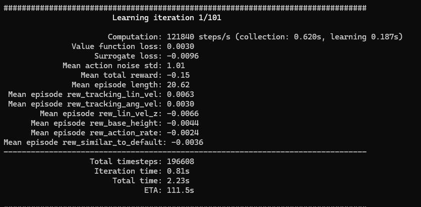
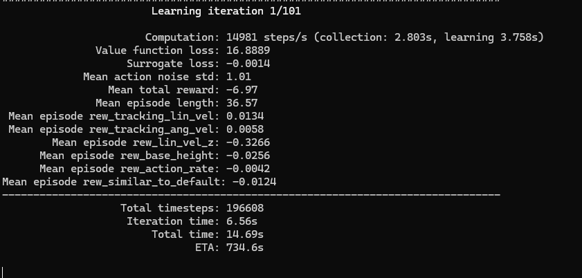

# 하나의 환경에서 서로 다른 ckpt의 로봇들 담아 관찰하기

https://github.com/user-attachments/assets/568e2732-7d7a-448a-8e8d-9b0f6ed070ab

https://github.com/user-attachments/assets/8b8e580e-d87d-4de0-8442-0b5b6ea3b623

### 알 수 있는 점
- 같은 코드의 같은 명령어로 실행했음에도 로봇들이 움직이는 양상이 조금씩 달라짐
- 로봇의 행동이 고정된 것이 아닌, 가우시안 분포에 따라 행동하기 때문
- gpu를 써서 돌렸음에도 한번에 5개의 로봇이 움직이다 보니 조금 버벅이는 모습

## WSL에서의 NVIDIA 드라이버 설치 관련 정리
### 빠른 결론
- wsl(ubuntu)는 윈도우쪽에 설치된 NVIDIA 드라이버를 공유해서 쓰는 구조임
- 즉 wsl에 리눅스 드라이버를 설치하면 충돌 위험이 있기에 NVIDIA 리눅스 드라이버는 설치하면 안 된다고 함

### gpu가 제대로 잡히려면?
```bash
export LD_LIBRARY_PATH=/usr/lib/wsl/lib:$LD_LIBRARY_PATH
```
- 이 명령어를 줬을 때 GPU가 제대로 잡히며 피크까지 올라감
- 위 mp4 동영상들도 GPU 피크가 잘 찍히는 것을 확인할 수 있음

## 연구실 pc에서 cpu로만 보행예제 돌리기 vs gpu도 써서 보행예제 돌리기

### gpu를 사용해 예제 돌려보기

https://github.com/user-attachments/assets/b72f787e-7cc9-4861-96c5-070db083f684

### cpu만을 사용해 예제 돌려보기

https://github.com/user-attachments/assets/27073d1a-9c1f-414c-9db4-c4e572a14e97

- 두 영상의 차이가 거의 없음
### 이유
- **평가** 자체는 연산량이 적기에 CPU로도 충분하고 GPU와 결과가 사실상 동일
- GPU는 학습(train)에서 수천개의 환경,배치,역전파가 있을 때 매우 유용함




 
### 그렇다면 집(RTX 4060)에서는 단순 eval 코드만 돌리는데도 왜 버벅거렸을까?

- 집에 있는 컴퓨터를 손볼 수 없는 상황이기에 정확한 원인을 찾진 못 했으나, time.sleep(), render_every, substeps 등 코드에서 수정 가능한 요인이었을 수 있음
    - 또는 Cuda와 WSLg 간의 합성, 물리충돌, 스파이크로 인한 병목 등 후보 요인이 매우 다양함

#### time.sleep()
- 루프 간 잠깐의 휴식을 주어 OS 스케줄러가 숨 쉴 틈을 확보해줌
- 다만 과도할 시 FPS를 떨어뜨리는 주범이 될 수 있음
#### render_every = N
- N 스텝마다 한 번 렌더링
- 화면 업데이트의 빈도를 낮춰 안정적인 성능을 낼 수 있지만 이 또한 과도할 시 화면 업데이트가 덜 자주 일어나며 FPS를 감소시킬 수 있음
#### substeps
- 한 스텝을 더 잘게 쪼개주는 역할
- substeps = 2면 dt를 2회 분할(정확도와 비용이 증가함)
- 이 또한 프레임 지체의 원인이 될 수 있음
