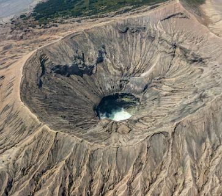
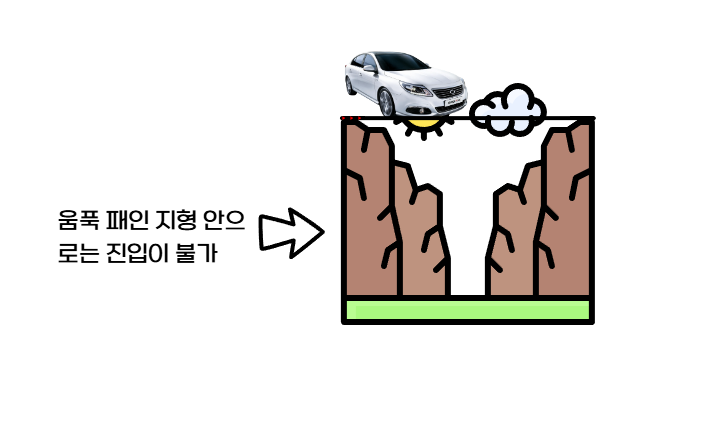
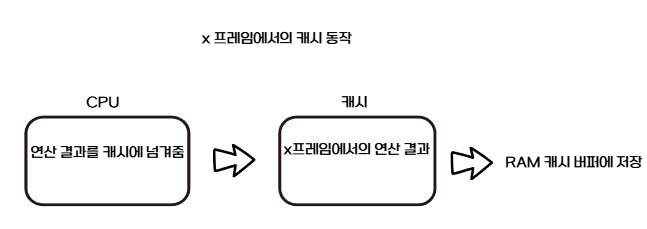

# 연구실 생성기로 생성된 blender terrain 에 주행 시뮬레이션 (blender) 적용 및 가상센서를 이용한 데이터 획득 방안
## 목차
- terrain 적용에서의 문제점
- 해결 방안1(Convex_Hull 유지)
- 해결 방안2(Mesh)
- 가상센서 
### 문제점
#### 연구실 생성기로 받은 산악지형은 가운데가 움푹 패인 지형

- 지형의 Shape을 Convex Hull로 설정할 시 지면의 세밀한 각도 하나하나가 전부 계산되어 자동차가 움직이진 않아도 연산량을 아낄 수 있다는 장점이 있음
- 다만 저런 분화구나 계곡같은 지형에선 Convex Hull은 사용 불가

[](https://github.com/user-attachments/assets/213eb335-404d-434a-86f4-d1f4decaafdf)

#### 왜 이런 일이?
- Convex_Hull의 Collider 모양 때문
- 이 문제를 해결하기 위해 Convex_Hull 대신 Mesh로 Shape을 지정하는 방법과 Collider를 조금 거칠게 가져가되 Convex_Hull을 유지하는 방법 2가지를 시도해봤음



### 방법1
- 그럼 그냥 mesh로 지정하면 되는데 뭐가 문제일까?
    - Blender의 Bullet 기반 Physics Engine이 100% CPU기반이라는 점이 문제 -> 연산 과부하
#### mesh 방식의 장점
- 지형의 세부적인 모양 하나하나 전부 계산하기에 현실과 가장 가까운 방식의 시뮬레이션이라고 볼 수 있음
- 분화구나 협곡 지형의 내부 또한 문제없이 잘 주행함

#### mesh 방식의 단점
- CPU로 수천 개짜리 mesh collider에 대해 충돌,관성,회전,미끄러짐 등을 매 프레임 시키다보니 과부하로 튕기는 일이 잦음
- 튕기지 않는다고 해도 프레임이 3~5사이로 매우 낮음
- GPU로 돌릴 방안을 강구해 봤으나 찾지 못 했음
    - Blender 자체 물리엔진의 한계로 보임

https://github.com/user-attachments/assets/7aee6272-3483-4776-8197-09e138583abd

#### mesh 방식의 단점을 해결할 방안(cache bake 방식)
- blender에선 센서를 이용한 데이터 획득이 목적이므로 주행 시뮬레이션은 실시간이 아니더라도 보기 불편하기 않게 나오면 괜찮을 것이라고 판단하였음
#### 어떤 식으로 시뮬레이션이 처리되는가
- 물리 시뮬레이션의 1프레임 결과를 Cache에 임시 저장하고 이를 RAM 캐시 버퍼에 기록 (이 과정을 반복) 
- 지정된 타임 스텝이 완료되면 Bake를 통해 RAM의 캐시를 디스크에 저장



https://github.com/user-attachments/assets/c4eef099-c48e-4fbf-a477-e0565a6ce1af

- 위 방식으로 재생한 시뮬레이션

### 방식2(반드시 실시간으로 연산이 처리되어야 한다면?)
- Mesh가 아닌 Convex_Hull을 유지하며 실시간으로 연산 부담없이 시뮬레이션하는 방식
    - 다만 제약조건이 붙게 됨
#### Convex_Hull 방식의 장점
- 연산이 대폭 감소하다보니 blender가 튕길 일이 없고 실시간으로 쾌적한 시뮬레이션이 가능
- 도로같은 완만한 지형에선 mesh와 큰 차이없이 부드럽게 시뮬레이션됨
#### Convex_Hull 방식의 단점
- 현재 사용중인 지형과 같이 울퉁불퉁한 면이 많고 움푹 패여 있다면 자동차의 움직임이 부자연스러움
    - 단점이 1가지이지만 사실 이 하나가 매우 크다고 볼 수 있음

https://github.com/user-attachments/assets/2da3a0be-c967-46b9-a1b1-64fc2b402e0c

- 초반처럼 완만한 지형은 잘 주행하지만 뒤로 갈 수록 Collider가 세밀하지 못 해 자동차가 공중에 떠서 가는 모습

# bledner에서 데이터셋 뽑아내기
- 이전에 설명한 Bake를 이용해 차량의 움직임을 미리 저장해두고 blender 내부에서 파이썬 코드를 통해 데이터 수집

https://github.com/user-attachments/assets/79237732-6c8f-460e-8f86-b4a9c02a497e

[sensor_log.csv](https://github.com/user-attachments/files/23292398/sensor_log.csv)
- 위 영상으로부터 얻어낸 csv 파일

### 1. frame
- 시뮬레이션 프레임 번호
- 1~250까지의 스텝으로 나눠서 각 스텝별 데이터를 저장한 것
### 2. time_sec
- 그 프레임이 시뮬레이션상에서 몇초대에 해당하는지를 나타낸 것
 
```text
frame=1 -> 0.000000초
frame=2 -> 0.041667초
frame=250 -> 10.375초
```

### pos_x, pos_y, pos_z
- 자동차(정확히는 차의 몸통)의 월드 좌표(Blender에서의 1unit = 1m로 해석)
- 초반부의 좌표
```text
frame 1:  x= 2.2592  y=4.0838  z=1.6751
frame 2:  x= 2.2592  y=4.0850  z=1.6662
frame 5:  x= 2.2592  y=4.0958  z=1.5369
```
- 후반부의 좌표
```text
frame 246: x=-36.2109 y=-5.2376 z=9.2633
frame 250: x=-36.3084 y=-4.1236 z=9.3721
```
- x가 -36근처로 갔고 y가 4에서 -5부근으로 바뀜
- 즉 10초 동안 전진/커브를 한 것으로 추정 가능
- z가 올라간 것으로 보아 언덕 경사를 타고 올라갔음을 추정 가능
### roll/pitch/yaw
- roll : 차가 좌우로 기울어진 정도
- pitch: 차가 앞뒤로 숙이거나 들린 정도
- yaw: 차가 어느 방향을 바라보고 있는지


```text
frame 1: roll=-0.000000, pitch=0.000000, yaw=0.000000
frame 5: roll=-0.033072, pitch=0.000037, yaw=0.000383

frame 246: roll=-0.108899 pitch=-0.245443 yaw=-2.927466
frame 250: roll=-0.128399 pitch=-0.266984 yaw=-2.987396
```

- yaw의 변화가 -3정도 -> 170도 이상 회전했음을 의미(거의 유턴)
### speed_m_s
- 이전 프레임의 위치와 이번 프레임의 위치 차이를 이용해서 구한 속력의 근삿값(m/s)
```text
frame 1: 0.000000
frame 2: 0.215368
frame 3: 0.628825
frame 4: 1.039813
frame 5: 1.445218

frame 246: 6.880745
frame 247: 6.800613
frame 248: 6.776288
frame 249: 6.741632
frame 250: 6.651986
```
- 후반에는 약 6.7 ~ 6.9 m/s 정도로 이동
    - km/h로 환산하면 24.48km/h

### front_distance_m 
- 차량 앞쪽 50m이내에 있는 장애물 감지 및 있다면 몇m앞에 있는지

### front_hit_object
- 그 앞쪽에 있던 물체가 무엇인지를 의미

```text
17.753327    BiomeTerrain
18.078477    BiomeTerrain
...
(빈칸)
...
19.302382    BiomeTerrain
15.793562    BiomeTerrain
...
6.717324     BiomeTerrain
...
35.629141    BiomeTerrain
...
23.687044    BiomeTerrain
21.611309    BiomeTerrain
...
6.928413     BiomeTerrain
```
- BiomeTerrain: 연구실 생성기로 생성한 지형
- 거리가 점점 줄어든다는 의미는 오르막길로 서서히 다가가고 있다는 의미
- 언덕 위로 올라오면 다시 차량 앞에 아무것도 없기에 데이터 칸이 비어져있는 모습

### 데이터 수집 코드

```python
import bpy
import mathutils
import csv
import os

########################################
# 🔧 사용자 맞춤 설정
CAR_NAME   = "Object_5"          # 차체 오브젝트 이름 
CAM_NAME   = "FrontCam"          # 전방 카메라 오브젝트 이름 
FRAME_START = 1                  # 시작 프레임
FRAME_END   = 250                # 끝 프레임 
FPS = bpy.context.scene.render.fps  # 씬의 Frame Rate 사용 (예: 24/30 등)
BASE_PATH = r"C:\Users\CEY\Desktop"    # 저장 경로
IMG_DIR   = os.path.join(BASE_PATH, "frames")  # 이미지 저장 폴더
CSV_PATH  = os.path.join(BASE_PATH, "sensor_log.csv")
########################################

# 폴더 없으면 만들기
os.makedirs(IMG_DIR, exist_ok=True)

scene = bpy.context.scene
car_obj = bpy.data.objects[CAR_NAME]
cam_obj = bpy.data.objects[CAM_NAME]

prev_pos = None

# CSV 열기
with open(CSV_PATH, mode="w", newline="", encoding="utf-8") as f:
    writer = csv.writer(f)

    # CSV 헤더 (hit 된 오브젝트 이름까지 기록)
    writer.writerow([
        "frame",
        "time_sec",
        "pos_x", "pos_y", "pos_z",
        "roll", "pitch", "yaw",
        "speed_m_s",
        "front_distance_m",
        "front_hit_object"
    ])

    # 프레임 루프
    for frame in range(FRAME_START, FRAME_END + 1):
        # 1) 해당 프레임으로 이동
        scene.frame_set(frame)

        # 2) 시간(초) 계산 (frame_start를 0초로 맞춤)
        t_sec = (frame - FRAME_START) / FPS

        # 3) 차체 위치/회전 (월드 기준)
        mat_world = car_obj.matrix_world
        pos = mat_world.translation              # Vector(x,y,z)
        rot_euler = mat_world.to_euler("XYZ")     # roll, pitch, yaw (라디안)

        # 4) 속도 추정 (전 프레임 대비 위치 변화 / Δt)
        if prev_pos is None:
            speed = 0.0
        else:
            delta = pos - prev_pos
            dist = delta.length      # 이동 거리 (m 가정)
            dt = 1.0 / FPS
            speed = dist / dt        # m/s
        prev_pos = pos.copy()

        # 5) "전방" 거리센서 (간이 라이다)
        #    - forward_local: 차의 '앞을 향하는 단위방향'
        #      여기서는 차 로컬 -Y가 전방이라고 가정
        forward_local_dir = mathutils.Vector((0.0, -1.0, 0.0))

        #    - 센서의 실제 위치(출발점)를 차체 로컬 좌표로 지정
        #      (차 중심에서 앞으로 3m 정도 쭉 뺀 위치, 높이 1m 정도)
        #      이 값은 네 차량 스케일에 따라 더 크게/작게 조절 가능
        sensor_origin_local = mathutils.Vector((0.0, -3.0, 1.0))

        #    로컬 -> 월드 변환
        sensor_origin_world = mat_world @ sensor_origin_local
        forward_world_dir = (mat_world.to_quaternion() @ forward_local_dir).normalized()

        max_distance = 50.0  # 레이캐스트 최대 탐지 거리 (m)

        # Blender 4.x에서는 depsgraph 필요
        depsgraph = bpy.context.evaluated_depsgraph_get()

        hit, hit_loc, hit_normal, face_index, hit_obj, hit_matrix = scene.ray_cast(
            depsgraph,
            sensor_origin_world,   # 레이 시작점
            forward_world_dir,     # 레이 방향
            distance=max_distance
        )

        if hit:
            front_dist = (hit_loc - sensor_origin_world).length
            hit_name = hit_obj.name if hit_obj else ""
        else:
            front_dist = None
            hit_name = ""

        # 6) 카메라에서 현재 프레임 이미지를 렌더해서 저장
        scene.camera = cam_obj

        #    저장 파일 경로 세팅
        img_name = f"frame_{frame:04d}.png"
        img_fullpath = os.path.join(IMG_DIR, img_name)

        #    Blender 렌더 출력 경로 지정
        scene.render.filepath = img_fullpath

        bpy.ops.render.render(write_still=True)

        # 7) CSV 기록
        writer.writerow([
            frame,
            f"{t_sec:.6f}",
            f"{pos.x:.6f}", f"{pos.y:.6f}", f"{pos.z:.6f}",
            f"{rot_euler.x:.6f}", f"{rot_euler.y:.6f}", f"{rot_euler.z:.6f}",
            f"{speed:.6f}",
            "" if front_dist is None else f"{front_dist:.6f}",
            hit_name
        ])

print("데이터 수집 완료!")
print("CSV:", CSV_PATH)
print("이미지 폴더:", IMG_DIR)

```

## 차후 나아갈 방향
- 위 예시는 기본적인 데이터들을 뽑아낸 예시이고 코드와 같은 방식으로 휠별 회전각, 회전속도, 각속도 등등 추가적인 데이터를 뽑아낼 예정
### 그렇게 뽑아낸 데이터를 어떻게 Genesis에 적용할 것인가
#### A. Physics Replay(강체 모델로 추종)
- Genesis의 물리엔진을 켜두고, 차량이 CSV의 궤적을 PD제어로 따라가게 하는 방식
  https://github.com/dwhaha6/Graphics_Study_Genesis_Ai/blob/main/2025_0922_backflip%EB%B3%B4%EA%B3%A0%EC%84%9C.md#64-pd%EC%A0%9C%EC%96%B4

    - PD 제어와 관련해서는 이전에 정리해둔 내용이 있음
- 정리하자면 PD제어를 설정해두어 매 프레임마다 CSV의 목표 위치,회전각을 타겟값으로 보냄으로써 실제 동역학(관성,마찰,질량)이 적용되며 목표궤적을 따라가는 형태로 Genesis에서 재현될 것임
#### B. 정확한 물리 재현(Inverse Dunamic)
- Blender에서 추출한 데이터를 학습 데이터로 사용해서, Genesis 차량이 같은 궤적을 **자체적으로 만들어내도록** 학습시키는 방식
- PPO나 BC(Behavior Cloning)으로 차량 policy 학습 (PPO는 백플립, 드론의 학습 정책과 일치)
### 각 방식의 장단점
#### A방식의 장점
    - 구현이 빠르다.
    - 재현성이 높다
    - 디버그가 쉽다
#### A방식의 단점
    - 정책없이 정해진 목표값만을 따라가기에 액션에 대한 원인이 없음
        - 여기서 원인이 없다는건 무엇을 해야할지 스스로 판단하는 로직이 없다는 것을 의미
#### B방식의 장점
    - 실제 액션을 내는 정책을 확보하고 일반화가 가능하다
#### B방식의 단점
    - 학습/보상 설계/수렴 관리 등 시간과 튜닝의 소요가 있다
#### 비유를 하자면
- A는 자동차를 리모컨으로 조작하듯, 미리 녹화된 궤적을 그대로 재현하는 것
- B는 자동차가 운전자의 예시를 보고 학습해서 나중에는 스스로 비슷하게 조향,가속을 하며 주행하는 것것 
