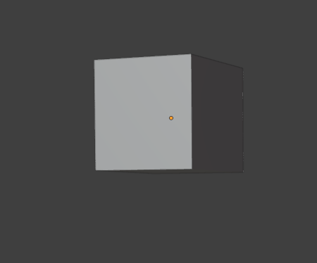
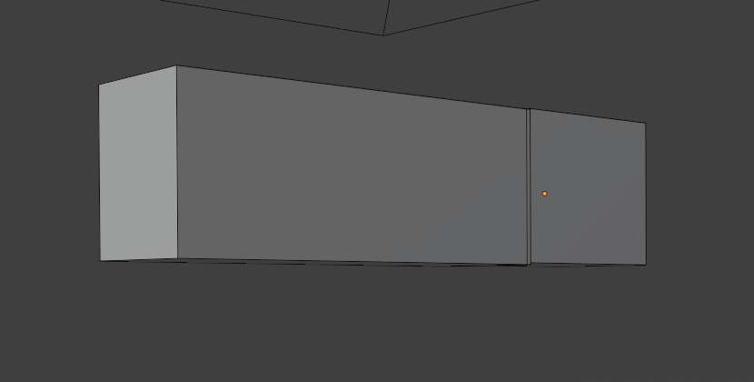

# Genesis 환경에서 자동차 구동시키기
## URDF 분석하며 얻은 insight들 정리
```python
<link name="base_link">
    <inertial>
      <origin xyz="0.3 0 0.5" rpy="0 0 0"/>
      <mass value="1200.0"/>
      <inertia ixx="1512.0" iyy="436.8" izz="1872.0" ixy="0" ixz="0" iyz="0"/>
    </inertial>

    <visual>
      <origin xyz="0 0 0" rpy="0 0 0"/>
      <geometry>
        <mesh filename="car_body_rotated.obj" scale="1 1 1"/>
      </geometry>
    </visual>
    
    <collision>
      <origin xyz="0 0 1.1" rpy="0 0 0"/>
      <geometry>
        <box size="2.5 1.6 0.6"/>
      </geometry>
    </collision>
```
#### 1. inertial의 origin -> COM(Center Of Mass)

    - 무게중심 추의 좌표를 의미
    - base_link의 로컬 좌표계 기준 COM이 (0.3,0,0.5)에 위치
    - base_link가 현재 URDF의 root이므로 월드에서 차량이 스폰되는 좌표 = base_link의 로컬 좌표

#### 2. Inertia Tensor(관성텐서)에 대한 명확한 이해

```
    [  ixx   ixy   ixz ]
I = [  iyx   iyy   iyz ]
    [  izx   izy   izz ]
```

- 기본 개념: 현실 세계에 존재하는 무한한 회전축에 대해 9개의 회전 관성을 정의한 것
#### 이게 무게중심 분포와 무슨 관련이 있는가?



- 차체가 위와 같은 모양이면? -> 관성값들이 고르게 나옴
    - (Ixx ≈ Iyy ≈ Izz)



- 위와 같은 모양에선?
    - Z축 회전(Izz)이 큼 → 옆으로 도는 게 어려움
#### 기존 URDF 코드의 관성 텐서

```python
<inertia ixx="1512.0" iyy="436.8" izz="1872.0"/>
```
-> ixx(roll, 좌우 전복): ixx가 커야 차량이 좌우로 넘어지지 않음  
-> izz(yaw, 수평 회전): 조향에 대한 민감도와 관련이 있다고 볼 수 있음

## 바퀴 세팅
- 피드백에 따라 collision을 mesh -> cylinder로 변경하였습니다


- rpy = 0,0,0 일 때의 실린더 모양


- rpy = 1.5708, 0, 0 일 때(x축에 대해 90도 회전)의 실린더 모양
    - 이 상태에서 axis xyz="0 1 0"으로 두고 y축에 대해 회전 -> 정상적으로 작동

## 앞바퀴 문제 해결

https://github.com/user-attachments/assets/d117c0b1-a937-4f97-9e35-f645352ab223

- 뒷바퀴는 잘 구르지만 앞바퀴가 덜덜 떨리며 비정상적인 움직임을 보였음
    - steer 세팅부터 해서 다양한 방법들 시도해봤음

### 1. 차체 Collision을 box로 교체
- 결론부터 말하면 바퀴의 collsion, 차체의 collsion이 앞바퀴에서 겹쳐지며 앞바퀴에 물리 오류를 일으킨 것
    - 이 오류를 해결하기 위해선 각 collision의 부피를 정확히 알아야 했기에 차체는 box, 바퀴는 cylinder인 상태에서 start
    - 위 결론은 정황상 가장 확률이 높은 원인을 고른 것으로 개인적으로는 다른 원인이 있을 것으로 생각되는데 확실한 원인을 찾지는 못 한 상황
### 2. 박스와 실린더의 collision 부피 계산

- collision이 mesh가 아닌 box와 cylinder이기에 box의 collision과 cylinder의 collision이 조금이라도 겹치면 안 되는 상황
#### 기존의 box collision 정의(radius = 0.358)
```
<collision>
  <origin xyz="0 0 0.8" rpy="0 0 0"/>
  <geometry>
    <box size="2.5 1.6 1.0"/>
  </geometry>
</collision>
```

- 위 상황을 도식화한 것
#### 현재의 box collision
```
    <collision>
      <origin xyz="0 0 1.1" rpy="0 0 0"/>
      <geometry>
        <box size="2.5 1.6 0.6"/>
      </geometry>
    </collision>
```

- 마찬가지로 현재 collision 상황을 도식화 한 것  
-> 앞바퀴 문제 해결
## 주행 영상

https://github.com/user-attachments/assets/5d6ede90-4758-4c64-aa20-7cb9b9c96c22
### 해결해야 하는 것들
#### 1. 위 영상은 뒷바퀴 토크를 1000으로 주었음(시속 약 36km/h)
    - 토크를 2500올렸을 때 차가 안정적으로 주행하지 못 했음
https://github.com/user-attachments/assets/20dc5609-0688-4b31-bf45-690a29933433  

    - 현재 원인 파악 중에 있는 문제
#### 2. blender 직진 문제
    - 정답 데이터를 가져와야 할 blender 차량에 문제가 있음을 만교 학생으로부터 알게 되었음
#### 3. GPU가 100% 잡히는 것에 비해 시뮬레이션이 느림
    - 연구실에서 했던 것과 동일한 방식으로 집에 있는 컴퓨터(RTX 4060)로 시뮬레이션을 돌렸을 때, 연구실의 컴퓨터보다 높은 프레임이 나오며 부드럽게 시뮬레이션 됐었음
    
