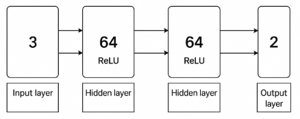
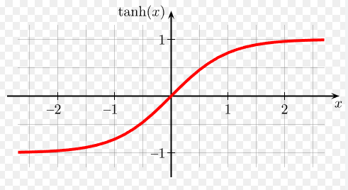

# 조향을 포함해서 Train 시키기
    - 블렌더에서 데이터를 뽑아내는 방식은 직진 모델 학습때와 동일하므로 pass
        - 쿼터니언 차이를 이용한 각속도 뽑아내기였음

(블렌더 영상)
- 위 움직임을 모사할 예정

## MLP 구조


### 입력층(Input Layer) - 6차원
| 차원       | 의미                  |
| -------- | ------------------- |
| g_lin_vx | X축 선속도 (전진 속도)      |
| g_lin_vy | Y축 선속도 (측방 속도)      |
| g_lin_vz | Z축 선속도 (상하 속도)      |
| g_ang_vx | X축 각속도 (roll rate)  |
| g_ang_vy | Y축 각속도 (pitch rate) |
| g_ang_vz | Z축 각속도 (yaw rate)   |

- 선속도 3개, 각속도 3개로 6차원 벡터를 입력

#### 기존에는 9차원 벡터를 사용 했으나...
- 현재 학습하는 건 차량의 상태에 따른 각 프레임에서의 **조향**과 **throttle**
- 조향/스핀은 차량의 "위치" 값과는 무관
- 또한 조향과 관련해 문제를 야기했음

#### pos 값에 따른 문제
- 현재 목표는 블렌더 차량의 "움직임"을 Genesis에서 모사하는 것
- pos_x, pos_y, pos_z는 절대적인 환경 의존 변수
- 이 값은 차량 주행 skill과 무관 → 모델이 필요 없는 feature를 학습하면서 분산 증가
    - 실제로 조향이 엉뚱하게 나오며 직진해야 하는 상황에서 급격한 우회전을 했었음

### 은닉층1 (Hidden Layer 1) - ReLU(64차원)
#### 역할
- 입력 상태의 비선형 조합(feature extraction)
- 속도 + 각속도 조합을 통해 "현재 주행 상황"을 구분하는 내부 표현을 만듦
- ReLU로 비선형성 확보 -> 복잡한 조향 패턴 근사 가능

### 은닉층2 (Hidden Layer 2) - ReLU(64차원)
#### 역할
- 1층에서 추출한 특징을 다시 조합해 **조향+토크**와 직접적으로 연관된 고차원 패턴을 학습
#### 예시
- 조향 민감도 변화, 조향 반응 보정 등

### 출력층(Output Layer)
| 출력     | 의미                                    |
| ------ | ------------------------------------- |
| out[0] | **조향 steering (-1~1 before scaling)** |
| out[1] | **throttle_norm (가속 명령, -1~1)**       |

- 2차원 출력(action_dim = 2)

### 출력 후처리(Post-processing)
#### 1. Steering 처리
```python
raw_steer = out[0]
steer_cmd = torch.tanh(raw_steer) * steer_scale
```

- tanh -> -1~1 의 범위로 제한
- steer_scale -> 최대 조향각(Blender와 동일하게 35도)
- 최종 조향 각도 산출 완료

#### 2. Throttle 처리
```python
raw_throttle = out[1]
throttle_norm = torch.tanh(raw_throttle)
```
- throttle_norm ∈ [-1, 1]
- 이후 실행코드에서 설정한 최대 토크에 곱해짐

### 파라미터 개수
| 층       | 파라미터 수 |
| ------- | ------ |
| 입력→은닉1  | 448    |
| 은닉1→은닉2 | 4160   |
| 은닉2→출력  | 130    |

- 총 4,738 parameters
- 학습 매우 빠름(3~5초)


## 시행 착오
(주행영상)
### Qualitative Problems
- 차량이 Blender에 비해 느리다
- 왼쪽으로 움직이긴 하나 그 정도가 미미하다

## Quantitative Evaluation
### Blender에서의 조향 setting
- 최대 조향각도: 30도
- Steering: -0.1
- 30 * -0.1 -> -3도 (왼쪽으로 3도)

### Genesis에서의 조향 상황
```
Frame  150 | PosX:   1.186 | PosY:   0.058 | Speed: 1.564 m/s | steer_cmd:  0.045 rad | throttle_norm:  0.31
```
- 0.045 rad -> 2.5785(왼쪽으로 2.5도)
    - 두 공간의 좌표계가 달라 부호는 다르나 왼쪽인건 동일
        - 둘다 오른손 좌표계 BUT
        - Genesis는 Forward +X, Left +Y
        - Blender는 Forward -Y, Left +X
        - 전진축과 왼쪽 방향의 부호가 같으냐 다르냐의 차이

#### 조향 결론
- 아무튼 둘다 왼쪽으로 회전하고 각도의 차이가 0.5도 정도면 조향에 대한 학습은 잘 되었다고 볼 수 있음

### 차량 속도에 대한 고찰 이전에...
- 프레임이 너무 낮게 나왔음 -> 슬로우 모션처럼 보일 수 있음

#### 이전 설정
```
dt = 0.01   # 시뮬레이션 시간 0.01초
substeps = 10
```
-> 1초에 1000번 물리 계산

```
dt = 0.02  
substeps = 2
```
-> 1초에 100번으로 변경해서 높은 FPS 확보

(영상 첨부)
- Blender 움직임 모사 완료

## 아직 해결하지 못 한 사항들

#### 1. 대략적인 움직임에 대한 모사는 완료 하지만 특정 terrain 적용 상황 혹은 더 세밀한 움직임에 대한 모사는 세부적인 튜닝이 필요
#### 2. Genesis 차량의 속도가 Blender보다 조금 느림
- Genesis : 최고 속도 약 6.3m/s
- Blender : 최고 속도 약 7.3m/s

-> 이 또한 아직 두 물리엔진 사이의 튜닝이 완벽하지 않다는 증거
