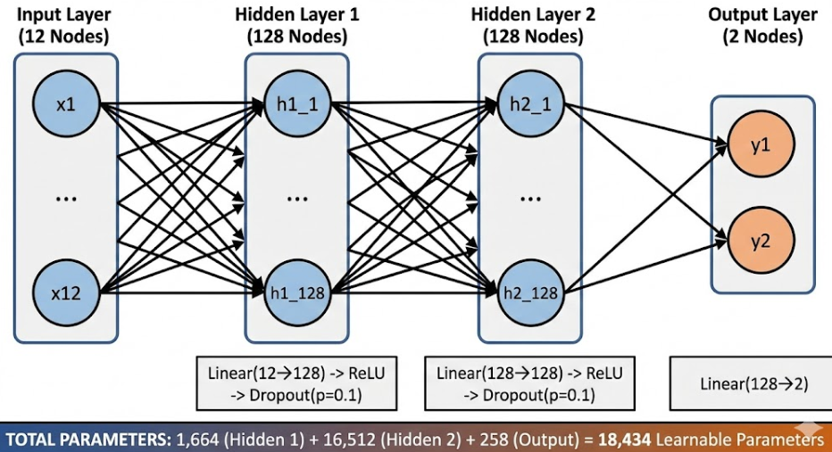

# 기존 데이터 추출 문제점 해결
### 1. Genesis는 앞바퀴 조향을 좌/우 따로 주는 게 아니라 하나의 steer 값으로 준다.
### 2. Genesis는 뒷바퀴 구동도 좌/우를 따로 주기보다 하나의 throttle(구동명령)으로 준다.

- 좌/우 바퀴별로 다른 값을 그대로 학습하면 모델 출력은 2개(좌 steer, 우 steer / 좌 spin, 우 spin)를 요구하게 됨

- 즉 Genesis 제어 인터페이스(1개 steer, 1개 throttle)와 구조적으로 안 맞음.

- 데이터를 추출할 blender simulation

# 코드 수정 내용
### 조향 라벨 통일
```
steer = 0.5 * (steer_L + steer_R)
```
### 뒷바퀴 구동(스핀) 통일
```
spin_R = 0.5 * (spin_RL + spin_RR)
```

### 기존 train 코드의 출력
```
[steer_L, steer_R, (spin_RL, spin_RR ...)]
```
- 데이터 잡음(바퀴별 spin 차이)을 모델이 그대로 학습하려고 해서 불안정
### 현재 train 코드의 출력
```
[steer, throttle_norm]
```

# 수정된 MLP 구조

## 입력
### 자세(Orientation)
```
g_qw, g_qx, g_qy, g_qz (Quaternion)
```
- 차가 어느 방향을 보고 있는지, 회전 중인지, 기울어졌는지 등 차량의 3차원 자세를 나타냄
- 이 정보가 없으면 차량이 직진 중인지 회전 중인지 구분 X

### 선속도(Linear velocity)
```
g_lin_vx, g_lin_vy, g_lin_vz
```
- x,y,z 방향에 대한 차량의 속도
- throttle 결정의 핵심 근거
### 각속도(Angular velocity)
```
g_ang_vx, g_ang_vy, g_ang_vz
```
- yaw(좌우 회전), pitch(앞뒤), roll(좌우 기울기) 정보
- 조향 안정성과 매우 직결됨
### 전방 속도(Longitudinal velocity)
```
v_long
```
- 차량이 “차가 바라보는 방향”으로 얼마나 빠르게 움직이는지
- throttle 판단에 가장 직접적인 입력
### 뒷바퀴 평균 회전 속도
```
spin_R = (ω_RL + ω_RR) / 2
```
- 엔진/모터 출력이 실제로 바퀴에 얼마나 전달되고 있는지 판단 가능

- 여기까지 총 12개의 입력(feature)
- 출력은 이전에 설명했으므로 생략

# 학습 결과


- 이전과 다르게 블렌더의 움직임과 거의 똑같음(9자로 그려지지 않는 모습)
