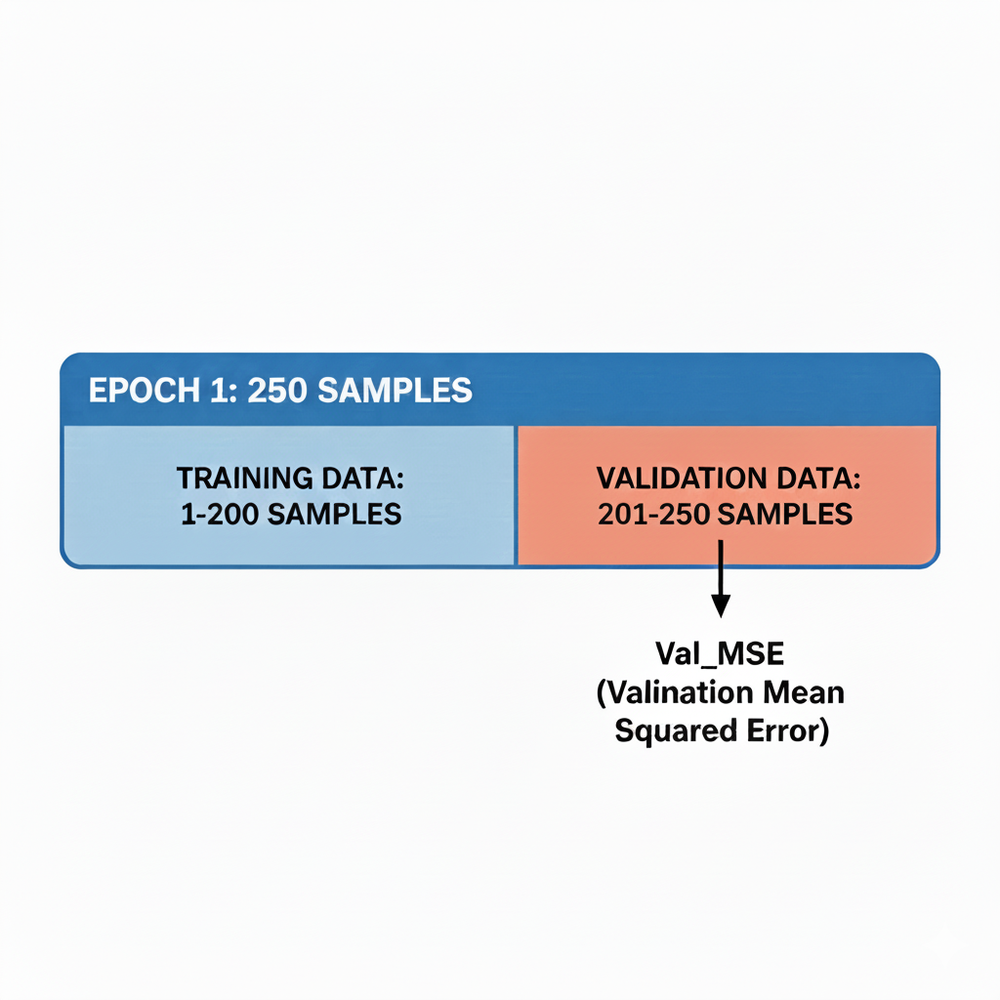
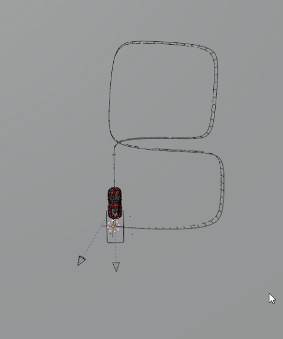
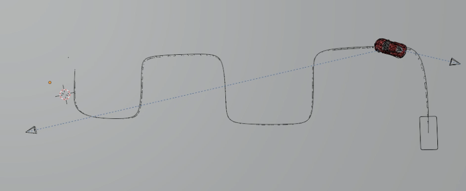
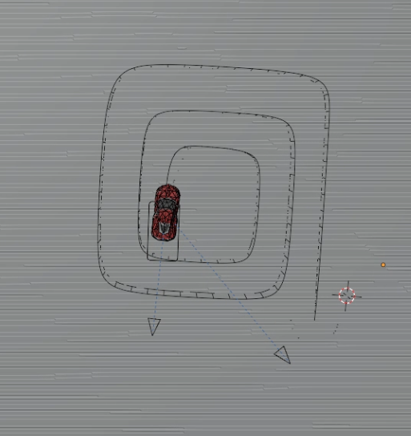

# 현재 시스템 전체 흐름 정리 및 몇가지 예시

### 1. 블렌더에서 Data 추출
- 기존에는 한가지 움직임에 대해 data를 추출한 뒤 이를 MLP에 학습시키고 시뮬레이션을 돌렸음
    - 한 가지 움직임만 학습 -> data 부족으로 다양한 움직임 모사 불가
- Blender에서 최대한 다양한 움직임을 만들고 이에 대한 Data를 뽑아내 csv로 추출

### 현재까지 만든 bledner csv
| File | Episode | Description |
|------|---------|-------------|
| data_1.csv | circle | 원형 주행 |
| data_2.csv | scoop | 스쿱 기동 |
| data_3.csv | uturn | U턴 |
| data_4.csv | m_move | M자 이동 |
| data_5.csv | line | 직선 주행 |
| data_6.csv | Big_circle | 큰 원 주행 |
| data_7.csv | Small_circle | 작은 원 주행 |
| data_8.csv | eight | 8자 주행 |
| data_9.csv | Spiral | 나선형 주행 |
| data_10.csv | Oval | 타원 주행 |
| data_11.csv | small_S | 작은 S자 |
| data_12.csv | big_s | 큰 S자 |
| data_13.csv | slalom | 슬라롬 |
| data_14.csv | drift | 드리프트 |
| data_15.csv | n | N자 주행 |
| data_16.csv | staright_brake | 직진 후 브레이크 |
| data_17.csv | thin_M | 얇은 M자 |
| data_18.csv | reverse | 후진 |
| data_19.csv | nine | 9자 주행 |
| data_20.csv | reverse_steer | 후진 조향 |
| data_21.csv | fast_reverse | 빠른 후진 |
| data_22.csv | slow_steer | 느린 조향 |
| data_23.csv | 3_point_turn | 3점 턴 |
| data_24.csv | stop_and_go | 정지 후 출발 |

- 각 csv당 1~250개의 행으로 이루어짐
- 행 1개가 1번의 MLP 입력
- 24 x 250 = 6000, 6000개의 data에 대해 300번 반복 학습 진행(Epoch = 300)
- 한 Epoch 당 250개의 data를 담당

### Epoch 내부에서 벌어지는 일

- Training MSE: 1~200 행 data에 대한 MLP의 MSE
- Val MSE: 201~250 행 data에 대한 MLP의 MSE
---
- data의 80%(1~200)는 Training용으로 사용(파라미터 업데이트)
- 나머지 20%(201~250)는 Validation(평가)용으로 사용
- 즉 20%에 대해서는 csv에 주어진 정답값과 NN의 출력 결과를 기반으로 Val_MSE를 계산
- 이 Val_MSE가 가장 낮은 Epoch를 best_model.pt로 저장

### Epoch Case
| Training MSE | Validation MSE | 전형적 패턴 | 상태 판단 | 의미 (무슨 일이 일어났나) | 에폭 판단 / 액션 |
|-------------|----------------|-------------|-----------|----------------------------|------------------|
| 높음 | 높음 | 둘 다 큼 | 언더피팅 (Underfitting) | 모델이 너무 단순하거나 아직 학습 부족 | 에폭 증가, 모델 용량 증가 |
| 중간 | 중간 | 함께 감소 중 | 정상 학습 중 | 데이터 패턴을 점점 학습하는 단계 | 계속 학습 |
| 낮음 | 낮음 | 거의 동일 | 잘 학습됨 (Good fit) | 일반화 성능 양호 | 해당 에폭 저장, Early Stop 후보 |
| 낮음 | 중간 | Val이 약간 더 큼 | 약한 과적합 시작 | Train 데이터에 치우치기 시작 | Val 최저점 근처에서 중단 준비 |
| 낮음 | 높음 | 격차 큼 | 과적합 (Overfitting) | Train 데이터만 외움 | 즉시 중단, 이전 에폭 복원 |
| 중간 | 높음 | Val만 나쁨 | 데이터 분포 불일치 | Train/Val 환경 차이 또는 라벨 문제 | 데이터 분할 및 라벨 점검 |
| 감소 후 정체 | 크게 요동 | Val 불안정 | 검증 데이터 노이즈 큼 | Val 샘플 수 부족 또는 라벨 노이즈 | 이동 평균으로 판단 |
| 계속 감소 | 갑자기 증가 | 특정 시점 분기 | 급격한 과적합 | 학습률 과다 또는 특정 패턴 외움 | 이전 에폭으로 롤백 |

## 위 방식으로 진행한 학습 결과
- 24개의 예시를 전부 볼 수는 없기에 이전에는 모사하기 힘들었던 움직임 위주로 첨부하였음

### 8자 그리며 움직이기
  

https://github.com/user-attachments/assets/12e806cf-edf6-4537-ac1b-82ffea53c91d

### slalom(스키 타듯이 왔다갔다 하는 움직임)
  

https://github.com/user-attachments/assets/83791105-9e22-4218-925f-69fae03a86b7

### Spiral(나선형 모양)
  

https://github.com/user-attachments/assets/682e9ab6-4a28-46ad-9448-7f62f21dd49d

### slalom(스키 타듯이 왔다갔다 하는 움직임)

### Spiral(나선형 모양)

# 아직 해결하지 못 한 사항
- 절대적인 data양이 부족 -> 특히 후진과 brake의 움직임 예시가 더 추가될 필요가 있음
- 후진에 대한 움직임은 아직 조금 미흡한 모습을 보임
