# data 추출 방식 구체화 및 새로운 방식+ 이후 처리에 대해 궁금한 점 정리

- MLP 학습 이전에 MLP의 정답 데이터가 blender에서 올바르게 뽑혀야 이후 과정 처리가 수월할 것 같다는 생각에 blender 데이터 추출 과정을 다시 한번 검토하였습니다
- **참고** mp4 영상 속 빨간색 주행 경로는 기존 방식의 시뮬레이션, 초록색 주행 경로는 새로운 방식의 시뮬레이션을 의미합니다.
## steer 제어 도출 파이프라인

### 1. 차체 forward 방향 계산
```python
R_body = car.matrix_world.to_3x3()
body_fwd_world = R_body @ BLENDER_FORWARD_LOCAL
```
### 2. 각 앞바퀴 forward 방향 계산
```python
wheel_fwd_world = R_w @ BLENDER_FORWARD_LOCAL
```
### 3. 차체 forward와 바퀴 forward의 yaw 차이 -> 조향각
```python
ang = signed_yaw_between(body_fwd_world, wheel_fwd_world)
```
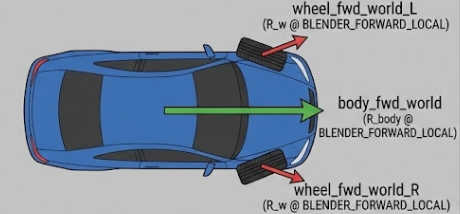
### 4. 좌/우 바퀴 조향각 평균 계산 -> 이 steer 값이 해당 step에서의 조향 제어값
```python
steer_rad_reverse = 0.5*(steer_FL + steer_FR)
steer_norm_reverse = clamp(steer_rad_reverse / MAX_STEER_RAD, -1, 1)
```

## thottle 역산 방식

### 1. 매 프레임, 차체와 뒷바퀴의 자세(쿼터니언)을 읽기
```python
q_car = car_eval.matrix_world.to_quaternion().normalized()
q_w   = wheel_eval.matrix_world.to_quaternion().normalized()
```
### 2. 바퀴 회전에서 차체 회전을 빼서 바퀴의 상대 회전 값 도출
```python
q_rel = q_car.conjugated() @ q_w
q_rel.normalize()
```
- 바퀴는 (차체가 도는 것 + 바퀴가 그 자체로 도는 것) 두 가지를 포함했기에 위 연산이 필요
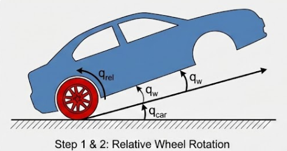
### 3. 상대 회전에서 스핀축 방향으로의 회전만 뽑기
```
ang = twist_angle_about_axis_stable(q_rel, axis_car_local)
```
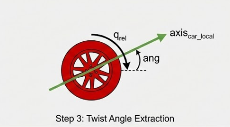
### 4. 각속도(= 각도 변화량/ dt) 구하기
```python
spin = 0.0 if prev is None else (ang_u - prev) / dt_safe
```
### 5. 좌/우 뒷바퀴 평균내기
```python
spin_R = 0.5 * (spin_RL + spin_RR)
```
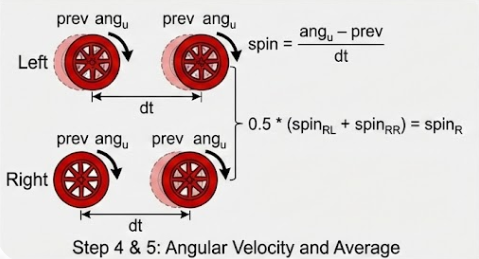
### 6. v_long(차체의 전방 속도)를 기반으로 부호를 결정해 throttle 도출
```python
v_long = float(v_B.dot(body_fwd_world))

if abs(v_long) < V_LONG_EPS:
    throttle_raw_reverse = 0.0
else:
    throttle_raw_reverse = abs(spin_R) * (1.0 if v_long > 0.0 else -1.0)
```
- 바퀴가 도는 방향만 보면 전진, 후진이 애매하므로 v_long을 이용해 확실하게 부호 결졍
### 7. throttle 값을 -1~1 로 normalization
```python
throttle_norm_reverse = clamp(throttle_raw_reverse / THROTTLE_OMEGA_MAX, -1.0, 1.0)
```

- spin = 바퀴 스핀 각속도  

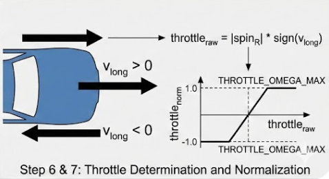

https://github.com/user-attachments/assets/cac973ae-bf8d-4742-adac-59dc6161abdf

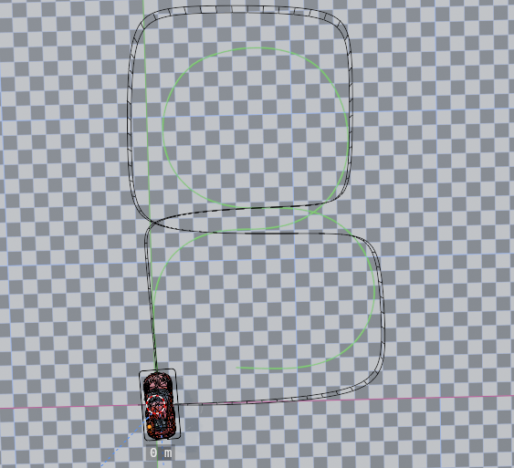

https://github.com/user-attachments/assets/e08c512b-a576-4856-9912-f3999d0295d4

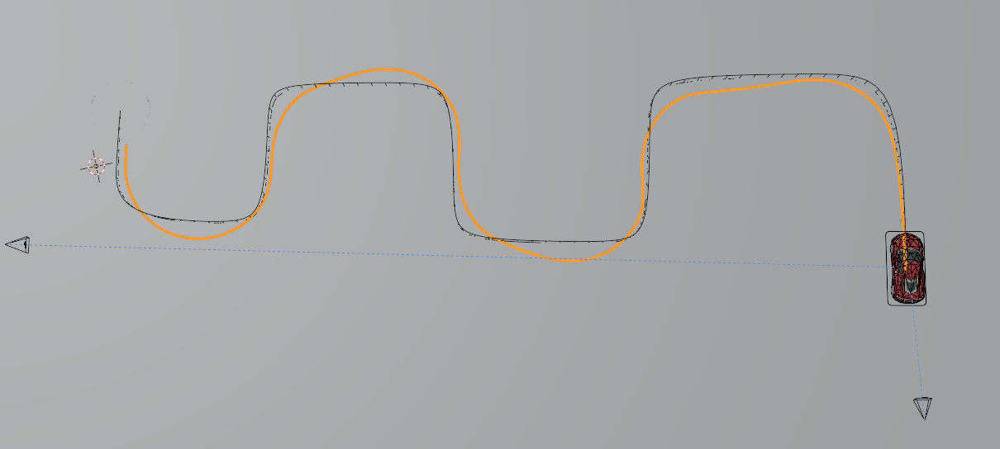

- 기존 방식대로 구해낸 정답 제어값을 Genesis에 넣고 시뮬레이션(MLP 학습 움직임이 아닌, 그저 뽑아낸 데이터를 가지고 그대로 시뮬레이션한 것)

## blender에서 내린 제어 값을 저장한 곳은 없을까?
- RBC Pro가 Armature 오브젝트에 저장해 둔 custom property 트리에서 값을 읽어오기
- 실제 차량에서 data를 가져올 것을 고려하면 역산 방식에서 처럼 일일이 차량과 바퀴의 쿼터니언과 yaw 차이 등을 매 순간 계산하는게 불가능하지 않을까 라고 생각해 **RBC pro의 실제 제어값**을 읽는 방안을 고려해봤습니다.

```python
armature = bpy.data.objects.get(ARMATURE_NAME)
props = armature['sna_rbc_rig_armature_props']
rig_drivers = props['rig_drivers']
steering_raw = float(rig_drivers.get('steering', 0.0))
target_speed = float(rig_drivers.get('target_speed', 0.0))
```
- RBC pro가 내부에서 계산/적용 중인 값의 미러링된 값을 그대로 읽어오기
```python
throttle_raw = target_speed / 0.35
```

https://github.com/user-attachments/assets/932a2ab0-d179-4413-a4ce-635fc7cd33d6

https://github.com/user-attachments/assets/7af3d1cb-21d6-4101-9ee4-d9a160d61f08

- 기존 방식으로 진행했을 때와 움직임이 유사

- 2가지 움직임 전부 blender와 genesis의 물리엔진 차이 + 시뮬레이션 step 수 차이로 인해 움직임에 오차가 존재하는 상황
## 궁금한 사항들 정리
### Main MLP -> filter MLP?
- 이전 피드백에서 기존 MLP(main MLP)의 출력에 bledner와 genesis의 차이를 보정해주는 filter MLP를 넣으라는 내용이 있었는데, 제 생각에는 현재 이 정답 data에 filter MLP를 적용시켜 차이를 먼저 보정하고 그렇게 blender와 비슷한 깔끔한 주행이 만들어지면 이를 정답데이터 삼아 Main MLP 학습을 진행하는게 맞지 않나 라는 의문이 듭니다.

### 조향 부호에 따른 움직임 변화

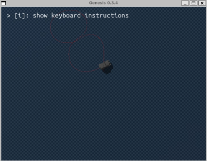

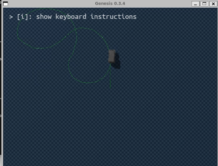

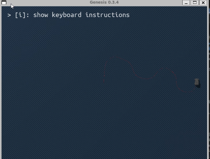

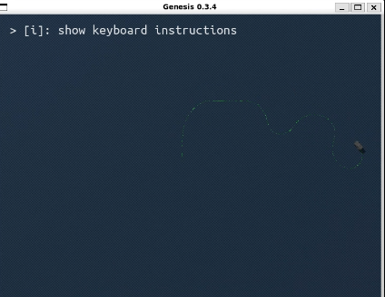


