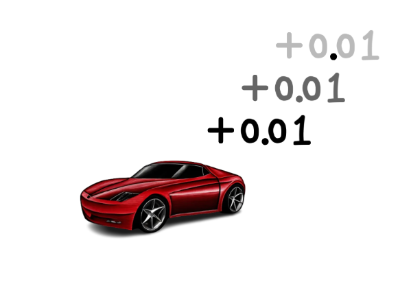
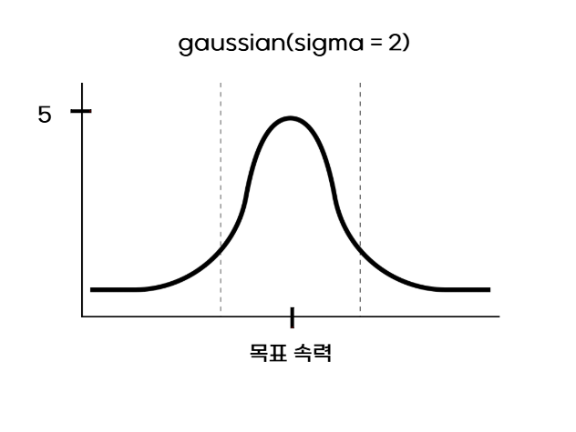

# 1_16 이후 수정 사항 정리
## 지난 리포트의 reward 정책으로 train한 결과

wring_train 영상

- 급격한 조향시 감점이라는 정책으로 인해 차량이 한번 steer를 정하면 그 값을 유지하려고만 함
- 결국 왼쪽 혹은 오른쪽으로만 계속해서 가서 죽는 모습
- steer를 조정하는 것보다 그냥 유지시키고 죽는게 reward가 더 높다고 판단한 것으로 보임

## reward 정책 재정립

### 1. Survival Reward(생존 보상)

- 점수: 생존한 프레임당 0.01점
- 의도: 생존 점수가 없으면 감점이 예상되는 상황에서 그냥 경로를 이탈해버리고 시뮬레이션을 끝내는 선택을 할 수 있음 -> 생존 보상으로 이를 방지

### 2. Speed reward(속력 보상)

- 가중치: 5.0
#### 오차에 따른 점수 부여
- 목표 속력과 오차가 없으면 : +5점
- 오차 2m/s : +3점
- 오차 4m/s : +0.6점

#### 선형 함수에서 가우시안 함수로 바꾼 이유?

- 다음과 같은 에이전트의 추천으로 속력 보상 함수를 가우시안으로 번경하였습니다

| 특징 | 선형 함수 (Linear Clamped) `max(0, 1 - 오차)` | 가우시안 함수 (Gaussian) `exp(-오차^2)` |
| :--- | :--- | :--- |
| **기울기 (Gradient)** | 일정함 (Constant) | 부드러운 곡선 (Smooth) |
| **학습 특성** | 오차가 크든 작든 똑같은 강도로 밀어붙입니다. 목표에 거의 다 왔을 때도 강하게 밀어서 "오버슈팅(지나침)"이 발생하기 쉽습니다. | 목표에 가까워질수록 기울기가 완만해집니다. "이 정도면 충분해"라며 부드럽게 수렴하도록 도와줍니다. (미세 떨림 방지) |
| **먼 거리 반응** | 오차가 너무 크면 점수가 0으로 딱 끊겨서, "어디로 가야 점수를 받는지" 힌트(Gradient)가 사라질 수 있습니다. | 오차가 아무리 커도 0에 가까운 양수가 나오므로, 미세하게나마 "저쪽이 더 낫다"는 신호를 계속 보내줍니다. |
| **결론** | 기계적이고 딱딱한 제어 (Robotic) | 사람처럼 자연스러운 제어 (Natural) |

### 3. Path Reward(경로 유지 보상)
- Huber Loss(휴버 손실 함수)의 원리를 이용: 큰 오차는 1차함수로, 작은 오차는 2차 함수로 처리
$$
R_{path} = 
\begin{cases} 
1.0 - 2.0 \times e_{lat}^2 & (\text{오차} < 0.5m, \text{정밀 구간}) \\
0.5 - 0.33 \times (e_{lat} - 0.5) & (0.5m \le \text{오차} < 2.0m, \text{완충 구간}) \\
-0.5 \times (e_{lat} - 2.0) & (\text{오차} \ge 2.0m, \text{페널티 구간})
\end{cases}
$$
$$
e_{lat}: 횡방향오차
$$

- 가중치: 2.0

#### 오차에 따른 점수 부여
- 경로의 정중앙(오차0m): +2.0점
- 오차 0.3m: +1.6점
- 오차 0.7m: +0.0점
- 완전 이탈(오차 1.0m 이상): 마이너스 점수(최대 2.0점 까지 감점)
- 의도: 차량의 주행이 최대한 트랙 정중앙에 오도록 유도
### 4. Direction Reward(방향 유지 보상)
- Huber Loss(휴버 손실 함수)의 원리를 이용: 큰 오차는 1차함수로, 작은 오차는 2차 함수로 처리
$$
R_{dir} = 
\begin{cases} 
1.0 - 2.5 \times e_{yaw}^2 & (\text{오차} < 0.2\text{rad}, \text{약 } 11^\circ) \\
0.5 - 0.5 \times (e_{yaw} - 0.2) & (0.2 \le \text{오차} < 0.5\text{rad}, \text{약 } 29^\circ) \\
-0.5 \times (e_{yaw} - 0.5) & (\text{오차} \ge 0.5\text{rad})
\end{cases}
$$
$$
e_{yaw}^: 각도오차(단위: 라디안)
$$
- 가중치: 1.0점

#### 오차에 따른 점수 부여

- 경로와 평행(오차 0도): + 1.0점
- 오차 10도: +0.9점
- 오차 30도: +0.3점
- 직각 or 역주행(90도 이상): 마이너스 점수

- 의도: 차체 중심 위치가 트랙 정중앙에 있더라도 차가 바라보는 방향이 엉뚱한 곳을 보고 있으면 안 되기에 이를 교정해주기 위함

## Penalty 정책 재정립

### 1. 조향 변화율 패널티
$$
-0.1 \times (\delta_{t} - \delta_{t-1})^2
$$
$\delta_{t}$: 현재 프레임의 조향값  
$\delta_{t-1}$: 직전 프레임의 조향값
- 가중치: 0.2

- 핸들을 급격하게 꺾는 행위를 방지
- 기존에는 이 패널티의 가중치를 5.0으로 주어 핸들을 아예 꺾지않고 고정해버렸던 현상이 발생했었음
- 가중치를 0.2로 낮추어 핸들 조작 자체는 자유롭게 할 수 있도록 수정

### 2. 조향 크기 패널티
$$
-1.0 \times \delta_{t}^2
$$
$\delta_{t}$: 현재 프레임의 조향값 (-1.0 ~ 1.0)
- 가중치: 1.0

- 불필요한 핸들링을 방지하고자 자동차 steer 값을 주는 만큼 패널티를 부여

- 그러면 코너링이 필요한 상황에서도 감점을 받는 것이 아닌가?  
-> 감점을 받지만, 경로를 잘 지키며 옳은 방향으로 주행한다면 reward 보상이 이를 어느정도 상쇄할 것이고 코너링을 해야하는 상황에서 만일 직진을 한다면 이후 나올 종료 패널티로 더 큰 감점을 받게 됨

### 3. 강제 종료 패널티

- 값: -5(일회성 감점)
- 조건: 경로에서 4.0m이상 심하게 벗어났을 때
- 자동차가 자살해버리는 상황을 방지하기 위함

## 기타 세팅 변화

- Learning Rate: 3e -5(천천히 ,꼼꼼하게 학습)
- entropy: 0.05 -> 0.02(너무 과하게 조향을 주지 않도록 조정)
## 비용(시간) 절약을 위한 시스템 구축

### 1. python eval_pure.py   --model_path models/pure_ppo_latest.pt   --data_path data/data_uturn_50hz_direct.csv
- 가장 최근에 저장된 train 모델로 시뮬레이션 시키는 명령어

### 2. python eval_pure.py   --model_path models/pure_ppo_uturn_final_scratch.pt   --data_path data/data_uturn_50hz_direct.csv
- 가장 reward가 높았던 모델로 시뮬레이션 시키는 명령어

### 3. python eval_pure.py   --model_path models/checkpoints/iter_0100.pt   --data_path data/data_uturn_50hz_direct.csv
- 100 iteration에서의 모델 움직임을 시뮬레이션하는 명령어(10 iteration마다 체크포인트로 모델을 저장)

- 1번 학습시킬 때마다 무작정 기다리기만 하기엔 시간이 너무 오래걸리기에, 어느정도 학습이 됐을 때쯤 중간점검 방식으로 train이 잘 되고 있는지 확인
- 만일 현재 150 iteration인데 30 iteration부터 쭉 차량이 같은 움직임(계속 시작하자마자 왼쪽으로 가서 사망)만 보인다면? 500 tieration까지 학습시키지 않고 원인 파악 후 보상 정책 혹은 기타 코드 수정 후 재학습

## 학습 결과
snake_moving mp4

- 경로를 따라 얼추 가긴 하지만 직진 구간에서 무의미한 핸들링을 하고 있음
- 핸들을 중앙에만 두어도 +0.1 점을 주는 reward를 추가해 직진 구간에서는 직진만 하는 것이 이득이 되도록 설계 후 재학습
