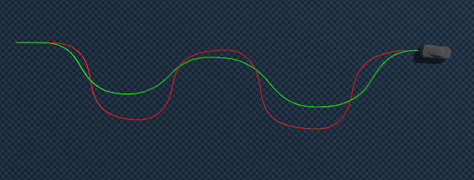
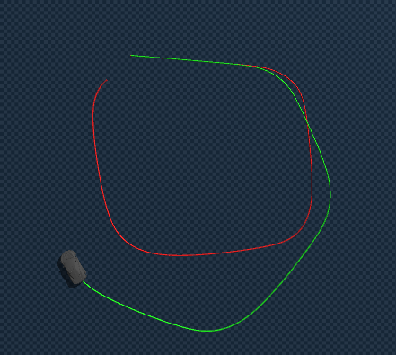

# Genesis Sim2Sim Calibration 파이프라인

## 이전 학습 결과 -> fail

## 1. 개요 및 목표
*   **핵심 문제:** 블렌더와 제네시스는 서로 다른 물리 솔버를 사용하므로, 동일한 입력($S, T$)을 주어도 결과 가속도($a$)와 곡률($k$)이 다르게 나타남.
*   **해결 방법:** 제네시스 시뮬레이터를 블랙박스로 두고, 반복적인 시뮬레이션(최적화)을 통해 블렌더의 거동을 똑같이 재현하는 **보정된 입력($S', T'$)**을 찾아내어 이를 학습함.
*   **중간 매개체:** Unicycle Kinematic Model의 가속도($a$)와 곡률($k$)을 정합 지표로 사용.

---

## 2. 세부 파이프라인 단계

### 단계 1: 기준 데이터 확보 (Blender)
블렌더 시뮬레이션 환경에서 다양한 주행 데이터를 수집합니다.
*   **입력 데이터:** $S_b$ (Steer), $T_b$ (Throttle)
*   **관측 데이터:** $a_b$ (Acceleration), $k_b$ (Curvature, $1/R$)
*   **결과물:** `(S_b, T_b) -> (a_b, k_b)` 데이터셋 구축

### 단계 2: 로컬 최적화 수행 (Genesis 반복 시뮬레이션)
제네시스 시뮬레이션 환경에서 블렌더의 거동을 재현하기 위한 입력을 찾습니다.
*   **목표 함수 (Objective):** $min \|(a_g, k_g) - (a_b, k_b)\|^2$
*   **탐색 변수:** Genesis용 보정 입력 $S', T'$
*   **방법:** 
    1.  특정 상태에서 블렌더의 $a_b, k_b$를 가져옴.
    2.  제네시스에서 $S, T$ 값을 바꿔가며 시뮬레이션을 반복 수행.
    3.  가장 유사한 $a_g, k_g$를 만들어내는 최적의 $S', T'$를 결정.
*   **최적화 알고리즘:** CMA-ES, Nelder-Mead 등 (미분 없이 가능한 최적화 기법)

### 단계 3: 지도학습 데이터셋 구축
최적화 과정을 통해 생성된 고품질 데이터를 정리합니다.
*   **Feature (Input):** $S_b, T_b, \text{Current State}$
*   **Label (Target):** 최적화로 찾아낸 $S', T'$
*   **결과물:** 보정 모델 학습을 위한 정규화된 데이터셋

### 단계 4: 보정 신경망(NN) 학습
블렌더 입력을 제네시스 입력으로 변환해주는 신경망을 학습시킵니다.
*   **구조:** MLP (Multi-Layer Perceptron)
*   **Loss:** $MSE(Model(S_b, T_b), (S', T'))$
*   **역할:** 실시간 주행 시, 블렌더 기반 제어 명령을 제네시스 물리 환경에 맞는 최적의 명령으로 즉시 변환.

### 단계 5: 최종 검증 및 배포
*   보정된 $S', T'$를 제네시스에 입력하여 실제 차량의 궤적이 블렌더와 일치하는지 확인.
*   필요시 강화학습(PPO)을 통한 후보정(Fine-tuning) 단계 진행.

---

## 3. 기대 효과
1.  **물리 엔진 한계 극복:** 제네시스의 미분 기능을 기다리지 않고 즉시 연구 진행 가능.
2.  **높은 정합성:** 반복 최적화를 통해 찾은 정답지를 학습하므로, 직관적인 입력 전달보다 훨씬 정교한 Sim2Sim 정합 가능.
3.  **실시간성:** 학습된 NN 모델을 사용하므로, 실제 주행 시에는 최적화 루프 없이 빠른 보정값 도출 가능.
