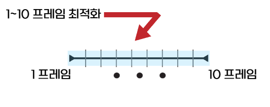
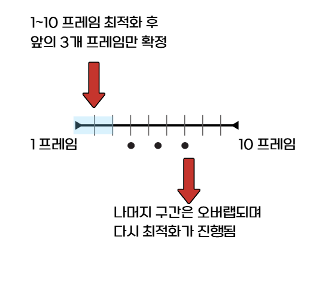

# 현재 진행 방식 및 결과 보고(2026_02_15)

## 최적화 결과에 영향을 주는 주요 요소
- 알고리즘: L-BFGS-B

### Loss

| 변수 | 현재값 | 역할 |
| --- | --- | --- |
| w_pos | 5.0 | 위치 오차 가중치|
| w_a | 1.0 | 가속도 오차 가중치 |
| w_k | 1.0 | 곡률 오차 가중치 |
| w_smooth | 0.01 | 제어 입력 smoothness 가중치 |

- w_smooth는 부드러운 제어를 위한 가중치

### Horizon
- 한 번 최적화할 때 미래 몇 프레임까지 내다볼 것인가를 의미
- 너무 크면 계산량이 많아지고, 너무 작으면 미래를 예측하지 못함

### horizon이 10(0.2초)일 경우 예시





## 진행하며 느낀 문제점

- iteration, horizon 등 값을 올렸을 때 더 나은 결과를 기대할 수 있을 법한 변수들은 값을 올리면 최적화 시간이 배로 늘어남
- 특히 코너링 구간에서 1번이라도 경로가 어긋나면 그 영향으로 그 뒤 최적화가 계속 꼬이는 현상이 발생
- 시간을 아끼면서도 정확하게 최적화하는 방법이 필요

## 위 문제 해결을 위해 고안한 방향

1. 최적화 시작(90프레임까지는 경로를 잘 따라갔다고 가정)
2. 90프레임에서 경로 이탈 발견(이탈 기준은 pos error가 2m 이상 났을 때)
3. 1~90 프레임까지는 경로를 잘 따라갔으니 golden 제어를 찾은 셈, 1~90까지의 제어는 저장
4. 경로가 어긋나기 시작한 90프레임부터 여러 변수들을 바꿔가며 재최적화(PD gain 튜닝이 될 수도 있고, loss를 수정해볼 수도 있고 어찌됐든 이 구간의 golden 제어를 찾으면 되는 것)
5. 4번을 통해 어긋났던 구간의 최적 제어를 찾으면 업데이트된 변수 값들을 그대로 유지하고 다음 최적화 진행

---
- 기존에는 최적화를 돌리고 1~500프레임이 전부 완료될 때까지 기다렸음
- 현재는 1~500프레임까지 최적화를 진행하다가 pos_err가 2m 이상 나면 멈추고, 시뮬레이션을 돌려 원인을 분석한 뒤 그에 맞는 튜닝 후 pos_err가 났던 지점부터 재최적화하는 방식

```
  >> Golden checkpoint saved at idx 211

  Saved: golden.json (controls up to idx 211)
  Saved: divergence_report.json

  To preview this segment:
    python replay_optimized.py --csv data/checkpoints_mpc/checkpoint.csv

  To re-optimize from problem area with different params:
    python optimize_mpc.py --from-idx 211 --error-threshold 3.0 [--horizon 30] ...
!!!!!!!!!!!!!!!!!!!!!!!!!!!!!!!!!!!!!!!!!!!!!!!!!!!!!!!!!!!!
```
이런 형식으로 golden checkpoint를 점점 늘려가는 식으로 진행중에 있습니다(현재 50%정도 완료)
