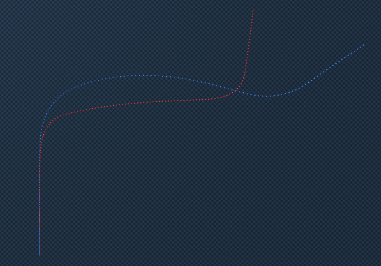
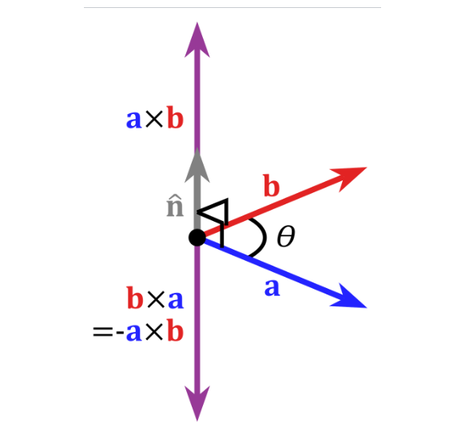
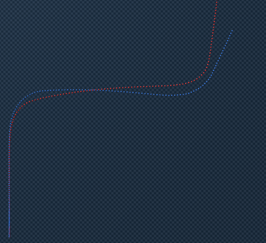
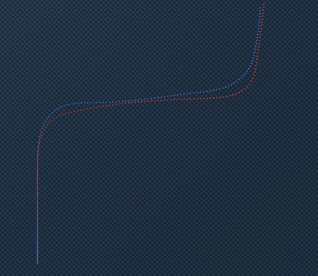
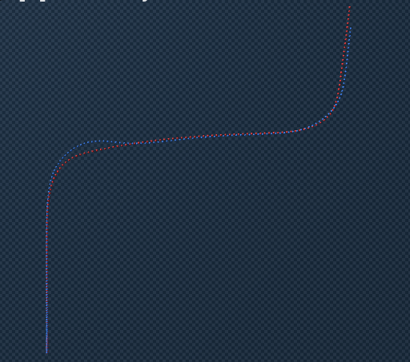

# Sweep + Feedback 제어 방식 정리

## 배경

Blender 차량 궤적을 Genesis 물리엔진에서 재현하는 Sim2Sim 과제.

### 이전 시도: MPC 최적화 (실패)
- L-BFGS-B로 매 프레임 throttle/steer 최적화
- loss를 지정하면 해당 loss들을 가장 최소로 하는 최적의 제어를 찾는 방식 BUT 경로 추종 특성상 초기에 pos, v,k 등 무엇 하나가 조금만 틀어져도 그에 대한 나비효과로 이후 결과도 전부 틀어져버림



- 직선 구간에서부터 쌓인 v오차(더 빨리 주행)로 코너링 구간에서 늦게 코너링 -> 벗어난 경로를 다시 복구하고자 steer를 주었으나 더 큰 pos 오차를 유발 

---

## 현재 방식: Sweep Mapping + Closed-Loop Feedback

### Step 1: Sweep Test 

Genesis 물리엔진의 제어-동역학 매핑을 직접 측정, 

**Throttle Sweep (직선)**
- 13 velocities (2\~14 m/s) × 101 throttle values (0\~1.0) = 1,313 조합
#### 예시: v_init=8, throttle=0.3일 때

8 m/s로 출발 → throttle 0.3으로 10프레임 → v_final 측정
a = (v_final - 8.0) / 0.2 = 4.2 m/s²

### a 결과 table (요약본)

| v \ thr | 0.0 | 0.1 | 0.2 | 0.3 | 0.4 | 0.5 | 0.6 | 0.8 | 1.0 |
|--------|-----|-----|-----|-----|-----|-----|-----|-----|-----|
| 2  | -3.7 | 2.4 | 7.2 | 8.1 | 8.9 | 8.0 | 9.5 | 6.9 | 8.2 |
| 3  | -5.0 | 0.8 | 6.3 | 8.4 | 7.8 | 7.8 | 9.4 | 6.9 | 8.0 |
| 4  | -6.2 | -1.1 | 4.7 | 7.2 | 9.3 | 9.7 | 8.5 | 6.5 | 7.7 |
| 5  | -6.6 | -2.8 | 3.0 | 7.8 | 8.2 | 8.9 | 8.0 | 6.4 | 7.6 |
| 6  | -7.1 | -4.4 | 1.4 | 6.0 | 8.8 | 8.2 | 8.0 | 10.9 | 7.3 |
| 7  | -7.2 | -5.1 | -0.3 | 4.9 | 7.5 | 9.4 | 10.3 | 10.3 | 7.2 |
| 8  | -7.9 | -6.2 | -2.1 | 4.2 | 7.8 | 8.6 | 9.6 | 9.8 | 6.8 |
| 9  | -6.7 | -6.3 | -3.6 | 2.3 | 5.5 | 7.9 | 8.4 | 9.9 | 7.0 |
| 10 | -8.4 | -6.6 | -4.1 | 0.6 | 5.2 | 7.2 | 10.0 | 9.1 | 6.8 |
| 11 | -5.7 | -7.7 | -5.9 | -1.4 | 4.4 | 8.4 | 8.0 | 8.5 | 6.6 |
| 12 | -6.5 | -7.0 | -6.5 | -2.6 | 2.6 | 7.6 | 8.4 | 8.5 | 6.1 |
| 13 | -6.8 | -7.4 | -6.5 | -3.5 | 1.3 | 4.5 | 6.1 | 7.8 | 5.8 |
| 14 | -7.3 | -7.5 | -7.5 | -3.6 | -0.7 | 4.3 | 6.8 | 9.7 | 10.1 |


**Steer Sweep (등속 선회)**
- 5 velocities (4,6,8,10,12) × 61 steer values (-0.6~0.6) = 305 조합
#### 등속 유지 throttle: throttle sweep 결과에서 a≈0인 throttle을 먼저 찾음

예: v=8일 때 throttle≈0.24면 a≈0 (감속도 가속도 안 함)

#### 예시: v_init=8, steer=0.2

1. `set_state(v_init=8, steer=0.2)`: 8 m/s + steer 0.2로 세팅
2. `step(steer=0.2, throttle=0.24)` × 10: 등속 throttle로 10프레임 선회 시뮬레이션
3. `k = yaw_rate / v` : 10프레임 후 yaw_rate 측정 → k = 0.53 / 8.0 = 0.0662 rad/m
4. k는 **1m 전진할 때 얼마나 회전하는가** 이므로 등속 throttle을 사용하지 않으면 k측정이 왜곡될 수 있음
### k 결과 table (요약본)

| v \ str | -0.6 | -0.4 | -0.2 | -0.1 | 0.0 | 0.1 | 0.2 | 0.4 | 0.6 |
|--------|------|------|------|------|-----|-----|-----|-----|-----|
| 4  | -0.2063 | -0.1373 | -0.0689 | -0.0330 | 0.0000 | 0.0330 | 0.0689 | 0.1373 | 0.2064 |
| 6  | -0.1560 | -0.1342 | -0.0666 | -0.0335 | 0.0000 | 0.0335 | 0.0666 | 0.1342 | 0.1562 |
| 8  | -0.1267 | -0.1029 | -0.0662 | -0.0352 | 0.0000 | 0.0352 | 0.0662 | 0.1030 | 0.1268 |
| 10 | -0.0291 | -0.0888 | -0.0687 | -0.0352 | 0.0000 | 0.0352 | 0.0688 | 0.0864 | 0.0289 |
| 12 | -0.0260 | -0.1052 | -0.0685 | -0.0271 | 0.0000 | 0.0271 | 0.0685 | 0.1058 | 0.0260 |


#### 여기까지 genesis의 a,k 값 추출 완료

### Step 2: 역매핑 구축

Sweep 데이터로 2D 선형 보간 역함수 구축:
- `throttle = f(v, target_a)` — throttle sweep 역산
- `steer = f(v, target_k)` — steer sweep 역산

v축과 a/k축 모두 선형 보간하여 sweep 격자점 사이 값도 정확히 산출.

### step2 요약
```
step1 에서 추출한 각 1313개의 a와 305개의 k로는 부족하기에 step2에서 그 사이 값들도 구하기위해 선형 interpolation을 진행한 것
```

### Step 3: Closed-Loop Feedforward + Feedback

매 프레임 Genesis 시뮬레이션을 실행하며 실제 상태 기반 피드백 적용.

```
# Feedforward (sweep lookup)
t_ff = throttle_lookup(target_v, target_a)
s_ff = steer_lookup(target_v, target_k)

# Throttle feedback (속도 오차 보정)
v_error = actual_v - target_v
t = t_ff - kp_v * v_error          # kp_v = 0.02

# Steer feedback (yaw + cross-track 오차 보정)
s = s_ff - kp_yaw * yaw_error      # kp_yaw = 0.5
       - kp_ct * ct_err_signed     # kp_ct  = 0.1
```

**피드백 항목:**

| 피드백 | 게인 | 역할 |
|--------|------|------|
| v_error → throttle | kp_v = 0.02 | 속도 드리프트 보정 |
| yaw_error → steer | kp_yaw = 0.5 | 방향 오차 보정 |
| cross-track → steer | kp_ct = 0.1 | 경로 이탈 보정 |

**Cross-track error 부호 계산:**
- 경로 방향 벡터와 (차량-경로점) 벡터의 cross product
- 양수 = 경로 좌측 → 우측으로 스티어링 보정
- 음수 = 경로 우측 → 좌측으로 스티어링 보정

### Cross-track 예시 



- a가 추종 경로 b가 경로점부터 차량까지의 위치 벡터라고 했을 때, cross product(aXb) 가 양수면 경로 기준 왼쪽 -> 우측 steering 보정
- b가 추종 경로 a가 경로점부터 차량까지의 위치 벡터라면, 이 경우 cross product가 bXa가 되므로 -aXb 즉 음수가 됨-> 좌측 steering 보정

### step3 요약
```
이전단계에서 구한 표를 이용해 목표 a,k를 구하기 위한 제어로 시뮬레이션 해보고 closed loop 방식으로 v,yaw,pos err에 대해 보정을 해가면서 제어를 보다 더 깔끔하게 다듬기
```
---

## 결과 비교

### 전체 방식 비교

| 방식 | pos_err mean | pos_err max | v_err mean | 소요 시간 |
|------|-------------|-------------|------------|-----------|
| MPC (L-BFGS-B) | 발산 | 발산 | 1.8 m/s | 수 시간 |
| Sweep open-loop | 1.01 m | 4.60 m | 0.49 m/s | 7.5s |
| Sweep + v feedback only | 1.04 m | 5.23 m | 0.32 m/s | 7.3s |
| **Sweep + full feedback** | **0.30 m** | **1.65 m** | **0.33 m/s** | **7.3s** |

### 각 방식 결과 이미지

| MPC (L-BFGS-B) | Sweep open-loop |
|--------|--------|
|  |  |

| Sweep + v feedback only | **Sweep + full feedback** |
|--------|--------|
|  |  |


### 최종 결과 상세 (Sweep + Full Feedback)

https://github.com/user-attachments/assets/bd3fb5ec-692a-4194-afff-1f2f62bd9d07

| 지표 | 값 |
|------|-----|
| pos_err mean | 0.30 m |
| pos_err max | 1.65 m |
| v_err mean | 0.33 m/s |
| v_err max | 1.21 m/s |
| a_err mean | 1.63 m/s² |
| k_err mean | 0.018 rad/m |
| vlat_err mean | 0.28 m/s |
| yaw_err mean | 3.34° |

### 분석
- **pos_err**: mean 0.30m, max 1.65m — MPC 대비 대폭 개선
- **v_err**: 0.33 m/s — MPC의 1.8 m/s에서 5배 이상 개선
- **a_err**: 1.63 m/s² — 상대적으로 높으나, 피드백이 v_err를 직접 보정하므로 v 누적 드리프트 없음
- **yaw_err**: 3.34° — yaw 피드백으로 코너링 방향 유지

---


## 추가 개선사항



- 위 방식을 유지하되, 코너 구간에서만 yaw 오차와 cross-track 오차에 더 강하게 반응하도록 kp_yaw와 kp_ct를 2배 강화한 결과 
