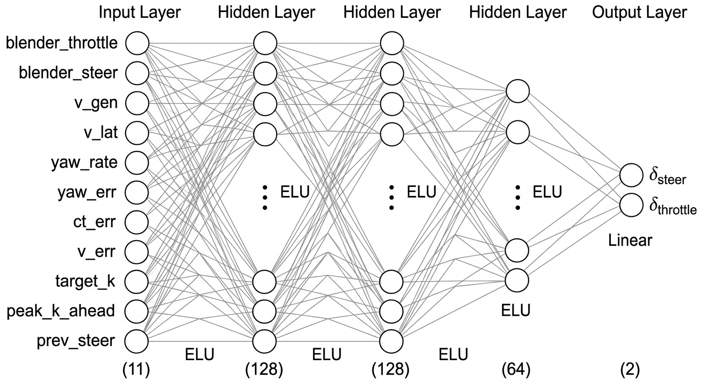

# Sim-to-Sim Transfer: Bridging Physics Engine Gap via MLP Control Correction
**Date:** 2026-02-20  
**Project:** Genesis Car Simulation — Sim2Sim Trajectory Matching

---

## 1. Problem Statement

Blender (Bullet physics)와 Genesis 물리 엔진은 동일한 제어 입력(throttle, steer)에 대해 서로 다른 차량 거동을 보입니다. 구체적으로:

- **속도 불일치**: Blender throttle 0.36 → Blender v ≈ 9.7 m/s, Genesis v ≈ 12.0 m/s
- **횡방향 속도 차이**: 타이어 모델 차이(Bullet RaycastVehicle vs Genesis Coulomb contact)로 인해 코너링 시 v_lat 거동이 다름
- **결과**: Blender에서 녹화한 제어 시퀀스를 Genesis에 그대로 재생하면 궤적이 크게 이탈


**목표**: Blender에서 생성된 차량 주행 궤적을 Genesis에서 동일하게 재현하는 Sim-to-Sim 전이 파이프라인 구축

---

## 2. Pipeline Overview

```
[Blender 주행 녹화]
        │
        ▼
[Sweep Test] ─── Genesis 동역학 특성화
  (throttle, v) → acceleration
  (steer, v)    → curvature
        │
        ▼
[Feedforward + PD Feedback Control]
  Sweep lookup + 속도·요각·횡방향 오차 보정
        │
        ▼
[Golden Controls 생성] ← Ground Truth
  (kp_yaw=1.0, kp_ct=0.3, lookahead=8)
        │
        ▼
[MLP 학습] ── 지도학습 (Supervised Learning)
  (Blender 제어 + Blender 상태) → Golden Genesis 제어
        │
        ▼
[실시간 Genesis 추론]
  Blender 데이터만으로 Genesis 제어를 실시간 보정
```

---

## 3. Ground Truth Generation (compute_controls_v2)

### 3.1 Sweep Test

Genesis 차량의 동역학 특성을 실험적으로 측정하여 역함수 룩업 테이블 구축:

| Sweep | 입력 | 측정값 | 조합 수 |
|-------|------|--------|---------|
| Throttle sweep | v_init ∈ [2, 14] m/s, throttle ∈ [0.0, 1.0] | a_measured | 13 × 101 = 1,313 |
| Steer sweep | v_init ∈ [4, 12] m/s, steer ∈ [-0.6, 0.6] | k_measured | 5 × 61 = 305 |

### 3.2 Feedforward + PD Feedback

각 프레임에 대해 Blender target (a, k, v)로부터 Genesis 제어값 역산:

```
throttle = lookup(v_target, a_target) − kp_v × (v_genesis − v_target)

steer    = lookup(v_target, k_target)
         − kp_yaw × Δyaw − kd_yaw × d(Δyaw)
         − kp_ct  × e_ct  − kd_ct  × d(e_ct)
```

코너 구간(frame ≤ 260)에서 곡률 적응형 게인 적용:

```
gain_boost = 1.0 + min(max_upcoming_k × 10.0, 1.0)   # 1.0 ~ 2.0×
```

### 3.3 Ground Truth 성능

| 지표 | 값 |
|---|---|
|Mean cross-track error|	0.2291 m|
|Max cross-track error|	1.5696 m|
|Mean v_err|	0.3504 m/s|
|Max v_err	|1.2249 m/s|


## 4. MLP Control Corrector

### 4.1 설계 동기

Ground truth 생성 파이프라인(sweep + PD feedback)은 매 시나리오마다 전체 시뮬레이션을 재실행해야 합니다. MLP는 이 과정을 학습하여 **새로운 Blender 궤적에 대해 실시간으로 Genesis 제어를 보정**하는 범용 보정기 역할을 합니다.

### 4.2 입력 설계 — Distribution Shift 문제 해결

**설계**: 입력에 Blender 상태(v_B, vlat_B, r_B) 사용
- Blender 데이터는 항상 고정값 → 추론 시에도 항상 학습 분포 내 입력
- Genesis 상태 이탈과 무관하게 안정적 출력 보장

### 4.3 아키텍처



| 구성요소 | 상세 |
|---------|------|
| **입력층** | 5 nodes |
| **은닉층 1** | 128 nodes, ReLU |
| **은닉층 2** | 128 nodes, ReLU |
| **은닉층 3** | 64 nodes, ReLU |
| **출력층** | 2 nodes, Linear |
| **총 파라미터** | **25,666** |

**입력 피처 (5개)**

| # | 피처 | 설명 | 학습 데이터 범위 |
|---|------|------|----------------|
| 1 | T_B | Blender 스로틀 | 0.080 ~ 0.417 |
| 2 | S_B | Blender 조향각 (rad) | −0.586 ~ 0.505 |
| 3 | v_B | Blender 종방향 속도 (m/s) | 2.133 ~ 11.176 |
| 4 | v_lat_B | Blender 횡방향 속도 (m/s) | −2.487 ~ 3.060 |
| 5 | r_B | Blender 요레이트 (rad/s) | −1.790 ~ 2.203 |

**출력 (2개)**

| # | 출력 | 설명 | 클리핑 |
|---|------|------|--------|
| 1 | throttle* | Genesis 보정 스로틀 | [−1.0, 1.0] |
| 2 | steer* | Genesis 보정 조향각 (rad) | [−0.61, 0.61] |

### 4.4 학습 설정

| 항목 | 값 |
|------|----|
| 학습 데이터 | 486 샘플 (frame 15 ~ 500) |
| Train / Val 분할 | 85% / 15% (414 / 72) |
| 정규화 | Z-score (입·출력 모두) |
| Optimizer | Adam, lr = 1×10⁻³ |
| LR Scheduler | Cosine Annealing (T_max = 2,000) |
| Loss 함수 | MSE (정규화 공간) |
| Batch size | 64 |
| Epochs | 2,000 |
| Best val loss | 0.01135 |

---

## 5. MLP Results

https://github.com/user-attachments/assets/6e6736b1-3994-447c-aab9-ccb4a39b1b53

### 5.1 방법별 위치 오차 비교

| 방법 | Mean error | Max error | 비고 |
|------|-----------|----------|------|
| Blender 제어 직접 적용 (baseline) | 5.013m | 24.198m | 물리 엔진 차이로 경로를 많이 벗어남 |
| Ground Truth Replay | **0.2291m** | 1.5696 m | 사전 계산된 golden controls 재생 |
| **MLP Inference (Blender 상태 입력)** | **0.3120 m** | 1.5633 m | 실시간 보정, 안정적 주행 |

### 5.2 방법별 속력 오차 비교

|방법|	Mean signed (m/s)|	Mean abs (m/s)|	Max abs (m/s)|
|------|------|------|------|
|Blender raw 직접 적용|	−4.029|	4.735	|14.277	|
|Ground Truth Replay|	−0.209|	0.350|	1.225|
|MLP Inference|	−3.975|	4.110	|12.126|


- 세 방법 모두 Genesis가 Blender보다 느린 경향을 띔
-  MLP의 위치 오차는 Ground Truth와 비슷하지만, 속도 오차는 baseline 수준으로 큰 것이 확인
- Ground Truth는 PD 피드백으로 매 프레임 속도를 보정하기 때문에 속도 오차가 크게 줄어든 것

---

## 6. Key Findings

1. **Sim-to-Sim 갭의 주요 원인**: 횡방향 속도(v_lat) 차이. 타이어 모델이 달라 코너링 시 Genesis의 횡력이 Blender보다 크게 작용하며, 이것이 누적 위치 오차의 주된 요인.

2. **곡률 적응형 게인**: 코너 구간에서 PD 게인을 최대 2배 부스트하여 ground truth 정밀도 향상.

---

