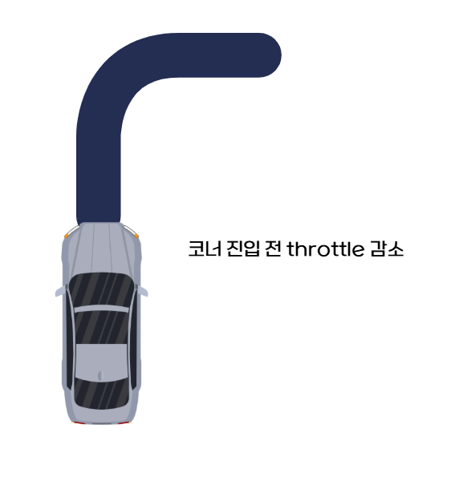
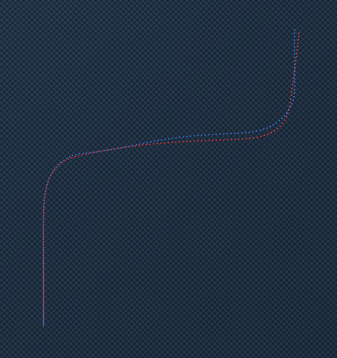
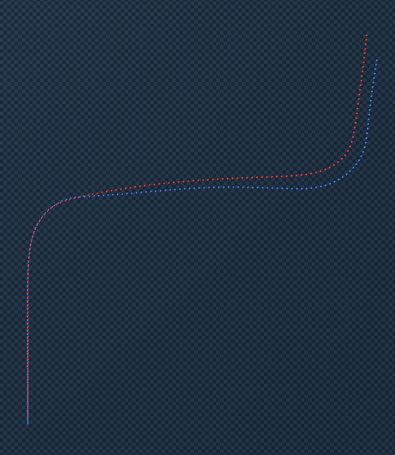
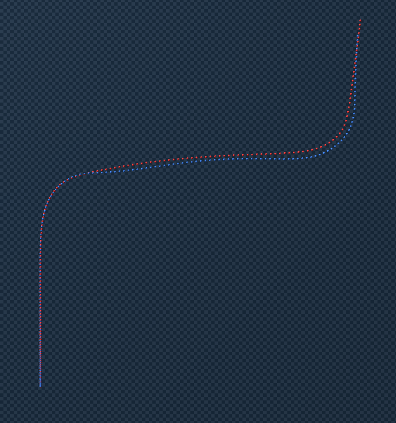
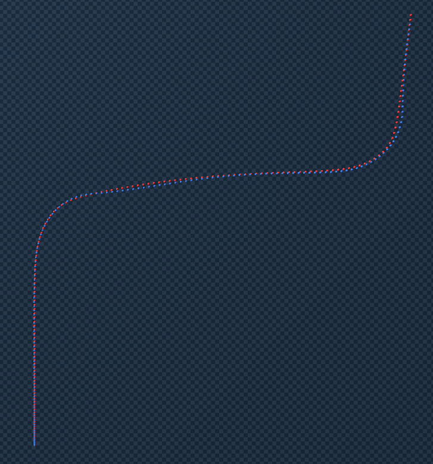
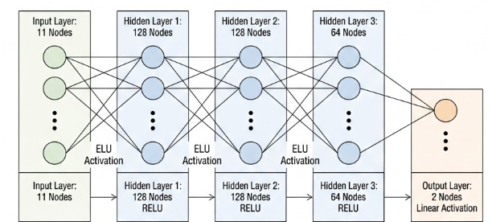

# Sim-to-Sim Transfer: Ground Truth → MLP 지도학습

**Date:** 2026-02-27
**Project:** Genesis Car Simulation — Sim2Sim Trajectory Matching

---

## 1. Ground Truth

이전 파이프라인(Sweep + Feedforward + PD Feedback)으로 평균 거리 오차 **0.2291m** 수준의 궤적 재현에 이미 성공한 상태,  
다만 코너 구간에서의 잔류 오차(1st corner ≈ 0.18m, 2nd corner ≈ 0.45m)가 남아 있었고, 이후 MLP 지도학습의 학습 데이터 품질이 Ground Truth 정밀도에 직접 비례하기 때문에 **평균 거리 오차 0.1m** 달성을 Ground Truth 목표로 설정

---

### 1.1 Sweep Test + Feedforward + PD Feedback

각 단계(Sweep Test, 역매핑 구축, Feedforward + PD Feedback)의 상세 내용은 이전 보고서에 기술되어 있음.


---

### k_brake 도입 배경 및 의미

이전까지는 Feedforward + PD Feedback만으로 궤적을 추종하였으나, Genesis 차량이 코너 진입 전 blender 차량과 같은 속력으로는 목표 k가 나오지 않는 문제가 있었음

이를 해결하기 위해 코너 **40 프레임(0.8s) 전부터 throttle을 선제적으로 감소**시키는 `k_brake` 항을 도입:

```
if max_upcoming_k > k_brake_threshold:
    t = t_ff - k_brake * (max_upcoming_k - k_brake_threshold)
```



| 파라미터 | 최종값 | 설명 |
|---------|:------:|------|
| `k_brake` | 1.25 | 감속 강도. 클수록 코너 전 더 많이 감속 |
| `k_brake_threshold` | 0.15 rad/m | 이 곡률 이상인 코너에서만 감속 트리거 |
| `k_brake_lookahead` | 40 frames (0.8s) | 코너 얼마 전부터 감속 시작할지 |

**Trade-off: 속도 오차 vs 위치 오차**

- k_brake로 인해 코너 진입 전 속력 오차가 발생
- 그러나 pos 오차를 깔끔하게 없앤다는 점에서 도입 가치가 있다고 판단

---

#### k_brake 값에 따른 결과 비교

| k_brake = 0.0 | k_brake = 0.5 |
|:---:|:---:|
|  |  |

| k_brake = 1.0 | k_brake = 1.25 (최종) |
|:---:|:---:|
|  |  |

#### 최종 PD 파라미터

| 파라미터 | 최종값 | 설명 |
|---------|:------:|------|
| `kp_v` | 0.15 | 종방향 속도 오차 P 게인 |
| `kp_yaw` | 0.3 | 헤딩(요각) 오차 P 게인 |
| `kp_ct` | 0.1 | 횡방향(cross-track) 오차 P 게인 |
| `kd_yaw` | 0.02 | 헤딩 오차 D 게인 |
| `kd_ct` | 0.01 | 횡방향 오차 D 게인 |
| `k_brake` | 1.25 | 코너 예고 감속 강도 |
| `k_brake_threshold` | 0.15 | 감속 트리거 곡률 기준 (rad/m) |
| `k_brake_lookahead` | 40 frames | 0.8s 전 감속 시작 |

https://github.com/user-attachments/assets/0747dee4-9b47-4936-9075-748a901ba0df

#### Ground Truth 정량적 지표 

| 구간 | Mean pos_err | Max pos_err |
|------|:-----------:|:-----------:|
| 직선 (Straight) | 0.020 m | 0.034 m |
| 1번째 코너 | 0.078 m | 0.199 m |
| 2번째 코너 | 0.218 m | 0.703 m |
| **전체 평균** | **0.105 m** | **0.703 m** |

---

### 1.2 PD Feedback에서의 State

PD 피드백 제어에서 오차 계산에 사용된 state 변수.

| 변수 | 기호 | 단위 | 설명 | 적용 제어 |
|------|------|------|------|----------|
| 종방향 속도 | v_gen | m/s | 차량 전방 방향 속도 (Genesis body frame) | throttle P 보정 |
| 요각 | yaw | rad | 차량 heading 각도 | steer P/D 보정 |
| 횡방향 위치 오차 | ct_err | m | 목표 경로로부터의 수직 이탈 거리 (부호 있음) | steer P/D 보정 |

> **v_lat(횡방향 속도)을 직접 제어하지 않는 이유:** 서로 다른 물리엔진 환경에서 throttle/steer로 v_lat을 직접 조종하는 것이 불가능하며, v_lat의 영향(경로 이탈)은 yaw와 ct_err로 간접 보정 가능하기 때문.

---

## 2. MLP 지도학습 (Supervised Learning)

### MLP의 역할

**새로운 Blender 궤적이 주어졌을 때 실시간으로 Genesis 제어를 보정하는 범용 보정기 역할**

MLP는 Feedforward 제어(sweep lookup)로부터의 **잔차(delta)를 예측**하는 방식으로 설계:

```
steer    = clip(s_ff + Δsteer,    −0.61, 0.61)
throttle = clip(t_ff + Δthrottle, −1.0,  1.0)
```

### State 구성 (11개 입력 피처)

| # | 피처 | 단위 | 설명 |
|---|------|------|------|
| 1 | `blender_throttle` | — | Blender 애니메이션 스로틀 값 (−1~1), 주행 의도 신호 |
| 2 | `blender_steer` | rad | Blender 애니메이션 조향각 |
| 3 | `v_gen` | m/s | Genesis 종방향 속도 |
| 4 | `vlat_gen` | m/s | Genesis 횡방향 속도 |
| 5 | `r_gen` | rad/s | Genesis 요레이트 (yaw rate) |
| 6 | `yaw_err_signed` | rad | 헤딩 오차 (Genesis − Blender target), 부호 있음 |
| 7 | `ct_err_signed` | m | 횡방향 위치 오차, 양수 = 경로 우측 이탈 |
| 8 | `v_err_signed` | m/s | 속도 오차 (Genesis − Blender target), 양수 = 과속 |
| 9 | `target_k` | rad/m | 피드포워드 스티어링 목표 곡률 (lookahead 적용) |
| 10 | `peak_k_ahead` | rad/m | 향후 40 프레임 내 최대 절대 곡률 (코너 예고) |
| 11 | `prev_steer` | rad | 직전 스텝에서 실제 적용된 조향각 (액추에이터 상태) |

### 출력 (2개)

| # | 출력 | 설명 |
|---|------|------|
| 1 | `Δsteer` | 조향각 보정값 (rad) |
| 2 | `Δthrottle` | 스로틀 보정값 |

- 이때 잔차는 sweep table에서 구했던 대략적인 제어에 대한 잔차를 의미
### MLP 구조 및 학습 설정



| 항목 | 값 |
|------|----|
| 아키텍처 | 11 → [128, 128, 64] → 2 (ELU activation) |
| 학습 데이터 | Ground Truth csv data (486 샘플, frame 15~500) |
| Train / Val 분할 | 90% / 10% |
| 정규화 | Z-score (입력, 학습 세트 기준) |
| Optimizer | Adam, lr = 1×10⁻³ |
| LR Scheduler | Cosine Annealing (T_max = 200 epochs) |
| Loss 함수 | MSE |
| Batch size | 64 |


https://github.com/user-attachments/assets/6afa2e5f-b924-4611-be91-7d19c75cc402

---

## 3. Residual RL (잔차 강화학습)

### 강화학습의 의의

MLP 지도학습은 Ground Truth 데이터와 같은 분포의 상황에서는 잘 작동하지만, 실시간 추론 시 MLP가 약간의 오차를 내면 state가 학습 분포에서 벗어나면서 오차가 누적되는 문제가 발생

Residual RL은 **frozen MLP를 base policy로 유지한 채, 그 위에 소량의 잔차(residual) 보정을 학습**

```
total_action = MLP_base(state) + RL_residual(state)

steer    = clip(s_ff + Δs_mlp    + Δs_res,    −0.61, 0.61)
throttle = clip(t_ff + Δt_mlp    + Δt_res,    −1.0,  1.0)
```

### 리워드 함수

```
r = −α · |ct_err| − β · |v_err| · (1 − corner_flag)
    − γ_s · Δs_res² − γ_t · Δt_res²
```

**설계 의도:**
코너 구간에서는 제동 효과를 위해 v_err를 허용하되 pos 오차를 최우선으로 줄이는 구조. `corner_flag = 1` 시 v_err 패널티 비활성화.

### 강화학습 설정

| 항목 | 값 |
|------|----|
| 알고리즘 | PPO (Proximal Policy Optimization) |
| 병렬 환경 수 | 200 (Genesis native `n_envs=200`) |
| 에피소드 길이 | 485 steps (frame 15~500) |
| Transitions / iteration | 200 × 485 = **97,000** |
| Iterations | 100 |
| 총 학습 transitions | **약 9.7M** |
| PPO epochs | 4 |
| Mini-batch size | 4,096 |
| Learning rate | 3×10⁻⁴ |
| LR Scheduler | Cosine Annealing |
| Discount factor (γ) | 0.99 |
| GAE λ | 0.95 |
| Clip ε | 0.2 |
| Entropy 계수 | 0.005 |

### 일부 세팅 설명
| 항목                 | 의미                  | 직관            |
| ------------------ | ------------------- | ------------- |
| 97,000 transitions | 한 번 업데이트 전 수집 데이터 수 | 배치 크기         |
| Cosine Annealing   | 학습률 점점 감소           | 초반 빠르게, 후반 안정 |
| γ=0.99             | 미래 보상 중시            | 장기 전략 학습      |
| λ=0.95             | Advantage smoothing | 안정성과 정확성 균형   |
| Clip ε=0.2         | 정책 변화 제한            | 과도한 업데이트 방지   |


### 결과

| 방법 | 평균 거리 오차 |
|------|:------------:|
| Ground Truth | **0.1 m** |
| MLP alone | > 0.2 m |
| **MLP + Residual RL** | **0.2 m** |

https://github.com/user-attachments/assets/a551484d-bf6a-4897-95e4-185f645e3209


