# 다양한 데이터 추출 & 학습

- 이전에 진행한 것과 방식은 동일(개별 강화 학습은 별도 진행X)
- 다양한 Blender 움직임을 만들어 데이터를 추출
- Ground Truth 생성 후 MLP 지도학습 진행
- 아래 정량 지표의 단위는 pos(m), v(m/s)

---

## Ground Truth 결과(이미지 클릭시 Ground Truth 영상 재생)

| 직선+우+좌 | N커브 | S커브 | 3코너 | 저속 좌유턴 |
|:-----------:|:-----------:|:-----:|:-----:|:-----------:|
| <a href="https://github.com/user-attachments/assets/fd8e22ee-9496-421a-b9b3-7bf837660745">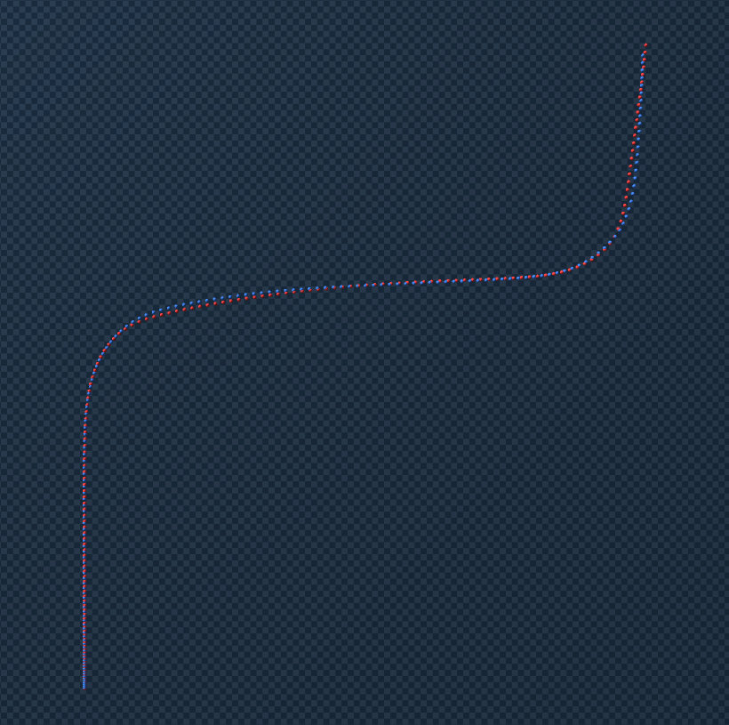</a> ----------------- PosErr μ=0.1407m   max=0.6863m VErr μ=0.1244   max=0.6612 | <a href="https://github.com/user-attachments/assets/9935096d-d20b-4336-bbca-c90486ef9bdc">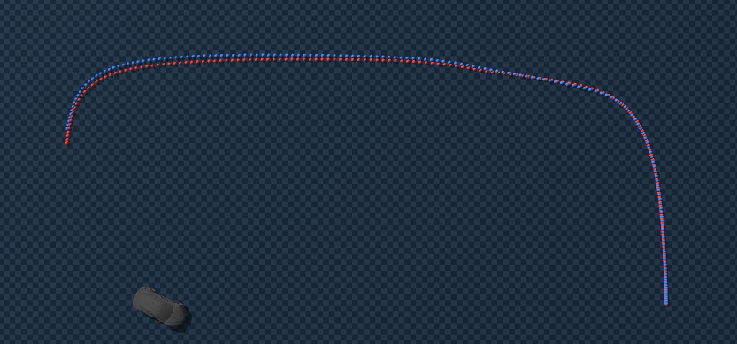</a> ----------------- PosErr μ=0.0539m   max=0.1661m VErr μ=0.1365   max=0.7990 | <a href="https://github.com/user-attachments/assets/66f6d5d9-0b65-46b0-b378-c858ed37f1cf">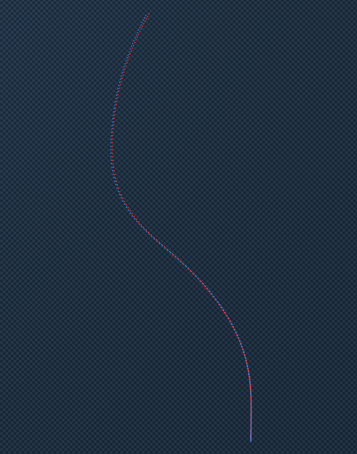</a> ----------------- PosErr μ=0.0499m   max=0.1099m VErr μ=0.0709   max=0.2763 | <a href="https://github.com/user-attachments/assets/021965da-b7be-473e-a6ba-741b2c44bdab">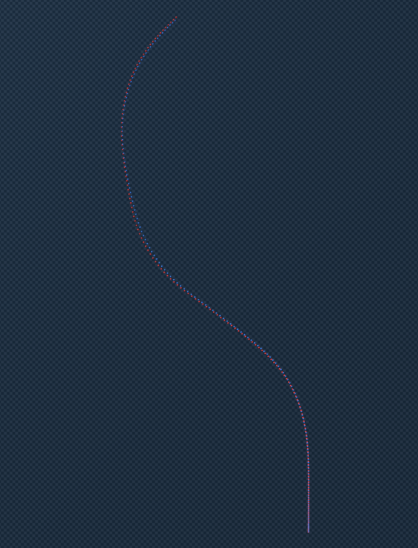</a> ----------------- PosErr μ=0.0646m   max=0.1531m VErr μ=0.0774   max=0.3023 | <a href="https://github.com/user-attachments/assets/420e65b6-9254-4d79-9cc6-6c5353f3106b">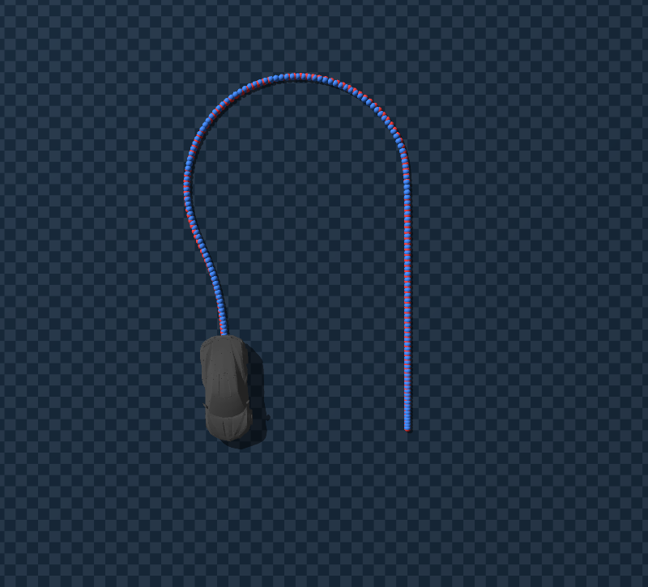</a> ----------------- PosErr μ=0.0320m   max=0.0718m VErr μ=0.2667   max=0.5564 |

| 우측 유턴 | 슬라롬 | 직진(저속->고속->저속) | 직진(고속→저속→고속) | 타이트 코너 |
|:-----------:|:------:|:--------------:|:--------------:|:-----------:|
| <a href="https://github.com/user-attachments/assets/d8e6af30-1ea0-44c0-98d2-0c0c260af716">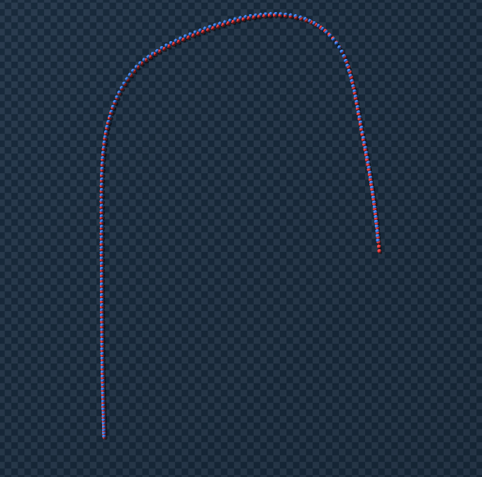</a> ----------------- PosErr μ=0.0453m   max=0.1030m VErr μ=0.1167   max=0.5439 | <a href="https://github.com/user-attachments/assets/fad77c58-995e-489f-be7c-e1fc2fbe40a3">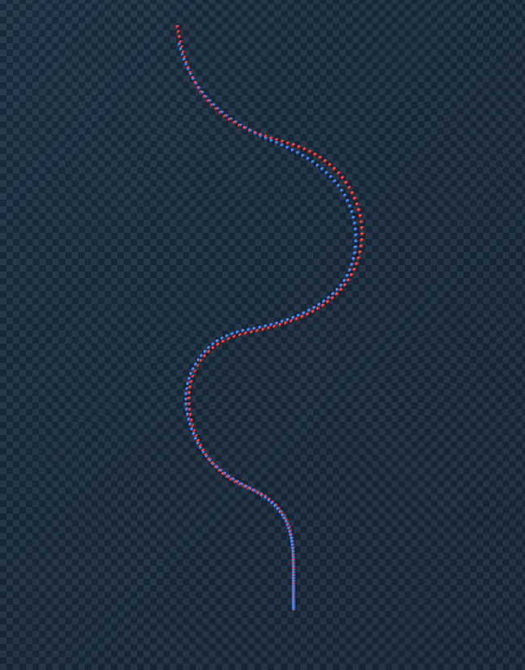</a> ----------------- PosErr μ=0.1164m   max=0.5403m VErr μ=0.2081   max=0.7093 | <a href="https://github.com/user-attachments/assets/f2e2d760-40f4-40fa-b0c7-7a2e172821ed">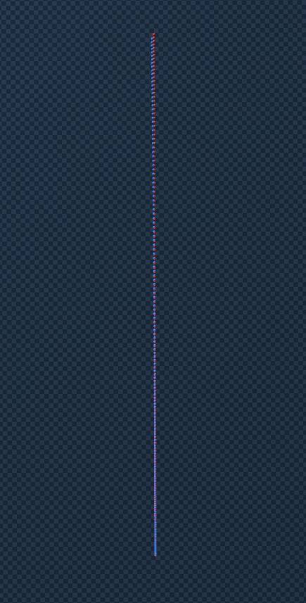</a> ----------------- PosErr μ=0.0256m   max=0.0781m VErr μ=0.0398   max=0.1606 | <a href="https://github.com/user-attachments/assets/ba5649e1-2e63-455e-9b21-f1da11556839">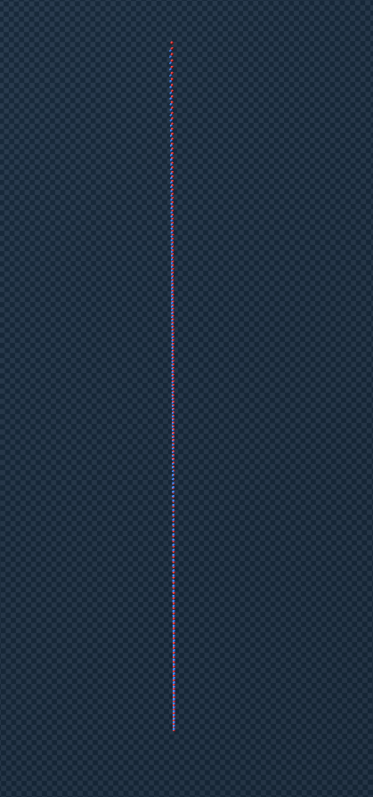</a> ----------------- PosErr μ=0.0244m   max=0.0773m VErr μ=0.0593   max=0.6800 | <a href="https://github.com/user-attachments/assets/263cdb29-4393-46e3-8212-0410ebd7ed60">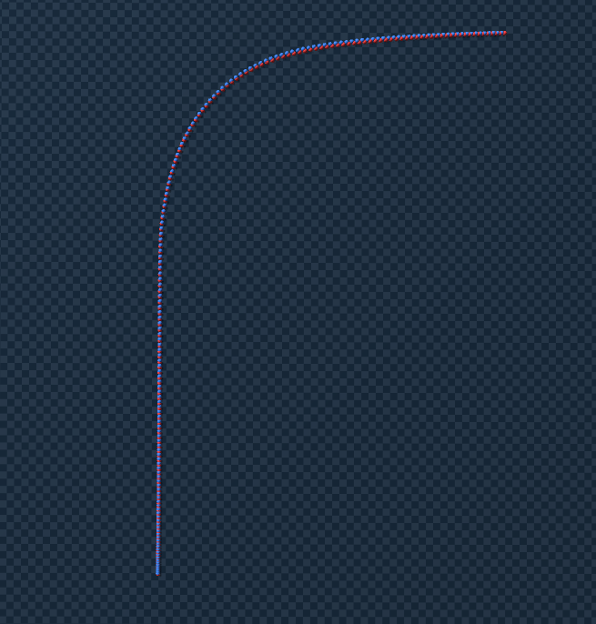</a> ----------------- PosErr μ=0.0371m   max=0.0851m VErr μ=0.0512   max=0.1495 |

- 다양한 움직임에 대한 Ground Truth 완료

---

## MLP 지도학습 결과(이미지 클릭시 MLP 결과 영상 재생)

| 직선+우+좌 | N커브 | S커브 | 3코너 | 저속 좌유턴 |
|:-----------:|:-----------:|:-----:|:-----:|:-----------:|
| <a href="https://github.com/user-attachments/assets/8822b801-3b97-4dfc-8193-d31f424028d5">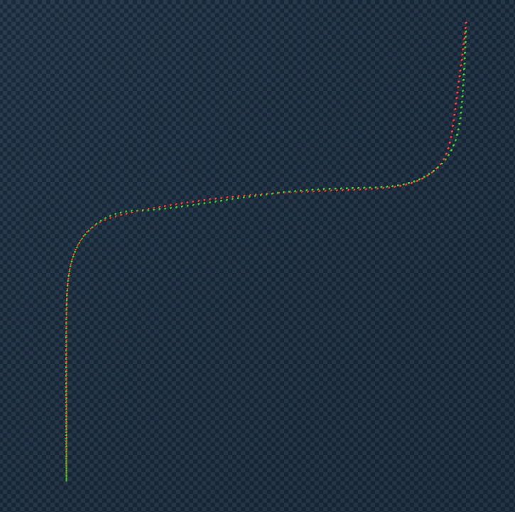</a> ----------------- PosErr μ=0.1667m   max=0.8075m VErr μ=0.1200   max=0.5855 | <a href="https://github.com/user-attachments/assets/51aacd5a-37ed-4ec4-b7cf-a14c3bf264b1">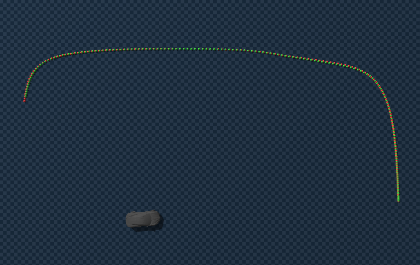</a> ----------------- PosErr μ=0.0543m   max=0.1409m VErr μ=0.1237   max=0.6772 | <a href="https://github.com/user-attachments/assets/4d40fd7e-2c26-4f4d-b1a2-6676560331fa">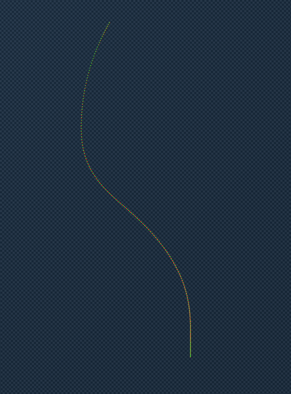</a> ----------------- PosErr μ=0.0523m   max=0.1121m VErr μ=0.0641   max=0.1978 | <a href="https://github.com/user-attachments/assets/1f979491-1594-4e5f-9580-2dc2efc7add4">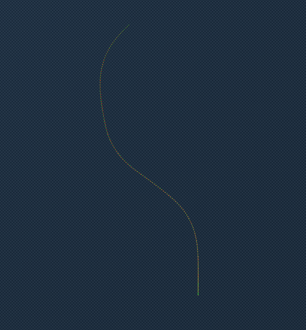</a> ----------------- PosErr μ=0.0844m   max=0.1948m VErr μ=0.0694   max=0.3033 | <a href="https://github.com/user-attachments/assets/5fa0d3c8-095d-4a2f-8363-1d862aa8d8cc">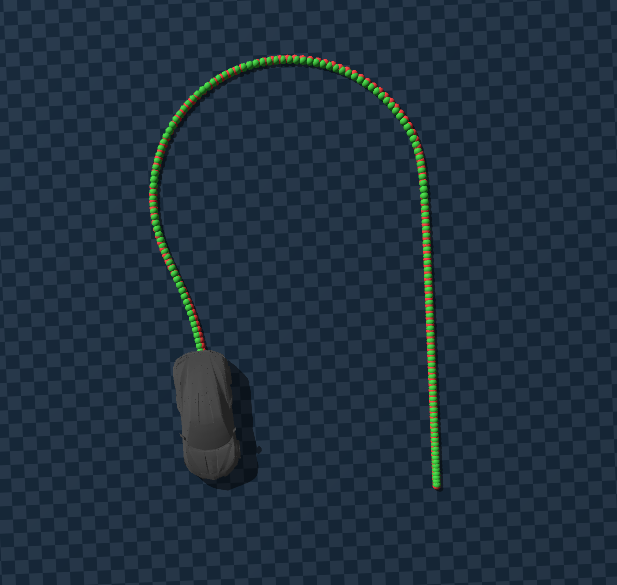</a> ----------------- PosErr μ=0.0333m   max=0.0809m VErr μ=0.2596   max=0.5654 |

| 우측 유턴 | 슬라롬 | 직진(저속->고속->저속) | 직진(고속→저속→고속) | 타이트 코너 |
|:-----------:|:------:|:--------------:|:--------------:|:-----------:|
| <a href="https://github.com/user-attachments/assets/2129179e-8eae-41bb-9a05-3ecbb1fef9d8">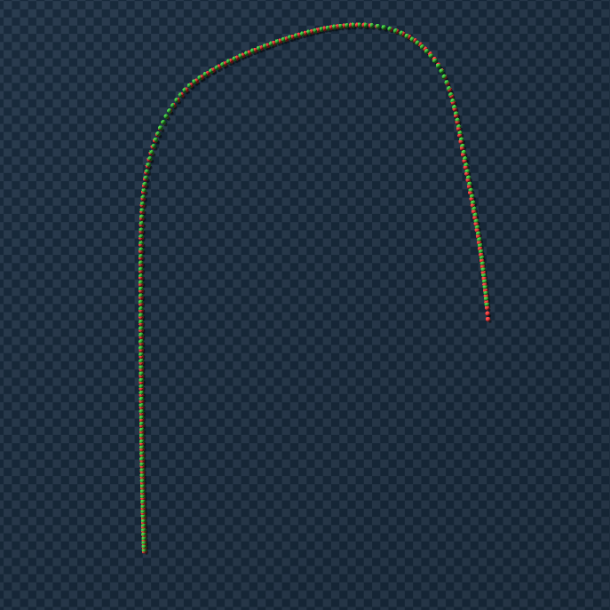</a> ----------------- PosErr μ=0.0357m   max=0.0917m VErr μ=0.1135   max=0.5633 | <a href="https://github.com/user-attachments/assets/50a16cce-22c0-4da4-a592-d0752d17b5f6">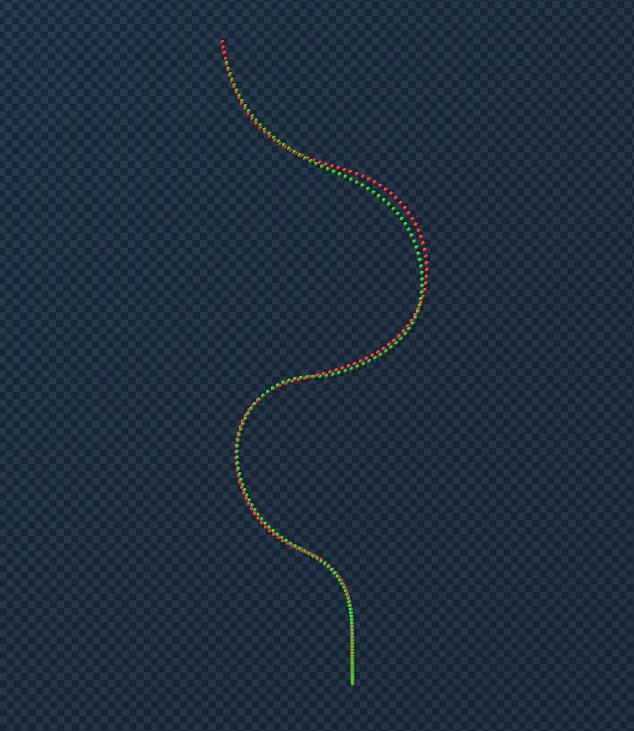</a> ----------------- PosErr μ=0.1460m   max=0.6721m VErr μ=0.2056   max=0.7504 | <a href="https://github.com/user-attachments/assets/acffaa71-1a44-494f-8a5c-48051236c93e">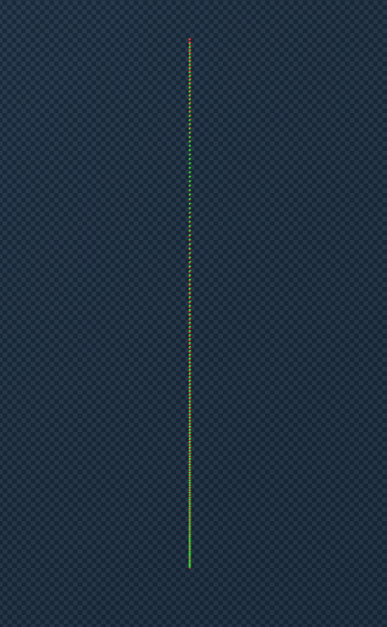</a> ----------------- PosErr μ=0.0259m    max=0.0776m VErr μ=0.0412   max=0.1526 | <a href="https://github.com/user-attachments/assets/a8f27a16-2b62-4f7d-a38d-76bba74ede45">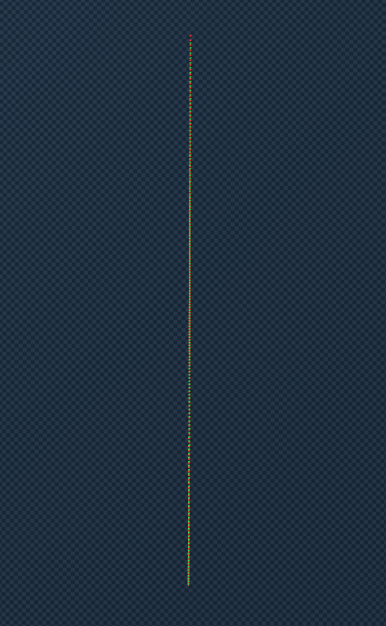</a> ----------------- PosErr μ=0.0241m   max=0.0792m VErr μ=0.0503   max=0.4102 | <a href="https://github.com/user-attachments/assets/179adbb2-a176-4ff6-b70f-3efc8a4711ad">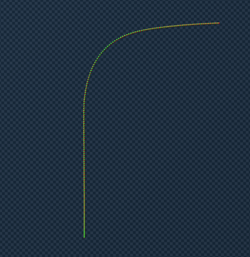</a> ----------------- PosErr μ=0.0327m    max=0.0839m VErr μ=0.0452   max=0.1729 |

---

## 학습시키지 않은 새로운 움직임 실험(이미지 클릭시 영상 재생)

- 새로운 경로에 대해 Blender raw 제어 및 state 입력
- 학습 범위 내 속도·곡률 영역에서 일반화 성능 검증

| 시도1 | 시도2 | 시도3 |
|:-----------:|:------:|:--------------:|
| <a href="https://github.com/user-attachments/assets/53e9daab-df20-46ad-8033-3ab87817747e">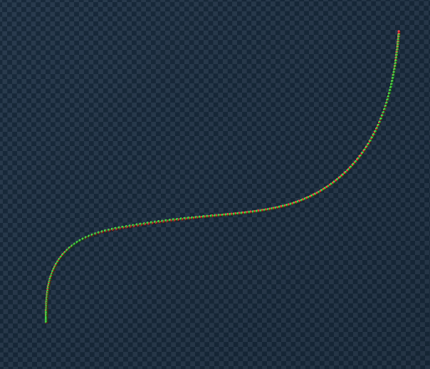</a> ----------------- PosErr μ=0.0424m   max=0.1323m VErr μ=0.0558   max=0.1492 | <a href="https://github.com/user-attachments/assets/7d9e59be-409d-4e87-9ee7-7a120a03ea43">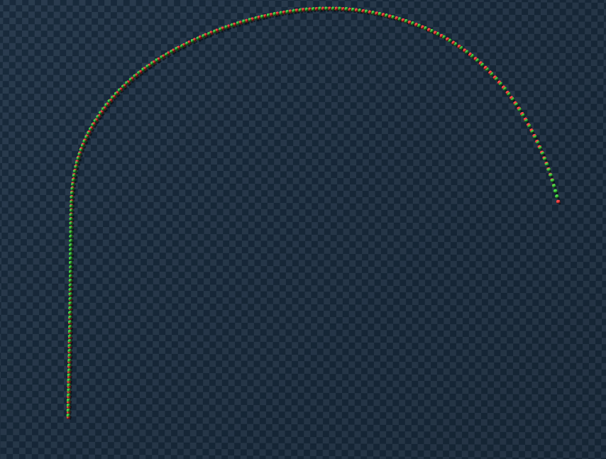</a> ----------------- PosErr μ=0.0405m   max=0.0855m VErr μ=0.0577   max=0.1482 | <a href="https://github.com/user-attachments/assets/85e47ad6-02f4-467a-8690-1fcc33f85809">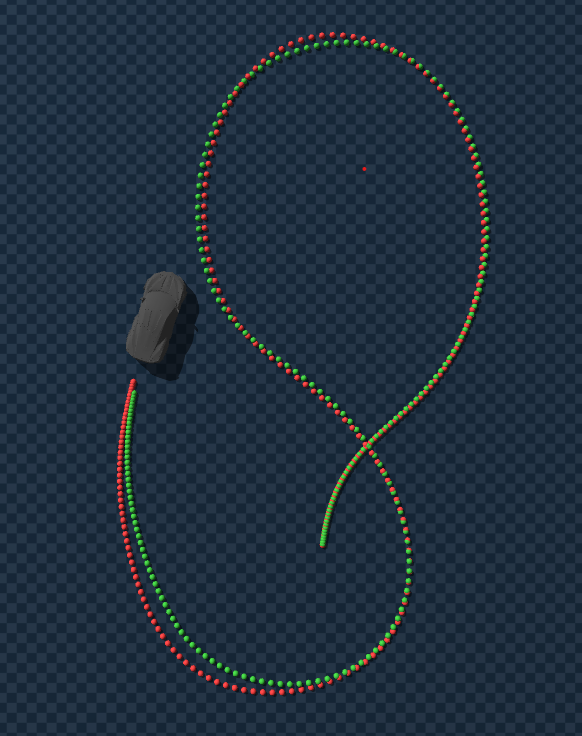</a> ----------------- PosErr μ=0.2540m   max=0.9366m VErr μ=0.1579   max=0.9549 |

| 시도4 | 시도5 | 시도6 |
|:-----------:|:------:|:--------------:|
| <a href="https://github.com/user-attachments/assets/822b6add-3eec-4bff-bb0a-6759e87e0ba6">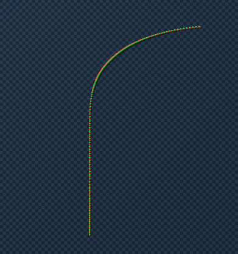</a> ----------------- PosErr μ=0.0569m   max=0.0859m VErr μ=0.0728   max=0.8055 | <a href="https://github.com/user-attachments/assets/d16bb8da-d70e-4582-92d7-25557a51653d">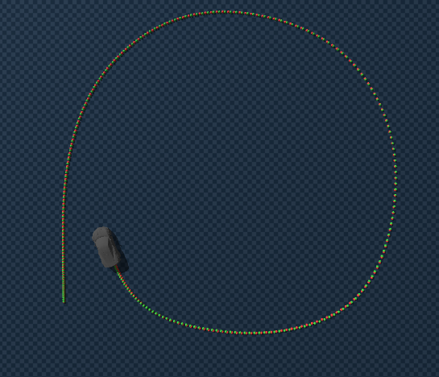</a> ----------------- PosErr μ=0.0512m   max=0.1185m VErr μ=0.0819   max=0.7680 | <a href="https://github.com/user-attachments/assets/957508bc-68d6-4a93-8e0b-82a29c7f7ff4">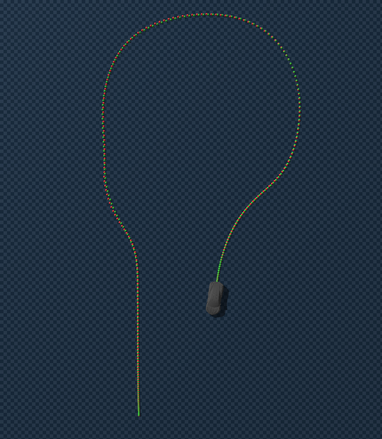</a> ----------------- PosErr μ=0.0638m   max=0.2871m VErr μ=0.0787   max=0.6429 |

---

## 전체 평균 오차 요약

| Category | Motion Count | Avg PosErr (m) | Avg VErr(m/s) |
|:--------|:------------:|:--------------:|:--------:|
| Ground Truth (Blender → Genesis 최적 제어) | 10 | 0.0590 | 0.1151 |
| MLP (학습된 움직임) | 10 | 0.0655 | 0.1093 |
| MLP (비학습 새로운 움직임) | 6 | 0.0848 | 0.08413 |

