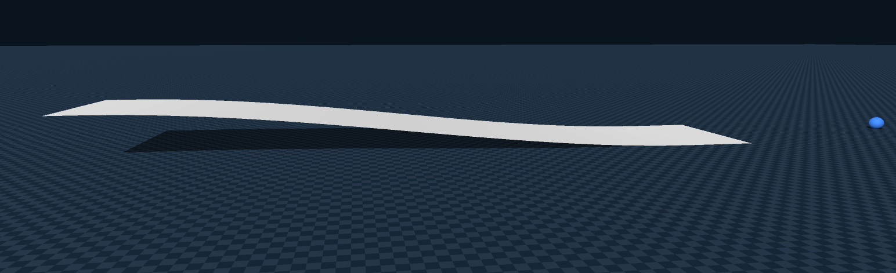
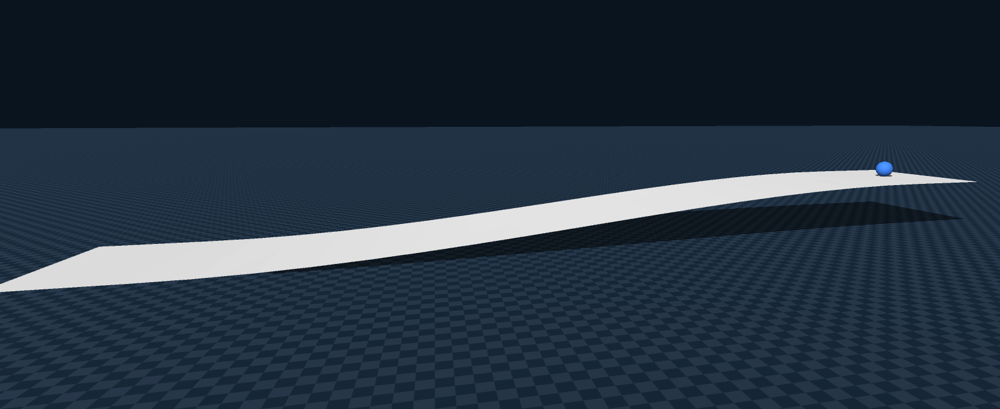
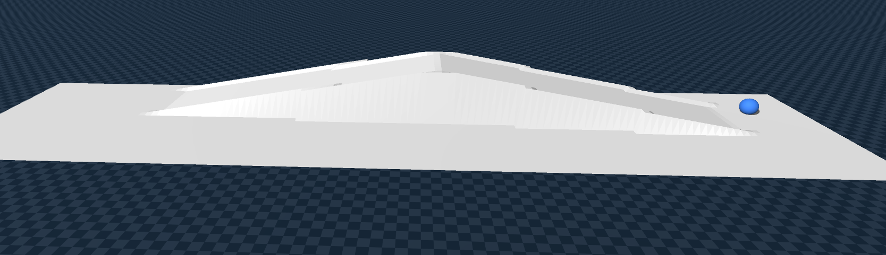
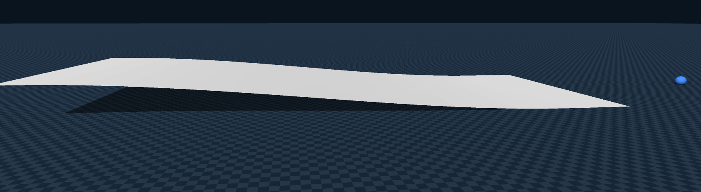
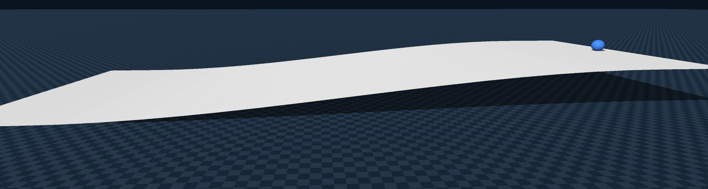
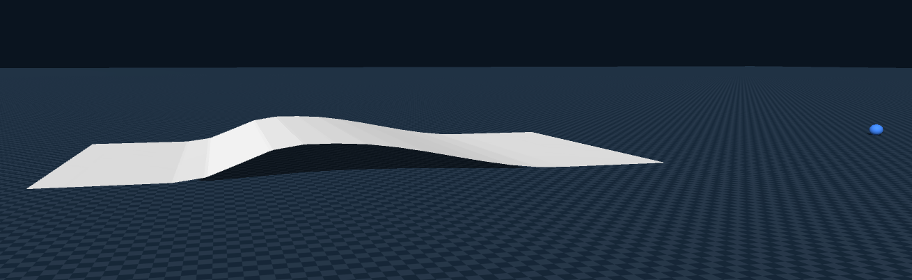
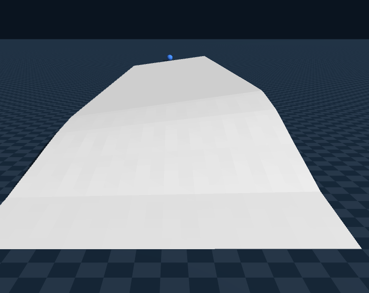
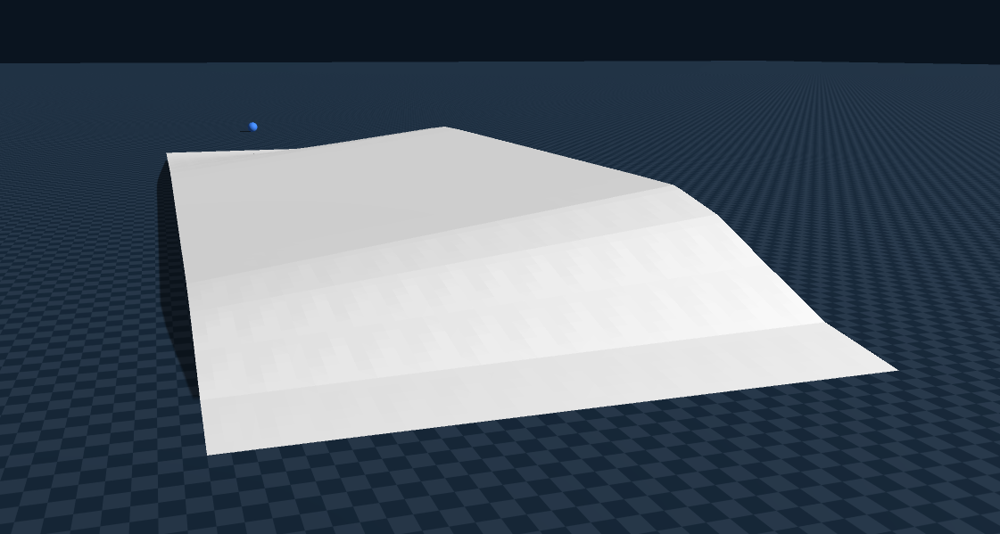
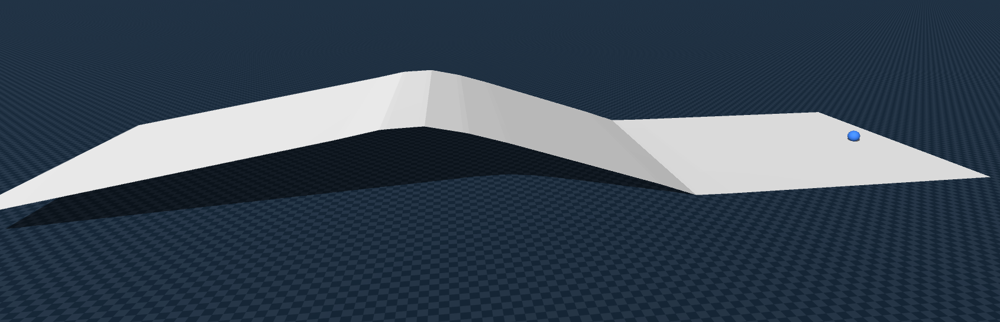
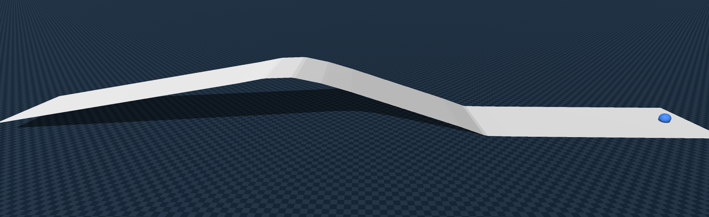

# 3D Sim2Sim — 경사 지형 주행 데이터 추출 & 학습

- 기존 2D Sim2Sim 파이프라인을 3D 경사 지형(pitch, roll)으로 확장
- Blender에서 경사/뱅크 지형 위 다양한 주행 데이터를 추출
- Genesis에서 terrain heightfield를 로드하여 Ground Truth 생성
- 10개 GT 데이터를 병합하여 MLP 지도학습 진행
- 아래 정량 지표의 단위는 pos(m), v(m/s)

---

## 3D Ground Truth 결과 (이미지 클릭시 영상 재생)

| 저속 오르막 | 저속 내리막 | 오르막→내리막 | 조향 오르막 | 조향 내리막 |
|:-----------:|:-----------:|:------------:|:-----------:|:-----------:|
|  ─────── PosErr μ=0.052m max=1.108m VErr μ=0.127 max=0.506 |  ─────── PosErr μ=0.084m max=0.578m VErr μ=0.212 max=0.861 |  ─────── PosErr μ=0.031m max=0.537m VErr μ=0.079 max=0.316 |  ─────── PosErr μ=0.065m max=0.372m VErr μ=0.179 max=0.627 |  ─────── PosErr μ=0.073m max=0.168m VErr μ=0.155 max=0.573 |
| pitch -6.5~1.6° 직진 100% | pitch -1.3~6.5° 직진 100% | pitch -10.6~11.1° 직진 84% | pitch -5.5~2.8° roll ±4.7° 커브 63% | pitch -0.6~6.0° roll ±5.8° 커브 62% |

| S자+조향 | Roll 직진 | Roll 커브 | 급경사+커브 | 급경사 직진 |
|:---------:|:---------:|:---------:|:----------:|:----------:|
|  ─────── PosErr μ=0.070m max=1.184m VErr μ=0.178 max=0.731 |  ─────── PosErr μ=0.034m max=0.405m VErr μ=0.141 max=0.549 |  ─────── PosErr μ=0.060m max=0.764m VErr μ=0.151 max=0.639 |  ─────── PosErr μ=0.073m max=1.829m VErr μ=0.184 max=0.708 |  ─────── PosErr μ=0.050m max=1.603m VErr μ=0.131 max=0.510 |
| pitch -11.3~23.2° roll ±4.9° 커브 72% | pitch -12.5~11.9° roll -8.3~0° 직진 100% | pitch -12.6~17.2° roll -11.5~4.3° 커브 63% | pitch -22.3~13.3° roll -10.4~6.3° 커브 68% | pitch -22.3~16.1° 직진 100% |

---

## 데이터별 학습 기여 분석

| # | 움직임 | 핵심 기여 |
|---|--------|----------|
| 1 | 저속 오르막 | 오르막 throttle 보정 기초 |
| 2 | 저속 내리막 | 내리막 throttle 감속 보정 |
| 3 | 오르막→내리막 | pitch 전환 구간 (1+2의 연결) |
| 4 | 조향 오르막 | 오르막 + 커브 + roll 복합 |
| 5 | 조향 내리막 | 내리막 + 커브 + roll 복합 |
| 6 | S자+조향 | 최대 다양성 — 큰 pitch + roll + 커브 |
| 7 | Roll 직진 | 뱅크 지형에서 직진 시 roll 보정 |
| 8 | Roll 커브 | 가장 극한 — 큰 pitch + roll + 커브 |
| 9 | 급경사+커브 | 급경사(±22°)에서 조향 — 미커버 영역 보완 |
| 10 | 급경사 직진 | 최대 pitch(±22°) — 급경사 throttle 한계 |

---

## 전체 GT 오차 요약

| Category | Motion Count | Avg PosErr (m) | Avg VErr (m/s) |
|:---------|:------------:|:--------------:|:--------------:|
| 3D Ground Truth | 10 | 0.059 | 0.154 |

---

## MLP 지도학습 결과 (이미지 클릭시 영상 재생)

| 저속 오르막 | 저속 내리막 | 오르막→내리막 | 조향 오르막 | 조향 내리막 |
|:-----------:|:-----------:|:------------:|:-----------:|:-----------:|
|  ─────── PosErr μ= max= VErr μ= max= |  ─────── PosErr μ= max= VErr μ= max= |  ─────── PosErr μ= max= VErr μ= max= |  ─────── PosErr μ= max= VErr μ= max= |  ─────── PosErr μ= max= VErr μ= max= |

| S자+조향 | Roll 직진 | Roll 커브 | 급경사+커브 | 급경사 직진 |
|:---------:|:---------:|:---------:|:----------:|:----------:|
|  ─────── PosErr μ= max= VErr μ= max= |  ─────── PosErr μ= max= VErr μ= max= |  ─────── PosErr μ= max= VErr μ= max= |  ─────── PosErr μ= max= VErr μ= max= |  ─────── PosErr μ= max= VErr μ= max= |

---

## 학습시키지 않은 새로운 경사 움직임 실험 (이미지 클릭시 영상 재생)

> TODO: 미학습 경사 데이터 추가 후 작성

---

## 전체 평균 오차 요약

| Category | Motion Count | Avg PosErr (m) | Avg VErr (m/s) |
|:---------|:------------:|:--------------:|:--------------:|
| 3D Ground Truth | 10 | 0.059 | 0.154 |
| MLP (학습된 움직임) | 10 | — | — |
| MLP (비학습 새로운 움직임) | — | — | — |
