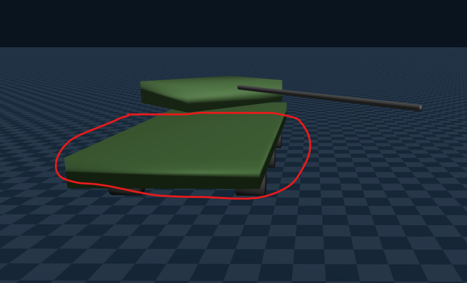
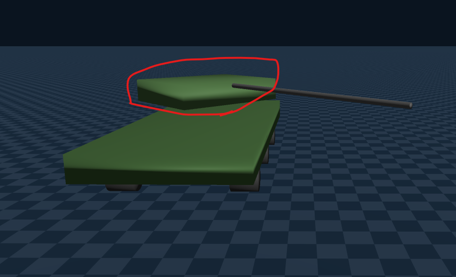
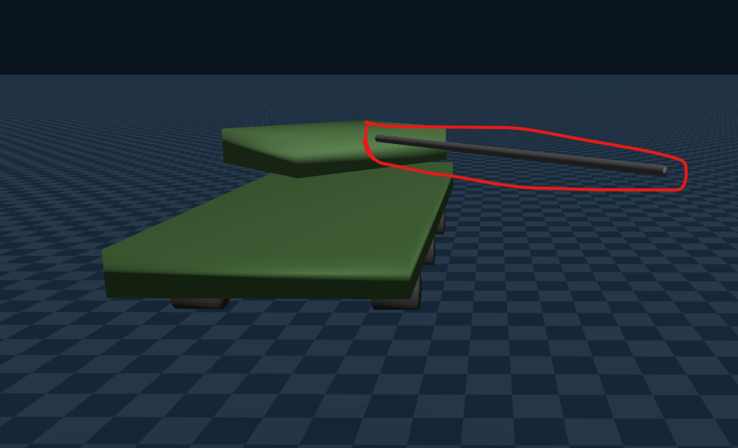
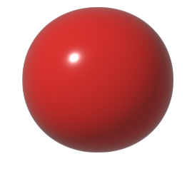
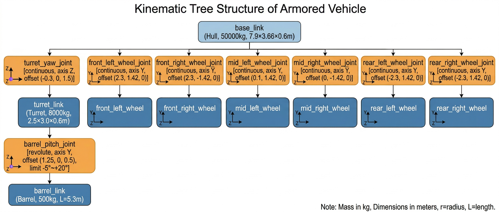
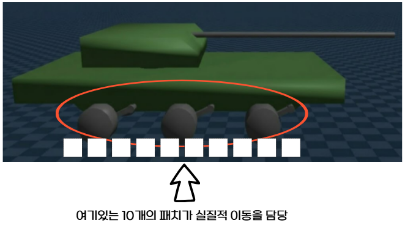

# Tank Simulation Specification


## 1. 탱크 제원 

### 차체 (Hull)




| 항목 | 값 | 비고 |
|---|---|---|
| 크기 | 7.9 x 3.66 x 0.6 m | 길이 x 폭 x 높이 |
| 질량 | 50,000 kg | base_link |
| 바퀴 | 6개 (좌3 우3) | 무한궤도(캐터필러) 대체, r=0.315m, 폭 0.64m, 각 500kg |
| 바퀴 Y간격 | ±1.42m | 궤도 중심거리 2.84m |
| 바퀴 X위치 | 0m ± 2.3m | 전/중/후 |
| 바퀴 감쇠 | damping=80, friction=20 | URDF joint dynamics |
| 지면 마찰 | friction=0.01 | `gs.materials.Rigid(friction=0.01)` — Track Force Model이 마찰 계산 |
| 최대속도 | ~67 km/h (18.6 m/s) | MOVE_SPEED=15.0 m/s (코드 기본값) |
| 총 질량 | ~63,000 kg | 차체 + 포탑 + 포신 + 바퀴×6 |

### 포탑 (Turret)



| 항목 | 값 | 비고 |
|---|---|---|
| 크기 | 2.5 x 3.0 x 0.6 m | 길이 x 폭 x 높이|
| 질량 | 8,000 kg | |
| 회전 | 360도 연속 (continuous joint) | turret_yaw_joint |
| 조인트 위치 | 차체 기준 (-0.3, 0, 1.5) m | base_link → turret_link |
| 조인트 감쇠 | damping=200, friction=0 | friction=0 (dead zone 방지) |
| PD 제어 | kp=50,000 / kv=45,000 | 임계감쇠 (ζ=1.0) |

### 포신 (Barrel — 120mm L/44 M256 Smoothbore)



| 항목 | 값 | 비고 |
|---|---|---|
| 길이 | 5.3 m | 구경 120mm (충돌체 반경 0.06m) |
| 질량 | 500 kg | 실제 ~2,000kg이나 COM 이동으로 감소 |
| 무게중심(COM) | 피봇에서 0.3m | breech block이 무거운 현실 반영 → 중력 토크 최소화 |
| 사각 범위 | -5° ~ +20° | revolute joint, 하한/상한 제한 |
| 조인트 위치 | 포탑 기준 (1.25, 0, 0.5) m | turret_link → barrel_link |
| 조인트 감쇠 | damping=50, friction=5 | |
| PD 제어 | kp=5,000,000 / kv=500,000 | 고강성 (중력 토크 극복) |

### 포탄 (Projectile)



| 항목 | 값 | 비고 |
|---|---|---|
| 형태 | 구 (Sphere) | 단순화 |
| 반경 | 0.3 m | 시각화용 확대 (실제 60mm) |
| 질량 | 10 kg | APFSDS 기준 |
| 포구초속 | 1,600 m/s | M829 APFSDS 기준 |
| 재장전 | 6초 (1200 프레임) | dt=0.005 기준, 현실 시간 20초 |
| 최대 사거리 (코드) | 5,000 m | 이 거리 초과 시 포탄 소멸 (변경 가능) |
| 최대 유효사거리 (실측) | ~10,000 m | 8×8×8m 목표 기준, 10km 명중 / 10.1km 이후 미스 |
| 피격 판정 (물리) | Genesis `get_contacts()` | cannon.py — 실제 포탄 물리 충돌 |
| 피격 판정 (RL env) | LOS 기반 즉시 히트 | cover_training_env — FOV + LOS clear + 재장전 완료 시 즉시 피격 |

---
### Tank Tree



- 차체 아래에 바퀴 6개, 포탑1개가 자식으로 있음
- 포탑 아래에 포신이 자식으로 붙어있음
```
바퀴 6개: rpy="1.5708 0 0" — X축 90° 회전 (Z축 실린더 → Y축 방향으로 눕힘)
포신: rpy="0 1.5708 0" — Y축 90° 회전 (Z축 실린더 → X축 방향으로 눕힘, 전방)
차체(box)랑 포탑(box)은 기본 방향 그대로라 rotation 없음.
```


## 2. 입력 가능한 값 (Control Inputs)

### 주행 제어

| 입력 | 변수 | 범위 | 단위 | 설명 |
|---|---|---|---|---|
| 좌측 궤도 속도 | `left_track_speed` | -18.6 ~ +18.6 | m/s | 양수=전진, 음수=후진 |
| 우측 궤도 속도 | `right_track_speed` | -18.6 ~ +18.6 | m/s | 양수=전진, 음수=후진 |

- **전진**: left = right = v (0 < v ≤ 18.6)
- **후진**: left = right = -v
- **좌회전**: left < right (예: left=0, right=v)
- **우회전**: left > right (예: left=v, right=0)
- **제자리 회전**: left = -v, right = +v (또는 반대)

최대속도 67 km/h = 18.6 m/s

### 포탑/포신 제어

| 입력 | 변수 | 범위 | 단위 | 설명 |
|---|---|---|---|---|
| 편각 (azimuth) | `azimuth_rad` | -∞ ~ +∞ (연속) | rad | 차체 전방 기준 수평 회전각. 양수=좌측(반시계) |
| 사각 (elevation) | `elevation_rad` | -0.0873 ~ +0.349 | rad | 수평 기준 포신 상향각. -5° ~ +20° 자동 클램프 |

편각/사각은 **목표값**을 설정하면 PD 제어가 조인트를 해당 각도로 구동합니다.

#### 조준 계산 예시

탱크 위치 (0, 0, 1), yaw=0° (X축 정면), 목표 위치 (100, 100, 2):

**1. 편각 (azimuth) 계산:**

$$\alpha_{world} = \arctan2(d_y, d_x) = \arctan2(100, 100) = 45°$$

$$\alpha_{azimuth} = \alpha_{world} - \theta_{yaw} = 45° - 0° = 45°$$

→ 포탑을 차체 기준 좌측 45° 회전

**2. 사각 (elevation) 계산:**

$$d_{horiz} = \sqrt{100^2 + 100^2} = 141.4 \text{m}$$

$$t_{flight} = \frac{d_{horiz}}{v_{muzzle}} = \frac{141.4}{1600} = 0.088 \text{s}$$

$$d_{drop} = \frac{1}{2} g \cdot t_{flight}^2 = \frac{1}{2} \times 9.81 \times 0.088^2 = 0.038 \text{m (3.8cm)}$$

$$\Delta z = z_{target} - z_{pivot} = 2.0 - 3.0 = -1.0 \text{m}$$

$$\theta_{elevation} = \arctan2(\Delta z + d_{drop},\ d_{horiz}) = \arctan2(-0.962,\ 141.4) = -0.41°$$

→ 포신을 수평에서 0.41° 아래로

> 141m에서 낙차 3.8cm (거의 직선 탄도). 1km에서 ~1.9m, 4km에서 ~30.7m 낙차.

### 발사

| 입력 | 함수 | 조건 | 설명 |
|---|---|---|---|
| 발사 | `cannon.fire()` | `can_fire() == True` | 재장전 완료 시 발사, (muzzle_pos, muzzle_vel) 반환 |
| 발사 쿨타임 | 6초 (1200 프레임) | 자동 카운트 | `cannon.tick()` 매 프레임 호출 필요, 최대 분당 10발 |

---

## 3. 문제 및 해결

## 문제 1: 궤도차량 조향 — 바퀴로 무한궤도 대체 시 회전 불가

**문제**: 탱크는 좌/우 궤도 속도 차이로 조향하는 스키드 스티어 방식. 그러나 연속 궤도(사슬)는 물리 연산 비용이 너무 높음
- 단순 바퀴 6개 구조로는 탱크의 움직임 재현 불가 (버티는 힘이 부족해서 조향이 안 됨)

**해결**: **Distributed Track Force Model** — 가상 궤도 접촉 패치 시뮬레이션

```
진짜 궤도 = 긴 벨트가 바닥을 쭉 누르며 미는 것
지금 방식 = 패치가 지면을 뒤로 밀려고 하면 지면이 반작용으로 탱크를 앞으로 밈
```

바퀴 6개는 시각적 회전만 담당.



동작 원리:
1. 각 궤도(좌/우)를 10개 접촉 패치로 분할 (궤도 길이 4.6m에 걸쳐 분포)
2. 각 패치에서 지면 대비 슬립 속도 계산:
   - 종방향 슬립: $s_x = v_{track} - (v_{x,body} - \omega_{yaw} \cdot p_y)$
   - 횡방향 슬립: $s_y = -(v_{y,body} + \omega_{yaw} \cdot p_x)$
3. 슬립 강성($k_x = 800{,}000$, $k_y = 600{,}000$)으로 힘 계산 후 쿨롱 마찰 한계($\mu_x = 0.9$, $\mu_y = 0.8$) 적용
4. 모든 패치의 힘과 모멘트를 합산하여 body frame Fx, Fy, Mz 산출
5. body → world 좌표 변환 후 `control_dofs_force(root_dof_idx=[0,1,5])` 로 적용

## 종방향 슬립

$$s_x = v_{track} - (v_{x,body} - \omega_{yaw} \cdot p_y)$$

> $\omega_{yaw}$ = yaw 각속도 (차체가 회전하는 속도, rad/s)

- $v_{track}$: 궤도가 그 지점에서 바닥을 쓸어주는 속도
- $(v_{x,body} - \omega_{yaw} \cdot p_y)$: 차체 운동 때문에 그 패치가 실제로 가지는 종방향 속도
- 종방향 슬립이 크면 지면과의 상대운동이 크다
    - 더 앞으로 간다

### py는 무엇인가
- p = (px, py) -> 패치의 위치
```
px > 0 이면 앞쪽 패치
px < 0 이면 뒤쪽 패치
py > 0 이면 한쪽 궤도
py < 0 이면 반대쪽 궤도
```
### vx_body - yaw_rate × py 이 식을 다시 해석해보자

- 회전하면 좌/우 패치는 가해지는 힘이 반대임
```
제자리 우회전 기준 왼쪽 패치는 더 앞으로 가려고 함(cw 기준 r은 음수 term)
우측 패치는 반대로 뒤로 가려고 함
```
## 횡방향 슬립

$$s_y = -(v_{y,body} + \omega_{yaw} \cdot p_x)$$

- 종방향 슬립과 같은 원리

### 쿨롱 마찰원리??
- 종방향(앞뒤) 마찰 한계가 0.9, 횡방향(좌우) 마찰 한계가 0.8이란 뜻

```
N = 패치 위에 실리는 무게. 63톤 탱크가 20개 패치에 분산되니까:


패치당 수직하중 = 63,000kg × 9.81 / 20 = 약 30,900N
종방향 최대 힘 = 0.9 × 30,900 = 약 27,800N
```
- 슬립 강성으로 계산한 힘이 이 한계를 넘으면 한계값에서 잘림
## 문제 2: 포탑/포신 관성 오버슈트

**문제**: 포탑(8,000kg, I=10,200)을 목표 각도로 회전시킬 때, 관성 때문에 목표를 지나쳐 오버슈트 발생. 이후 반대 방향으로 진동하며 수렴하지 않거나 매우 느리게 수렴.

**해결**: **PD 위치 제어의 임계감쇠 (Critical Damping)** 적용.

PD 제어 토크:

$$\tau = k_p \cdot (\theta_{target} - \theta_{current}) - k_v \cdot \omega_{joint}$$

> $\theta_{target}$: 목표 각도, $\theta_{current}$: 현재 각도, $\omega_{joint}$: 현재 조인트 각속도

#### 감쇠비란?
```
"kp를 정했을 때 kv를 얼마로 해야 진동 없이 수렴하는가"를 알려주는 튜닝 가이드
```

감쇠비 정의:

$$\zeta = \frac{k_v}{2\sqrt{k_p \cdot I}}$$

- $\zeta < 1$ (과소감쇠): 진동하며 수렴 → 오버슈트 발생
- $\zeta = 1$ (임계감쇠): 진동 없이 가장 빠르게 수렴 → **이것을 적용**
- $\zeta > 1$ (과감쇠): 진동 없지만 느리게 수렴

포탑: $k_p = 50{,}000$, $I = 10{,}200$

$$k_v = 2\sqrt{k_p \cdot I} = 2\sqrt{50{,}000 \times 10{,}200} = 2 \times 22{,}583 \approx 45{,}000$$

URDF에서 turret_yaw_joint의 friction=0 설정. 마찰이 있으면 목표 근처에서 1~2° dead zone이 생겨 정밀 조준 불가.

---

## 4. 강화학습 현황

### 환경 설계: 1 vs 3 터렛 엄폐 학습 (cover_training_env.py)

Genesis 탱크 1대 vs 고정 터렛 3대. 엄폐의 중요성을 학습하는 환경.

| 항목 | 값 |
|---|---|
| Genesis HP | 5 |
| Turret HP | 5 |
| Genesis 재장전 | 2초 (400 프레임) |
| Turret 재장전 | 6초 (1200 프레임, 3터렛 × 2초 스태거) |
| 시야각 | ±75° (150°) |
| 액션 | 6 waypoint (hold, cover_L, cover_R, peek_L, peek_R, retreat) |


### 현재 Reward 구조

| 이벤트 | 보상 | 설명 |
|---|---|---|
| 적 터렛 격파 | +0.3 | 터렛 1대 HP 0 만들 때마다 |
| 피격당함 | -1.5 | 터렛에게 맞을 때마다 (HP -1) |
| 생존 | +0.005 × dt | 매 프레임 소량 (살아있으면 보상) |
| 전원 격파 (승리) | +2.0 | 3대 모두 파괴 시 에피소드 종료 보너스 |
| 사망 | -1.0 | HP 0 에피소드 종료 페널티 |
| 타임아웃 | -0.5 | 제한시간 내 승부 못 냄 |
| 아레나 이탈 | -1.0 | 맵 밖으로 나감 |

- reward를 바꿔가며 시도 중 (아직 탱크가 엄폐물의 필요성을 습득하지 못 함)
    - 300 iteration 안에 습득시키는게 목표지만 잘 안 되면 iteration을 늘리는 것을 고려할 예정
