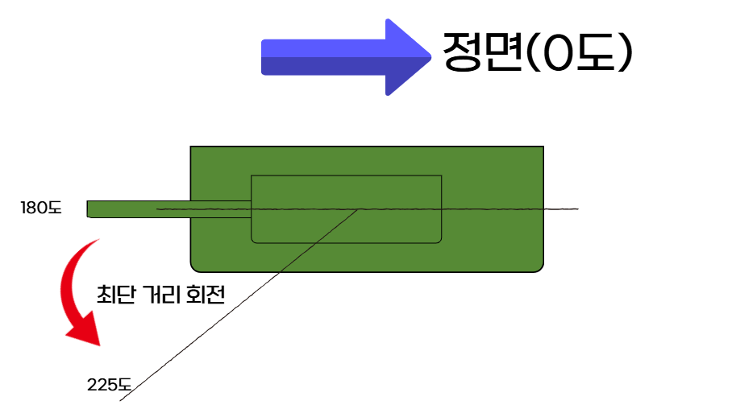

# 학습 진행 보고서 — 2026-04-26

3v3 탱크 PPO 학습 환경 구축 및 학습 진행 중. 최근 발견된 문제와 그에 대한 대응 정리.

---

## 1. 포탑 최단거리 회전 (해결 완료)

### 기존 세팅
- NN이 적 탱크를 타겟으로 지정하면 자동 조준 시스템이 포탑을 회전시켜 명중 판정
- 매 step 포탑의 목표 각도를 적 방향(`aim_angle`) 기준으로 계산:
  ```
  turret_rel = aim_angle - shooter_yaw_body
  turret_rel = atan2(sin(turret_rel), cos(turret_rel))   # [-π, +π] 정규화
  control_dofs_position(turret_rel)
  ```
- PD 제어로 포탑이 `turret_rel` 각도로 회전

### 발견된 문제
- 포탑이 현재 +175°에 있고, 적이 -175° 방향에 있을 때:
  - 명령 각도: -175° (정규화된 값)
  - PD가 보는 차이: -175° − (+175°) = **−350°**
  - 결과: **시계방향으로 350° 회전** (long way around)
- 실제 최단 경로는 반대 방향 +10° 회전
- 즉 포탑이 최단거리로 회전하지 않는 문제



### 원인
- `turret_yaw_joint`이 `type="continuous"` (제한 없는 누적 각도)
- PD 컨트롤러가 단순히 `target − actual` 차이로 토크 계산
- target은 [-π, +π]로 정규화됐지만 actual(현재 포탑의 각도)은 누적값
- 극단적인 예를 들어 타겟이 0도여도 actual이 720도면 0-720 = -720 만큼 회전
- 한 바퀴 이상 차이가 자연스럽게 발생

### 해결책
PD 명령 시점에 actual 위치 읽어서 **shortest path 보정**:

```python
actual_turret_full = tank.get_dofs_position(turret_idx)   # 누적값 읽기
diff = turret_rel - actual_turret_full
diff = atan2(sin(diff), cos(diff))                         # [-π, +π] 강제 wrap
turret_target = actual_turret_full + diff                  # 누적 + 최단 회전량
control_dofs_position(turret_target)
```

핵심: 정규화된 target을 그대로 인가하지 않고, **현재 위치 + 최단 회전량**을 새 target으로 설정.

### 결과
- 포탑이 항상 ±180° 이내 최단 경로로 회전
- PD 수렴 시간 일관 (약 0.4초)
- 명중 판정의 `yaw_err < AIM_YAW_TOL` 조건이 의미 있게 작동 (이전엔 너무 큰 오차로 항상 실패할 위험)

---

## 2. 조향 문제 (해결 중)

### 기존 세팅
- 마찰 계수: **0.3** (지면 + 탱크)
- 이 환경에서 차체 조향 정상 작동 (직진 ~10 m/s, spin ~70°/s)
- 학습도 진행 가능했음

### 현실 매칭 시도
실제 도로 환경(아스팔트)은 마찰 계수 ~0.7. 현실성 향상을 위해 마찰 0.7로 변경 시도.

### 새로 발견된 문제 — 차체 진동
마찰 0.7에서 spin 시 차체가 떨림:
- 위에서 본 사각형 차체의 **대각선 꼭짓점 쌍**이 함께 위아래로 진동
- 회전 속도가 빨라질수록 진동 심함
- 회전 속도 느리거나 정지 상태에선 안 떨림

### 원인 추정 — 서스펜션 부재
물리적으로 자연스러운 현상:
- **고마찰 + 강체 + 평면 접촉** = 지우개를 책상에 강하게 누르고 끌 때의 stick-slip과 동일
- 회전 중 단일 collision box가 모서리로 번갈아 접촉 → corner rocking
- 실제 차량/탱크는 **서스펜션** (휠당 독립 수직 운동 + spring + damper)으로 이런 진동을 흡수
- 현재 우리 모델은 휠이 visual only, 차체는 단일 강체 박스 → **서스펜션 완전 부재**

### 대처 방안 (검토 중)


#### 방안 A — Solver 정밀도 향상
`substeps` 8 → 16 또는 32로 증가, contact resolution 정밀화.
- 장점: 코드 1자리 변경
- 단점: 시뮬레이션 속도 비례 감소 → 학습 시간 크게 증가

#### 방안 B — URDF 서스펜션 구현 
각 휠에 prismatic 수직 joint + PD spring 추가, collision도 휠별 cylinder로 분산.
- 장점: 물리적으로 현실적 — 진동 자연 감소 + 향후 경사면/장애물 대응 자연스러움
- 단점: 기존 박스 collision에서 휠 6개 collision으로 solver 부담 ↑ → 학습 GPU 비용 상승

#### 방안 C — 마찰 0.3 유지 (현재 학습 환경 유지)
현재 학습 환경 그대로 두고 진동 회피.
- 장점: 추가 작업 없음, 학습 영향 없음 (NN은 시각 진동 안 봄)
- 단점: 도로 환경이 비현실적 (빙판~젖은 아스팔트 수준)

#### B방안으로 추진중
---

## 3. 학습 분할 (Curriculum Learning)

### 기존 학습의 문제
초기에 전체 환경 (3v3 + 엄폐물 + 자기장 + self-play 풀)에서 처음부터 학습 시도.
- NN이 동시에 학습해야 할 것: 타겟 선정, 조준, 사격, 이동, 엄폐, 팀 협업, 자기장 회피, 적 행동 예측…
- 보상 신호가 여러 목표에 분산되어 희석
- 실제 학습 결과: 200~300 iter 학습 후 **수동 회피 + 자기장 사망** 또는 **중앙 엄폐물에 숨어 시간 끌기** 같은 pathological 정책 형성
- 정상적인 교전·전술 학습 안 됨

### 강의시간 insight
> 어린이에게 처음부터 체스 대국 시키는 것과 같음. 단계별로 기초부터 가르쳐야 의미 있는 학습 가능.

→ Curriculum learning 도입. 기초 skill부터 단계별 학습.

### 5단계 Curriculum 설계

| Stage | 환경 | 상대 | 학습 목표 | 예상 iter |
|-------|------|------|----------|----------|
| **0** | 1 Tank vs 3 정지 dummy, 개활지, 자기장 X | 정지 | "타겟 지정 → 피해 → 보상" 인과 학습 | 100~200 |
| **1** | 1 Tank vs 3 무작위 이동 dummy, 개활지 | 무작위 이동 (발사 X) | 움직이는 표적 추적 | 200~400 |
| **2** | **3 Tank** vs 3 정지 dummy, 개활지 | 정지 | 다중 탱크 동시 제어 + 타겟 분담 | 300~500 |
| **3** | 3 Tank vs 3 frozen Stage-2 Tank, **엄폐물 8개** 활성 | 학습된 rusher (frozen) | 능동 교전 + 엄폐물 활용 | 500~1000 |
| **4** | 3v3 self-play, 엄폐물 + 자기장 (현재 환경) | 풀 (10개) | 풀 전략 / pool 자가발전 | 1000~3000+ |

### NN 입출력 구조 (모든 stage 공통)

NN 아키텍처는 **모든 stage에서 동일**:
- **입력 (obs)**: 76 dim
- **출력 (action)**: 9 dim

#### 입력 76 dim 구성
| 영역 | dim | 내용 |
|------|-----|------|
| 아군 3대 | 21 (3×7) | pos(2) + heading(sin,cos) + hp + reload + alive |
| 적 3대 | 18 (3×6) | pos(2) + heading + hp + alive |
| 엄폐물 8개 | 32 (8×4) | center xy + size xy |
| 시간 | 1 | 진행률 0~1 |
| 자기장 반변 | 1 | normalized |
| 자기장 피해 플래그 | 3 | 아군 각 탱크 자기장 안 |

#### 출력 9 dim 구성
탱크 3대 × 3 dim:
- left_speed (continuous, tanh × 12 m/s)
- right_speed (continuous, tanh × 12 m/s)
- target_id (continuous, 4구간 분할: 적0/적1/적2/no_target)

### Stage별 활성/비활성 입출력

NN 구조는 고정이고, **stage별로 활성화되는 입력/출력만 다름**. 비활성 부분은 환경이 0/constant로 채우거나 무시.

| Stage | 활성 입력 | 활성 출력 | 비활성 처리 |
|-------|----------|----------|------------|
| 0 | A0 obs(7) + 적 3대(18) + 시간(1) | A0 action(3) | A1/A2 hp=0 alive=0 (사망 처리), 엄폐물 32 dim 모두 0, 자기장 dim constant. NN의 A1/A2 action 출력은 환경이 ignore (해당 탱크가 사망 상태) |
| 1 | Stage 0 + 적 위치 매 step 변동 | Stage 0과 동일 | 동일 |
| 2 | A0/A1/A2 obs(21) + 적 3대(18) + 시간(1) | A0/A1/A2 action(9) | 엄폐물 32 dim 모두 0, 자기장 dim constant. A1/A2 활성화 (hp=2 alive=1). NN의 9 dim 모두 의미 가짐 |
| 3 | Stage 2 + 엄폐물 32 dim 활성 | 9 dim | 자기장 dim constant. 엄폐물 처음으로 의미 있는 입력 |
| 4 | 전체 76 dim 활성 | 9 dim | 모든 입력 의미 있음 |

### 단계 전환 mitigation

NN이 stage N에서 학습한 것을 stage N+1로 이전 시 발생 가능한 문제와 대처:

#### 문제 1 — Catastrophic forgetting
Stage 0/1에서 NN은 "A1, A2 출력은 무의미"를 학습 → entropy collapse → 출력 분포 평탄.
Stage 2에서 갑자기 A1, A2 활성화 → NN이 재탐색 어려움.

**대처**: 단계 전환 시 `entropy_coef`를 일시 5배 증가 (0.01 → 0.05), 50 iter 후 linear decay로 복원.
```
iter 0~50: entropy_coef = 0.05 (높게 유지, 탐색 강화)
iter 50~100: entropy_coef = 0.05 → 0.01 (linear decay)
iter 100+: entropy_coef = 0.01 (기본값)
```

#### 문제 2 — Observation distribution shift
Stage 0의 A1/A2 obs는 항상 alive=0, hp=0 → NN이 "이 패턴은 무시"를 학습.
Stage 2에서 alive=1, hp=2로 바뀌면 NN이 본 적 없는 분포 → value function 오추정.

**대처**: 단계 전환 시 critic의 마지막 layer만 재초기화 (정책 layer는 보존). 첫 20 iter `value_loss_coef` 2배로 critic warm-up.


#### 문제 3 — Stage 4 self-play 풀 다양성
Stage 3까지는 frozen 상대 → 일관된 학습. Stage 4는 풀 self-play → 풀이 비어있으면 self-current와만 매치.

**대처**: Stage 4 시작 시 **Stage 1, 2, 3 ckpt를 풀에 강제 시드**로 추가. 처음부터 다양한 행동의 상대 풀 보장.

### 보상 weight (stage별 차이)

활성 시그널만 강조, 비활성 항목은 0:

| 보상 | Stage 0 | Stage 1 | Stage 2 | Stage 3 | Stage 4 |
|------|---------|---------|---------|---------|---------|
| 적 명중 | +2.0 | +2.0 | +1.5 | +1.0 | +0.6 |
| 아군 피격 | 0 | 0 | 0 | -0.3 | -0.15 |
| 적 격파 | +10.0 | +10.0 | +5.0 | +2.5 | +1.5 |
| 아군 사망 | 0 (1대만) | 0 | 0 | -1.0 | -1.0 |
| 시간 패널티 | -0.005 | -0.005 | -0.003 | -0.001 | -0.001 |
| 자기장 밖 | 0 | 0 | 0 | 0 | -0.02 |
| 승리 | +30 | +30 | +15 | +10 | +5 |
| 패배 | -10 | -10 | -5 | -5 | -5 |
| Draw | -10 | -10 | -5 | -3 | -5 |
| HP 잔량 | 0 | 0 | 0 | +0.2 | +0.3 |

### 합격 기준 (각 stage 종료 조건)

| Stage | 합격 |
|-------|------|
| 0 | winrate ≥ 95%, 평균 episode 길이 ≤ 25초 |
| 1 | winrate ≥ 85%, ≤ 30초 |
| 2 | winrate ≥ 90%, ≤ 35초, 탱크별 명중 분포 20~50% |
| 3 | vs frozen Stage-2 NN winrate ≥ 70% |
| 4 | 명시적 종료 없음 (풀 다양성 + 평균 winrate 모니터링) |

