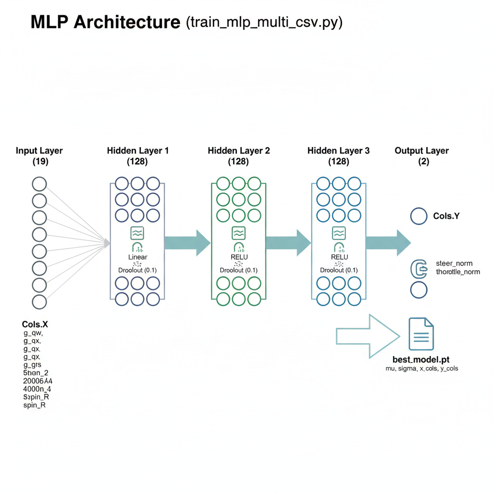
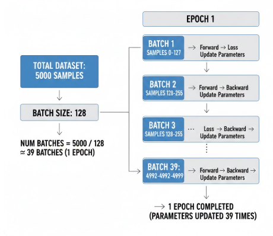

# 2025_1226까지의 진행 상황 보고서
### kmooc 지능형 로봇의 이해 강좌중 딥러닝 알고리즘 기초 강의 공부 후 기존 방식을 다소 수정해 진행하였습니다.

# 1. MLP 구조 요약

## 네트워크 구조



| 항목 | 값 |
|------|-----|
| **입력 차원** | 18 |
| **출력 차원** | 2 |
| **은닉층 개수** | 3 |
| **은닉층 노드 수** | [128, 128, 128] |
| **활성화 함수** | ReLU (은닉층), Linear (출력층) |
| **총 파라미터 수** | **35,714** |

- 각 data별로 MLP에서 정규화된 Throttle과 Steer를 출력

### 학습 하이퍼파라미터

| 항목 | 값 |
|------|-----|
| **손실 함수** | MSE (Mean Squared Error) |
| **최적화 알고리즘** | AdamW |
| **학습률** | 0.001 |
| **배치 크기** | 128 |
| **에포크 수** | 300 |


- batch와 epoch의 의미가 담긴 학습 파이프라인 이미지
- 전체 학습 데이터 5000개에 대해 1~39배치로 나눔(1배치당 128개의 데이터)
- 배치 1개마다 파라미터 업데이트가 일어나고 39개의 배치에 대해 파라미터 업데이트가 완료되면 1 epoch 완료

# 2. 휠 토크 제어 파이프 라인

### Throttle 이란?
- 자동차의 **가속 패달 입력**
    - 양수 throttle: 전진하려는 의도 → 뒷바퀴가 앞으로 회전
    - 음수 throttle: 후진하려는 의도 → 뒷바퀴가 뒤로 회전
    - 0 throttle: 가속하지 않음 (관성으로 계속 굴러감)

### 정규화된 Throttle -> 목표 휠 속도 변환

```python
target_spin = THROTTLE_OMEGA_MAX * throttle_norm
# THROTTLE_OMEGA_MAX = 60
```
#### 예시
- throttle_norm = +0.5 → target_spin = 30 rad/s (전진)
- throttle_norm = -0.3 → target_spin = -18 rad/s (후진)
- throttle_norm = 0 → target_spin = 0 rad/s (가속 안 함)

### 현재 휠 속도 읽기
```python
dofs_vel = car.get_dofs_velocity()  # 모든 관절 속도
omega_rl = dofs_vel[rl_wheel_idx]   # 왼쪽 뒷바퀴 각속도 (rad/s)
omega_rr = dofs_vel[rr_wheel_idx]   # 오른쪽 뒷바퀴 각속도 (rad/s)
```

### PD 제어로 토크 계산
```python
# P항 (Proportional): 속도 오차에 비례
error_rl = target_spin - omega_rl
P_rl = Kp_WHEEL * error_rl  # 150.0 * error

# D항 (Derivative): 속도 변화율로 진동 감쇠
d_omega_rl = (omega_rl - prev_omega_rl) / dt
D_rl = -Kd_WHEEL * d_omega_rl  # -5.0 * 변화율

# 최종 토크
torque_rl = P_rl + D_rl
```

### 토크 제한 및 적용
```python
torque_rl = np.clip(torque_rl, -MAX_WHEEL_TORQUE, MAX_WHEEL_TORQUE)
          = np.clip(torque_rl, -850.0, 850.0)  # N·m

car.control_dofs_force(
    force=np.array([torque_rl, torque_rr]),
    dofs_idx_local=np.array([rl_wheel_idx, rr_wheel_idx]),
)
```
# 3. 조향 제어 파이프라인

### 정규화된 조향 → 실제 조향 각도

```python
steer_target = steer_pred
steer_target = np.clip(steer_target, -MAX_STEER_LIMIT, MAX_STEER_LIMIT)
           # = np.clip(steer_target, -0.65, 0.65) 라디안 단위
```
#### 예시
- steer_pred = +0.4 → steer_target = +0.4 rad ≈ 22.9° (왼쪽)
- steer_pred = -0.8 → steer_target = -0.65 rad (리미트) ≈ -37.2° (오른쪽)

### 급격한 조향 방지(Rate Limiting)
```python
max_delta = STEER_RATE * dt  # 2.5 * 0.04167 ≈ 0.104 rad
steer_cmd = clip(steer_target, steer_prev - max_delta, steer_prev + max_delta)
```
- 현재 코드의 경우 이전 조향과 비교해 한 step당 약 0.1rad이상의 조향 변화는 허락하지 않음
### 앞바퀴 조향 적용
```python
car.control_dofs_position(
    position=np.array([steer_cmd, steer_cmd]),  # 좌우 앞바퀴 동일
    dofs_idx_local=np.array([fl_steer_idx,   fr_steer_idx]),
)
```

# 4. Brake 기능 분석
### 현재 구현: throttle = 0 = 브레이크

### 작동 원리
```python
throttle_norm = 0.0  # NN 출력 또는 CSV 값
target_spin = 60.0 * throttle_norm  # = 0
error = target_spin - current_omega  # = 0 - 현재속도 = 음수
torque = Kp * error  # 음수 토크 = 브레이크
```
## 별도 브레이크 명령이 불필요한 이유

1. **물리적 등가성**
   - throttle = 0 → PD 제어로 자동 감속
   - 실제 차량의 엔진 브레이크와 동일

2. **Genesis RWD 특성**
   - 뒷바퀴에 토크 제어
   - target_spin = 0일 때 자동으로 멈추려는 힘 발생


- 수동으로 브레이크를 걸어준 예시를 학습한 영상

### 더 강한 브레이크를 위한 대안들

### 방법 1: PD gain 조정
```python
# 브레이크 시 더 강한 감속
Kp_WHEEL_BRAKE = 300.0  # 기본 150.0의 2배
Kd_WHEEL_BRAKE = 15.0   # 기본 5.0의 3배

if throttle_norm < 0.05:  # 브레이크로 간주
    error_rl = -omega_rl  # 목표: 완전 정지
    error_rr = -omega_rr
    torque_rl = Kp_WHEEL_BRAKE * error_rl - Kd_WHEEL_BRAKE * d_omega_rl
    torque_rr = Kp_WHEEL_BRAKE * error_rr - Kd_WHEEL_BRAKE * d_omega_rr
else:
    # 기존 로직
    ...
```
- throttle = 0 명령을 보다 빠르게 즉각적으로 받아들이도록 수정

### 방법 2: 마찰력 증가 (URDF 수정)
```xml
<!-- 뒷바퀴 조인트에 높은 damping/friction -->
<joint name="rear_left_wheel_joint" type="continuous">
    <dynamics damping="0.5" friction="0.2"/>  <!-- 증가 -->
</joint>
```

### Brake를 위한 음수 Throttle 방안도 있긴 하나 블렌더 데이터와 불일치하기에 굳이 방법을 정리해두진 않았음
- 즉 음수 Throttle은 후진만을 위한 명령으로 세팅

## 참고사항)  뒷바퀴 토크 제어가 서로 다른 이유
### 차가 좌회전 또는 우회전을 할 시 물리법칙에 의해 바깥쪽 바퀴가 더 빨리 돌 수밖에 없음
- 이때 회전속도가 달라진 두 바퀴에 대해서 PD 제어를 통해 서로 다른 토크 명령을 하달해야 이후 두 바퀴의 회전 속도가 일치하게 됨
