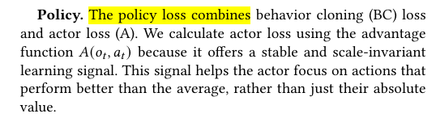

# PPO 강화학습
- 계속해서 승률이 나오지 않고 룰봇에게 패배하여 논문(학습 방식에 대해)을 재검토 함
- 지금까지 수행한 학습 방식은 BC(warm start) -> PPO 였음
- 논문에서는 BC(지도학습)와 강화학습을 섞어서 학습시키다가 마지막에 PPO(다양한 상황에 일반화된 성능을 위함)를 함
- 논문 구조대로 이 또한 바꿔볼 예정

### 논문 근거

- BC에 대한 loss(지도학습)와 actor loss(강화학습 loss)를 결합해서 학습
- 이때 지도학습의 역전파(파라미터 업데이트) 비중을 10배 더 크게 잡았다고 함
	- 동일하게 진행할 예정
# 룰 설계
- 위 구조를 따라가기 위해선 다양한 상황에 강건하고 똑똑한 지도학습의 정답으로 삼을 만한 룰봇이 있어야 함
- 따라서 map 구조를 전략적 요소가 많게 바꾸고(bush 점령 행동을 유도하자는 취지에서 간단하게 설계했던 이전 map을 버림) 룰을 새로 짰음
### map 구조
### 룰 설계

| 분류         | 트리거 (적 1대 기준, 우리 진영 부호로 정규화)                       |
| ---------- | -------------------------------------------------- |
| **HOME**   | 자기 스폰에서 이동거리 < 20 m                                |
| **FLANK**  | **\|y\| > 40** (우회로 안) — 우회로엔 부쉬가 없어 항상 보임, 오판 불가  |
| **BUSH**   | KEY 부쉬(0,±22) 반경 20 m 이내 (은폐 중이면 **마지막 목격 위치** 사용) |
| **CENTER** | 위 셋 다 아니고, 우리 쪽으로 25 m 이상 전진 + \|y\| < 18          |
- 강건한 룰 설계를 위해서 적의 state를 위 4가지로 분류
	- 스폰 지점, 측면 우회 경로, bush, 중앙 길목 이 4가지 중 어디로 가냐에 따라 state가 바뀜
- 그리고 적팀의 tank 3대가 취할 수 있는 state 경우의 수는 20가지임(서로 다르지 않은 같은 tank로 취급할 경우의 수)
- 이 20가지 경우의 수에 대해 룰을 나누었음

### 페이즈 1

- 처음 전투 시작 직후엔 적 행동이 전부 HOME일테니 이때는 무조건 정해진 위치로 각 Tank가 이동하게 됨

| 역할                      | 목적지               |
| ----------------------- | ----------------- |
| `BUSH_N` (스폰 y 가장 큰 탱크) | 북 KEY 부쉬 (0, +22) |
| `MID` (가운데)             | 자기 진영 중앙 (+24, 0) |
| `BUSH_S` (y 가장 작은 탱크)   | 남 KEY 부쉬 (0, −22) |
- 위 아래 Tank는 본인에게 가까운 bush로 이동, 중앙 Tank는 중앙 길목 엄폐물 뒤에서 대기
- 1 페이즈에선 무조건 이 행동을 취함
- 이때 Mid는 중앙 엄폐 대기 중인 tank, BUSH_N/S(north,south)는 각 부쉬에 숨어있는 tank를 의미
### 페이즈 2

- 페이즈 1 이후 상대 행동에 따라 어떻게 행동할 지가 결정됨
- 상대 행동을 크게 4가지 케이스 별로 나눠봤음

**케이스1 (상대가 본진에서 가만히 있을 경우)**

- `BUSH_N/S`: 부쉬 유지, **사격 보류**(은폐 유지 = 조준 불가 = 무적). 해제 조건: 적 40 m 접근 / 우회 탱크 교전 시작 / 적 HP 40% 미만
- `MID`: **적이 적은 쪽** 통로로 우회 → 통로 횡단 → **적 스폰 측면(격자 39/40)** 까지 진출

**케이스2 (적이 중앙 길목으로 돌격할 경우)**

- 전원 현 위치 유지, 사격. 돌진하는 적의 측면을 부쉬에서 침
- `MID`는 4번(엄폐 뒤) 유지

**케이스3 (상대가 bush로 쳐 들어올 경우)**

- `BUSH_N/S`: 부쉬 교전 계속
- `MID`: **밀리는 쪽** 지원 (21 또는 22). 그쪽 적이 은폐하거나 내가 피격되면 **9/10으로 후퇴**

**케이스4 (상대가 우회 통로로 쳐들어올 경우)**

- `BUSH_N/S`: 부쉬 유지, 스폰으로 들어오는 적 사격
- `MID`: **4번 유지 + 적이 올 방향으로 spin(spin하지 않으면 후면을 타격당함)

### 상대가 취할 수 있는 행동 표(20가지 경우의 수)

|#|HOME|FLANK|BUSH|CENTER|대응|
|---|---|---|---|---|---|
|1|3|0|0|0|**1**|
|2|2|1|0|0|**4**|
|3|2|0|1|0|**1**|
|4|2|0|0|1|**1**|
|5|1|2|0|0|**4**|
|6|1|1|1|0|**4**|
|7|1|1|0|1|**4**|
|8|1|0|2|0|**3**|
|9|1|0|1|1|**1**|
|10|1|0|0|2|**2**|
|11|0|3|0|0|**4**|
|12|0|2|1|0|**4**|
|13|0|2|0|1|**4**|
|14|0|1|2|0|**4**|
|15|0|1|1|1|**4**|
|16|0|1|0|2|**4**|
|17|0|0|3|0|**3**|
|18|0|0|2|1|**3**|
|19|0|0|1|2|**2**|
|20|0|0|0|3|**2**|
- 상대 tank 3대가 어떤 행동을 취하느냐에 따라 이 20가지 경우의 수중 하나로 분리하고 그에 맞는 행동을 위에서 설명한 4가지 중 하나로 수행

### 룰봇 전투 영상
- 지난 PPO 학습에서 가장 강력했던 제자리 대기 룰봇과 대결

https://github.com/user-attachments/assets/03493051-0af7-4b9c-a98f-fd8f76ec4f84

- 전략이 다양해짐에 따라 전투 길이도 180초로 늘림
- 상대가 제자리에서 대기하자 1대는 우회 통로로 돌아서 상대의 측면을 타격
- 나머지 2대는 bush에서 사격하지 않고 대기하다가 1대가 습격하는 동시에 같이 사격(먼저 사격하면 위치가 노출되므로 3 vs 2의 불리한 전투를 하게 됨)
- 이 룰봇을 정답으로 삼아 지도학습 + 강화학습을 진행중
