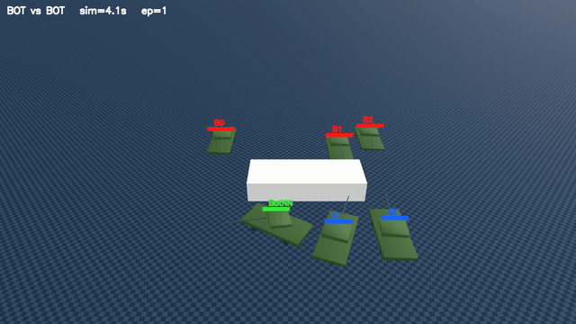
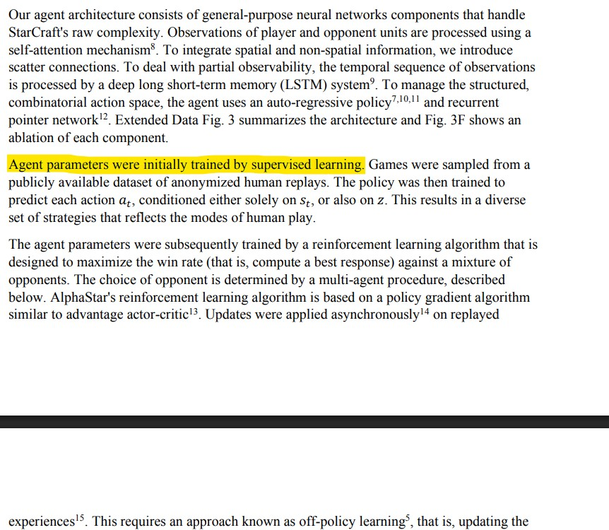
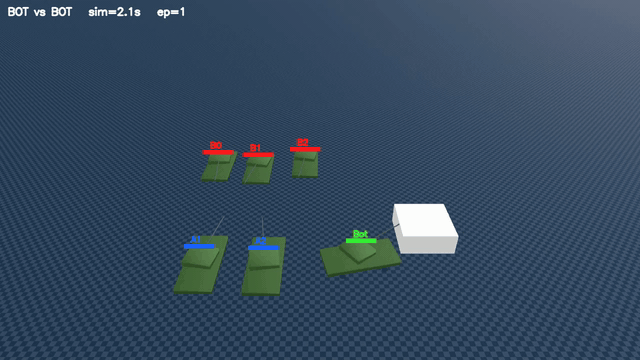
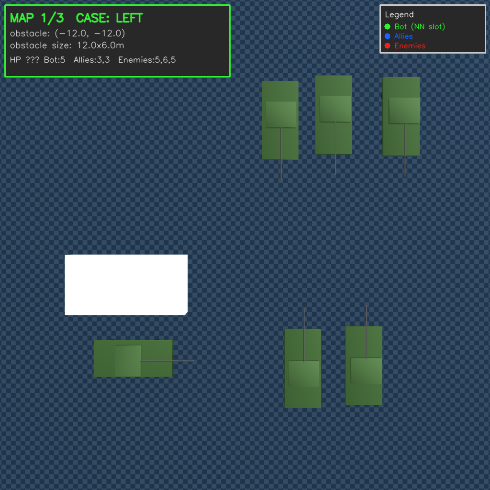
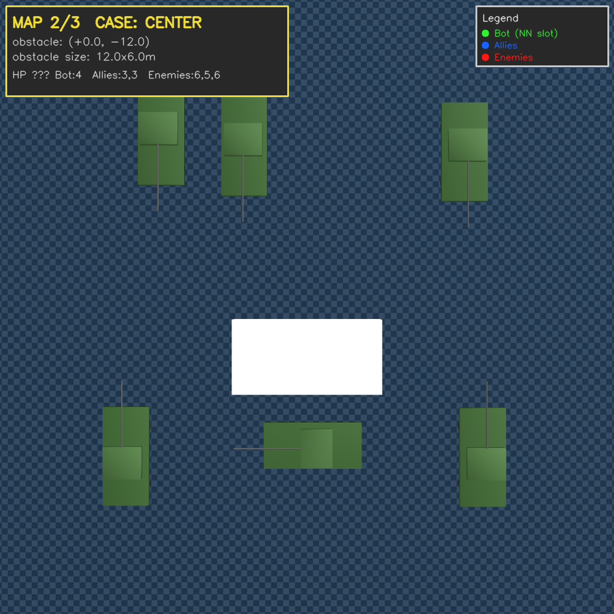
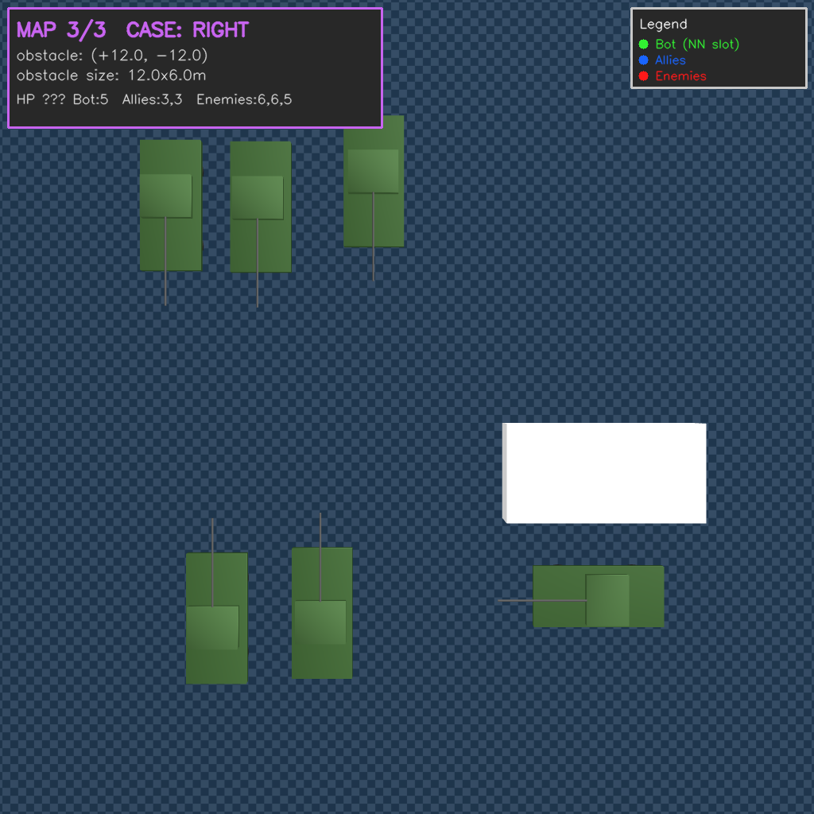
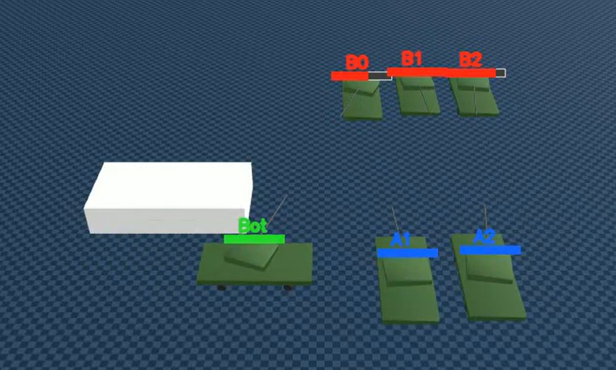
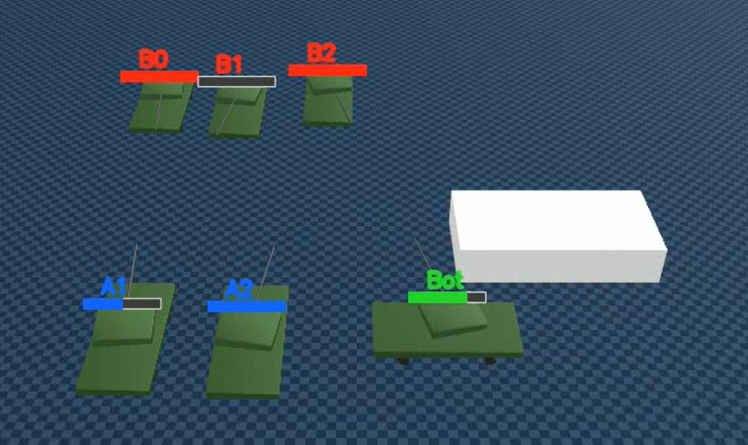

## 이전 미팅 피드백에 따라 NN은 1개의 탱크만 조종
- 이에 맞게 학습 파이프라인을 재설계

# Tank_brake 기능 추가(추가 이유는 하단에)

```python
brake_active = True 일 때:
  - 트랙 명령 = 0 (실제 brake = 휠 정지)
```
- 즉 brake 제어가 내려지면 탱크 20개 패치의 속도 명령값은 0
- 그러나 이는 자동차 brake를 밟은 것이 아닌 가속 패달에서 발을 뗀 것과 같은 효과
- **관성**으로 탱크가 멈추지 않고 앞으로 더 밀려날 수밖에 없는 구조

## 그럼 실제 탱크 brake처럼 궤도를 멈추기 위한 힘을 주면 되지 않나?


- 실제 탱크는 “궤도 회전 속도”라는 물리 상태가 있고, 브레이크는 그 회전을 막는 토크를 검
- Genesis tank는 궤도의 연산 비용이 비싼 관계로 패치로 대체했었음
- 실제 궤도가 없고, 패치가 그냥 힘만 직접 넣는 구조
	- x라는 힘을 brake를 위한 힘이라고 하면 현재 genesis tank로는 이 x를 구하기 힘들다는 것 (x보다 힘을 더 주면 후진을, 덜 주면 전진을 할 것임)
## 부족한 brake 힘을 추가하자

$F_{\mathrm{damping}} = -D \cdot v_{x,\mathrm{body}} \quad (D = 8000\ \mathrm{N \cdot s/m})$

- 기본적으로 damping force는 속도에 비례하는 반대 방향의 힘을 의미
- vx_body는 tank 차체의 속도(양수 전진, 음수 후진)
- D(damping coefficient)는 속도 1m/s 당 얼마나 강한 brake를 걸 것인지를 결정하는 상수 term
	- 값을 바꿔가며 8000정도로 세팅하기로 결정

### D=8000일 때, brake 시 탱크에 가해지는 힘

| 상태                    | $v_{x,\mathrm{body}}$ |                   $F_{\mathrm{damping}}$ | 결과                   |
| --------------------- | --------------------: | ---------------------------------------: | -------------------- |
| 정지                    |                   $0$ |                                      $0$ | 힘 없음. 후진/전진 없이 그대로   |
| 전진 $+5\,\mathrm{m/s}$ |                  $+5$ |   $-5 \times D = -40{,}000\,\mathrm{N}$  | 음의 힘 → 감속 (전진 방향 감속) |
| 후진 $-5\,\mathrm{m/s}$ |                  $-5$ | $-(-5) \times D = +40{,}000\,\mathrm{N}$ | 양의 힘 → 감속 (후진 방향 감속) |

https://github.com/user-attachments/assets/150212d0-067b-430f-ad18-db0933a6a2e7

- brake로 정지하는 영상
### 우려되는 사항
- 이 방식은 어디까지나 brake를 env 차원에서 **임의로** 부여한 것
	- 무한궤도를 patch로 흉내낸 것처럼 brake를 흉내낸 방식
- 현재 방식의 tank는 빙판길에서도 아주 잘 멈출 것임(차체 속도에 비례해서 알아서 힘이 가해지므로)

# 학습 파이프라인(새로운 제시)

### 겪었던 고충
1. 아무리 NN이 한대만 조종한다고 해도 완전히 random한 파라미터로 이루어진 NN을 처음부터 강화학습을 시켜 전략적 전술을 기대하는 건 매우 어려운 task
2. 따라서 거의 모든 상황에서 합리적인 전략은 Hard Coding으로 NN에 박아두는 idea를 생각해보았음
	1. hp가 1인 적은 무조건 targeting
	2. 아군이 많이 targeting한 적을 우선 공격
	3. hp가 부족하면 엄폐
	4. 재장전 중엔 엄폐, 재정전이 완료될 때쯤 엄폐 해제 후 사격
3. 그러나 위 방식의 문제점은 아무리 합리적인 전략이라고 해도 NN의 자유도를 매우 많이 해치는 일이라는 것(flexible하지 못 함)

### 하드코딩 문제점 예시


- 위 하드코딩 규칙에 따라서
	- 동료가 타깃하는 적을 우선 타깃
	- 재장전중엔 엄폐
- BUT 본인과 싸우는 상대를 앞에두고 엄폐물 때문에 맞지도 않을 상대에게 포신을 돌리는 비합리적인 행동을 하게 됨
	- 유연의 중요성 -> NN이 필요한 이유

- 위 gif는 차후 설명할 Rule Bot의 구버전임(NN이 아님)
- NN의 자유도를 유지하면서 warm start model을 만들 방법?

# Rule Bot 지도학습

## Rule Bot이란?
- 복잡하지 않은 간단하면서도 합리적인 규칙들에 의거하여 행동하는 탱크 Bot
- Rule Bot을 제작하고 지도학습 정답으로 삼아 NN을 먼저 지도학습 시켜둔 뒤, 강화학습을 진행하자는 것
- Deepmind의 AlphaStar라는 모델의 논문에서도 사람의 starcraft play로 먼저 지도학습 시키고 이후 강화학습으로 모델을 발전시켰다고 한 사례가 존재



## Rule
### 1. 이동 규칙

| 조건     | 목적지 (dest)                  | 비고  |
| ------ | --------------------------- | --- |
| HP > 1 | Expose 위치 (시나리오 고정 측면 step) |     |
| HP = 1 | Spawn 위치 (엄폐물 뒤)            | 엄폐  |
- 재장전 중일 땐 엄폐하는 게 더 합리적이지만, Bot의 목적은 warm start 즉 initial NN보다 나은 전투 능력을 보이면 됨(그 이상의 전략 전술은 NN이 학습하게 끔 두자는 것)
#### 이동과 관련한 brake 부재 issue



- brake가 없어서 NN이 원하는 지점(엄폐물 뒤, 개활지 등)에 도달하지 못 하고 관성으로 앞으로 더 밀려나는 등의 문제가 있었음
- brake 추가로 위 문제 해결

### 2. 타겟 선정 규칙
0. 모든 적은 LOS가 가능할 때만 사격 -> 보이지 않는 적을 락온해 사격 못 하는 비합리적 행동 차단
1. hp가 1인 적(1순위)
2. 동료(slot 1, 2)가 노리고 있는 적 중 LOS 가능한 것 (집중사격 합류)
        - 동료들의 현재 nearest LOS-cleared 타겟 집계
        - 가장 많은 동료가 노리는 적 우선
        - 동률이면 봇 자신과 가까운 적
3. 가장 가까운 살아있는 적

- LOS(Line of Sight): 두 지점 사이에 직선 시야가 확보되는가의 여부
```
shooter 위치 P_a = (x_a, y_a) (예: bot)
target 위치 P_b = (x_b, y_b) (예: 적)
obstacle AABB: [x_min, y_min, x_max, y_max] (axis-aligned bounding box, z 축 무시)
```
- shooter와 target 두 점을 잇는 선이 obstacle영역에 들어오는 지를 수학적으로 계산

### 적, 아군 탱크 규칙
- 적 탱크와 아군 탱크는 모두 제자리에 고정(이동X)
- LOS만 판정하고 가장 가까운 적을 사격
## map 환경 설정

| 항목             | 값                          |
| -------------- | -------------------------- |
| 맵 크기           | 44×44 (MAP_HALF=22)        |
| Obstacle 크기    | 12 × 6 × 2.5 m (bot 전용 엄폐) |
| Bot/동료 spawn y | -20 (지터 ±1m)               |
| Obstacle 위치 y  | -12 (bot 8m 전방)            |
| 적 spawn y      | +5 (지터 ±1m)                |
| Bot HP         | 4-5 (랜덤)                   |
| 동료 HP          | 3-4 (랜덤) × 2               |
| 적 HP           | 5-6 (랜덤) × 3               |
| Reload         | bot/동료 5s, 적 8s            |
| Reload 초기값     | 0~30% × interval (랜덤)      |
| Episode 길이     | 60s (1200 step)            |
- 적과 동료의 hp에 randomness가 있긴 하나, hp는 적이 더 많게 설정
- 공격속도는 Bot 쪽이 더 빠르게 설정

```
Bot Team은 화력 우위 (reload 5s), 적은 HP 우위 (총 HP +50%) 로 비대칭 밸런스 설계. 단순 무지성 사격으로는 비등하거나 패배지만, bot/NN 이 점사 (concentrated fire) 를 잘 수행하면 화력 우위로 역전 가능
```

#### map 장애물 구성(seed마다 랜덤)

| Left | Center | Right |
|---|---|---|
|  |  |  |
- 환경의 다양성(차후 NN의 학습 고려)과 Bot이 다양한 환경에서 문제 없이 잘 동작하는지 확인하기 위해 map은 3가지 형태로 간단하게 제작
### randomness가 들어간 항목들 정리

| 변수 | 범위 | 종류 |
|---|---|---|
| 시나리오 case | LEFT / CENTER / RIGHT | 이산 (3개) |
| Bot spawn | x ±1m, y ±1m (jitter) | 연속 |
| 동료 1 spawn | x ±1m, y ±1m | 연속 |
| 동료 2 spawn | x ±1m, y ±1m | 연속 |
| 적 1 spawn | x ±1m, y ±1m | 연속 |
| 적 2 spawn | x ±1m, y ±1m | 연속 |
| 적 3 spawn | x ±1m, y ±1m | 연속 |
| HP_bot | {4, 5} | 이산 (2개) |
| HP_ally (양 동료 공통) | {3, 4} | 이산 (2개) |
| HP_enemy 1 | {5, 6} | 이산 (2개) |
| HP_enemy 2 | {5, 6} | 이산 (2개) |
| HP_enemy 3 | {5, 6} | 이산 (2개) |
| reload_init_frac | [0.0, 0.3] | 연속 |

## 실제 전투 영상

| Bot Lose (근소한 차이) | Bot Lose | Bot Win |
|---|---|---|
| [](https://github.com/user-attachments/assets/de2795fd-8d8c-46a6-b8c2-8101a2330b21) | [](https://github.com/user-attachments/assets/74da7095-d153-4068-90a9-d25acff6e9d1) | [](https://github.com/user-attachments/assets/114ee1bb-4530-41ec-a825-cfb176883fb9) |

### 총 전적(총 256개 episode)
| 결과                          |  횟수 |  비율 |
| --------------------------- | --: | --: |
| WIN (Bot team 승)            | 184 | 72% |
| LOSE (Bot team 패)           |  57 | 22% |
| DRAW (HP 동률)                |  15 |  6% |
| ANOMALY (NaN/out-of-bounds) |   0 |  0% |
- bot은 hp가 1이 되면 엄폐하므로 결판이 안 났을 시 남은 hp로 승패를 판단(DRAW는 남은 hp마저 같은 것)

## 다음 지도학습 단계(진행중)
