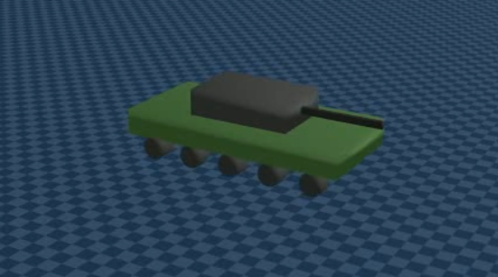
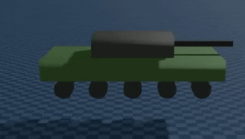
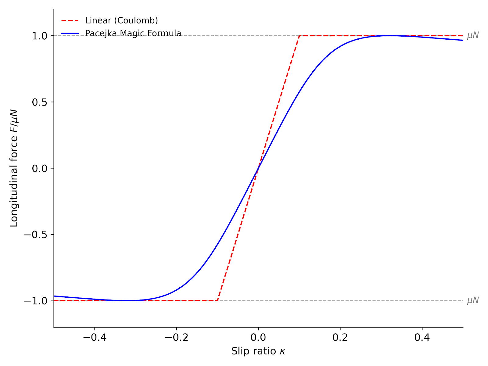
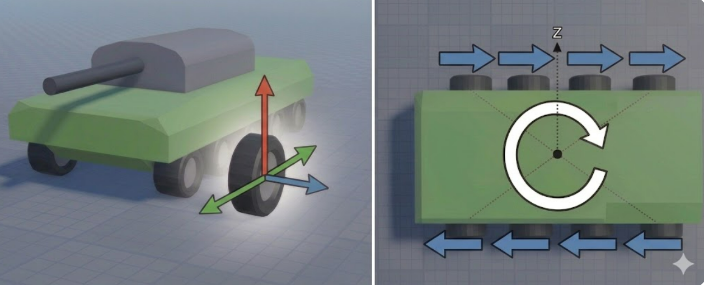

# Ray-based vehicle(Tank) physics 구현

- 보고서에 나오는 chassis = tank의 차체입니다(자동차의 chassis와는 조금 다른 개념)

- solver에게 맡겼던 계산들을 어떻게 직접 설계했는지 알아보기
---
## A1. tank_ray.urdf

기존 `tank_belt.urdf` 를 ray-based 모델용으로 재구성.
(아래 사진은 ray 부착이 된 사진, 부착 안 할시 바퀴가 땅 밑으로 꺼짐)



**변경 사항:**

- 탱크 몸통만 collision 유지, 바퀴는 collision 제거
- prismatic joint를 fixed joint로 변경
	- prismatic joint는 suspension을 위해 붙어있던 joint
	- 더 이상 실제 휠이 지면과 충돌해서 서스펜션이 눌리지 않기에 솔버가 서스펜션 계산을 할 필요가 없음

**구조:**

- 10 wheels = 5 (좌) + 5 (우)

- y position ±1.42 (track 폭 2.84m), wheel radius 0.4m

- DoF: 6 chassis root + 10 wheel revolute + turret + barrel = 18

---
## A2. Custom Raycaster Pattern (10-ray)

### 1. gs.sensors.Raycaster

- Genesis가 기본 제공하는 ray-cast 센서
- 어떤 entity에 부착하면 그 entity에서 ray를 쏴서 닿은 곳까지 거리/위치 정보를 알려줌
### 2. RaycastPattern

- Raycaster가 쏠 ray가 어떤 방향들로 쏘아질지 정해둔 목록
- Genesis 기본 제공은 GridPattern, SphericalPattern 등
	- ray를 Grid 형태로 쏘거나 사방으로 퍼져나가는 등의 ray

```
GridPattern
● ● ● ●
● ● ● ●
● ● ● ●

SphericalPattern
        ↑
     ↖  |  ↗
←────── ● ──────→
     ↙  |  ↘
        ↓
```

  - 제공되는 패턴중엔 원하는 게 없어서 WheelRayPattern을 정의
  - 3개의 메서드만 오버라이딩해 현재 task에 맞게 간단히 구현

```python
class WheelRayPattern(RaycastPattern):
    def _get_return_shape(self):       # ray 몇 개?
        return (10,)                    # → 10개

    def compute_ray_dirs(self):         # 각 ray 어느 방향?
        # 10개 모두 (0, 0, -1) 즉 아래쪽

    def compute_ray_starts(self):       # 각 ray 시작점은?
        # body-frame 으로 (3.0, +1.42, 0), (1.5, +1.42, 0), ..., (-3.0, -1.42, 0)
        # = 10 wheel 중심 위치
```
- 그 결과 매 step 아래 정보를 얻게 되고,
```python
data = sensor.read()           # → RaycasterData(points, distances)
data.distances    # shape (10,)  — 10 wheel 각각의 ground 까지 거리
data.points       # shape (10,3) — hit 된 world 좌표
```
- sensor.read()만 호출하면 Genesis solver가 BVH를 통해 알아서 위 정보를 제공, 우린 아래 지형이 mesh인지, plane인지, 어떤 모양인지 몰라도 OK
---
## A3. 5-step Force Pipeline (Pacejka tire)

### 1. Suspension force 계산 (수직력 N)

```
compression = (TIRE_R + L_SUSP) - distance
# TIRE_R은 타이어 반지름, L_SUSP는 spring의 원래 길이
```
- compression은 spring이 원래의 길이보다 얼마나 압축됐는지를 의미
- 아래 경우 compression = 0

```
N = K_SUSP · compression + C_SUSP · comp_rate
# Spring 항은 압축이 클 수록 더 강하게 밀어낸다는 의미
# Damper 항은 압축 중(spring이 꾹 눌리고 있을 때)일 땐 comp_rate > 0 (댐퍼가 압축 저지)
# spring이 펴지고 있을 땐, comp_rate < 0 (댐퍼가 반발 저지)
N = max(N, 0.0)
```

- `K_SUSP` = spring stiffness (1,000,000 N/m)
- `C_SUSP` = damper coefficient (120,000 N·s/m, 양방향 작동)
- `comp_rate` = `compression` 의 시간 미분 (압축이 얼마나 빠르게 변하나)
- `N` 은 항상 ≥ 0 (지면이 바퀴를 위로 미는 힘)


- 탱크가 통통 튀지 않고 가상의 suspension으로 안정적으로 착지하는 모습
---
### 2. Slip 계산

**종방향 slip ratio:**

$$
\kappa = \frac{R \cdot \omega_{\text{wheel}} - v_{\text{long}}}{\mathrm{max}(|v_{\text{long}}|,\ \varepsilon)}
$$
- w_wheel은 바퀴 회전 속도(어떻게 구하는 지는 4번에서)
- 바퀴 회전 속력보다 탱크 차체 속력이 더 빠르다면 braking slip(멈추는 중)
	- kappa < 0
- 바퀴 회전 속력보다 탱크 차체 속력이 더 느리다면 driving slip(출발 가속 중)
	- kappa > 0

**횡 slip angle:**

$$
\alpha = \mathrm{atan2}\left(v_{\text{lat}},\ \mathrm{max}(|v_{\text{long}}|,\ \varepsilon)\right)
$$
- alpha는 바퀴 정면 방향과 실제 진행 방향의 각도 차이를 의미
	- 0이면 직진 중 횡방향 slip X
	- 11이면 좌측으로 살짝 미끄러지는 상황
	- 45면 drift 중
**참고**
- v = (v_long, v_lat)  ← 2D 벡터
---

### 3. Tire force (Pacejka Magic Formula)

### Pacejka??

- slip에 따라 타이어가 만들어내는 마찰력 곡선을 의미
	- 수식이 linear 곡선보다 조금 복잡하나, 현실과 더 일치하는 곡선이기에 채택 

**수식 차이**
```
Linear:    F = clamp(C·slip, ±μN)
Pacejka:   F = D·sin(C·atan(B·slip - E·(B·slip - atan(B·slip))))
```
- B,C,D,E 전부 지정해줘야 하는 상수
- Step B 의 slip (κ, α) 을 입력으로 받아 종/횡 마찰력 (F_long, F_lat) 산출

| 기호    | 이름               | 곡선 어디 영향                                                | 우리 값 (탱크)                     |
| ----- | ---------------- | ------------------------------------------------------- | ----------------------------- |
| **D** | peak factor      | **곡선 천장 높이** (= 마찰 한계, 보통 μN)                           | μN(μ는 0.9), μN·LAT_SCALE(0.5) |
| **C** | shape factor     | sin 안 들어가는 ratio. 곡선의 전체 모양 결정                          | 1.6 (long), 1.4 (lat)         |
| **B** | stiffness factor | 작은 slip 영역에서의 **기울기**. 클수록 빨리 saturate                  | 5.0 (long), 4.0 (lat)         |
| **E** | curvature factor | peak 이후 **얼마나 떨어지나** (E 작을수록 plateau, E 클수록 sharp drop) | 0.4 (둘 다)                     |
#### 종 + 횡 force 가 anisotropic 마찰 한계를 동시에 못 넘게 cap
$$
\text{norm} = \sqrt{\left(\frac{F_{\text{long}}}{\mu N}\right)^2 + \left(\frac{F_{\text{lat}}}{\mu N_{\text{lat}}}\right)^2}
$$

$$
\text{if } \text{norm} > 1: \quad F_{\text{long}} \leftarrow \frac{F_{\text{long}}}{\text{norm}}, \quad F_{\text{lat}} \leftarrow \frac{F_{\text{lat}}}{\text{norm}}
$$
- `norm ≤ 1`: 마찰 한계 안. 그대로 사용.
- `norm > 1`: 한계 초과. 두 force를 **같은 비율로 줄임** (벡터 방향 유지, 크기만 축소).

### 추가 사항

```python
F_RR = -Cr · N · sign(v_long)
```
- Cr은 0.05, N은 지면이 바퀴를 위로 미는 힘(1에서 계산), sign(v_long)은 전진 반대방향
- 전진하던 차량이 brake없이 악셀에서 발을 뗀다면 서서히 멈춰야 함
- 그 힘을 구현한 것(brake를 밟지 않아도 서서히 속력이 줄어드는 효과)

### 4. Wheel ω(각속도) 업데이트
$$T_{\text{drive}} = \text{throttle} \cdot T_{\text{drive}}^{\max}$$

$$T_{\text{brake}} = \text{brake} \cdot T_{\text{brake}}^{\max} \cdot \tanh!\left(\frac{\omega}{0.5}\right)$$

$$T_{\text{friction}} = R \cdot F_{\text{long}}$$

$$\frac{d\omega}{dt} = \frac{T_{\text{drive}} - T_{\text{brake}} - T_{\text{friction}}}{I_{\text{wheel}}}$$

$$\omega \leftarrow \omega + \frac{d\omega}{dt} \cdot \Delta t$$
- 엔전 토크, brake 토크, 지면 마찰 반작용 힘을 각각 계산
- 바퀴에 걸리는 모든 토크(엔전 토크, brake 토크, 지면 마찰 반작용)의 합을 구함(바퀴에 가해지는 힘)
- 위 합을 바퀴의 관성으로 나누면 바퀴의 각가속도 도출(관성은 가만히 있으려는 힘, 상수 50 kg·m²로 세팅)
- 각가속도를 dt에 대해 적분 -> 한 step동안 w(바퀴 각속도) 변화량 -> 이 값을 바탕으로 w값 업데이트

### 추가 사항
- 단 w가 커지더라도 토크 출력에는 한계(clip)가 존재

```
T_max(ω) = T_DRIVE_MAX × max(0, 1 - |ω|/OMEGA_MAX_DRIVE)
         = 30,000 × max(0, 1 - |ω|/100)
```
- 위 식에 따라 w가 100이상이 되면 T_max(w)는 0
- T_max(w)는 현재 w에서 출력할 수 있는 최대 토크를 의미


### 5. Wheel이 만든 힘을 chassis에 인가

- wheel별로 F_world와 torque를 계산
- 왼쪽 그림은 코드에서 F_world에 대해, 오른쪽은 torque에 대해 나타낸 그럼


```
F_world = N · ẑ_world + F_long · forward + F_lat · lateral
torque = r_wheel × F_world # r_wheel은 chassis 중심에서 wheel까지의 위치 벡터
 
total_F += F_world 
total_T += torque # step 끝나면 한 번에 인가 

solver.apply_links_external_force (total_F, base_link) solver.apply_links_external_torque(total_T, base_link)
```
- N은 1에서 구한 suspension 반력
- F_long과 F_lat은 3에서 구한 wheel의 종/횡 마찰력
- F_world는 wheel 이 chassis 에 가하는 앞,뒤,옆에 대한 평행 이동의 힘
- Torque는 wheel이 chassis에 가하는 회전힘
- `total_F`: chassis의 직선 운동을 만드는 힘
- `total_T` = chassis의 회전 운동을 만드는 힘
- total_F가 0이고 total_T만 값이 있다면 탱크는 제자리 회전

### 위 힘들을 종합한 결과
#### 탱크 직진 영상

https://github.com/user-attachments/assets/5872ce5a-136f-4ee8-9d27-494d2bd5f4c0


---

  

## A4. Brake mechanism
- Brake는 별도로 구현한 것은 없음
- T_brake가 바퀴의 각속도를 감소시키면, slip(k)이 음수가 되고 Pacejka 가 음의 F_long 출력
- 즉 위 5단계 수식에 의해 자연스럽게(현실과 유사하게) brake가 구현된 것

### Brake parameter
```python
T_BRAKE_MAX = 30,000 N·m / wheel
T_brake = brake · T_BRAKE_MAX · tanh(ω / 0.5)
```

#### `tanh(ω/0.5)` 의 역할:

- `ω > 0`: T_brake > 0 → 바퀴 회전 저지 (감속)
- `ω < 0`: T_brake < 0 → 자동으로 부호 뒤집어 반대 방향 회전도 저지
- `ω ≈ 0`: T_brake ≈ 0 → sign이 아닌 tanh로 구현하여 w가 감소할 때 부드럽게 진동없이 정지
### Brake 영상

https://github.com/user-attachments/assets/59dc7692-faf9-4213-80e6-72501ad78dd0

---

## A5. Skid Steering
- 좌·우 wheel 에 차등 토크 → yaw torque 발생. 자동차 타이어와 다른 처리 필요

```python
T_drive_L = (throttle - steer) × T_DRIVE_MAX     # 좌 5 wheel
T_drive_R = (throttle + steer) × T_DRIVE_MAX     # 우 5 wheel
for i in range(10):
    T_drive_i = T_drive_L if i in LEFT_IDX else T_drive_R
```
- 토크를 좌우 다르게 인가해야 좌우 w차이가 발생(10개 wheel이 모두 같은 각속도면 회전이 불가)

```python
mu_N      = MU × N                       # 종
mu_N_lat  = MU × 0.5 × N           # 횡 (절반)
F_long = pacejka(κ, ..., D=mu_N)
F_lat  = -pacejka(α, ..., D=mu_N_lat)    # 횡 한계 별도
```
- 탱크의 실제 track 특성상 똑같은 힘을 주어도 앞뒤는 잘 안 밀리고 옆으로는 비교적 잘 밀림
- 즉 횡방향 마찰계수를 종방향 마찰계수의 절반으로 세팅 

### 조향 영상

https://github.com/user-attachments/assets/1745f3c8-5fe6-4017-b9ed-c8d10025cd62

---
## A6. Mesh Terrain Integration (Plane + 가우시안 언덕)
- plane은 genesis의 기본 plane을 의미
	- `scene.add_entity(gs.morphs.Plane(), material=gs.materials.Rigid(friction=0.7))`

```python
hf[i,j] = peak · exp(-(dx² + dy²) / 2σ²)
scene.add_entity(
    morph=gs.morphs.Terrain(horizontal_scale=1.0, height_field=hf, pos=(0, -40, 0)),
    material=gs.materials.Rigid(friction=0.7),
    surface=gs.surfaces.Default(color=(0.45, 0.35, 0.20)),  # 흙색
)
```
- 가우시안 모양의 언덕을 정의하고 scene에 추가
- Terrain(height_field=hf)를 호출하면 Genesis가 hf 격자의 각 점을 vertex로 만들고, 인접한 점 4개를 2개의 삼각형으로 묶어 face 형성
- 결론은 mesh terrain이 scene에 생성된다는 것
### terrain 위 주행 영상

https://github.com/user-attachments/assets/fd08413f-474b-405e-8fe9-a8e73a872072


---

## 추가 사항
```python
omega[LEFT_IDX]  = omega[LEFT_IDX].mean()    # 좌 5 wheel 평균으로 통일
omega[RIGHT_IDX] = omega[RIGHT_IDX].mean()
```
- 이전에 피드백 받았던 좌우 별 wheel 각속도 통일도 반영되어 있음

## todo

- **stochasticity 구현**
- 봇 이동
- Rule bot 재설계
