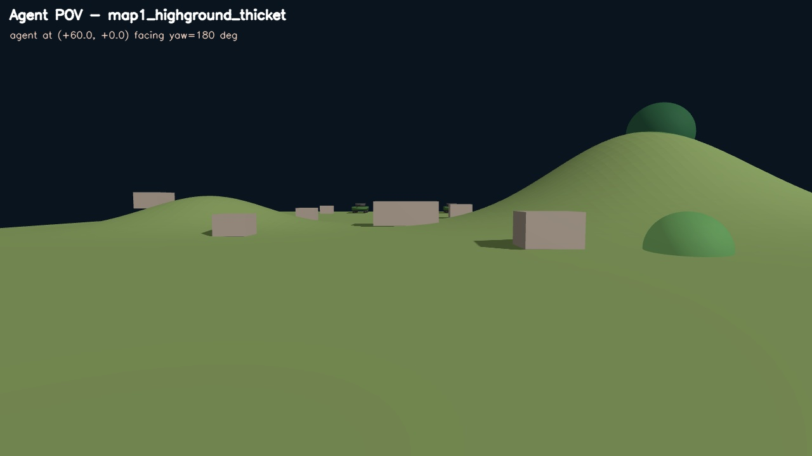

## 1. 명중률 Stochasticity

```
P_hit = P_base × f_movement × f_distance × f_LOS × f_aim
```

- 각 변수들은 [0,1] -> 즉 어느 한 요인이라도 값이 작으면 피격 확률이 작아지게 됨

### P_base = 1.0(최대 명중률)

-> 이후 나오는 명중률은 피격확률을 의미

### f_movement(이동속도에 대한 명중률)

```python
def speed_factor(v_long, v_lat=0.0):
    v_eff = sqrt(v_long² + LAT_WEIGHT · v_lat²)
    return exp(-HIT_ALPHA · v_eff)
```

- `HIT_ALPHA = 0.02` -> v_eff에 대한 상수 가중치(크면 속도에 더 예민)
- `LAT_WEIGHT = 2.0` — 횡속도 가중치(횡방향 이동이 피할 확률을 더 높여줌)
- 여기서의 종방향은 shooter와 target을 잇는 벡터방향을 의미

|v_eff|f_movement|
|---|---|
|0 (정지)|1.00|
|5 m/s|0.90|
|10 m/s|0.82|
|15 m/s|0.74|
|20 m/s|0.67|

- 즉 조금이라도 움직인다면 가만히 있는 것보다는 맞을 확률이 내려감
- 특히 횡방향(좌회전, 우회전)에 대한 이동은 회피에 있어 더 큰 영향을 미침

### f_distance(거리에 따른 명중률)

```python
def distance_factor(distance):
    return exp(-distance / HIT_D_EFF)
```

- HIT_D_EFF = 200m
- 거리가 멀수록 명중률 감소(풍속, 낙차 등 많은 원인이 존재)

|거리 (m)|f_distance|비고|
|---|---|---|
|0|1.00|코앞|
|10|0.95|근거리|
|30|0.86|통상 교전 거리|
|50|0.78|중거리|
|80|0.67|중원거리|
|100|0.61|원거리 sniping|
|150|0.47|맵 끝|
|200|0.37|1·d_eff (37%)|

예를들어 10m/s(36km/h) 속력으로 이동 중인 50m 앞 적 탱크를 사격 시 피격 확률은 약 64%

### 기타 factor(0 또는 1)

- los_quality: 엄폐물이 LOS 상에 존재하는가(존재하면 0)
- aim_quality: 포신이 조준 되어 있는가(조준이 안 되어있다면 0)
    - 현재는 조준 시에만 사격하기에 무조건 1

## Distance Test

https://github.com/user-attachments/assets/c970a884-3ffb-4727-b052-2b6bedf79062

| 거리           | 이론 P_hit | 실측 명중률    | hits/shots |
| ------------ | -------- | --------- | ---------- |
| CLOSE (10m)  | 95.1%    | **97.0%** | 97/100     |
| MEDIUM (30m) | 86.1%    | **84.0%** | 84/100     |
| FAR (60m)    | 74.1%    | **77.0%** | 77/100     |

## Speed Test

https://github.com/user-attachments/assets/9d85fd11-d439-4eeb-95f3-8431cc9f0ad2

|Phase|throttle|평균 속도|이론 P_hit (avg)|실측 명중률|hits/shots|
|---|---|---|---|---|---|
|SLOW|0.15|1.36 m/s|93.4%|**83.9%**|26/31|
|MEDIUM|0.5|7.27 m/s|79.0%|**77.0%**|67/87|
|FAST|1.0|20.84 m/s|53.8%|**53.7%**|51/95|

## 데미지 Stochasticity

```
damage = BASE_DAMAGE × zone_multiplier × crit_multiplier
```
- BASE_DAMAGE = 10 (한 발의 기본 피해량, 기본 Tank 체력은 100으로 임의 세팅해둠)
- zone_multiplier: 피격 위치(정면/측면/후면)에 따른 random 배수
- crit_multiplier: 일정 확률로 발동되는 critical 배수
	- 현실과 비교해보자면 피격 후 승무원 부상 혹은 사망, 차내 화재 등과 같은 치명적 피해

###  zone_multiplier(피격 위치 기반)

```python
def damage_zone(aspect_deg):
    a = abs(aspect_deg)
    if a <= 45.0:
        return "FRONT", 0.3, 1.0
    elif a <= 135.0:
        return "SIDE",  1.0, 2.5
    else:
        return "REAR",  2.0, 4.0
```
- aspect_deg = 피격 탱크의 정면 방향과 사격자 위치 사이의 각도
	- 0° = 정면 피격 (가장 두꺼운 장갑)
	- 90° = 측면 피격
	- 180° = 후면 피격 (가장 약한 장갑)

각 피격 부위 별로 아래 범위 내에서 기본 데미지에 곱해질 배수가 랜덤하게 뽑힘(uniform random)

|Zone|aspect 범위|multiplier 범위|
|---|---|---|
|FRONT|0 – 45°|0.3 ~ 1.0|
|SIDE|45 – 135°|1.0 ~ 2.5|
|REAR|135 – 180°|2.0 ~ 4.0|

### crit_multiplier(치명타)

```python
P_CRITICAL = 0.10
CRIT_MULT_LO, CRIT_MULT_HI = 1.6, 2.5
```

- 매 사격마다 10% 확률로 치명타 발동
- 발동 시 uniform [1.6, 2.5] 배수가 zone_multiplier 위에 추가로 곱함
- 미발동 시 1.0 (변화 없음)

### 최종 damage 분포

| Zone  | non-crit 최소 | non-crit 최대 | crit 시 최대       |
| ----- | ----------- | ----------- | --------------- |
| FRONT | 3           | 10          | 25              |
| SIDE  | 10          | 25          | 62.5            |
| REAR  | 20          | 40          | **100 (즉사 가능)** |

https://github.com/user-attachments/assets/9d3042da-1715-4c19-9418-581c79e83bfa

- 영상의 mean은 각 부위별 평균 배수를 의미(3이면 평균적으로 30의 damage가 들어갔다)
- range는 위 측정에서 나온 데미지 배수의 최소, 최대값을 의미

### damage test 통계계

|Shooter|aspect (실측)|Zone|mean dmg|std|min~max|critical 수|
|---|---|---|---|---|---|---|
|FRONT (0°)|0.0°|FRONT|**0.70**|0.32|0.31~1.92|12|
|OBLIQUE (60°)|60.0°|SIDE|**1.98**|0.79|1.01~5.30|12|
|SIDE (90°)|90.0°|SIDE|**1.97**|0.89|1.01~5.99|11|
|REAR (180°)|180.0°|REAR|**3.46**|1.45|2.01~9.06|12|


## Todo -> Map 설계

## 현재 Map설계 진행중



https://github.com/user-attachments/assets/316eedfe-660f-490e-bf78-a2ffbb4b9e39
