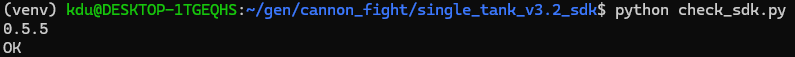
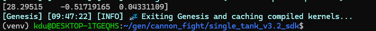
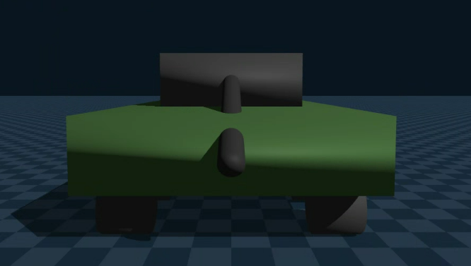

# SDK 환경 셋업(Tank) 정리 및 시행착오 보고서

- 현 보고서에 제시되는 코드는 아래 깃허브링크에서 제공와 조금 다를 수 있습니다.
	- 시행착오에 따른 코드 수정은 대부분 기재되어 있습니다.
	- 수기로 작성한 코드라 줄바꿈 등이 어색할 수 있습니다.

[genesis_vehicle](https://github.com/korfriend/GenesisVehicle](https://github.com/korfriend/GenesisVehicle "https://github.com/korfriend/GenesisVehicle)

- 만약 genesis 환경 구축이 안 되어 있다면?

[genesis 환경 구축 보고서](https://github.com/dwhaha6/Graphics_Study_Genesis_Ai/blob/main/2025_0910_genesis%20%EC%83%98%ED%94%8C%20%EC%8B%A4%ED%96%89%20%EB%B3%B4%EA%B3%A0%EC%84%9C.md)

### 참고(현재 보고서 작성자의 폴더 구조 입니다.)
```
~/gen/
├── genesis_vehicle/         
│   ├── __init__.py
│   ├── _version.py
│   ├── config.py
│   ├── core.py
│   ├── dynamics.py
│   ├── inputs.py
│   ├── presets.py
│   ├── raycast.py
│   ├── scene_helpers.py
│   ├── urdf.py
│   ...
│
└── cannon_fight/
    └── single_tank_v3.2_sdk/   # SDK 기반으로 새로 짤 우리 탱크 코드
        └── check_sdk.py

```
## A1. SDK clone 후 import test
### 1. SDK 폴더를 둘 위치에 아래 명령어 실행
```
git clone https://github.com/korfriend/GenesisVehicle.git
```
### 2. 이제 작업할 폴더로 가서 아래 test 코드를 실행

```python
import genesis_vehicle

print(genesis_vehicle.__version__)

from genesis_vehicle import VehiclePhysics, VehicleInputs, tank_10w_skid_belt

print("OK")
```
- 이때  ModuleNotFoundError가 뜬다면 아래와 같이 조치
- $HOME/gen 등의 경로는 본인의 경로에 맞게 수정할 것

```bash
# 1. 폴더 이름을 import 이름과 일치시킴
mv ~/gen/GenesisVehicle ~/gen/genesis_vehicle

# 2. PYTHONPATH 에 ~/gen 추가 (parent 디렉토리)
export PYTHONPATH=$HOME/gen:$PYTHONPATH

# 3. 영구 설정 (매번 export 안 하게)
echo 'export PYTHONPATH=$HOME/gen:$PYTHONPATH' >> ~/.bashrc
source ~/.bashrc
```


- import 확인 완료
- README, docs, tests, sample 코드 모두 `from genesis_vehicle import ...` 로 적혀있으나 git clone으로 받아오는 폴더명이 대문자여서 발생한 오류
## A2. SDK quickstart
- 간단한 4륜 자동차를 불러와 주행 시켜보는 test 단계
- 본인이 정의한 4륜 자동차 urdf가 필요

```python
import os

import genesis as gs

from genesis_vehicle import (

    VehiclePhysics, VehicleInputs, add_vehicle, car_4w_rwd_ackermann,

)

  

URDF = os.path.join(os.path.dirname(__file__), "car_raywheel.urdf")

  

gs.init(backend=gs.gpu)

scene = gs.Scene(sim_options=gs.options.SimOptions(dt=1/48, substeps=50))

scene.add_entity(gs.morphs.Plane())

  

car, sensor, cfg = add_vehicle(scene,URDF, car_4w_rwd_ackermann)

scene.build(n_envs=1)

  

physics = VehiclePhysics(scene, car, sensor, cfg, n_envs=1)

for step in range(480):

    physics.step(VehicleInputs(throttle=0.5, brake=0.0, steer=0.0))

    scene.step()

  

print(car.get_pos()[0].cpu().numpy())
```
- URDF경로는 본인의 환경에 맞게 경로를 입력해야 함
- 원본 코드엔 os 모듈이 없으나 URDF를 편하게 불러오기 위해 추가하였음

### cfg??

```python
cfg.urdf_path          # URDF 경로
cfg.wheels             # WheelConfig × 4 (위치, 반경, k_susp, mu, ... 다 채워진 상태)
cfg.chassis            # ChassisConfig (mass, base_link 이름 등)
cfg.steering           # Ackermann() 인스턴스
cfg.drivetrain         # RWD() 인스턴스
cfg.coupling           # Independent() 인스턴스
cfg.tire               # PacejkaAnisotropic() 인스턴스
cfg.stability_hooks    # [RollingResistance(), LowSpeedRegularizer(), ...]
cfg.dt                 # 1/48 = 0.0208
cfg.visual_susp_mode   # "control"
```
- 차량 주행에 필요한 다양한 정보들을 담은 명세서
- 이 외에는 쭉 읽어보면 그리 어렵지 않은 코드


- forward X(RHS)에서 직진(steer = 0)만 했으니 위처럼 x값만 크게 나온다면 성공

## B1. Tank 불러와서 직진 시키기
- 이번엔 우리의 목적인 tank를 불러오자
- car_4w_ ~~  -> tank_10w_skid_belt 으로 교체 + 이번엔 show_viewer = True로 세팅

```python
import os

import genesis as gs

from genesis_vehicle import (

    VehiclePhysics, VehicleInputs, add_vehicle, tank_10w_skid_belt,

)

  

URDF = os.path.join(os.path.dirname(__file__), "tank_ray.urdf")

  
gs.init(backend=gs.gpu)

scene = gs.Scene(

    sim_options=gs.options.SimOptions(dt=1/48, substeps=50),

    viewer_options=gs.options.ViewerOptions(

        camera_pos=(-15, 0, 8), camera_lookat=(0, 0, 1)),

    show_viewer=True,

)

scene.add_entity(gs.morphs.Plane())

tank, sensor, cfg = add_vehicle(scene, URDF, tank_10w_skid_belt, pos=(0, 0, 1.5))

scene.build(n_envs=1)

scene.viewer.follow_entity(tank)

physics = VehiclePhysics(scene, tank, sensor, cfg, n_envs=1)


for step in range(480):

    physics.step(VehicleInputs(throttle=0.5, brake=0.0, steer=0.0))

    scene.step()

  

print(tank.get_pos()[0].cpu().numpy())
```
- 핵심1: camera_pos=(-15, 0, 8), camera_lookat=(0, 0, 1)) -> 카메라 초기 pos와 lookat을 세팅
- 핵심2: scene.viewer.follow_entity(tank) -> scene의 follow 함수를 통해 카메라가 tank를 자동으로 따라가도록 세팅

### 결과 영상

https://github.com/user-attachments/assets/b3c14b8a-4286-48ef-9eb5-bcdcd972b172

- Tank가 비정상적으로 튀며 움직임

## B2. 원인 분석

SDK 의 `tank_10w_skid_belt` preset을 살펴본 결과

```python
return VehicleConfig.from_urdf(
    ...
    dt=0.005,                  # ← tank preset 은 200 Hz 필수
    visual_susp_mode="control",
    wheel_overrides=_kdu_wheel_overrides(),   # ← 우리 KDU 탱크 값 그대로 (K_SUSP 등)
)
```

→ tank preset 이 명시적으로 `dt=0.005` (200 Hz) 를 요구
- 즉 코드도 이에 맞게 dt를 0.005로 수정

### 수정된 코드

```python
import os

import genesis as gs

from genesis_vehicle import (

    VehiclePhysics, VehicleInputs, add_vehicle, tank_10w_skid_belt,

)

URDF = os.path.join(os.path.dirname(__file__), "tank_ray.urdf")


gs.init(backend=gs.gpu)


scene = gs.Scene(

    sim_options=gs.options.SimOptions(dt=0.005, substeps=4),

    viewer_options=gs.options.ViewerOptions(

        camera_pos=(-15, 0, 8), camera_lookat=(0, 0, 1)),

    show_viewer=True,

)

scene.add_entity(gs.morphs.Plane())

  
tank, sensor, cfg = add_vehicle(scene, URDF, tank_10w_skid_belt, pos=(0, 0, 1.5))

  
scene.build(n_envs=1)


scene.viewer.follow_entity(tank)


physics = VehiclePhysics(scene, tank, sensor, cfg, n_envs=1)

  

for step in range(480):

    physics.step(VehicleInputs(throttle=0.5, brake=0.0, steer=0.0))

    scene.step()

  

print(tank.get_pos()[0].cpu().numpy())
```
https://github.com/user-attachments/assets/6b2d6387-a1be-4a69-9804-ffdcafd7ef70

- Tank가 안정적으로 직진
- dt 0.005s × 480 step = 2.4 이므로 시뮬레이션이 2.4초만 흘러 빨리 종료됨
	- SDK에 명시된 dt값을 0.01 정도로 올리는 것에 대한 검토 필요(0.005가 안정적이긴 하나 학습이 느려지고실시간 시뮬레이션도 슬로우 모션처럼 보임)

## C-1. 강화학습을 위한 추가 기능 작업(Auto Brake)

- 실제 Tank 게임을 직접 조작해본 결과 참고할 만한 기능들이 존재했음


- 별도의 brake 조작 없이 throttle이 0이라면(전진 키에서 손을 떼면) 알아서 brake가 걸림
- 이 기능을 추가하면 brake없이 관성만으로 움직이는 동작은 수행이 불가하지만 실제로 자동차 혹은 Tank를 그렇게 조작하려는 case는 거의 없을 것이기에 위 기능을 추가하려고 함

```python
V_AUTO_BRAKE_THRESHOLD = 0.5    # m/s, 이 속도 이상이면 throttle 떼는 순간 강제 brake
AUTO_BRAKE_STRENGTH    = 1.0    # 강제 brake 강도 (0~1)
THROTTLE_ZERO_EPS      = 0.01   # throttle 이 "거의 0" 이라고 볼 임계


def apply_auto_brake(throttle: float, brake: float, v_long: float) -> tuple[float, float]:
    if abs(throttle) < THROTTLE_ZERO_EPS and abs(v_long) > V_AUTO_BRAKE_THRESHOLD:
      brake = max(brake, AUTO_BRAKE_STRENGTH)
    return throttle, brake
```
- throttle이 0.01 이하인데 tank 속도가 1.8km/h 이상이라면 자동 brake

https://github.com/user-attachments/assets/cbdb1fac-2aa4-4aca-9e0d-cc3921861cb7

- brake가 안 먹는 문제 발생(brake가 1인데 v가 4초 넘게 0이 되지 않음)

### 원인 분석

| 변수            | 값          | 의미                                                        |
| ------------- | ---------- | --------------------------------------------------------- |
| `t_brake_max` | 30 000 N·m | SDK preset의 최대 brake 토크 합계 (10 wheel)                     |
| `n_wheels`    | 10         | 탱크 wheel 수                                                |
| `T_brake_pw`  | 3 000 N·m  | wheel 당 최대 brake 토크 = `t_brake_max / n_wheels`            |
| `I_wheel`     | 24.8 kg·m² | wheel 회전 관성 (URDF iyy) ->값이 클 수록 wheel 회전 시키기 어려움         |
| `TIRE_R`      | 0.4 m      | wheel 반경                                                  |
| `DT`          | 0.005 s    | sim 의 outer time step                                     |
| `μ` (mu_long) | 0.9        | 지면 - 타이어 간의 종방향 마찰계수                                      |
| `N`           | 50 000 N   | wheel 당 수직력 (50 ton 탱크 / 10 wheel)                        |
| `μ·N`         | 45 000 N   | wheel 1개가 낼 수 있는 최대 종방향 마찰력 한계(0.9 × 50000 = 45000 N)     |
| `PB_X`        | 10         | Pacejka 종방향 stiffness(slip이 생겼을 때 마찰력을 얼마나 세게 걸건지에 대한 계수) |
- 각 변수별 의미와 실제 세팅된 값
- PB_X는 slip이 0인 상황에서 아주 작은 slip이 생겼을 때 엔진/물리 모델이 마찰력을 얼마나 세게 걸 것인지를 정하는 값

|PB_X|거동|
|---|---|
|5 (soft)|slip 0.2 까지 가야 peak. 부드러운 타이어. 적분 안정|
|**10 (우리)**|slip 0.08 정도에서 peak. 게임 탱크 기본. 적분 stiff|
|15+ (race)|slip 0.05 도 안 돼서 peak. 매우 stiff|

#### 위 용어들을 숙지하고 쉬운 예시로 아래 수식들을 이해하자(수식 이해를 위한 예시입니다)
- chassis 속도: **`v_long = 4.0 m/s`** (앞으로 굴러가는 중)
- wheel 회전 속도: **`ω = +10 rad/s`** (반시계 방향 회전)
- 유저 입력: **`brake = 1.0`, `throttle = 0`**
### SDK 내부에서 brake torque를 어떻게 처리하는가
- 아래 과정은 기본적으로 t 단계에서 구한 값을 t+1 단계의 입력으로 넣는 과정이 반복됩니다.
#### 1. wheel 1개에 대한 brake 토크 계산
```
T_brake_pw = brake × t_brake_max / n_wheels
```
- brake가 1.0이라면 T_brake_pw = 1.0 x 30000 / 10 = 3000N·m

#### 2. brake의 부호 결정(토크의 부호와 같아야 함)
```python
def brake_torque_signed(t_brake, ω, smoothing_scale=0.5):
    return t_brake * tanh(ω / smoothing_scale)
```
- 위 식을 현재 상황에 맞게 대입해보면
```
T_brake_eff = T_brake_pw × tanh(10 / 0.5)
            = 3000 × 1.0
            = +3000 N·m
```
- tanh(20) = 0.9999... 이니 1.0으로 근사
- T_brake_eff = wheel에 적용되는 brake 토크값
#### 3. Wheel의 표면 속도
```
v_roll = TIRE_R × ω
```
- 선속도 = 반지름 x 각속도

#### 위 수식 증명
```
거리 = 반지름 × 회전한 각도
s = rθ # 원에서 호의 길이를 구하는 수학 공식
```
- 위 식에서 양 변을 t(시간)으로 나누면
```
거리 / 시간 = 반지름 × 회전각 / 시간
-> v = rω(선속도 = 반지름 x 각속도)
```
#### 이제 우리 상황에 맞는 값을 대입
```
v_roll = 0.4 × 10 = 4.0 m/s
```
- 즉 wheel 표면이 4 m/s 로 굴러감

#### 4. slip ratio(kappa) 구하기
```
κ = (v_roll − v_long) / max(|v_long|, EPS_V = 0.5)
```
- wheel 표면의 속력과 차체의 속력을 비교
	- κ > 0: wheel 표면이 chassis 보다 빠름 → 가속 slip (지면을 뒤로 차는 중, driving)
	- κ < 0: wheel 표면이 chassis 보다 느림 → 감속 slip (지면이 wheel 을 끄는 중, braking)
	- κ = 0: 정확히 굴러감 (no slip)
- 즉 slip ratio는 차체와 바퀴 표면 선속도 차이 비율을 의미
	- 10km/h인 차체에서 바퀴가 3.6km/h 더 빨리 혹은 느리게 속도가 부여됐다면 slip ratio(kappa) = 0.36
#### 값 대입
```
κ = (4.0 − 4.0) / max(4.0, 0.5)
  = 0 / 4.0
  = 0
```
- 차체 속력과 바퀴 표면 속력이 일치하기에 slip이 없는 상황
### 5. Pacejka 종방향 마찰력 구하기
```
F_long = D × sin(C × atan(B·(1−E)·κ + E·atan(B·κ)))
```
- 식에 대해 설명하기 전 기본 전제: Pacejka 모델의 기본 원칙은 slip이 낮을 때는 기본 선형 모델과 마찰이 비슷하다가 slip이 어느 정도 이상 커지면 마찰이 선형적으로 증가하지 않고 일정하게 유지됨

- `D` (= μN = 45 000) — 곡선의 **최댓값** = 마찰력 한계
- `B` (= 10) — **stiffness factor.** κ=0 근처 기울기 결정 (가파를수록 큼)
- `C` (= 1.65) — **shape factor.** 곡선 모양 (peak 까지 얼마나 빨리 가는가)
- `E` (= −0.2) — **curvature factor.** peak 이후 곡선 (음수면 peak 후 약간 감소)

#### 1. 식의 바깥쪽을 먼저
```
F_long = D × sin( ... )
```
- sin은 -1~1 이므로 최종 값(종방향 마찰력)은 +D ~ -D
- 즉 D는 최대 힘 한계 역할

#### 2. 식의 안 쪽을 보면
```
B·κ
```
- 입력으로 들어온 kappa에 B를 곱해줌
- 즉 B가 크면 조금만 slip 생겨도 힘이 빠르게 커짐
```
atan(B·κ)
```
- 위 식을 arc tangent에 넣어서 적당한 slip값은 선형적으로 보존해주되 너무 큰 값은 부드럽게 눌러줌

#### 3. B·(1−E)·κ + E·atan(B·κ)) 이해하기
- 이해하기 쉽게 위 식을 풀어서 쓰면
```
B·κ - E·(B·κ - atan(B·κ))
```
- 일단 slip에 비례한 B·κ 값을 baseline으로 두고 현실과 맞게 이 baseline에서 E·(B·κ - atan(B·κ))만큼 빼주자
```
E·(B·κ - atan(B·κ))
```
- 수식에 대한 직관적 이해: 기본 slip과 arc tangent에 넣은 slip의 차이
	- 즉 slip이 낮을 때는 0에 가깝다가 slip값이 커지면 위 값도 커짐
- 다시 말하면 slip이 어느 정도 이하일 때는 선형모델과 비슷하게 선형성을 유지하다가 slip이 어느 정도 이상이 되면 B·κ에서 위 값을 빼줌으로써 현실 타이어와 비슷한 모델을 만들자는 것

#### 4. 최종 수식
```
F_long = D × sin(C × atan(B·(1−E)·κ + E·atan(B·κ)))
```
- 3번까지 구한 값을 atan에 넣어 다시 일정 값이상 못 올라가게 눌러주고
- 그 값에 C를 곱해줌
```
C 작음
→ 힘이 부드럽고 완만하게 증가

C 큼
→ 힘이 더 빨리 올라가고 peak 근처로 빠르게 감
```
- 최종적으로 sin에 넣어주는 이유는
```
slip 조금 증가
→ 힘 증가

slip 적당히 증가
→ 힘 최대치 근처

slip 너무 큼
→ 힘이 더 이상 안 커지거나 약간 감소
```
- 위 양상이 sin함수와 비슷하기 때문

`F_long` = **지면이 wheel 의 접지점에 가하는 종방향(+x) 마찰력

- `F_long > 0` → 지면이 wheel 을 **앞쪽으로** 밀고 있음 (= chassis 가속)
- `F_long < 0` → 지면이 wheel 을 **뒤쪽으로** 밀고 있음 (= chassis 감속)

### 6. F_long을 기반으로 wheel에 부여할 반작용 토크 구하기

```
T = r × F     (토크 = 반지름 × 힘)
```
- 위 수식에 따라
```
T_friction = TIRE_R × F_long
```
- 즉 T_friction은 접지점 마찰력이 바퀴 중심을 기준으로 만들어내는 회전 효과(토크)
- T_friction으로 인한 결과는 slip의 감소로 이해하기

### 7. wheel의 각가속도 구하기
```
domega = (T_drive − T_brake_eff − T_friction) / I_wheel
```

|직선 운동|회전 운동|
|---|---|
|힘 `F` [N]|토크 `τ` [N·m]|
|질량 `m` [kg]|회전 관성 `I` [kg·m²]|
|가속도 `a` [m/s²]|각가속도 `α` [rad/s²]|
|`F = m × a`|`τ = I × α`|
- F=ma에 대응되는 회전운동 공식을 다시 쓰면
```
α = τ / I
```
- 좌변 `domega` = wheel 의 **각가속도** (1 초당 ω 가 얼마나 변하는가, 단위 `rad/s²`)
- 우변 분자 = wheel 에 걸린 **모든 토크의 합** (net torque)
- 우변 분모 = wheel 의 **회전 관성** (= URDF 의 `iyy = 24.8 kg·m²`)

#### 분자를 자세히 보면
- T_drive -> throttle을 이용해 바퀴에 걸린 토크에서
- T_brake_eff -> brake를 이용해 바퀴에 건 토크
- T_friction -> slip이 0이 되기 위해 지면으로부터 바퀴에 걸리는 토크
- 즉 바퀴에 걸린 순수 전진 토크값만 남은게 분자식

### 8. 각속도 업데이트
```
new_ω = ω + domega × DT
```
- 각가속도를 기반으로 바퀴의 각속도를 update

### 위 과정을 따라 문제가 되는 case를 보면?
#### step1

|항|값|
|---|---|
|`v_roll`|4.0|
|`κ`|0|
|`F_long`|0 (slip 없으니 마찰 없음)|
|`T_friction`|0|
|`T_brake_eff`|+3000|
|`τ_net`|0 − 3000 − 0 = **−3000**|
|`domega`|−121 rad/s²|
|`Δω`|**−0.6**|
|**ω 끝**|**9.4**|
- 여기까진 문제X
#### step2
- ω 가 9.4 로 떨어졌으니 wheel 표면이 차체보다 느린 상황(즉 kappa가 음수로 나올 것을 알 수 있음)

| 항             | 값                                              |
| ------------- | ---------------------------------------------- |
| `v_roll`      | 0.4 × 9.4 = **3.76**                           |
| `κ`           | (3.76 − 4.0) / 4.0 = **−0.06** ← 6% slip       |
| `F_long`      | **−35 400 N** ← Pacejka 가 작은 slip 에 큰 force 출력 |
| `T_friction`  | 0.4 × (−35400) = **−14 160**                   |
| `T_brake_eff` | +3000 (변화 없음)                                  |
| `τ_net`       | 0 − 3000 − (−14 160) = **+11 160** ← **양수!**   |
| `domega`      | +450 rad/s²                                    |
| `Δω`          | **+2.25**                                      |
| **ω 끝**       | **11.65** ← Step 1 의 9.4 보다도, 시작값 10 보다도 큰 값   |
- Pacejka 출력(wheel에 대한 종방향 마찰력)이 너무 크게 나와 T_friction(slip을 줄이기 위해 지면에서 wheel로 부여되는 토크)이 brake로 인한 토크보다 훨씬 크게 나와버림
	- 그로 인해 brake 중인데 각속도가 증가하는 현상

## 그럼 Pacejka 연산이 잘못된건가?
- 이건 X , 위 수식 자체는 정확함
- **5-step pipeline (raycast → susp → slip → tire → ω) 이 outer dt 한 번에 한 번씩만 호출되고 있는 게 진동의 근본 원인**(계산 간격이 충분히 세밀하지 못 해 발생하는 진동 문제) -> substep 단위 연산 필요
- 그렇다고 해서 위 5step을 전부 substep 단위로 돌리면 계산이 너무 비효율적임 

|단계|substep?|이유|
|---|---|---|
|raycast (지면 거리)|❌ 1 번|한 outer step 동안 chassis 위치 거의 안 변함|
|compression / N|❌ 1 번|suspension 자체는 stiff 안 함 (K=1M 이라도 chassis 질량 큼)|
|**slip / Pacejka / ω 적분**|**✓ N 번**|**이 부분만 stiff coupling**|
|chassis F 인가|❌ 1 번|적분 결과 한 번만 적용|
- 위 표처럼 우리가 위에서 알아본 수식에 해당하는 부분만 substep 단위로 연산

### 위 제안에 대한 수도코드
```python
# BEFORE (현재 SDK, 한 번만)
T_brake_eff = brake_torque_signed(T_brake_pw, self.omega)
T_friction = radius_b * F_long
domega = (T_drive_pw - T_brake_eff - T_friction) / i_w
new_omega = self.omega + domega * DT

# AFTER (제안, N 번 반복)
sub_dt = DT / N_OMEGA_SUBSTEPS    # 예: 0.005 / 5
for _ in range(N_OMEGA_SUBSTEPS):
    v_roll = radius_b * self.omega
    kappa = (v_roll - v_long) / torch.clamp(v_long.abs(), min=EPS_V)
    F_long = self.resolved.tire(kappa, ...)              # Pacejka 재호출
    T_brake_eff = brake_torque_signed(T_brake_pw, self.omega)
    T_friction = radius_b * F_long
    domega = (T_drive_pw - T_brake_eff - T_friction) / i_w
    self.omega = self.omega + domega * sub_dt
```
## 검토 사항 정리
- SDK에 명시된 dt 0.01로?
- 위 수도코드(substep 단위 brake 계산)
### 추가검토 사항



`tank_10w_skid_belt` 가 처리하는 joint:

- `*_susp` (prismatic) — suspension 시각화
- `*_steer_joint` (revolute) — Ackermann 조향 (탱크엔 없지만)
- `*_wheel_joint` (continuous) — wheel 회전

처리 안 하는 joint:

- `turret_yaw_joint` (revolute, z축)
- `barrel_pitch_joint` (revolute, y축)
- 이 joint들은 자체 PD(kp,kv)가 0인 상태로 방치되어 중력에 의해 자유 회전하게 됨

### 기존에 썼던 해결책

`scene.build()` 직후 사용자가 직접 PD gain + target position 명령:

```python
turret_idx = tank.get_joint("turret_yaw_joint").dofs_idx_local[0]
barrel_idx = tank.get_joint("barrel_pitch_joint").dofs_idx_local[0]

tank.set_dofs_kp(
    kp=np.array([50_000.0, 5_000_000.0]),
    dofs_idx_local=np.array([turret_idx, barrel_idx]),
)
tank.set_dofs_kv(
    kv=np.array([45_000.0, 500_000.0]),
    dofs_idx_local=np.array([turret_idx, barrel_idx]),
)
tank.control_dofs_position(
    torch.zeros((1, 2), device=gs.device, dtype=gs.tc_float),
    dofs_idx_local=np.array([turret_idx, barrel_idx]),
)
```

|Joint|kp|kv|target|
|---|---|---|---|
|turret_yaw_joint|50 000|45 000|0|
|barrel_pitch_joint|5 000 000|500 000|0|

→ 큰 PD gain으로 두 joint 가 중립 위치 (0°) 에 강하게 고정, 중력 무시
- 하지만 이 방식은 ready to use 원칙이 깨지므로(사용자가 신경쓸게 생기므로)
#### 아래처럼 SDK 내부 VehicleConfig에 `auxiliary_joints` 필드 신설하는 방식 고려
```python
@dataclass
class AuxiliaryJointConfig:
    name: str           # 예: "turret_yaw_joint"
    kp: float           # PD position gain
    kv: float           # PD velocity gain
    target: float = 0.0 # 기본 목표 각도 (대부분 0)

@dataclass
class VehicleConfig:
    ...
    auxiliary_joints: list[AuxiliaryJointConfig] = field(default_factory=list)
```

`tank_10w_skid_belt` preset 안에 미리 채워둠:

```python
return VehicleConfig.from_urdf(
    urdf_path,
    ...
    auxiliary_joints=[
        AuxiliaryJointConfig("turret_yaw_joint",   kp=50_000,    kv=45_000),
        AuxiliaryJointConfig("barrel_pitch_joint", kp=5_000_000, kv=500_000),
    ],
)
```

`VehiclePhysics.__init__()` 이 build 후 자동으로 이 정보로 `set_dofs_kp/kv` + `control_dofs_position` 호출.

→ 사용자는 preset 만 import 하면 포신 처짐 걱정 없음.

## Auto brake 외에 구상중인 추가 기능들
#### 1. Tank 최고 속도를 30km/h으로 두되 shift 등의 키를 누르면 60km/h까지 주행 가능하게 설정 -> 학습시 최고 속도를 제한시키기 위함
#### 2. 직진하며 조향하던 도중 조향키를 떼면 조향에 의한 관성없이 곧바로 직진을 하는 기능(auto brake의 의도와 유사)
#### 3. 제자리 spin에 대한 가속 limit 설정 -> 현실에선 tank가 아무리 빨리 제자리 회전을 하더라도 어느정도 속도 이상으로는 올라가지 않음
