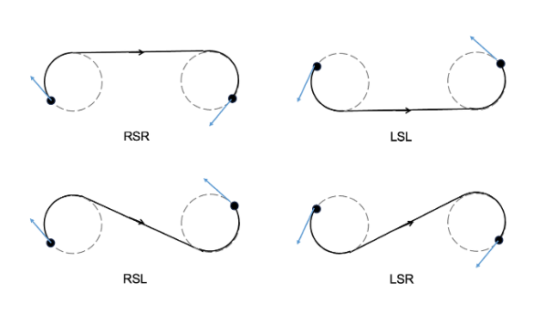

# Tank 이동 방식
- Tank의 위치와 목표지점 좌표는 주어졌다고 가정했을 때 Tank가 목표지점까지 어떻게 이동하는게 좋을까?
## 방식1. spin 후 직진
- 가장 간단, 경로 그리기도 쉽고 Tank 제어도 매우 쉬움
	- spin하다가 heading 방향과 경로 방향이 align됐을 때 쭉 직진하면 끝
### 단점
- 즉각적인 이동이 불가
- 전장에서 빨리 이동해야하는 상황인데 천천히 spin하고 있다면 비합리적인 행동이 될 것임
- spin 시간이 오래걸린다는 것도 단점
## 방식2. Dubins + sweep table
- Dubins 알고리즘으로 경로 생성 후 sweep table로 경로 따라가기
- 목표점이 뒤에 있더라도 일단 앞으로 움직이면서 목표로 이동하게끔 하자
### Dubins??

```
1. 앞으로만 움직인다  
2. 순간적으로 방향을 확 꺾을 수 없다  
3. 최소 회전반경 R_min이 있다
```
- 위 제약을 지키면서 시작점 - 목표점까지의 최단 경로를 찾는 알고리즘

### 간단 알고리즘 파이프라인
```
1. 시작 pose와 목표 pose를 받음  
2. 최소 회전반경 R_min을 정함  
3. 가능한 경로 패턴 4개를 계산함  
LSL, RSR, LSR, RSL  (L은 좌회전, S는 직진, R은 우회전)
4. 각 경로의 총 길이를 계산함  
5. 가장 짧은 family를 선택함  
6. 선택된 경로를 waypoint들로 샘플링함  
7. tank controller가 waypoint를 따라감
```
**family 종류**

```python
L1 = t × R_min       # 첫 L arc 길이 (m)
L2 = p × R_min       # 직선 길이 (m)
L3 = q × R_min       # 끝 R arc 길이 (m)
total = L1 + L2 + L3
```
- t,q,p 값은 시작, 끝점이 주어지면 각 family 별로 단 1개의 해가 존재하게 됨(즉 고정 상수값)
- R_min은 차량(tank)가 따라갈 수 있는 가장 작은 회전 반경
	- R_min 이 작을수록 → 급회전 허용, 더 짧은 path → 추종 어려움

### 경로가 주어지면 그 이후 과정

- Pure pursuit + sweep table 로 경로를 따라가게끔 설정
- 위 조합으로 경로를 잘 따라가는게 확인되어 closed-loop 나 MLP는 사용 X

1. **lookahead** — path 따라 현재 위치에서 L_d=2.5m 앞 점 = target
2. **error 계산** — `v_err = v_cruise − v_long`, `heading_err = bearing(target) − tank_yaw`
3. **target 동역학** — `a_target = K_v × v_err`, `yaw_rate = K_w × heading_err` (P gain)
4. **sweep inverse** — (v_long, pitch, roll, a_target) → throttle / (v_long, pitch, roll, yaw_rate) → steer
5. traj.is_done(목표 도달) -> brake(arrival_threshold = 0.5m)
- 2.5m 앞 목표 점이 주어지면 그 목표로 가기 위한 sweep table 역산
- 목표 0.5m 이내 도달 시 종료 
#### sweep table 관련 Report
[sweep table report](https://github.com/dwhaha6/Graphics_Study_Genesis_Ai/blob/main/2026_0218_sweep_feedback_approach.md)

## 방식2. 결과

https://github.com/user-attachments/assets/79a38f0a-f47b-4b57-8c8a-f188bb705677

https://github.com/user-attachments/assets/fe440245-ec3a-4ed3-982e-904bf161f892

https://github.com/user-attachments/assets/b4802cdc-69db-4efe-80ce-e4ec404406e9

### 해결 못 한 문제점(실제 map 적용)

https://github.com/user-attachments/assets/4b79effa-0997-42a3-9a41-4949e4c0e4de

- 실제 map에는 다양한 obstacle이 존재
- 이 obstacle을 고려하면서 합리적인 경로를 만들어줄 방안 구색중
	- spin 후 직진을 하더라도 obstacle에 대한 처리는 필요
