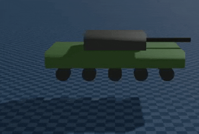
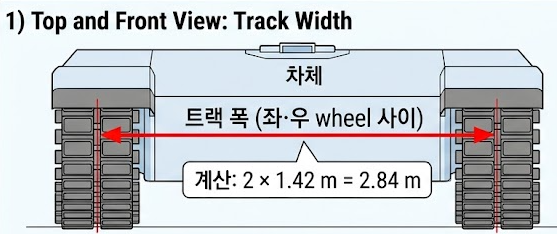
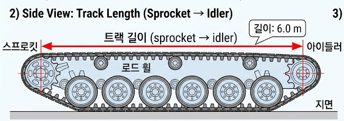
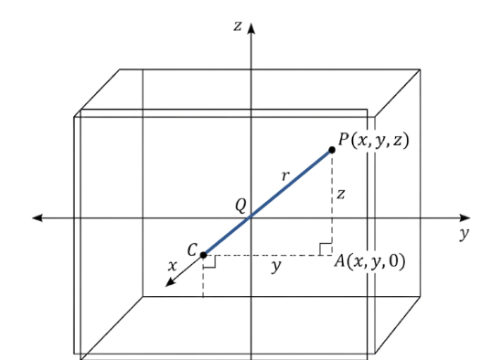
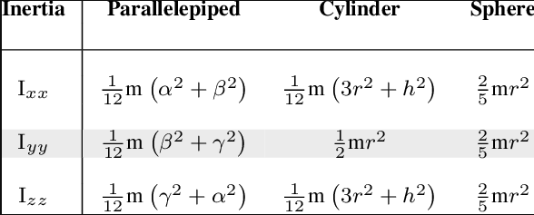

- 본래는 파제카 모델 수식과 SDK 정리 보고서였으나 상당 부분을 이전 보고서 내용에서 다루어서 Tank 튜닝 과정을 주 내용으로 이번 보고서를 작성하였습니다.
---

## A1. tank_ray.urdf 구조

### 1. URDF 구조 변경 (collision, prismatic suspension)
#### 1-1. 차체(chassis)만 collision 유지, Wheel은 collision 제거
```xml
<!-- 차체 link -->
<collision>
  <geometry>...</geometry>
</collision>

<!-- wheel link: collision 태그 없음 -->
<visual>
  <geometry><cylinder radius="0.4" length="0.64"/></geometry>
</visual>
```
- wheel - 지면 접촉을 ray cast로 대체했기 때문
	- wheel마다 아래로 ray를 쏴서 지면까지의 거리를 측정, 거리에서 suspension force `N`을 직접 계산
- mesh 면의 접촉을 계산하는 것보다 위 연산이 훨씬 연산 비용이 저렴

#### 1-2. 모든 wheel은 prismatic joint를 가짐 
#### joint 종류

| 종류           | 자유도    | 설명               | 예시                 |
| ------------ | ------ | ---------------- | ------------------ |
| `fixed`      | 0      | 완전 고정            | 차체 위에 박힌 안테나       |
| `revolute`   | 1 (회전) | 회전 1축, 각도 제한 있음  | 도어 hinge           |
| `continuous` | 1 (회전) | 회전 1축, 각도 제한 없음  | 자동차 바퀴 굴림          |
| `prismatic`  | 1 (직선) | 직선 슬라이딩 1축       | 피스톤, 슬라이딩 도어       |
| `floating`   | 6      | 자유 (3 위치 + 3 회전) | 차체 root (월드에 free) |
- prismatic이 하는 역할: ray cast로 측정한 wheel 압축량(compression)에 따라 wheel이 시각적으로 자연스럽게 위 아래로 움직이는 효과 부여
	- prismatic joint의 운동이 차체 dynamics에 직접 영향을 주는 건 아님



### 2. 차량 구조 및 DoF
#### 탱크 부품 구성
|그룹|link 이름|개수|
|---|---|---|
|차체|`base_link`|1|
|Wheel|`l_sprocket`, `l_road1`, `l_road2`, `l_road3`, `l_idler` (좌측 5)  <br>`r_sprocket`, `r_road1`, `r_road2`, `r_road3`, `r_idler` (우측 5)|10|
|Turret|`turret_link`|1|
|Barrel|`barrel_link`|1|
|**합계**||**13**|
- **sprocket** (구동륜): 엔진 토크 받는 큰 톱니바퀴, 한쪽 끝
- **idler** (유동륜): 반대쪽 끝, 트랙 텐션 잡아주는 wheel
- **road wheel** (도로륜): 가운데 작은 wheel 들. 차체 무게 지탱
- 즉 실제로는 구동륜이 실질적인 동력을 공급하는 구조이지만 현재 코드에선 무한 궤도 구현이 너무 비싸 모든 wheel이 동일 실린더로 구현됨, 도메인 knowledge 상 명칭만 다르게 붙인 것

#### Track 폭, 가로 길이




- 트랙 폭 (좌·우 wheel 사이) = 2 × 1.42 = **2.84 m**
- 트랙 길이 (sprocket → idler) = **6.0 m** -> chain을 쭉 풀었을 때 길이 아님
- wheel 반경 = **0.4 m**

#### DOF 정리

| 항목                        | 자유도    | 비고                  |
| ------------------------- | ------ | ------------------- |
| 차체 강체 자유도                 | 6      | 3 위치 + 3 자세         |
| Suspension prismatic × 10 | 10     | z 축 슬라이딩 (시각 효과)    |
| Turret yaw joint          | 1      | z 축 회전(continuous)  |
| Barrel pitch joint        | 1      | y 축 회전(-17° ~ +17°) |
| **합계**                    | **18** |                     |

---

## A2. Tank 물리 파라미터(현재 환경에 맞게 튜닝 후 최종 결정된 값들)
### 1. 차체(chasis)- mass, inertia

**코드**
```xml
<link name="base_link">
  <inertial>
    <origin xyz="0 0 0.7" rpy="0 0 0"/>
    <mass value="50000.0"/>
    <inertia ixx="60000.0" iyy="264000.0" izz="316000.0"
             ixy="0" ixz="0" iyz="0"/>
  </inertial>
  ...
</link>
```
#### 각 값의 의미

| 파라미터           | 값                 | 의미                                                                |
| -------------- | ----------------- | ----------------------------------------------------------------- |
| `mass`         | **50,000 kg**     | chassis 의 질량. forward 가속 / brake 감속에 직접 영향: `a = F / m`.          |
| `ixx`          | **60,000 kg·m²**  | x 축 회전 관성 (roll). 차량의 좌·우 흔들림 저항.                                 |
| `iyy`          | **264,000 kg·m²** | y 축 회전 관성 (pitch). 가속·brake 시 앞·뒤 쏠림 저항.                          |
| `izz`          | **316,000 kg·m²** | **z 축 회전 관성 (yaw)**. spin / cornering 응답 결정 — 작을수록 빨리 회전, 클수록 느림. |
| `<origin xyz>` | `(0, 0, 0.7)`     | 질량중심 위치. ground 에서 z=0.7m 위 (트랙 중심).                              |
- 질량 50000kg이 적절한가?
	- 실제 탱크 질량 (T-72: 41t / M1A2: 62t)을 감안했을 때 적정 수준의 질량
- 각 intertia 값이 적절한가?(너무 큰거 아닌가?)
### 2. 직육면체 기준 회전 관성 공식
```
I = m(a²+b²)/12
```
- 물체가 어떤 축을 기준으로 회전할 때, 그 축에서 멀리 떨어진 질량일수록 회전시키기 어렵다
	 = 관성이 크다 = 물체가 자신의 현재 상태를 유지하려는 힘이 크다
- m = mass
### 수식 유도1(ixx 예시)
```
1. F = ma, 회전 운동에서의 회전 가속도는 a = rα(r은 물체가 회전 중심에서 떨어진 거리)
2. 회전에서의 힘의 효과 -> τ = rF(거리 x 힘)
3. 즉 τ = (mr²)α = Iα(회전 관성 × 각가속도), 
4. I = mr²
5. r² = y² + z² 인데 여기서 각 점들의 y², z² 값의 평균은 적분으로 구해야 함(직육면체는 무한한 작은 점들로 이루어져 있기 때문)
```
- 위 수식 유도 중 참고
- rF = 물체에 가한 회전시키는 효과(토크 값)
- Ia = 그 결과 물체가 실제로 회전 가속되는 정도(그 토크가 만드는 회전 운동량)
- 원래는 Στ = Iα 이기에 수식이 더 복잡하지만 토크가 1개 뿐인 간단한 예시로 설명
#### r² = y² + z²인 이유 


### 수식 유도 2

$$\overline{y^2}= \frac{1}{W}\int_{-W/2}^{W/2} y^2 \, dy$$

- 길이가 W이고 중점이 0인 선분의 양 끝점은 W/2 , -W/2

$$  
\boxed{  
\overline{y^2} = \frac{W^2}{12}  
}  
$$

- 즉 z도 마찬가지로 구해지니 `I = m(a²+b²)/12`의 형태가 되는 것
**a,b에 들어가는 값들**
```
length = x 방향 길이  
width = y 방향 길이  
height = z 방향 길이
```
```
ixx = m(width² + height²) / 12  
iyy = m(length² + height²) / 12  
izz = m(length² + width²) / 12
```
- 수식을 개념적으로 이해해본다면 ixx는 x축 기준 회전(roll)에 대한 관성, 즉 length(x방향 길이)는 ixx 값에 영향을 주지 않음을 알 수 있음

|회전축|식|이론값|URDF 값|비율|
|---|---|---|---|---|
|**ixx** (roll)|m(W² + H²)/12 = 50000·(9+4)/12|**54,167**|60,000|×1.1 (≈ 이론)|
|**iyy** (pitch)|m(L² + H²)/12 = 50000·(36+4)/12|**166,667**|264,000|×1.6|
|**izz** (yaw)|m(L² + W²)/12 = 50000·(36+9)/12|**187,500**|316,000|×1.7|



- 직육면체 이외의 다른 물체에 대한 관성 수식들(물체 모양에 따라 관성 수식은 달라짐)

## A3. Wheel 관성 및 마찰 계수

### 1. Wheel 회전 관성
```
Δω = (T_drive − T_brake_eff − T_friction) · dt / i_wheel
```
- 이전 보고서에 있던 공식 중 i_wheel에 해당하는 내용
	- i_wheel이 **SDK preset default값으로 1.5 kg·m²** 로 명시되어 있음
- Tank의 무한궤도를 고려하면 너무 낮은 값 -> 이전에 썼던 진동 문제의 원인이었을 수 있음(바퀴 각속도 변화량이 너무 커짐)
- 현재 setting은 **`i_wheel = 100 kg·m²`** 으로 되어 있음 -> Tank 무한궤도에 적절한 관성값
### 2. 종방향 마찰계수(mu_long)
- Wheel의 forward 방향 마찰
- SDK에서 0.9로 세팅 -> 따로 수정할 필요 없다고 판단

### 3. 횡방향 마찰계수(mu_lat)
| `mu_lat`          | 정지 spin omega_z | 360° 회전 시간 | felt                             |
| ----------------- | --------------- | ---------- | -------------------------------- |
| 0.63 (SDK preset) | 0.033 rad/s     | **190초**   | spin lock — 거의 회전X               |
| 0.27 (v3.1 정지값)   | 1.5+ rad/s      | **4초**     | 너무 빠름                            |
| **0.5 (우리 값)**    | **0.066 rad/s** | **95초**    | viewer 적정 — slow but stable spin |
- Tank 제자리 spin을 여러 값으로 실험해본 결과 현재 세팅에서 횡방향 마찰은 0.5로 결정
	- Tank spin이 지나치게 느려도 안 되지만 너무 RC카처럼 빨라도 안 됨

https://github.com/user-attachments/assets/368305ab-6713-423f-9f5b-01382c5eb8f8

https://github.com/user-attachments/assets/e8c844da-14db-4897-bda9-9d8cf1746dea

## A3. 각속도 최대값, Brake 토크 최대값

### 1. 각속도 최대값
| 차량 preset                      | `omega_max_drive` | top speed                         |
| ------------------------------ | ----------------- | --------------------------------- |
| `tank_10w_skid_belt` (default) | 100 rad/s         | 100 × 0.4 = 40 m/s ≈ **144 km/h** |
| Car preset                     | 50-80 rad/s       | 20-32 m/s                         |
- 현재 Tank 각속도에 의하면 최고 속력이 144km/h가 나옴
	- 실제 Tank로도 비현실적, 전장에선 더더욱 나오기 힘든 속도
**현재 세팅**
```
v_max = omega_max_drive · wheel_radius = 10.4 × 0.4 = 4.17 m/s = 15 km/h
```
- Real Tank는 시속 60이상 달릴 수 있으나 전장 simulation Tank를 설계중이므로 최고 속력을 15km/h로 제한
### 2. t_brake_max
- 이 값은 기존 30000(wheel당 3000)이었으나 위에서 수정한 세팅에서 Brake test를 해보니 Tank가 정지하지 못 함
	- 값을 30000 -> 200000 으로 수정

| 파라미터              | preset | 우리 값        | 단위          | 의미                                     |
| ----------------- | ------ | ----------- | ----------- | -------------------------------------- |
| `omega_max_drive` | 100    | **10.4**    | rad/s       | wheel ω cap → cruise top speed 15 km/h |
| `t_brake_max`     | 30,000 | **200,000** | N·m (total) | per-wheel 20k                          |
**Brake 검증**

https://github.com/user-attachments/assets/e56a7124-c252-41b9-bb1d-cbfaec69bd0a

## A4. StaticFrictionLock
- v_thr 이하의 속력에서 brake 중일 때 작동하는 chassis hold 보조 메커니즘
- 50톤 tank 는 mass가 크고 wheel friction 도 강해 일부 파라미터를 다시 세팅

**v_thr**

| 단계         | 값           | 의미                                         |
| ---------- | ----------- | ------------------------------------------ |
| SDK preset | 0.5 m/s     | 거의 멈춘 후에야 잡음 (보수적)                         |
| **우리**     | **5.0 m/s** | Brake 걸린 직후부터 미리 활성. brake 시 chassis 빨리 잡힘 |
- 정지 마찰인 동시에 brake를 보조하는 항으로써 이용중
**K_spring**

|단계|값|의미|
|---|---|---|
|SDK preset|500,000 N/m|5톤 차량 기준|
|**우리**|**1,000,000 N/m**|50톤 chassis 에 비례 → 강하게|
**K_damp**

|단계|값|의미|
|---|---|---|
|SDK preset|20,000 N·s/m|5톤 차량 기준|
|**우리**|**200,000 N·s/m**|50톤 + K_spring 키운 비율|
