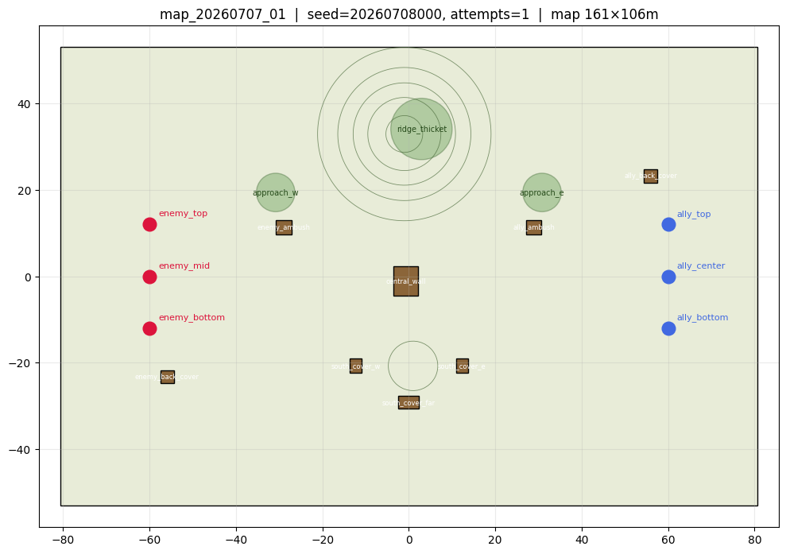
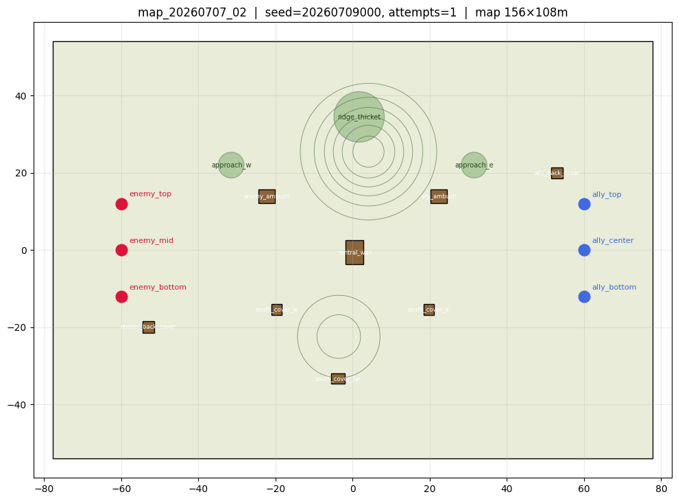
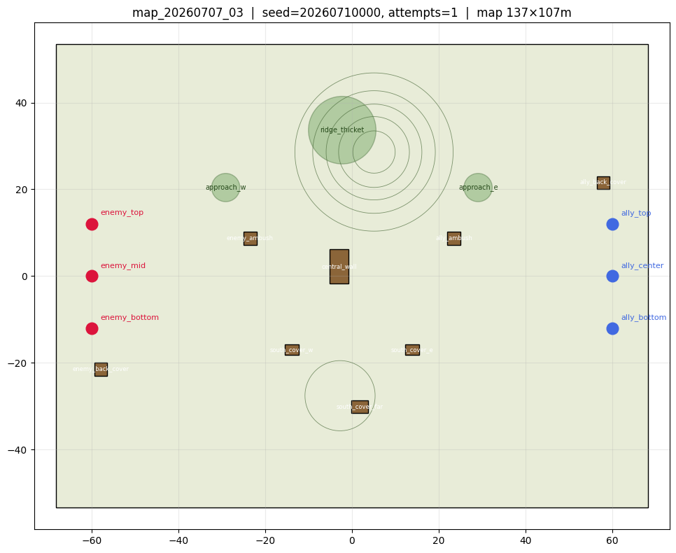
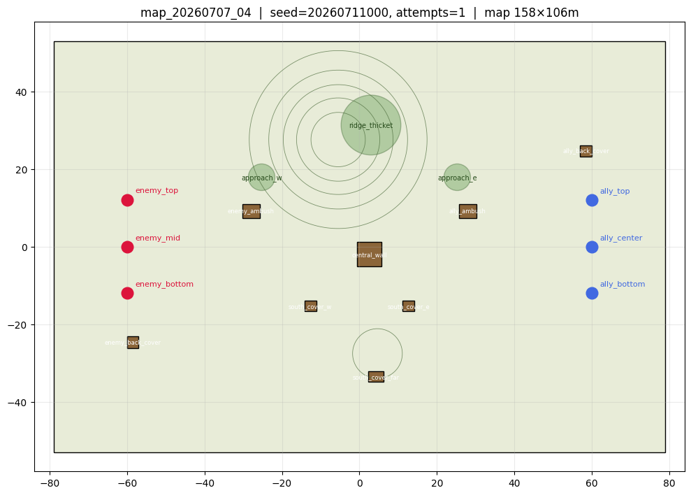
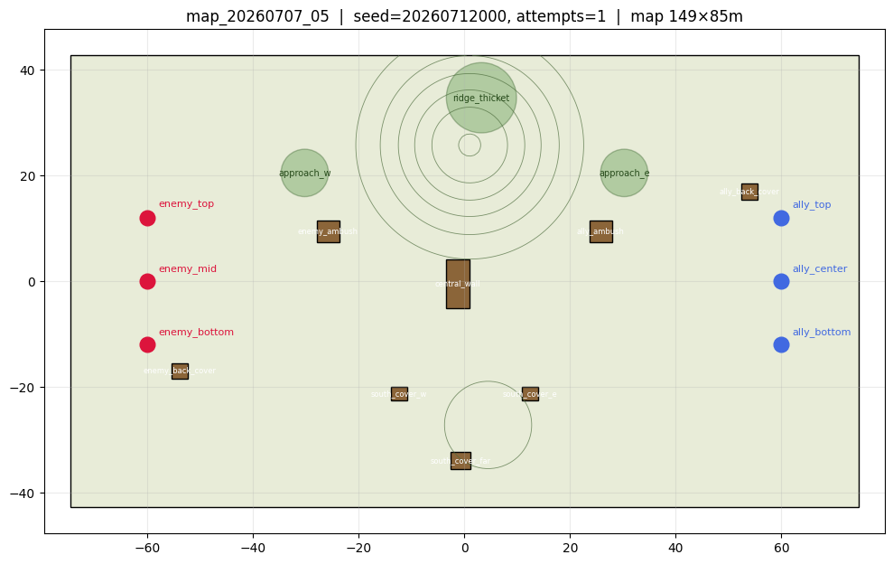
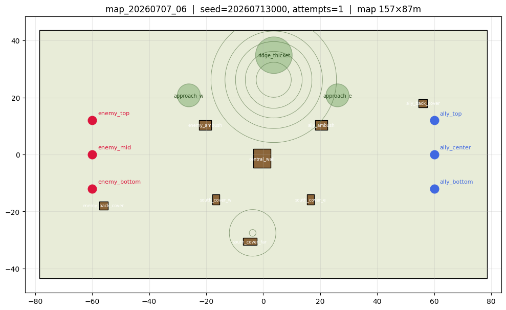
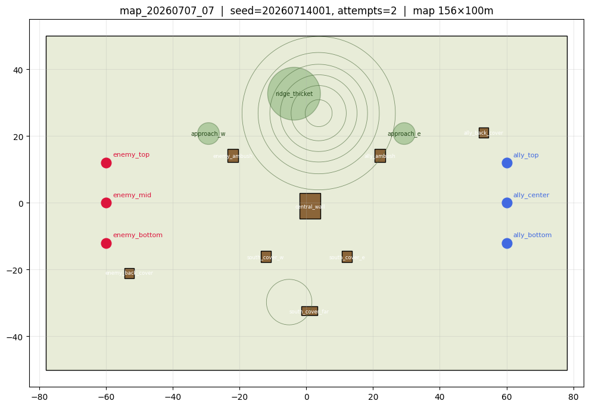
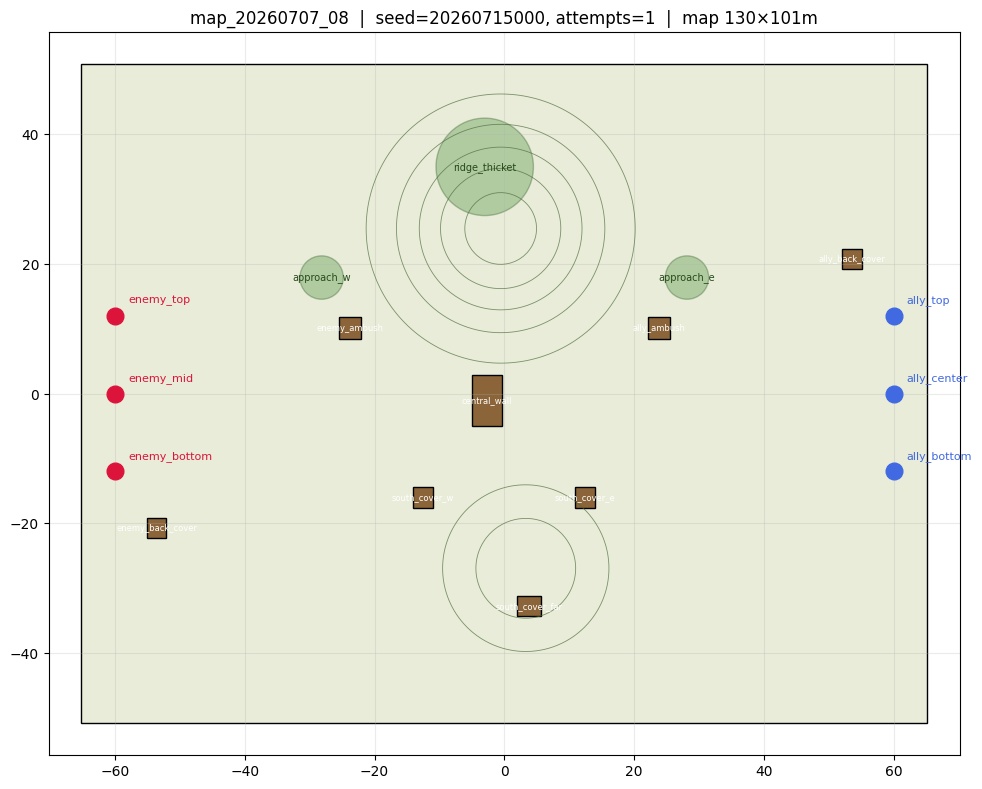
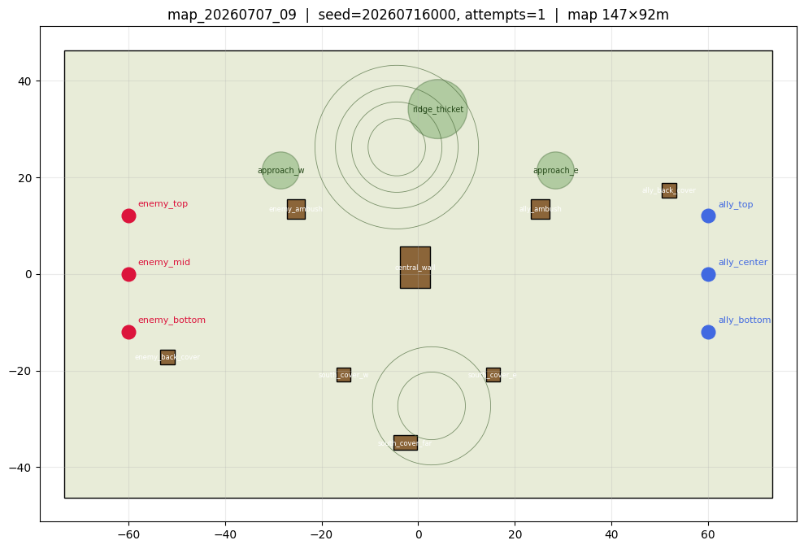

# 3v3 탱크 전투 강화학습 파이프라인


## 전체 흐름

```

1) 기준 맵 (map1) 을 jitter → 총 10개 map 확보


2) Rule bot 제작 → 3 vs 3 랜덤 파라미터 모델 대결 → 육안 검증


3) 위 rule bot 을 지도학습 (BC) 으로 흉내 → policy 가 어느 정도 똑똑해진 상태


4) 강화학습 phase 1: 고정 rule bot 3 vs 학습 policy 3 (한쪽만 gradient)

       ↓

   전투 구도 기울면 그 policy 를 v1 로 고정

       ↓

   phase 2: v1 vs 새 학습 policy → v2 → v3 → ...

       ↓

5) 매 전투 random map + n_envs 500 ~ 1000 병렬

```
## 1. 후진 이동 방식

https://github.com/user-attachments/assets/01a0b087-1cd4-47b1-a51e-ed61111c94e3

- Tank의 최초 heading 방향과 목표 경로 방향의 각도 차이가 15도 이상 나면 위와 같은 후진 후 전진 방식으로 이동

## 2. 다양한 map 생성

- 기존 map에서 약간의 variation을 주어 총 10개의 map 생성
	- 통로 넓이 (map 크기)
	- 중앙 벽 뒤 사각지대 크기
	- 언덕 기울기
	- Bush 커버리지 범위
	- 등등

|  |  |  |
|:---:|:---:|:---:|
| map_20260707_01 | map_20260707_02 | map_20260707_03 |
|  |  |  |
| map_20260707_04 | map_20260707_05 | map_20260707_06 |
|  |  |  |
| map_20260707_07 | map_20260707_08 | map_20260707_09 |
- 비슷하지만 위 요소들에 조금씩 변화를 준 map들

## Rule bot 설계 및 검증

```python
if 죽음:
    move_dest = None
elif HP < 30:
    move_dest = own_spawn                    # 후퇴
elif 현재 post 까지 거리 < 6m:                 # 도착 판정
    if 시야 에 적 없음 and 마지막 관측 후 5초+:
        post_idx += 1                        # 순회 (다음 post)
        move_dest = 새 post
    else:
        move_dest = None                     # 자리 잡고 대기 (hold)
else:
    move_dest = 현재 post

```
**Post 리스트** (map1 기준, tank 역할 별):

|Tank|Role|Primary → Alt → Alt|
|---|---|---|
|Ally 0|center|(8, 3) → (0, 30) → (0, -20)|
|Ally 1|top|(28, 18) → (0, 30) → (5, 5)|
|Ally 2|bottom|(22, -13) → (0, -25) → (5, -5)|

| 항목  | 규칙                                                                     |
| --- | ---------------------------------------------------------------------- |
| 이동  | 자기 primary post → 도착 하면 hold → 시야 없으면 5초 뒤 다음 post 순회. HP 낮으면 spawn 후퇴 |
| 조준  | 가장 가까운 visible + LOS clear + 아군 안 겹침 적. 매 tick 재선택                     |
| 발사  | Reload 완료 + aim_target 있음 → 발사. 실제 명중 은 turret 각도 (±5°) 에 의존           |

즉 **"자기 자리 가서 대기, 조건 맞는 가장 가까운 적을 쏘기"** 의 반복.

#### Rule bot vs Random Bot(Random bot은 랜덤 파라미터 모델을 재현하기 위한 bot -> 랜덤하게 행동함)


https://github.com/user-attachments/assets/efccd56c-76ab-45fd-9522-9f0b00aaba09

#### 10판 매치 결과

| 지표 | 값 |
|---|---|
| Rule 승률 | 100% |
| Rule hit rate | 35% |
| Random hit rate | 12% |
| 평균 경기 시간 | 60s (T_MAX 도달) |
- rule bot 성능 검증

### 실제 학습

### obs

| # | 부분 | 필드 | dim | 설명 |
|---|---|---|---|---|
| 1 | Own | pos_x, pos_y | 2 | 자기 위치 (map 좌표 / half-size 로 normalize, [-1, 1]) |
| 2 | Own | chassis_yaw (sin, cos) | 2 | 차체 yaw 를 sin/cos 로 인코딩 |
| 3 | Own | v_long, v_lat | 2 | 종/횡 속도 (m/s / V_MAX) |
| 4 | Own | turret_yaw_local (sin, cos) | 2 | 포탑 yaw (chassis 기준) sin/cos |
| 5 | Own | hp_ratio | 1 | HP / 100 (0~1) |
| 6 | Own | reload_ratio | 1 | reload_remaining / 5.0 (0~1) |
| 7 | Own | in_bush | 1 | 지금 bush 안 (0/1) |
| 8 | Own | arrived | 1 | env.arrived (도착 상태 0/1) |
| 9 | Ally × 2 | rel_pos_x, rel_pos_y | 2 × 2 | 아군 상대 위치 (norm) |
| 10 | Ally × 2 | hp_ratio | 1 × 2 | 아군 HP |
| 11 | Ally × 2 | rel_yaw (sin, cos) | 2 × 2 | 아군 yaw 상대 |
| 12 | Ally × 2 | alive | 1 × 2 | 아군 생존 0/1 |
| 13 | Enemy × 3 | visible | 1 × 3 | 보이는가 (alive AND !camo) |
| 14 | Enemy × 3 | rel_pos_x, rel_pos_y | 2 × 3 | 상대 위치 (invisible 이면 0) |
| 15 | Enemy × 3 | hp_ratio | 1 × 3 | HP (invisible 이면 0) |
| 16 | Enemy × 3 | rel_yaw (sin, cos) | 2 × 3 | 상대 yaw (invisible 이면 0) |
| 17 | Enemy × 3 | alive | 1 × 3 | 생존 0/1 |
| 18 | Obstacles × 5 | rel_pos_x, rel_pos_y | 2 × 5 | 가까운 obstacle top-5 상대 위치 |
| 19 | Obstacles × 5 | size_x, size_y | 2 × 5 | 각 크기 (norm) |
| 20 | Bushes × 3 | rel_pos_x, rel_pos_y | 2 × 3 | 가까운 bush top-3 상대 위치 |
| 21 | Bushes × 3 | radius | 1 × 3 | 반경 (norm) |
| 22 | Terrain | pitch | 1 | 자기 pos 에서 pitch (rad) |
| 23 | Terrain | roll | 1 | roll (rad) |
| 24 | Boundary | dist +x | 1 | 오른쪽 경계 까지 (norm) |
| 25 | Boundary | dist -x | 1 | 왼쪽 경계 까지 |
| 26 | Boundary | dist +y | 1 | 위쪽 경계 까지 |
| 27 | Boundary | dist -y | 1 | 아래쪽 경계 까지 |
| 28 | Events | was_hit_last_step | 1 | 지난 tick 자기 hp 감소 (0/1) |
| 29 | Events | did_hit_last_step | 1 | 지난 tick 적 hp 감소 (0/1) |
| 30 | Role | role_center, role_top, role_bottom | 3 | one-hot (spawn y 기반) |
| 31 | Post | post_idx_norm | 1 | 현재 post 순회 idx / 2 (0/0.5/1) |
| 32 | Time | t_since_enemy_seen | 1 | (sim_t - last_seen) / 5.0 clip [0, 1] |


- 한쪽 team은 rule bot(학습X)
- 반대쪽 team은 역할별 MLP를 부여하여 학습
- 현재 학습 진행중
