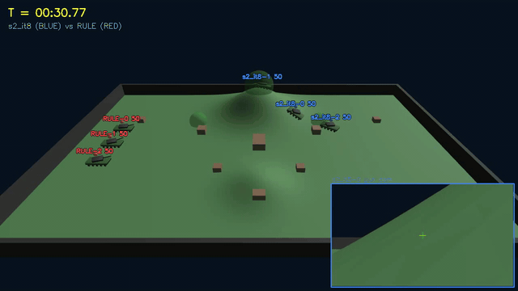
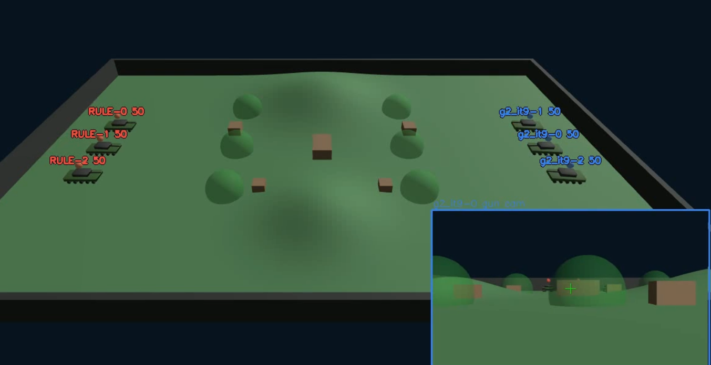

# 1. map 변경
- Tank 개수보다 bush 개수가 적은데 bush 자체에 reward를 주다보니 bush를 차지하기 위해 아군 tank끼리 서로를 미는 상황이 발생
#### 문제 장면

#### 수정한 map

- bush 개수를 각 진영 탱크 개수에 맞게 배치

# 2. reward 일부 변경

| 분류                     | 항목              | 상수값        | 적용               | 실효(×0.05) | 비고                      |
| ---------------------- | --------------- | ---------- | ---------------- | --------- | ----------------------- |
| **매치결과**(종료 1회)        | WIN_BONUS       | **+100**   | 승리 시             | +5.0      | 승패=생존수 우선, 동수면 HP합      |
|                        | LOSE_PENALTY    | **−100**   | 패배 시             | −5.0      | 매치보상을 "이겼나"가 지배         |
| **전투**(dense)          | KILL_BONUS      | +25        | 적 격파당(팀 전원)      | +1.25     | focus fire 유도           |
|                        | NUM_ADV_BONUS   | +15        | Δ(아군생존−적생존)      | +0.75     | 수적우위 변화, 승리 직결 proxy    |
|                        | DAMAGE_SCALE    | +0.05      | 딜한 피해량           | ×0.0025   | 딜 farming 축소, 명중 nudge만 |
|                        | DEATH_PENALTY   | −10        | 자기 죽음            | −0.5      | 무모한 자폭 억제 (죽음<패배)       |
|                        | FLANK_HIT_BONUS | +2.0       | 측면/후방 명중         | +0.1      | 측면+2/후방+4               |
|                        | DMG_TAKEN_SCALE | **0.0**    | (맞은 피해)          | —         | OFF ("피해 감수하고 딜")       |
| **위치/전술**(dense nudge) | BUSH_BONUS      | +0.02/step | 부쉬 은신 중          | +0.001    | 은신 지점 선점 유도             |
|                        | COVER_BONUS     | +0.02/step | 엄폐(적 70m내 LOS차단) | +0.001    | peek 전술                 |
|                        | TIME_PENALTY    | −0.01/step | 매 스텝             | −0.0005   | 지연 억제                   |
- 위 reward에서 무승부 시 패배와 동일하게 -100으로 처리하게 끔 세팅(무승부 = 패배 이므로 bush에서 가만히 대기만 하는 일 없게 끔 한 것)

# 3. 이동 명령 방식 변경
- 기존엔 목적지 한 곳을 정하면 그 곳에 도달할 때까지 추가적인 목적지 명령 및 이동이 불가능했음
- 하지만 어떤 곳으로 가다가 전투 상황에 따라 다른 곳으로 이동해야 할 수 있음
- 따라서 총 전투 60초 기준 1초에 한 번 이동 목적지를 결정할 수 있게(즉 A 목적지로 이동 중 B 목적지로 경로를 우회하여 이동할 수 있게 세팅)

https://github.com/user-attachments/assets/f88717e6-a105-4558-ae8d-8d5c2ac39e21

# 현재 진행 상황

https://github.com/user-attachments/assets/1b712a63-0884-4514-9965-b75601da0365

- 위 방식으로 학습 중이지만 bush를 활용하지 않는 모습
- bush에 대한 reward를 강화한 후 재학습 중
