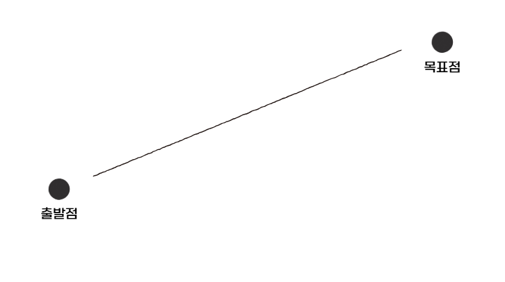
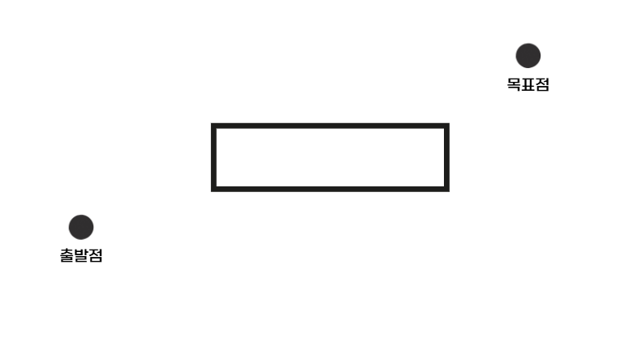
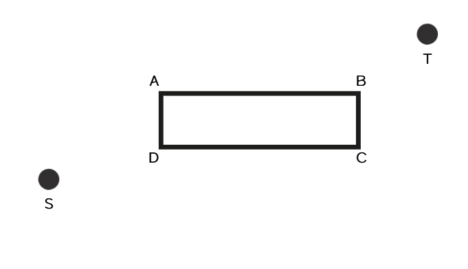
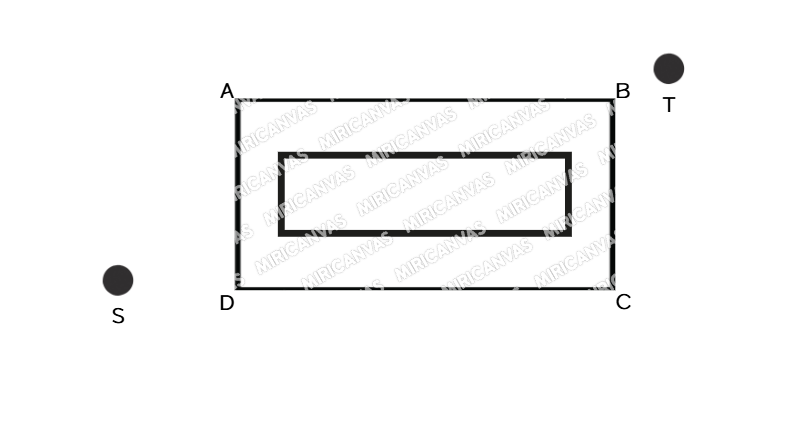
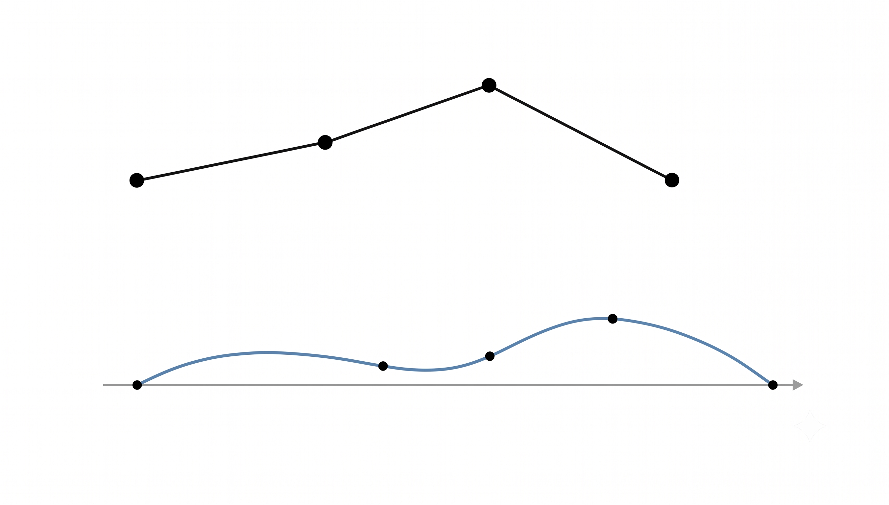

# 현재 시도 중인 경로 생성과 추종 방식

## 1. 경로 만들기 — Visibility Graph 기반 방식이란?

### 핵심 아이디어

* 기본적으로 출발과 목표점은 직선으로 잇는게 최단 경로

* 하지만 현재 map에선 중간에 이런 직사각형 장애물이 존재
* 즉 벽이 있고 그 너머로 가야 한다면, 벽 모서리 두 곳을 거쳐 가는 게 최단.

* 출발점, 도착점 및 장애물 4개의 꼭짓점을 노드로 보고 그 노드를 잇는 경로 하나하나를 엣지로 보자
* 위 사진에서 최단경로는 S-D-C-T 혹은 S-A-B-T 가 될 것임

### 여기서 Safety margin도 고려

장애물 실제 크기에 그대로 노드 박으면 tank 가 표면 긁힘. 그래서 **장애물을 사방으로 3m 부풀린 가상의 큰 직사각형** 을 만들고 그 꼭짓점을 노드로 씀.

* 이렇게 해서 tank가 벽과 어느정도 이격된 상태로 이동하게끔 만듦

* Visibilty Graph로 만든 여러 경로들 중 **최단 경로**를 찾는 방법을 A*이라고 함

## 2. Catmull-Rom Spline

* Visibility graph 결과는 꺾인 polyline:

이걸 그대로 tank 한테 주면 코너에서 무한히 작은 회전반경 요구 → 추종 실패.

* 즉 위 그림처럼 각 꼭짓점을 **반드시 통과** 하되 그 사이를 매끄러운 곡선으로 잇게끔 경로를 세팅
* 이때 곡선은 반드시 연속이며 미분가능한 spline

### Tension 파라미터

* 점 사이를 얼마나 크게 휘면서 연결할지를 정하는 파라미터, 현재 0.3으로 설정(이후 동영상에 경로 나올 예정)

### Densify

* 전체 경로 안의 점들을 얼마나 촘촘하게 배치할지
* 현재 2m -> 2m마다 점 하나를 생성

## 3. 경로는 어떻게 따라가는가?

* 이전에 보고했던 Dubins 방식 대신 Pure pursuit으로 교체
* Sweep table은 여전히 사용
* 즉 가까운 목표점이 주어지면 그 목표점을 sweep table로 따라가는 방식

## 4. Tank 가 실제로 보였던 거동 (A, B)

### Case A

https://github.com/user-attachments/assets/557dd6c7-e674-4f7a-9f5f-edd5f4431eff

### Case B

https://github.com/user-attachments/assets/08a319a4-3cc8-4379-902c-51f0528ac55a

* 2가지 경로 모두 무난하게 주행

### Case C

https://github.com/user-attachments/assets/97ed15de-3f66-4f39-bb12-6f8847088d15

* 위처럼 특이한 경우(바로 앞이 장애물 + 제자리 90도 회전을 요구) spin떄문에 경로 추종이 매우 오래 걸림
* 위 상황에서 만약 실제 tank 운전자가 있었다면 잠시 후진한 후 우회전 조향으로 경로를 주행했을 것임
* 실제 운전자가 운전하는 것과 최대한 유사하게 구현하는 것을 목표로 진행중
