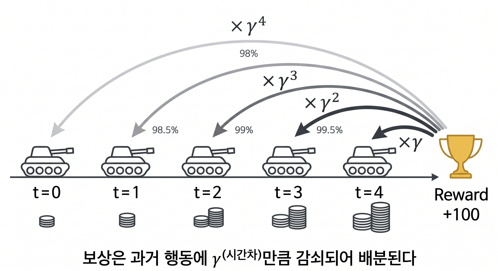
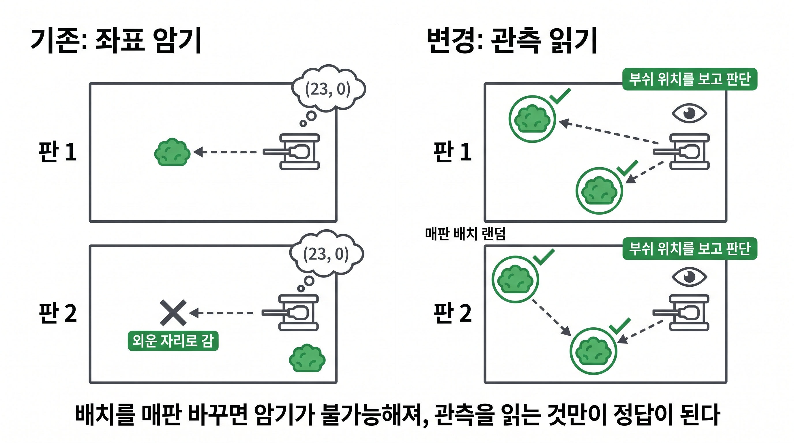

# 1. 매치 변경 사항

### 매치 길이 변경
- 기존 한 경기 60초 -> 120초로 변경
### discount factor γ 값 변경(**0.99 → 0.995**)
- discount factor란 어떤 행동을 해서 보상을 받았을 때 그 행동을 하기 이전 행동들에도 보상을 부여하는 계수 값(보상이 발생했을 때 **그 이전 행동들에 보상 지분을 시간 거리만큼 감쇠시켜 배분하는** 계수)
- 매치 길이가 120초로 늘어남에 따라 계수도 증가시켜 준 것
- 1초 뒤 보상은 γ배, 2초 뒤는 γ²배(현재 행동이 보상을 준 시점이 더 미래일 수록 보상이 줄어듦)

#### 위 설명 예시 이미지


- 만약 고지대로 이동 후 상대 팀을 저격해 보상을 얻었다면 단순 상대를 쐈다 뿐만 아니라 고지대로 이동한 전략적 행동에 대해서도 보상이 주어지는 것

# 2. 현재 reward 정리

| 분류               | 항목                      | 상수값             | 적용               | 비고                                                                                 |
| ---------------- | ----------------------- | --------------- | ---------------- | ---------------------------------------------------------------------------------- |
| **매치결과**(종료 1회)  | WIN_BONUS               | +100            | 승리 시             | 승패=생존수 우선, 동수면 HP합으로 판단                                                            |
|                  | LOSE_PENALTY            | −100            | 패배 시             | **무승부=패배 동일 처리**                                                                   |
| **전투**(dense)    | KILL_BONUS              | +25             | 적 격파당(팀 전원)      | focus fire 유도                                                                      |
|                  | NUM_ADV_BONUS           | +15             | Δ(아군생존−적생존)      | 수적우위 변화                                                                            |
|                  | DAMAGE_SCALE            | +0.05           | 딜한 피해량           | 명중시 보상                                                                             |
|                  | DEATH_PENALTY           | −10             | 자기 죽음            | 죽음 패널티(킬보다 변화량이 적기에 전진 유도 가능)                                                      |
|                  | FLANK_HIT_BONUS         | +2.0            | 측면/후방 명중         | 측면+2/후방+4                                                                          |
| **위치/전술**(dense) | **BUSH_BONUS**          | **+2.0/step**   | 부쉬 은신 중          | bush에 은신 중일 경우의 reward를 대폭 상향시킴                                                    |
|                  | **BUSH_DWELL_CAP**      | **60 (누적상한)**   | 에피소드당            | Bush에 가만히만 있으면 reward를 벌 수 있기에 이를 방지하기 위해서 BUSH BONUS에 상한을 걸어둠(승리 시 reward를 넘지 않게) |
|                  | **BUSH_APPROACH_SCALE** | **+1.0/m (신규)** | 부쉬에 가까워진 거리      | 망원급수를 이용해 부쉬로 가까워질 때만 보상이 들어가게끔 설계(구체적 설계는 아래)                                     |
|                  | COVER_BONUS             | +0.1/step       | 엄폐(적 70m내 LOS차단) | peek 전술                                                                            |
|                  | TIME_PENALTY            | −0.01/step      | 매 스텝             | 지연 억제                                                                              |

- 볼드체로 쓴 사항이 변경된 reward
- BUSH 안에 있을 시의 reward 대폭 향상
- 다만 BUSH 안에만 있고 전투를 하지 않을 수도 있기에 승리에 대한 reward보다 커지지 않게 BUSH로 얻는 reward에는 상한을 걸어둠
- BUSH로의 접근에 대한 reward도 추가
#### Bush 접근 시 reward 기여 예시
```
스텝1: d 35→30 으로 접근   보상 = 35−30 = +5
스텝2: d 30→32 로 후퇴     보상 = 30−32 = −2   ← 멀어지면 음수
스텝3: d 32→20 으로 접근   보상 = 32−20 = +12
스텝4: d 20→ 0 도착        보상 = 20−0  = +20

합계: (35−30)+(30−32)+(32−20)+(20−0)
    =  35 −30+30 −32+32 −20+20 −0
              └──┘   └──┘   └──┘     ← 중간항이 전부 짝지어 소거
    =  35 − 0 = 35

```
- 즉 bush 주변에서 왔다 갔다 거리는 것 만으로는 지속적으로 reward를 얻는 게 불가능 

# 3. BC(강화학습 전 Warm Start) 변경

- 가장 가까운 bush로 들어가서 싸우는 룰봇의 행동을 지도학습 시킨 뒤 강화학습을 진행했었음
- 이때 tank의 스폰 지점과 bush 위치가 매번 비슷하여 BC를 해도 tank가 bush로 가는 것을 학습하지 못 하고 외워둔 특정 위치로만 가는 것을 확인했었음
- 즉 지형·장애물은 그대로 두고, **매 매치마다 탱크 6대의 스폰 위치와 부쉬 6개의 위치를 무작위 재배치**하여 BC를 진행

#### 설명 예시 이미지


## 현재까지의 중간 결과(iter13, 아직 추가적인 학습 필요)

### 1. vs Rule bot A(자신의 진영에서 자리를 잡고 싸우는 룰봇)

https://github.com/user-attachments/assets/f84acc14-4f3f-495d-a6cd-ea68cd4764e0


### 2. vs Rule bot B(제자리에 가만히 서 있는 룰봇)
- 룰은 굉장히 간단하지만 측,후면을 보여주지 않고 정면으로 반격하기 때문에 가장 강한 룰봇

https://github.com/user-attachments/assets/6f3b4a88-925f-4bcd-926b-cc187f21990b

### 3. vs Rule bot C(돌진하는 룰봇)

https://github.com/user-attachments/assets/17a1260c-0a6d-48db-8711-434fa8c11a7b

- 현재 각 판 당 128판씩 매치 후 승률 측정중
