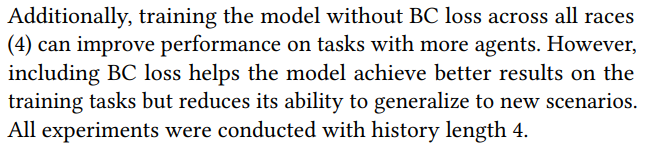
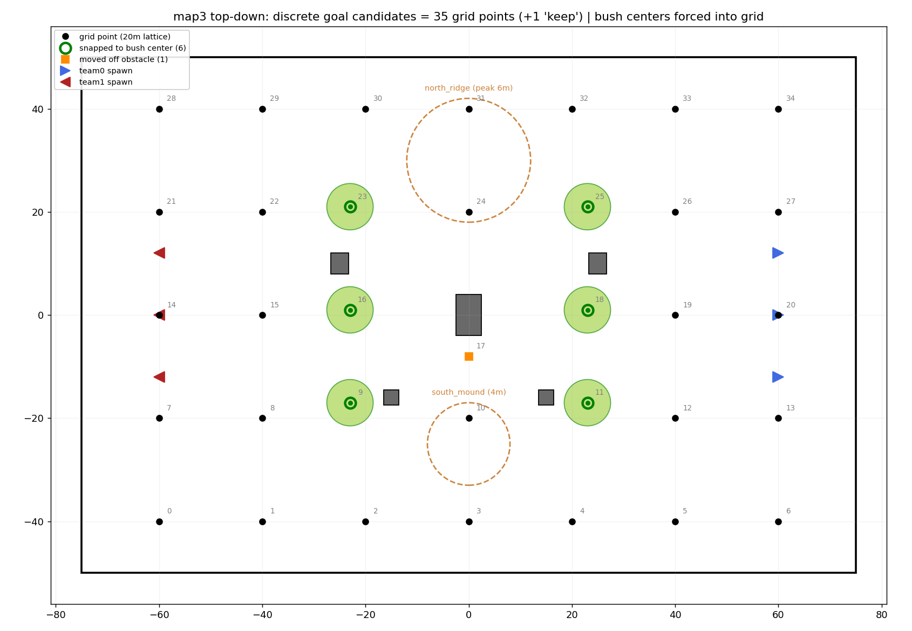

# 학습 결과
### 봇당 128판씩 심사한 iteration들의 승률표

| 전체 iter | A (전진교전) | B (고정포탑) | C (중앙돌격) | 3종 합   |
| ------- | -------- | -------- | -------- | ------ |
| 4       | 20%      | 12%      | 40%      | 72     |
| 9       | 13%      | 12%      | 38%      | 63     |
| 14      | 15%      | 21%      | 23%      | 59     |
| **19**  | **24%**  | **16%**  | **28%**  | **68** |
| 27      | 5%       | 12%      | 19%      | 36     |
- 상승하지 못 하고 오히려 승률이 하락하는 추세

### 30iteration 전투 영상

https://github.com/user-attachments/assets/d6e3c75e-5c8b-4abc-b41d-1a2a06f35503

- 30 iteration(약 45시간 소요)임에도 불구하고 룰봇에게 승리하지 못 함(2대 이상 죽는 등 압도적인 패배가 대부분)
- 각 tank들의 이동이 전략적으로 보이지 않고 노이지하게 움직이는 것이 관측됨(전술 이동 학습이 되지 않음)
# 수정하고자 하는 것

## 1. history의 개념 추가

- 현재까지는 MGPT model이 obs를 읽고 그에 따라 출력을 매 step내는 구조였음
- 그러나 이동에 대해서 고민을 해본 결과, 실제 인간은 게임을 할 때 당장 눈앞의 정보만을 이용해 판단을 내리지 않음
- 즉 과거 n step의 정보를 현재 obs와 같이 보고 판단을 내리게 하는게 합리적인 설계

- 실제 논문에도 관련 내용이 있을 것 같아 찾아보니 실제 해당 내용이 있었음
- 우선은 논문이 제시한 값에 맞추어 history = 4로 두고 진행
	- 즉 n step의 MGPT는 n-3 ~ n step까지의 obs를 입력받고 n step에서의 출력 결정을 내림

## 2. 이동 명령 주기에 대한 고찰
- 최초에는 한 목적지를 정하면 그 목적지에 도달할 때까지 절대 다음 목적지를 찍을 수 없었음
- 그러나 이렇게 하니 한 매치마다 MGPT의 목적지 출력 98%가 묵살됐었음(즉 모델이 원하는대로 자유롭게 움직이지 못 함)
#### 참고 예시 자료

https://github.com/user-attachments/assets/08a319a4-3cc8-4379-902c-51f0528ac55a

- 따라서 지난 학습까지의 구현은 매 초(40step)마다 목적지를 출력하게끔 두었었음
- 그러나 이 또한 **위 영상**처럼 노이지 한 움직임이 관측됨(매 초마다 원해서 움직인다기 보단 움직임을 뭐라도 내야 하니 억지로 여기 저기 찍으며 움직이는 느낌)
### 사람처럼 움직이게 하자

- 실제 사람이 이 tank 게임을 한다면 어떻게 어떤 요소들을 기준으로 목적지를 찍을지 고민해봄
- 사람은 임의의 **event**가 있을 때 목적지를 바꾼다는 결론에 도달
	- event는 개개인에 따라 다양할 수 있음
	- 아군 사망, 적군과 조우, 피격 등등
- 따라서 **event**를 일단 간단히 목적지 도달 혹은 피격 이 2가지로 두고 이 event가 일어날 때만 목적지를 새로 출력해내게 끔 구현
- 다만 12초동안 목적지 도착도 피격도 타격도 없는 상태에 빠진다면 그땐 목적지를 새롭게 찍을 수 있게 예외적으로 허용(dead lock 방지를 위함)

## 3. 이동 후보를 이산적으로
- 지난 학습까지는 tank가 map 어디든지 자유롭게 목적지로 찍을 수 있는 구조였음
- 이는 전략적인 자유도는 매우 높으나 그만큼 전략적 행동을 구사하는 난이도가 모델입장에선 매우 높았을 것으로 예상됨
- 즉 map을 격자화 시킨 후 각 격자점에 대해서만 이동이 가능하게 선택 가능한 목적지 후보들을 이산적으로 제한 시켜 학습 난이도를 낮추고자 함

- 삼각형은 tank
- 초록색 원은 bush
- 갈색 점 선은 고지대
- 기본적으로 grid한 구조 이지만 bush는 특별히 예외로 bush 중앙을 목적지 후보로 둠
- 즉 tank는 event 발생 시마다 위 격자점들 중 하나의 point를 선택해서 이동

## 4. BC에 대한 검토(개인적인 의심)

- 검증된 바는 아직 없으나 초기 진행하는 BC 지도학습이 MGPT의 flexibility(학습에 필요한 유연성)을 무너뜨려 오히려 학습을 방해하는게 아닐까하는 의심이 들었습니다.
- 기존엔 warm start를 목적으로 간단한 룰봇을 무조건 따라하게 만들었으나 이번 학습에선 BC 없이 진행한 모델과 BC로 start한 모델 2개로 나누어 학습해보고자 합니다.

# 수정 사항 요약

1. 이제 현재 step obs 뿐만 아니라 이전 4 step obs를 입력받음
2.  학습 난이도 완화
3. 사람이라면 어떻게 행동할까에서 출발한 idea 적용
4. BC 대조 실험(확실한 것이 아니니 허락 후 진행하겠습니다.)
