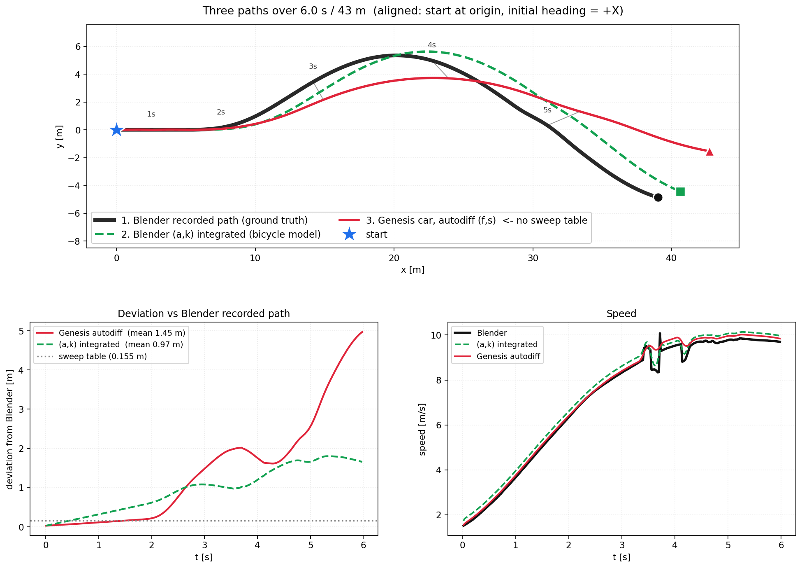
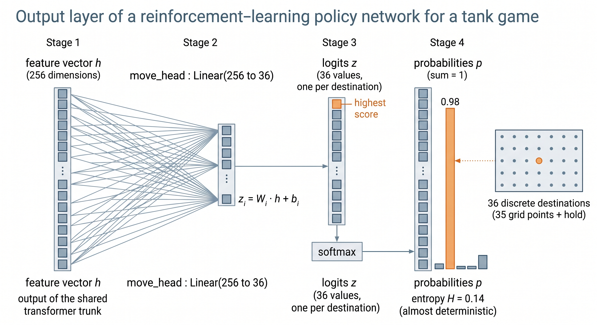
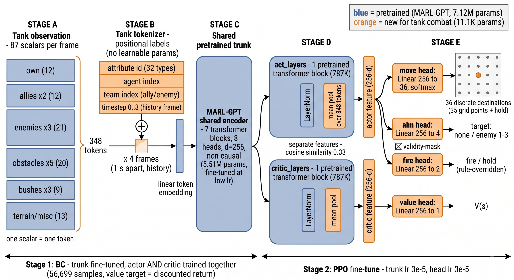

# 강체 미분 조사
### 미분으로 추종해본 블렌더 경로
- 여기서 throttle, steer로 차량을 조작하지 않고 f(뒷바퀴에 걸리는 토크), s(앞바퀴의 조향 각도)로 차량을 조작했습니다. -> Sim2Real(자율주행) 관점에서도 이게 더 적합하다고 합니다.
	- throttle에서 여러 계산을 거쳐 토크가 되고 그 토크로 뒷바퀴가 굴러가는데 이러면 미분 식이 복잡해지기 때문

 #### blender에서 측정한 a,k를 정답으로 삼아 제어를 계산한 영상

https://github.com/user-attachments/assets/9e2efbde-1ab4-420a-bc43-c332ffbfb6ea

### 3개의 경로 비교(블렌더 실제 경로, genesis 미분으로 주행한 경로, a,k값으로 추정한 경로)


- 맨 위 이미지에서 **검은 실선**이 원래 경로
- **초록색 점 선**이 정답 a,k로 그린 경로
- **빨간 실선**이 genesis에서 주행시킨 경로
- dynamic model 특성상 단순 a,k 추정 미분만으로는 경로를 완벽히 추종하기 어려움
### 현재 state에 따라 내야하는 제어를 동적으로 바꿔보자

- 전 step마다의 a,k에 따른 제어를 한번에 쭉 구하고 주행시키지 말고 상황에 따라 동적으로 대처해보는 식으로 구현
- 미분 방식은 같으나 n step 제어를 구한 뒤 n+1 step에서의 state를 읽고난 다음 n+1 번째 제어를 구하는 방식
- 이때 목표 곡률에 따라 속도 상한이 정해짐

|경로위치|곡률|속도상한|
|---|---|---|
|10.3 m|0.0974|**2.77**|
|15.0 m|0.0108|**5.85**|
|22.4 m|0.1106|**2.77**|
|37.5 m|0.0043|**7.45**|
- 즉 미리 계산된 정답 a,k를 따르지 않고 상황에 따라 step 단위로 원하는 a,k 값이 그때 그때 정해짐(Sim2Sim보단 Path2Control에 가까움)

#### 구체적인 파이프라인

```
매 프레임 t:
  ① 현재 상태 읽기      → 위치, 헤딩
  ② 경로에 투영         → ct(횡편차), d_ct(변화율), e_yaw(방향오차)
  ③ 목표 만들기         → k_cmd = k_ff − 0.1·ct − 0.05·d_ct + 0.3·e_yaw 
                          a_cmd = (v_프로파일 − v_현재) / 0.35
  ④ 오차                → e = [a_cmd − a_now,  k_cmd − k_now]
  ⑤ 야코비안            → J = ∂(a,k)/∂(f,s)   (현 작동점에서 autodiff 재계산)
  ⑥ 역산                → du = [e₀/J₀₀, e₁/J₁₁]
  ⑦ 누적                → f_cur += du_f,  s_cur += du_s
  ⑧ 물리 1스텝 전진
  ⑨ 새 (a,k) 측정 → 다음 프레임의 a_now, k_now
```
- 역산 부분에 대해 부가적인 설명을 하자면
	- 미분으로 구할 수 있는 것은 **"토크를 1 N·m 올리면 → 가속이 0.002774 늘어난다"**
	- 하지만 구해야 하는 것은 **"가속을 0.5 늘리고 싶다 → 토크를 몇 N·m 올려야 하나?"**
```
Δa = (∂a/∂f) · Δf          ← 미분이 주는 것
Δf = Δa / (∂a/∂f)          ← 우리가 필요한 것    ← 이게 역산
```
- 즉 위 나눗셈 과정을 수행해주는 게 역산

### 결과

https://github.com/user-attachments/assets/0d867621-c21a-4b9b-8d94-f5516977c6c6

- 상황에 따라 동적으로 움직이기에 곡률이 높은 구간은 천천히 움직이는 모습
- 아직 외란이나 고속주행은 시험해보지 않음
- 참고로 해당 주행은 파제카 모델이 아닌 기존 genesis 물리 기반 주행

### sweep table(+PD 제어)과 비교

https://github.com/user-attachments/assets/68b2e42d-3996-498b-b8e7-eae596bab1f3

|방식|평균 이탈|주행 시간|
|---|---|---|
|sweep table|**0.110 m**|**6.02 s**|
|미분|0.165 m|10.06 s

- 정량적, 정성적 평균 이탈 오차에서는 sweep table이 앞서는 모습(약 0.5m)
- sweep table의 주행 시간 6.02s는 blender 차량의 주행 시간을 따른 것
- 위 미분 방식은 blender 데이터 없이 path만 따라가게 끔 두었음
- sweep table은 Sim2Sim 미분 방식은 Path2Control에 가깝다고 볼 수 있음
#### 장단 비교
- 경로 오차는 sweep table이 근소 우위이지만 sweep은 미리 정해진 경로에 대해서만 강건함
- 경로가 동적으로 바뀐다면 미분 방식이 유리할 것으로 예상됨(아직 시도해보진 X)
- 대량의 고정된 경로에 대해 정확한 추종을 원한다면 sweep table
- 적당한 양의 variable한 경로에 대해 적당한 추종을 원한다면 미분 방식이 나을 것으로 보임
# 강화학습 현황

### iter 9 전투 영상

https://github.com/user-attachments/assets/be86053b-37dc-4c4d-aaaf-89b7cb10c325

### iter 9 기준
| iter | A (전진교전) | B (고정포탑) | C (중앙돌격) | 3종 합 |
| ---- | -------- | -------- | -------- | ---- |
| 9    | 22%      | 12%      | 37%      | 71   |

### 지난 학습 승률

| 전체 iter | A (전진교전) | B (고정포탑) | C (중앙돌격) | 3종 합   |
| ------- | -------- | -------- | -------- | ------ |
| 4       | 20%      | 12%      | 40%      | 72     |
| 9       | 13%      | 12%      | 38%      | 63     |
| 14      | 15%      | 21%      | 23%      | 59     |
| **19**  | **24%**  | **16%**  | **28%**  | **68** |
| 27      | 5%       | 12%      | 19%      | 36     |
- 지난 학습보단 낫지만 여전히 세 룰봇에게 50% 이상 승률이 나오지 않음
### 학습시키며 발견한 문제점

## 1. Spin 후 이동 방식의 문제

https://github.com/user-attachments/assets/ce50a54c-732e-45a1-bd61-cae19d6a0c2a

- 위 영상처럼 앞에는 엄폐물이 옆에는 동료 Tank가 있어 벽에 낀 채로 움직이지 못 하는 문제가 있었음(Spin 불가)
- 따라서 **2.5초동안 목적지에 도달 하지 못 함** and **이동X**인 경우 1.5초동안 후진 후 재이동하도록 설정(1번째 mp4는 이 문제는 해결한 뒤의 영상이므로 후진하는 것을 볼 수 있음)
## 2. Move 엔트로피 붕괴 문제
- 여기서 붕괴는 엔트로피가 0에 가까운 값이 되어 모델이 더이상 새로운 행동을 내지 않는 상태를 의미
- 위 영상들에서도 볼 수 있듯이 각 tank 이동 목적지가 거의 똑같음
### 2-1. 엔트로피 정의(move 기준)
#### 이동을 담당하는 move head에서 벌어지는 일


- MGPT 본체(head = 8인 인코더)에서 256차원의 정보를 주면 이를 36차원으로 줄인 뒤 softmax를 계산(구체적인 식은 아래에)

**z값 계산(기존 MLP 컨벤션과 동일)**

$$z_i = \mathbf{W}_i \cdot \mathbf{h} + b_i = \sum_{k=1}^{256} W_{ik} h_k + b_i$$

**확률 변환 (softmax)**

$$p_i = \frac{e^{z_i}}{\sum_{j=1}^{36} e^{z_j}}$$

**엔트로피**

$$H = -\sum_{i=1}^{36} p_i \log p_i$$

 
- 모델이 어떤 선택을 함에 있어서 그 확률 분포가 얼마나 퍼져 있는지(유동적인지)를 나타낸 값
	- 엔트로피가 작을 수록 행동의 다양성이 적어짐
- move 엔트로피의 경우 만약 H=0이라면 하나의 격자로만 가는 것
### 2-2. 왜 붕괴했는가
1. BC 단계에서 Actor는 지도학습에 따라 학습되는 반면 Critic은 랜덤 파라미터로 남음
	- 학습 시작시 Learning Rate이 올라갈 수밖에 없음
2. 논문 구조와 다르게 Actor, Critic 각각을 인코더가 아닌 리니어 구조로 대체했었음
	- 여기서 문제가 발생 Actor, Critic은 단순 리니어 구조라 낼 수 있는 출력이 제한적임 즉 backpropagation에 따라 인코더 몸체 파라미터가 바뀌게 됨
	- 그러나 Critic이 원하는 출력을 내기 위해선 Critic만 바뀌어야 하는데 그게 아니라 내부 인코더를 건드리게 되고 결국 행동 분포에도 영향을 끼친 것(인코더의 출력이 단순화 = Actor의 입력도 단순화 -> 행동 분포가 단순하게 될 수 밖에 없었던 것)

### 2-3. 해결책(논문의 구조와 똑같이 변경)


- 기존 MGPT 구조


- 논문과 동일하게 Actor, Critic을 인코더로 바꾸고 마지막에 차원만 줄여주는 리니어 구조를 붙임
- Actor, Critic 자체적으로 낼 수 있는 출력이 다양해지므로 위 문제 방지 가능
- 구조를 바꾼 후 다시 학습 진행중
