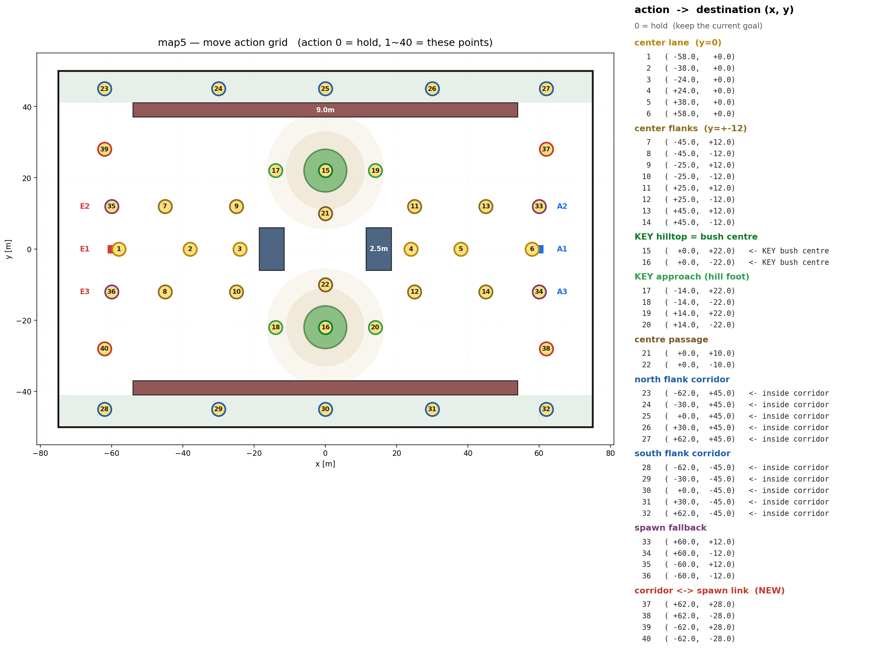

# PPO 강화학습
- 계속해서 승률이 나오지 않고 룰봇에게 패배하여 논문(학습 방식에 대해)을 재검토 함
- 지금까지 수행한 학습 방식은 BC(warm start) -> PPO 였음
- 논문에서는 BC(지도학습)와 강화학습을 섞어서 학습시키다가 마지막에 PPO(다양한 상황에 일반화된 성능을 위함)를 함
- 논문 구조대로 이 또한 바꿔볼 예정

### 논문 근거

- BC에 대한 loss(지도학습)와 actor loss(강화학습 loss)를 결합해서 학습
- 이때 지도학습의 역전파(파라미터 업데이트) 비중을 10배 더 크게 잡았다고 함
	- 동일하게 진행할 예정
# 룰 설계
- 위 구조를 따라가기 위해선 다양한 상황에 강건하고 똑똑한 지도학습의 정답으로 삼을 만한 룰봇이 있어야 함
- 따라서 map 구조를 전략적 요소가 많게 바꾸고(bush 점령 행동을 유도하자는 취지에서 간단하게 설계했던 이전 map을 버림) 룰을 새로 짰음
### map 구조
### 룰 설계

|state|판정 조건|
|---|---|
|**home**|적 홈존 격자 6곳 중 한 곳에서 10m 이내, **또는** 중앙 지대지만 표준 화점 4곳(부쉬 N/S·중앙 2곳) 어디서도 타격 불가한 벽 그림자 위치|
|**mid** (PUSH)|home도 side도 아닌 전부 — 중앙 지대의 타격 가능 위치|
|**side** (FLANK)|\|y\| > 40 (우회 통로)|
- 강건한 룰 설계를 위해서 적의 state를 위 3가지로 분류
	- 스폰 지점, 측면 우회 경로, 중앙 길목 이 3가지 중 어디로 가냐에 따라 state가 바뀜

- 적 tank 3대가 위 3개 state 중 하나를 취할 때 각 경우의 수에 대해 룰을 나누었음

### 페이즈 1

- 처음 전투 시작 직후엔 적 행동이 전부 HOME일테니 이때는 무조건 정해진 위치로 각 Tank가 이동하게 됨

| 역할                      | 목적지                 |
| ----------------------- | ------------------- |
| `BUSH_N` (스폰 y 가장 큰 탱크) | 북 KEY 부쉬 (0, +22)   |
| `MID` (가운데)             | 자기 자신 spawn지점 (6,0) |
| `BUSH_S` (y 가장 작은 탱크)   | 남 KEY 부쉬 (0, −22)   |
- 위 아래 Tank는 본인에게 가까운 bush로 이동, 중앙 Tank는 제제리에서 대기
- 1 페이즈에선 무조건 이 행동을 취함
- 이때 Mid는 제자리에서 대기 중인 tank, BUSH_N/S(north,south)는 각 부쉬에 숨어있는 tank를 의미
### 페이즈 2

- 페이즈 1 이후 상대 행동에 따라 어떻게 행동할 지가 결정됨

|번호|내용|
|---|---|
|**행동 1**|중앙 교전: 가운데(MID) 탱크가 적 무리 20m 앞까지 전진해 교전, 부쉬 2대는 은폐 사격 (못 쏘면 쏠 수 있는 자리로 이동). 중앙 적을 다 잡을 때까지 유지|
|**행동 2**|측면 우회: 가운데 탱크가 우회 통로로 적 스폰 측면 타격, 부쉬 2대는 은폐한 채 침묵 → 우회 탱크가 적측에 진입/개전하는 순간 일제 사격|
|**행동 3**|수비 대기: 가운데 탱크는 중앙 엄폐물 앞에서 위협 방향으로 몸만 돌리며 경계, 부쉬 2대는 부쉬 지키며 교전|

**선택 규칙 (한 줄 요약)**: 중앙 적이 1대라도 있으면 무조건 행동 1 → 없으면 스폰캠핑 적 ≥ 우회 적일 때 행동 2 → 우회 적이 더 많으면 행동 3.

### 상대가 취할 수 있는 행동 표(20가지 경우의 수)

|스폰캠핑|중앙|우회|아군 행동|
|---|---|---|---|
|3|0|0|행동 2|
|0|3|0|행동 1|
|0|0|3|행동 3|
|2|1|0|행동 1|
|1|2|0|행동 1|
|0|2|1|행동 1|
|0|1|2|행동 1|
|1|1|1|행동 1|
|2|0|1|행동 2|
|1|0|2|행동 3|
|2|0|0|행동 2|
|0|2|0|행동 1|
|0|0|2|행동 3|
|1|1|0|행동 1|
|0|1|1|행동 1|
|1|0|1|행동 2 (동률이면 캠핑 우선)|
|1|0|0|행동 2|
|0|1|0|행동 1|
|0|0|1|행동 3|
- 상대 tank 3대가 어떤 행동을 취하느냐에 따라 이 경우의 수중 하나로 분리하고 그에 맞는 행동을 수행

### 룰봇 전투 영상
- 지난 PPO 학습에서 가장 강력했던 제자리 대기 룰봇과 대결

https://github.com/user-attachments/assets/03493051-0af7-4b9c-a98f-fd8f76ec4f84

- 전략이 다양해짐에 따라 전투 길이도 180초로 늘림
- 상대가 제자리에서 대기하자 1대는 우회 통로로 돌아서 상대의 측면을 타격
- 나머지 2대는 bush에서 사격하지 않고 대기하다가 1대가 습격하는 동시에 같이 사격(먼저 사격하면 위치가 노출되므로 3 vs 2의 불리한 전투를 하게 됨)
- 이 룰봇이 임의로 설계한 룰봇 모두를 이기게 하기 위해 조금씩 계속해서 수정중
