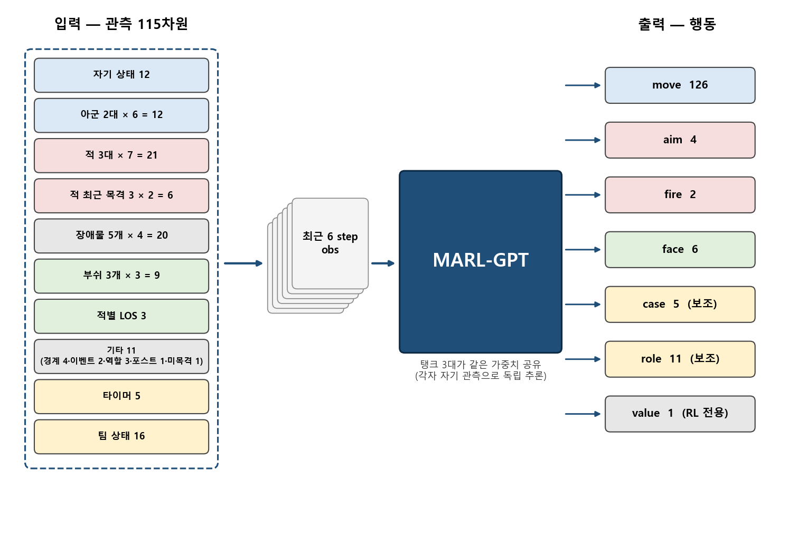
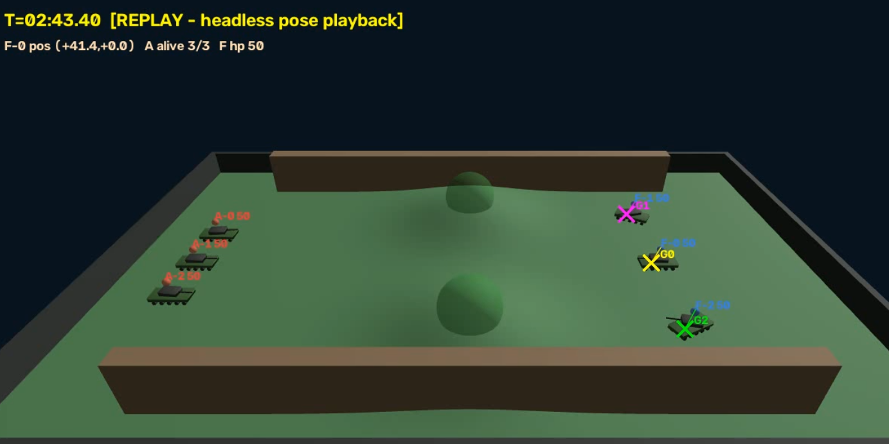
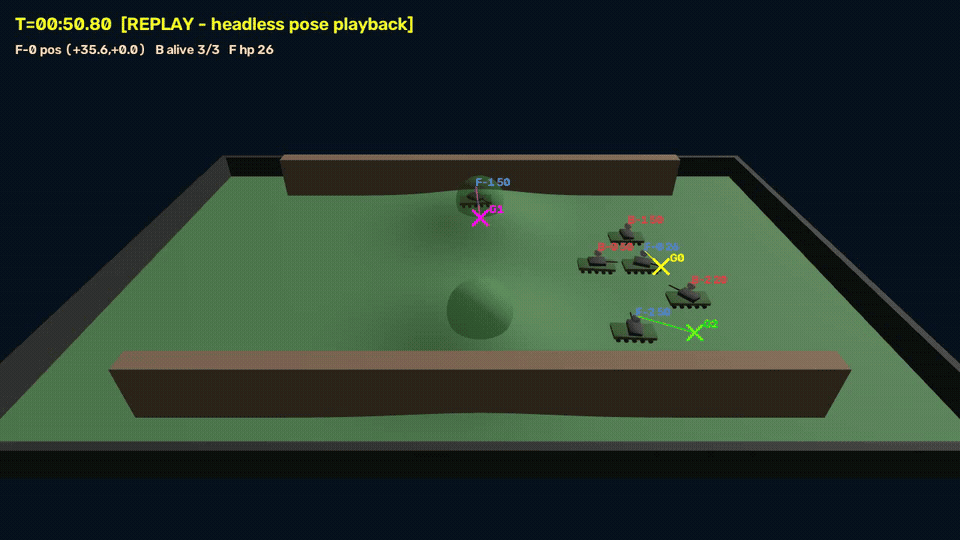
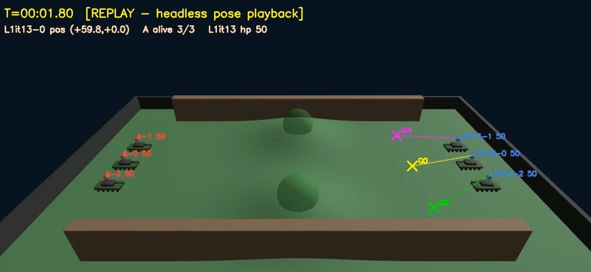
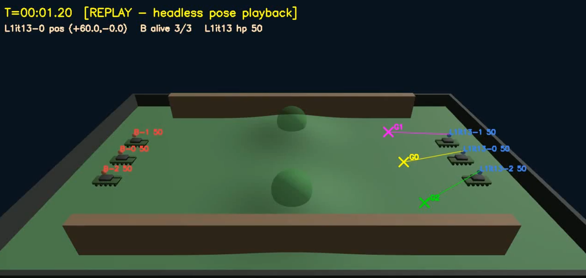
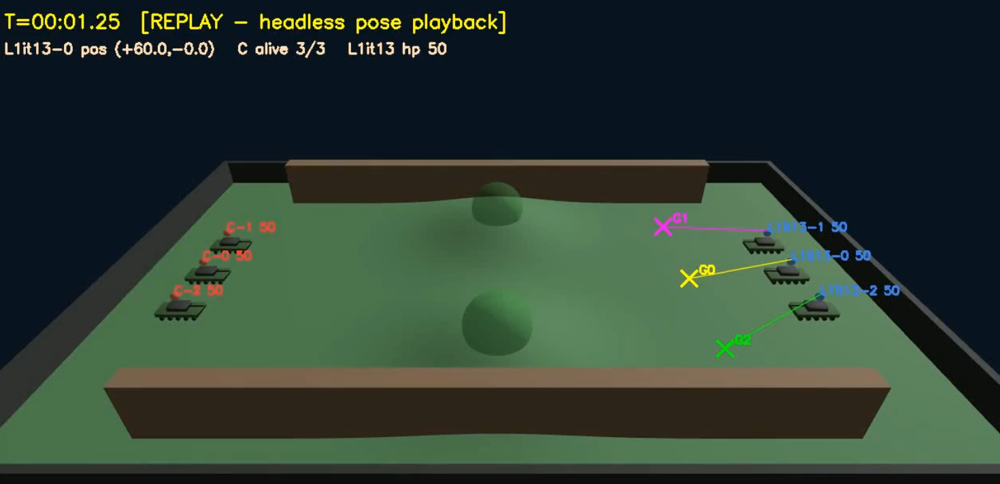
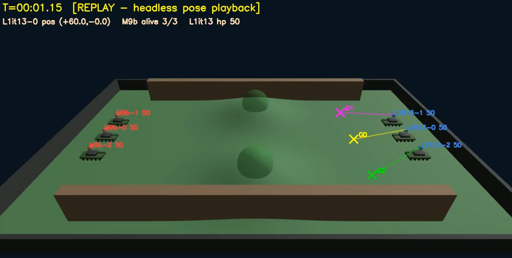

## 1. 전문가 룰봇(F) 구축 후 결과

| 항목          | 수치                                                   |
| ----------- | ---------------------------------------------------- |
| 상대          | 룰봇 44종                                               |
| 최종 승률 (v16) | 동쪽 진형 **44/44**, 서쪽 진형 **44/44** (100%)              |

- 모든 나머지 룰봇과 1판씩 대결한 결과 승률 100% 달성 완료

### model의 obs 추가(93 -> 115)



#### 기타 11 설명

- **경계 4**: 내 위치에서 맵의 동·서·남·북 벽까지 거리 4개 (가장자리에 몰렸는지를 판단)
- **이벤트 2**: 타격 / 피격 2가지 이벤트에 대한 
- **역할 3**: 내 스폰 배역 중앙/북/남 스폰 탱크 중 어느 것인지 (고정값)
- **포스트 1**: 진형 자리 번호 — 아군 진영 자리 3곳 중 몇 번째에 배정됐는지
- **미목격 1**: 마지막으로 적을 본 뒤 흐른 시간
## obs 변경 정리

### 타이머 추가

| 채널       | 정의                             | 정규화 | 0으로 리셋되는 때      |
| -------- | ------------------------------ | --- | --------------- |
| t_move   | 마지막 "새 이동 명령" 후 경과 초           | ÷30 | 이동 명령을 낼 때      |
| t_arrive | 목적지 도착 후 경과 초                  | ÷30 | 이동 중이거나 미도착이면 0 |
| t1_still | 조준 표적이 연속 정지(1초당 1 m 미만 이동)한 초 | ÷10 | 표적 없음·표적 교체 시   |
| t_aim    | 현재 조준 표적을 유지한 초                | ÷15 | 표적 교체 시         |
| t_ep     | 에피소드 경과 초                      | ÷60 | 판 시작            |
- 전문가가 이동 명령을 낸 후 목적지에 tank가 도달하기 전까지는 이동에 관해 추가적인 명령이 없음 -> 이를 이동 명령 극히 일부, 정지 명령이 대다수라고 모델이 잘못 오해하여 BC 승률이 44전 1승 43패로 무너졌었음
#### 2분 43초째 가만히만 있는 모델


- 따라서 위 obs 채널 추가(특정 event 발생 후 몇 초 경과했는지를 obs에 추가)하여 위 문제를 해결
- 가만히 정지해 있는 상태와 이동 중인 상태를 구분짓게 한 효과 

### case와 role
- case는 이 상황에서 전문가 rule bot이 어떻게 움직였을지를 의미
- role은 어떤 case 안에서 특정 1대의 tank가 어떻게 움직였을지를 의미
- 이 2개를 모델이 추론하게 함으로써 꼭 전문가 행동이 아니더라도 모델 자체가 어떤 룰(case 가짓수, role 가짓수에 따라 룰이 더 복잡해질 수 있음) 아래에서 동작
- 즉 팀 단위로 개별 tank가 역할을 나누어 행동하게 하는 효과과
### 관측에 적 tank에 대한 LOS 3개 추가
- LOS가 안 되는데 쏘거나 LOS가 되는데 안 쏘는 현상이 자주 발생
- 원래는 학습으로 배우게 하려 했으나 task 난이도 완화를 위해 obs로 LOS를 제공
	- 간접적으로 위 문제 해결(쏘거나 쏘지 않는 판단은 결국 모델이 함)
## 2. 시연 데이터 수집 → 모방학습(BC): 20.5%

| 항목           | 수치                                                     |
| ------------ | ------------------------------------------------------ |
| 수집 데이터 (v18) | 3,168 에피소드 / 390,607 샘플, 동·서 각 6라운드 × 88 env, F 승률 97% |
| BC 모델 M7     | 룰봇 44종 상대 **9/44 (20.5%)**                             |
- 위 obs 업데이트에도 불구하고 BC 결과는 위와 같이 전문가에 한참 미치지 못 했음
	- 물론 룰봇 상대 승률이 절대적인 평가 지표는 아니지만 어느정도 성능이 검증된 모델들이 없는 상황에서 1차적인 검증 지표가 될 수 있음
### M7 전투 영상(B 룰봇에게 패배)



## 3. DAgger 교정: 64.2%
### DAgger 설명

1. **모델이 직접 조종**해서 게임을 진행한다 (모델이 실제로 가게 되는 상태를 만들기 위해).
2. 매 틱, 같은 상태를 **그림자 전문가 F 에게 보여주고 "너라면 뭘 하겠나"를 라벨**로 기록한다 (F 는 관전만 하고 조종하지 않음).
3. 이렇게 모은 "모델이 저지른 상태 + 전문가 정답"을 원래 시연 데이터에 합쳐 재학습한다.

### DAgger 라벨 예시

```
 t(초)  내위치(x,y)    HP  적LOS | F의 정답: move→목적지   aim fire face   case     
   1   (+60.0, +0.0)  100   111 |  120→(+40,+0)          적1   0   없음   P1       
   3   (+57.8, +0.1)  100   111 |  120→(+40,+0)          적2   0   없음   P1       
  12   (+41.4, +0.0)  100   111 |  120→(+40,+0)          적2   0   없음   P1       
  18   (+41.4, +0.0)  100   111 |  120→(+40,+0)          적2   0   없음   ASSAULT  
  21   (+41.4, +0.0)  100   111 |    2→(-38,+0)          적2   0   없음   ASSAULT  
  24   (+41.4, +0.0)  100   011 |    2→(-38,+0)          적2   0   없음   ASSAULT  
  27   (+41.4, +0.1)  100   011 |    0→정지/유지          적2   0   적2    ASSAULT  
  30   (+43.7, +5.5)  100   011 |    0→정지/유지          적2   0   적2    ASSAULT  
  33   (+46.3,+10.9)  100   011 |    0→정지/유지          적2   0   적2    ASSAULT  
  36   (+48.8,+16.3)  100   011 |    0→정지/유지          적2   0   적2    ASSAULT  
  42   (+50.5,+20.2)  100   011 |    0→정지/유지          적2   0   적2    ASSAULT  
  48   (+46.1,+12.5)  100   011 |    0→정지/유지          적2   0   적2    ASSAULT  
  51   (+43.5, +7.1)  100   011 |    0→정지/유지          적2   0   적2    ASSAULT  
```
- 왼쪽은 현재 model tank의 state, 오른쪽은 그 state에서의 전문가 봇의 행동

| 항목              | 수치                                                        |
| --------------- | --------------------------------------------------------- |
| DAgger 1라운드 수집  | 176판 (모델 M7 조종, 승률 22% — 의도된 이탈 상태), 99,692 샘플            |
| 재학습 M9b         | 4시드 176판 **113승 (64.2%)** — BC 대비 3배                      |
- M7 모델에 DAgger를 붙인 후 재학습시키자 승률이 대폭 상승했음

## 4. 온라인 PPO

| start    | iter 수 | 구성                     | best iter    |
| -------- | ------ | ---------------------- | ------------ |
| M7       | **20** | 워밍업 3 + PPO 17         | it07 (14/44) |
| M9b      | **16** | 워밍업 3 + PPO 13         | it05 (30/44) |
| M11-it05 | **15** | 워밍업 3 + PPO 12, 교착 페널티 | it04 (26/44) |
| M9b      | **20** | 워밍업 2 + PPO 18         | it13 (31/44) |
| L1-it13  | 20     | 워밍업 2 + PPO 18         | —            |
- 워밍업은 BC 후 PPO를 돌린다거나 reward 수정 후 PPO를 새로 돌릴 때 critic을 그대로 쓰게 되면 critic이 제 역할을 못 해낼 수 있음(좋은 행동을 나쁘다고, 나쁜 행동을 좋다고 잘못 판정하는 등)
- 따라서 actor는 frozen 시켜두고 critic만 첫 3iter동안 파라미터를 업데이트, critic loss가 3iter 후 안정되면 본 학습 진행
- 기존 best model은 M9b였으나 M9b를 start한 PPO best model인 L1이 현재의 best model
	- M과 L의 차이는 M은 룰봇만 상대로 학습을 진행한 모델, L은 룰봇 60% + 풀의 모델들 40%(풀에 들어가는 기준은 정해진 룰이 없으나 이전 best model, 현재 best model을 특정 조건에서 이기는 model 정도로 잡고 학습을 진행 중)
	- 배울 게 없는 model(압도적으로 start model에 패배하는 model)은 풀에 넣지 X

## Best model 전투 영상(룰봇 상대 승률은 70.5%)

| vs A (정면 러시) | vs B (고정 수비) | vs C (우회 협공) | vs M9b (직전 최강 모델) |
|:---------------:|:---------------:|:---------------:|:----------------------:|
| <a href="https://github.com/user-attachments/assets/e495c3fa-2f8b-45a4-a7eb-e218139886ed"></a><br>───────<br>L1-it13 **승**<br>종료 176 s<br>생존 1/3 | <a href="https://github.com/user-attachments/assets/a97c8178-37cd-43f5-9ade-1060902f378b"></a><br>───────<br>L1-it13 **승**<br>종료 77 s<br>생존 2/3 | <a href="https://github.com/user-attachments/assets/c323b326-e328-4536-86e3-f879e959dfa7"></a><br>───────<br>L1-it13 **승**<br>종료 157 s<br>생존 3/3 | <a href="https://github.com/user-attachments/assets/b3b98a43-11ad-4a4c-bea0-4f09129b6975"></a><br>───────<br>L1-it13 **승**<br>종료 94 s<br>생존 2/3 (HP 62) |
| 3대 동시 정면 돌격 | 자리 고정·포탑만 회전 | 중앙 1 + 남북 우회 2 | 88판 통계 60:28 (68%) |
