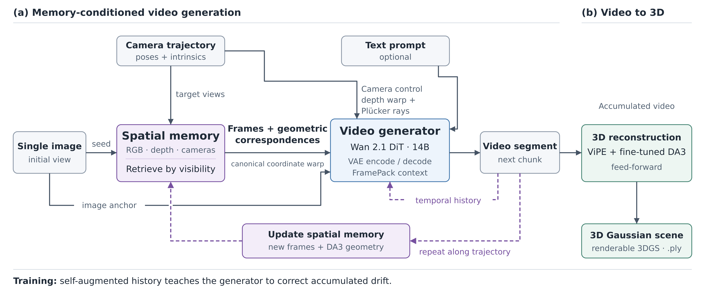
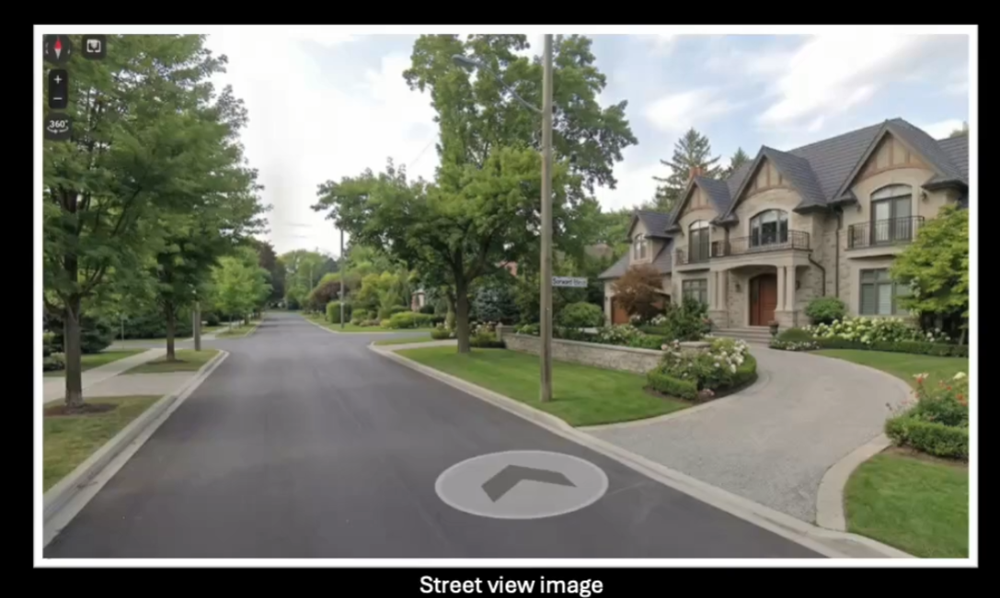
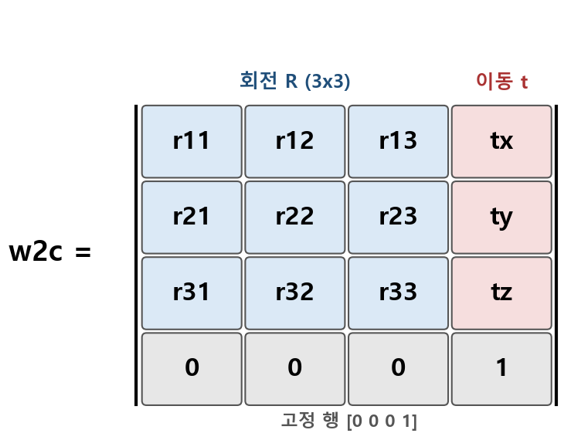
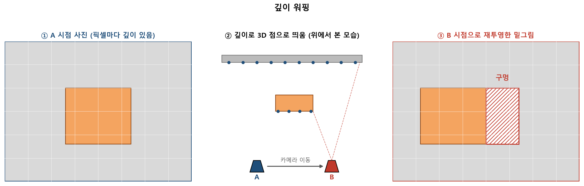
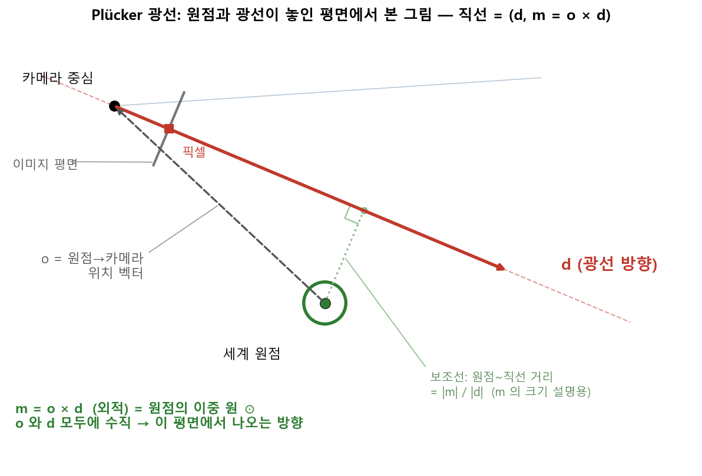

- 아래에서 설명할 coordinate은 RHS, up -y, forward +z입니다
	- OpenCV 카메라 규약
# Lyra 아키텍쳐
 
 
# 1. 입력 

## 1-1. Image

- input image
- DA3(Depth Anything 3): 사진 1장(혹은 그 이상)을 넣으면 각 픽셀의 depth + 카메라 렌즈값(내부 파라미터)을 함께 추정해주는 기하추정모델
	- Lyra는 DA3를 사용하여 사진에서 픽셀마다의 depth를 추정
## 1-2. 카메라가 움직일 경로

- 카메라 외부 파라미터(rotation, translation) 정보를 담은 w2c matrix
	- 카메라가 월드 어디에 있는가는 c2w matrix(별도 저장하지 않고 위 행렬 저장 후 역행렬을 취해줌)
- 1번째 input image가 곧 coordinate의 원점, +z 방향(forward)
	- 그 후 카메라가 움직일 경로에 대한 이미지들은 프롬프트에 따라 모델이 생성
- 공간 메모리라고 하는 곳에 (RGB, 깊이, 위치·자세) 형태로 지금까지 생성한 프레임들이 쌓여있게 됨, 이 공간메모리에서 새 카메라가 보려는 방향을 가장 넓게 담은 프레임 순으로 최대 5장을 참고하여 새로운 프레임을 생성
	- 이로 인해 이미 생성한 map의 일부와 모순되지 않게 map을 생성해 나감

## 1-3. 프롬프트(선택)

- input으로 넣은 이미지에 드러나지 않는 안 보이는 곳에 대한 묘사 프롬프트
- 모델이 공간 메모리에서 가져오지 못 하는 정보는 프롬프트 및 사진 지식을 기반으로 map을 생성

### 장면 생성에 들어가는 추가적인 장치

#### 3D homography

- 어떤 프레임 하나를 생성할 때 공간 메모리에서 고른 최대 5장 프레임의 픽셀들을 3D점으로 띄우고 각 픽셀들을 새 카메라 위치, 자세로 좌표 변환 -> 기존에 보여진 정보들은 보존
#### 광선 정보

- d는 카메라 원점에서 픽셀 방향으로의 벡터(카메라의 자세)
- o는 월드 원점에서 카메라 원점으로의 벡터
- m은 두 벡터를 cross product한 벡터(카메라의 위치가 녹아 있음)
- 즉 모든 픽셀을 어떻게 그릴지는 몰라도, 그려야 할 각 픽셀의 시선(픽셀 -> camera)이 월드 어디를 지나는지는 확정이 되고 그 시선 위에 무엇이 보일지는 과거 프레임 워핑으로 일부 채워짐

# 구동 리소스 조사

| 항목             | 내용                                                                              |
| -------------- | ------------------------------------------------------------------------------- |
| 검증된 하드웨어       | **H100 80GB 1장** 논문 실측은 GB200 1장. 그 외 카드는 NVIDIA에서 보장X                          |
| 출력 사양          | 해상도 **832×480 고정**, 1스텝 = **80프레임 = 5초 분량**                                     |
| 생성 속도 (정식 모델)  | 80프레임당 **H100: 약 9분 / GB200: 약 194초** (35 denoising steps + CFG)                |
| 생성 속도 (DMD 증류) | 80프레임당 **H100: 약 35초 / GB200: 약 15초** (4 steps, CFG 없음)                         |
| 3D 재구성 (후처리)   | 생성된 영상을 3DGS 장면으로 변환 — H100 에서 **약 1분** (VIPE 포즈 추정 + Depth Anything 3 + GS 렌더) |
| 메모리            | **공식 VRAM 수치는 미공개** — 검증된 그래픽 카드 메모리는 80GB                                      |

# 3. 되는 것 / 안 되는 것

| 기능                     | 상태         | 비고                                                                                                            |
| ---------------------- | ---------- | ------------------------------------------------------------------------------------------------------------- |
| 사진 1장 → 경로 따라 영상       | 됨          | 공식 명령                                                                                                         |
| 원하는 경로를 직접 지정          | 됨          | `trajectory.npz` (행렬 파일)                                                                                      |
| 안 보이는 곳을 텍스트로 지시       | 됨          | 조각마다 다른 문장 가능                                                                                                 |
| 마우스로 경로 그리며 대화형 탐험     | 됨          | GUI (2026-07 공개)                                                                                              |
| 3D 장면 파일 출력            | 됨          | `.ply`                                                                                                        |
| 빠른 모드                  | 됨          | 4단계 생성, 약 15배 빠름, 텍스트 지시 준수는 약간 약해짐                                                                           |
| **사진 여러 장 입력**         | **공식 미지원** | GUI 는 2장부터 오류. 창고에 실제 사진 여러 장을 미리 넣는 코드 조각(`multiview_ids`)은 남아 있으나 넣어 주는 입력부가 없어 직접 만들어야 하고, NVIDIA 검증 사례 없음 |
| 실제 영상으로 시작             | 안 됨        |                                                                                                               |
| 움직이는 물체                | 안 됨        | 정적 장면만                                                                                                        |
| 메시 변환 / Isaac Sim 내보내기 | 코드 없음      | 논문 데모만 존재, 관련 질문 이슈 무응답                                                                                       |
| 항공/드론 사진 입력            | **사례 없음**  | 논문·예시·이슈 전부 확인(But 위 원리에 따라 이론상 가능)                                                                  |
