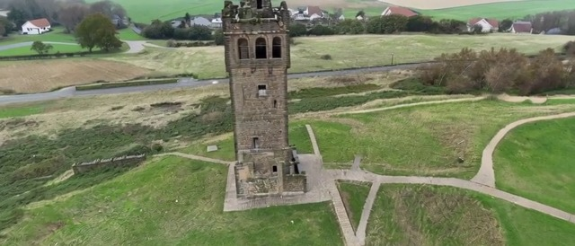
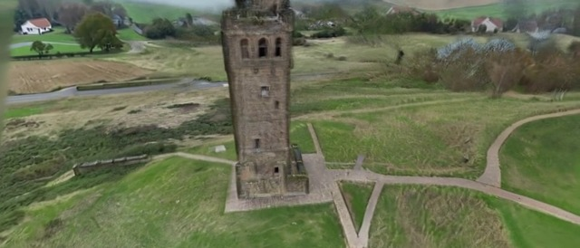
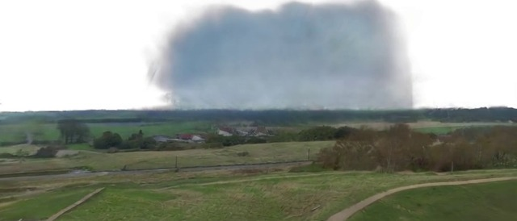
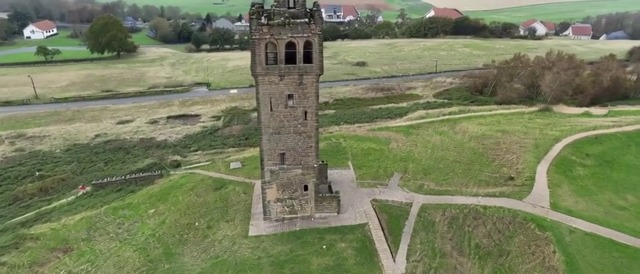
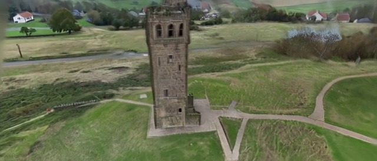
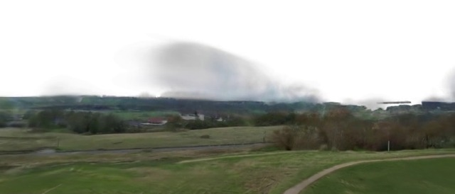
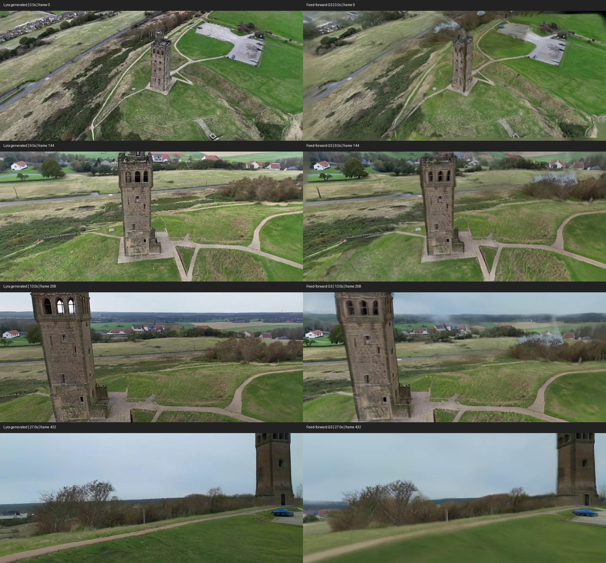
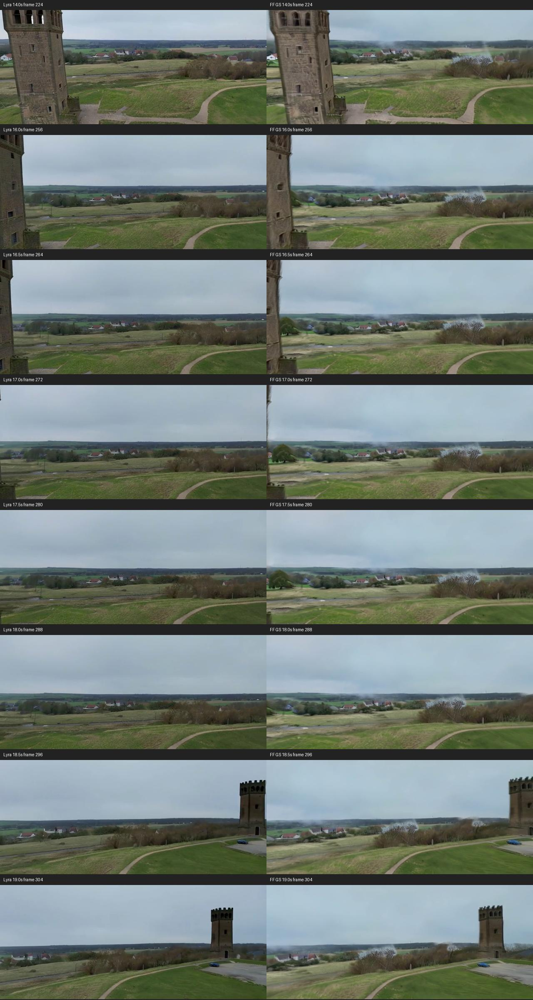

### 용어 정리

| 항목                   | 역할                                                                                                                |
| -------------------- | ----------------------------------------------------------------------------------------------------------------- |
| 명령 포즈                | Lyra에 입력한 카메라 위치·방향                                                                                               |
| 추정 포즈                | 생성된 영상의 관측을 설명하도록 ViPE 또는 COLMAP이 추정한 카메라 위치·방향                                                                |
| FF GS(Feed Forward)  | 학습된 복원 모델이 Gaussian 파라미터를 예측하는 피드포워드 방식의 3DGS   (학습된 모델이 사진을 보고 Gaussian의 위치·크기·색 등을 예측)                       |
| OPT GS(Optimization) | 해당 장면의 렌더링 오차를 줄이도록 Gaussian 파라미터를 반복 조정하는 최적화 방식의 3DGS   (Gaussian 장면을 그린 이미지가 원본과 비슷해질 때까지 위치·크기·색 등을 반복 수정) |
| NVS                  | 복원 입력에 없던 카메라 시점의 이미지 합성   (입력 영상에서 보지 못했던 방향으로 카메라를 옮겨 장면을 그려보는 것)                                            |

## 9_17 GS 결과

https://github.com/user-attachments/assets/b6733899-0fb5-46c7-ae8c-62907da7f8d0
- 최적화 및 카메라 경로 문제가 있었음

# 조치 사항들

### 1. COLMAP 포즈 재추정 및 OPT GS

- 생성 영상은 유지하고, COLMAP으로 카메라를 다시 추정하여 OPT GS 학습에 활용.
- 즉 기존 영상을 어느 위치에서 찍은 것처럼 보이는지 COLMAP으로 다시 계산해 GS제작에 사용

#### 적용 구성
1. gsplat: Gaussian을 그리는 도구
2. 하늘 마스크: 하늘 영역을 학습, 평가에서 구분
3. 포즈 미세보정: 카메라 위치 방향을 추가로 조금씩 조정

| 방식                                                            | 기존 기록의 시험 PSNR, 하늘 제외 (dB) |
| ------------------------------------------------------------- | -------------------------- |
| FF   (장면별 반복 조정 없이 모델이 예측한 결과의 점수입니다.)                     | 20.58                      |
| 명령 포즈 사용 OPT   (Lyra에 지시했던 카메라 위치를 기준으로 장면을 반복 조정한 결과입니다.) | 19.30                      |
| SfM 전 구간 OPT   (영상 전체에서 카메라를 다시 추정하고 그 정보를 사용한 결과입니다.)     | 23.18                      |

- PSNR은 두 이미지의 픽셀 값이 얼마나 비슷한지 나타내는 지표

| 버전                 | 경로를 어떻게 바꿨나?                                             | Lyra 생성 영상                                                                                                                                            | FF GS 결과                                                                                                                                                        | OPT GS 결과                                                                                                                                                       |
| ------------------ | -------------------------------------------------------- | ----------------------------------------------------------------------------------------------------------------------------------------------------- | --------------------------------------------------------------------------------------------------------------------------------------------------------------- | --------------------------------------------------------------------------------------------------------------------------------------------------------------- |
| **v1 — 첫 pass-by** | 탑 옆을 지나며 하강한 뒤 개활지로 이동하도록 설계.                         |  ▶ v1 원본 |  ▶ v1 FF |  ▶ v1 OPT |
| **v2 — 시야각 반영**    | 카메라 시야각과 여유 각도를 반영해, 통과 후 원래 탑이 시선 뒤쪽에 남도록 명령 경로 수정.  |  ▶ v2 원본   |  ▶ v2 FF   |  ▶ v2 OPT   |
- v1: 탑을 한 바퀴 돌고 같은 장소를 다시 보는 상황을 피하려는 경로입니다.
- v2: 단순히 재방문하지 않는 것뿐 아니라 지나온 탑이 다시 보이지 않도록 설계했습니다.
  (v2에선 카메라 시야각과 여유 각도를 반영)

## 2. Lyra와 v2 FF 방식 관찰결과

| 구간     | 확인한 차이                                                                                               |
| ------ | ---------------------------------------------------------------------------------------------------- |
| 0~5초   | GS에서 탑 상단·지형의 번짐 및 변형이 더 두드러짐   (원본보다 GS에서 탑 꼭대기와 주변 땅이 덜 또렷하게 보입니다.)                             |
| 9~14초  | GS에서 창문·벽면 세부 정보가 흐려지고 오른쪽 수풀 위에 추가적인 밝은 얼룩 발생                                                       |
| 16~19초 | 왼쪽 탑이 사라진 후 약 18.5초에 오른쪽 탑 등장. Lyra 원본과 GS 양쪽에서 확인   (탑이 사라졌다 다시 나타나는 것은 원본에도 있어, GS만의 문제는 아닙니다.) |
| 24~30초 | GS에서 풀·나뭇가지·보행로의 세부 질감이 뭉개짐                                                                       |
### v2 기준 Lyra와 FF GS 동일 시간대 비교

  

### 개선 방향 정리
- Lyra 원본 품질이 결국 GS 품질을 결정하기에 Lyra 영상 개선을 목표로 변인 통제 실험을 진행할 예정
#### 카메라 급회전 완화
- 이동이 부드럽게 이어지도록 경로를 수정
#### 탑 통과 후 프롬프트 수정
- 현재는 탑 통과 후 탑이 보이지 않는다 라는 부정문으로 프롬프트를 넣었으나 탑이 여전히 등장한 상황 -> 부정문 대신 전방의 초원 보행로 수풀이 있음을 설명
#### 개선된 설정에 대해 여러 시드로 재검증
- 한 번 우연히 잘 나온 결과인지 반복해서 개선되는지를 확인
