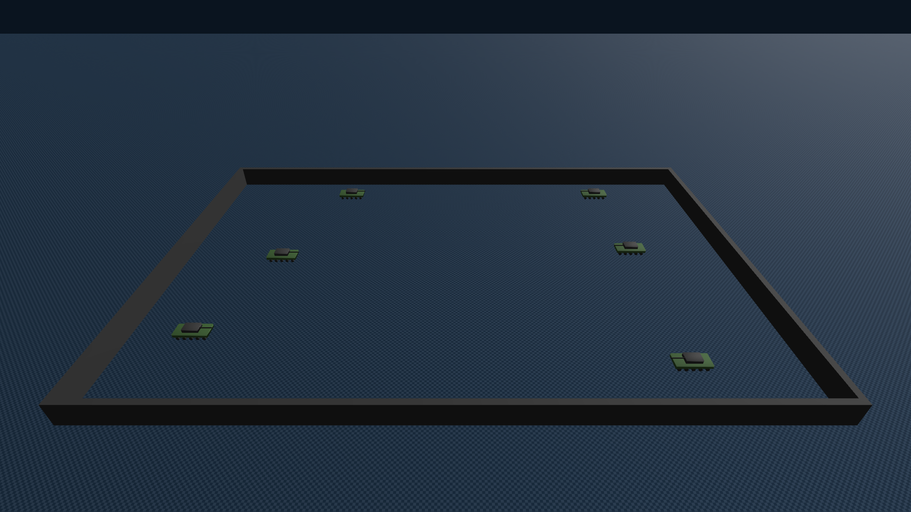
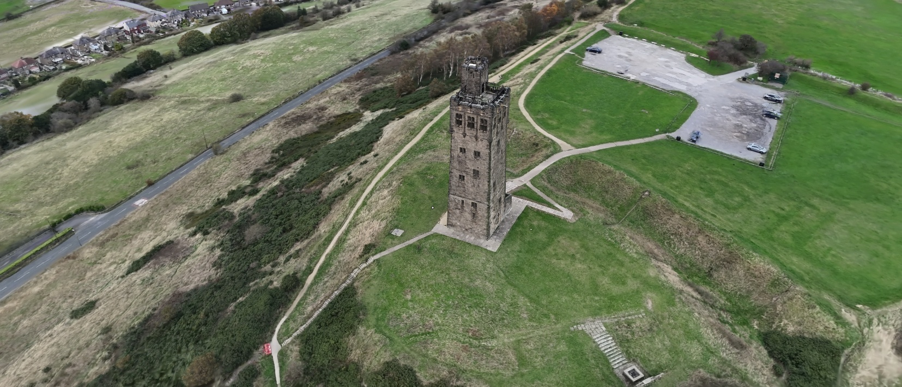
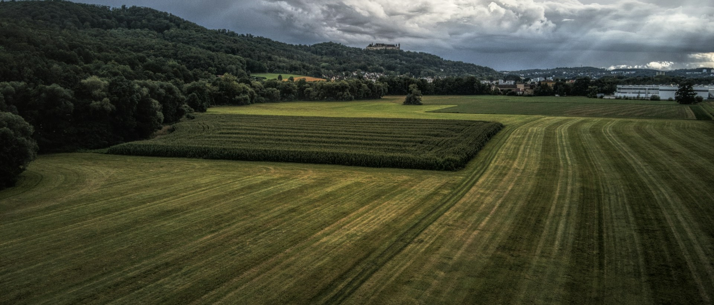

# 1. MARL 현황

- Lyra로 map을 만들다 보니, 지금까지 학습한 특정 map에서의 정책들이 너무 **특정 map**에만 통용되는 전술이라고 생각이 들었습니다.
- 따라서 평지 map에서 익힐 수 있는 전술들을 최대한 익히게 해둔 후 이후 전술이 필요한 map이 정해지면 그 map에 맞는 전술을 fine tuning 시키는 방식으로 가는게 맞을 것이라 생각하였습니다.
- 학습 방식은 이전과 동일합니다, 현재 전문가(교사) 룰봇 튜닝중에 있습니다.

## 1.1 학습 환경

| 항목 | 내용 |
| --- | --- |
| 맵 | 150 × 100 m 평지, 장애물·통로 없음 |
| 스폰 | 각 진영 열의 남/중/북 칸에 한 대씩 무작위 배치(같은 팀은 같은 진영) |
| 상대 | 룰봇 22종 (대기·돌격 조합 × 돌격 시점 0/30/60초) |
| 명중률 | 0.95 − 0.005 × 거리(m), 70 m 밖은 0 |
| 피해 | 정면 6.5 / 측면 17.5 / 후면 30, 재장전 5초 |

### 평지 map

## 1.2 학습중인 전략

| 전략 | 규칙 |
| --- | --- |
| 공통 전진선 | 세 대가 같은 x선(10 m 간격)을 맞춰 함께 전진. 한 대만 튀어나가 각개격파되는 것을 막음 |
| **점사 (Focus fire)** | 팀 전체가 한 표적을 쏨. 표적 고르는 순서: 사거리 안 → HP 최저 → 아군 무게중심에서 최근접 |
| 미리 조준 | 이동 중에도 포탑을 표적에 맞춰 두고, 포신 오차 1.5° 안일 때만 발사 |
| **손상 후퇴** | 내 HP ≤ 30이고 가장 건강한 아군과 HP 차이 ≥ 20이면 후퇴. 최근접 적과 63~67 m(사거리 밖)를 유지하다가 HP 차이가 10 이하가 되면 복귀 |
| 혼자 남으면 돌진 | 마지막 한 대는 대형 유지가 의미 없으므로 표적 25 m 앞까지 돌진 |
| **어그로 초기화** | 후퇴한 탱크는 모든 적과 72 m 밖으로 최대 15초 빠져 적의 표적에서 벗어남 |

## 1.3 전투 영상

https://github.com/user-attachments/assets/13e1685e-e0f5-4ada-98b6-d03cc000a5f8

- 교사 룰봇 완성 후 BC -> DAgger ->PPO 순으로 진행할 예정

# 2. Lyra 현황

- 9/22 보고에서 정한 개선 방향을 반영해, 입력 사진과 카메라 경로를 새로 잡았습니다.

## 2.1 급회전 문제 해결

- 기존에는 카메라 회전 속도에 대해 제한이 없었으나 너무 빠른 회전은 곧 해당 구간 품질 저하로 이어졌었음
- 따라서 **초당 10° 이하**로, 진행 방향 ±40° 밖은 보지 않고 뒤를 돌아보지 않음으로위 문제를 해결하고 생성 모델이 마음대로 만들어내는 object들을 최소화함

## 2.2 input 사진 변경

- GS 렌더 이미지는 그 자체로 선명하지 못 한 품질이기에 실제 사진으로 input을 변경(Lyra 품질 개선 목적)

### 이전 input

### 현재 input

## 2.3 생성된 GS에 대해 추가적으로 최적화 진행

- 아래 과정을 6000번 반복

1. 481 프레임의 Lyra 영상 중 1 프레임을 랜덤으로 샘플링
2. GS에서 3D 장면을 같은 위치와 방향에서 촬영
3. 두 이미지를 비교 후 loss를 구함
4. loss가 줄어드는 방향으로 가우시안의 색, 투명도 등을 수정

- Loss = 0.8 × L1 + 0.2 × (1 − SSIM)
- L1: 같은 위치의 픽셀 색이 얼마나 다른가?
- SSIM: 주변 픽셀들이 만드는 밝기, 대비(contrast), 무늬가 얼마나 비슷한가?
- L1을 0.8 SSIM을 0.2만큼 가중치를 두고 LOSS를 구성

## 2.4 결과

### Lyra

https://github.com/user-attachments/assets/a2f7e12b-2b59-4a0c-a73e-d5d19ea48125

### GS

https://github.com/user-attachments/assets/e03b1e29-1548-44a6-9959-32b5e7a3823c
