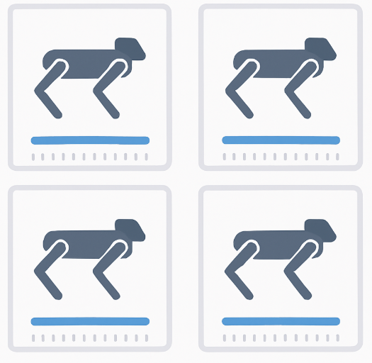
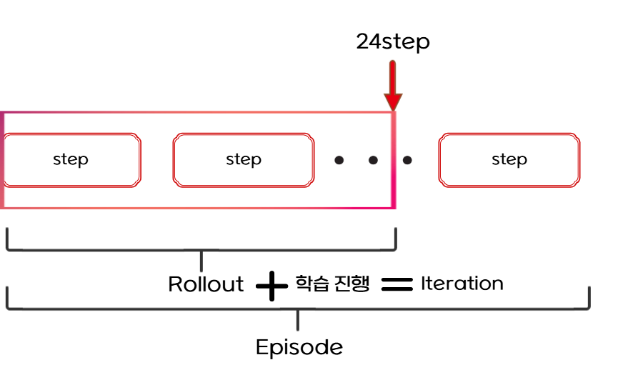
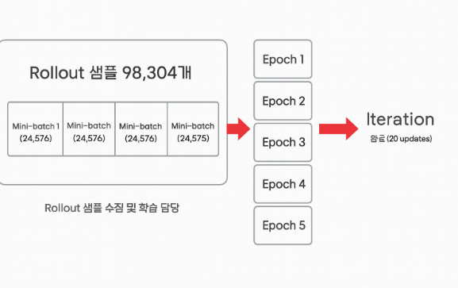

# 백플립 학습 데이터 조사
## 사전 설명
backflip 예제 관련 train코드가 없어 학습 데이터를 찾을 수 없었습니다. 대신 백플립과 비슷한 go2 로봇의 보행 예제의 학습 데이터를 조사하였습니다.
# 용어정리
## env
- 가상 시뮬레이션 세계 하나(로봇 1마리)
- 이 예제에선 num_envs = 4096 
    - 로봇 4096마리를 동시에 돌림  

## step
- 현재 상태 관측 -> 정책이 행동을 선택 -> 환경이 그 행동을 반영해서 다음 상태와 보상 반환
    - 이 하나의 과정이 1 step
- 즉 로봇이 한 발짝 움직이는 순간 같은 최소 단위
## Episode
- 시작부터 정해진 종료조건까지의 step 묶음
    - ex) 로봇이 300 step 동안 걷다가 넘어짐 -> episode 길이 = 300 step
## Rollout
- 환경을 실제로 일정 길이만큼 실행해서 샘플 transition을 모으는 과정

## transition 
- 환경에서 한 스텝 실행할 때 생기는 데이터 묶음
- **로봇을 24 스텝 동안 뛰게 해서 데이터를 모으는 행위**를 의미
- 병렬 환경마다 하나씩 발생
- 24 steps(num_steps_per_env)
- 1개의 Rollout에 24 x 4096 = 98,304개의 샘플 transition를 수집
## Iteration
- Rollout으로 데이터를 모으고 정책을 학습하는 한 사이클
- 한 iteration에서:
    1. rollout으로 데이터 수집(98,304개 transition)
    2. mini-batch로 나눠 학습
    3. 데이터 폐기 -> 다음 iteration에서 새로운 rollout 수집  

## Mini-batch(새로 알게 된 개념)
- 98,304개의 샘플을 4등분(num_mini_batches = 4)
- mini-batch 크기 = 24,576
- 한번에 98,304개의 데이터 샘플을 GPU 메모리에 올려 학습하는게 아니라 mini-batch의 크기만큼 쪼개서 4번에 거쳐 학습
### 한번에 학습하지 않고 4번으로 쪼개는 이유?
- 한번에 98,304개의 데이터를 GPU 메모리에 올리면 부담이 커지고 학습 안정성이 떨어지기 때문
## epoch
- num_learning_epochs = 5
- mini-batch 4번 학습이 끝나면 -> epoch 1회
- 결과적으로 한 iteration마다 4 mini-batch X 5 epoch = 20번 update

## 이후 처리
- 한 iteration이 끝나면 학습이 끝난 데이터는 버림
- 남는 건 업데이트된 MLP 신경망 파라미터
- 업데이트된 신경망으로 다시 Rollout 시작
- max_iteration = 101 -> 이를 101번 반복
## 정리하며 들었던 의문점들
### 에피소드가 24step도 채우지 못 하고 종료되면?
- 즉시 해당 env를 리셋하고 남은 step동안 새로운 데이터를 계속 모음
- rollout은 24 step을 채워야 끝이남
    - 즉 rollout이 끝날 때는 각 env마다 24 transition이 채워져 있음
### 각 env에서 데이터를 빨리 모은 env는 먼저 학습을 진행하나?
- 그런 일은 일어날 수 없음
- step은 공통 시간 틱(time tick)
    - 시뮬레이터는 고정된 시간 간격으로 환경을 진행
    - dt = 0.02s  -> 1 step = 0.02초로 고정
- 즉 24 step이 되면 모든 env에서 transition 24개가 쌓이고 학습을 시작
### 에피소드의 종료조건은?
- roll > 10° -> 종료
- pitch > 10° → 종료
- 최대 길이: 20초(즉 한 에피소드에 1000step 제한)
