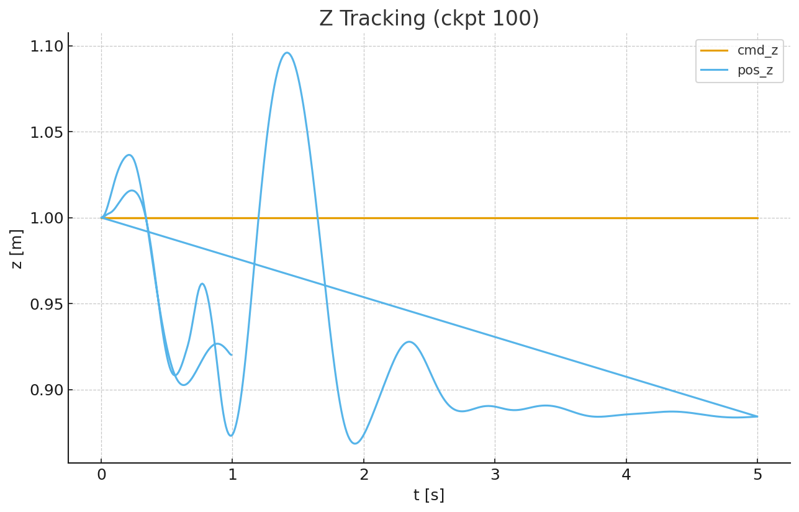
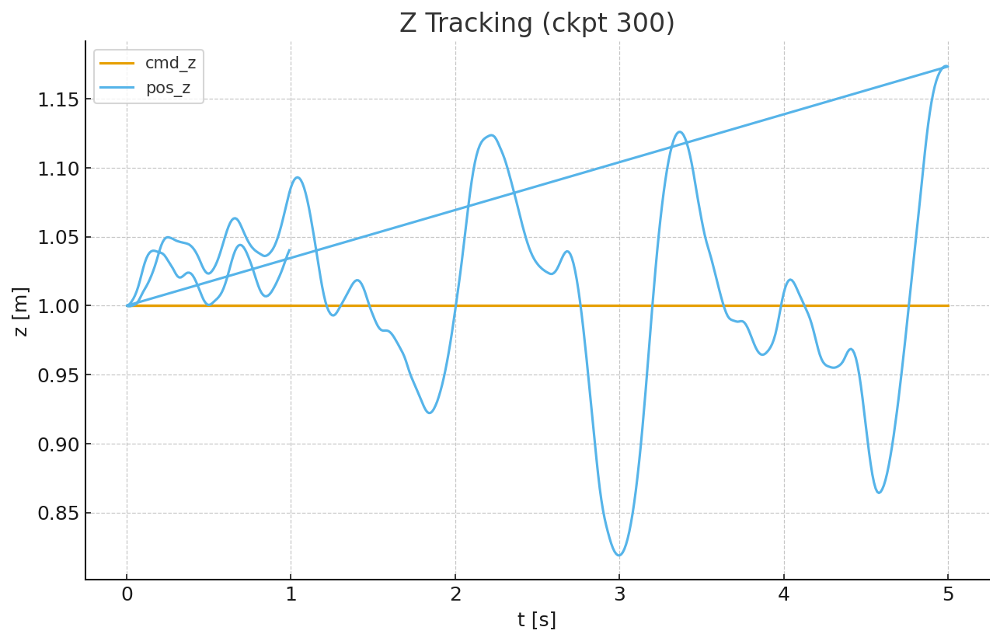
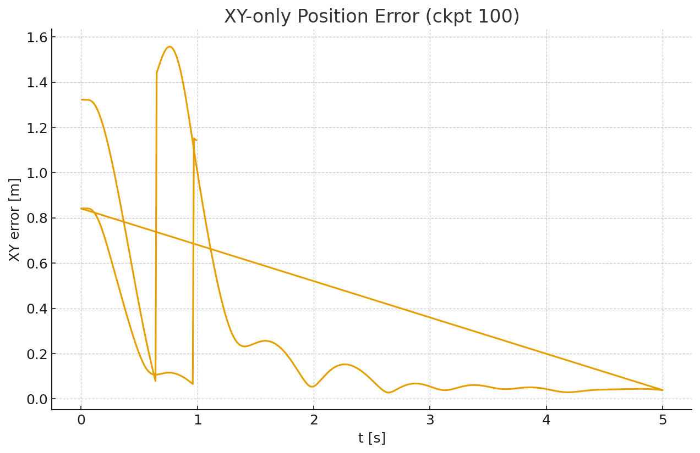
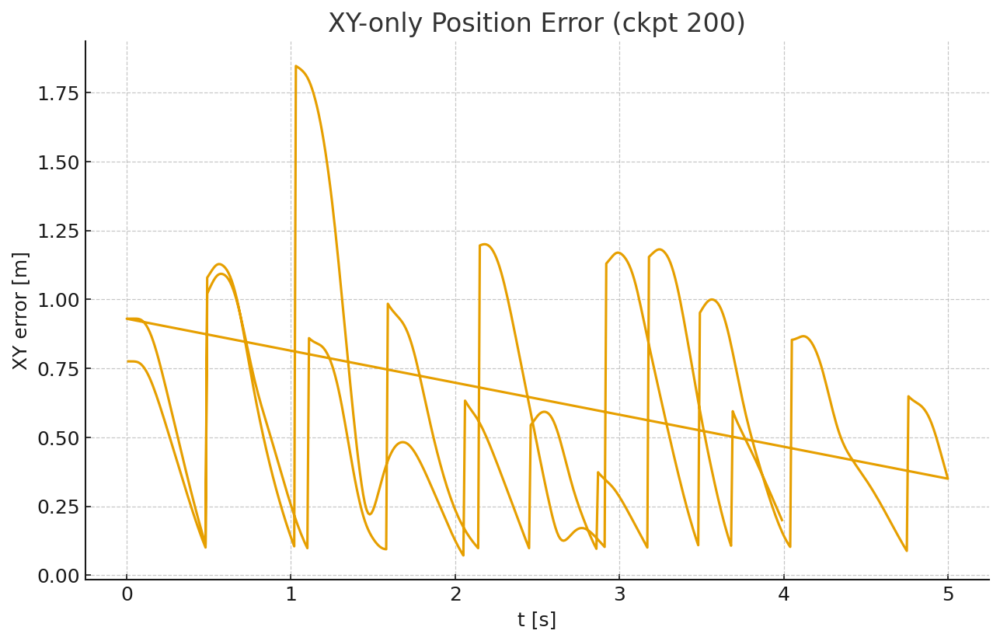
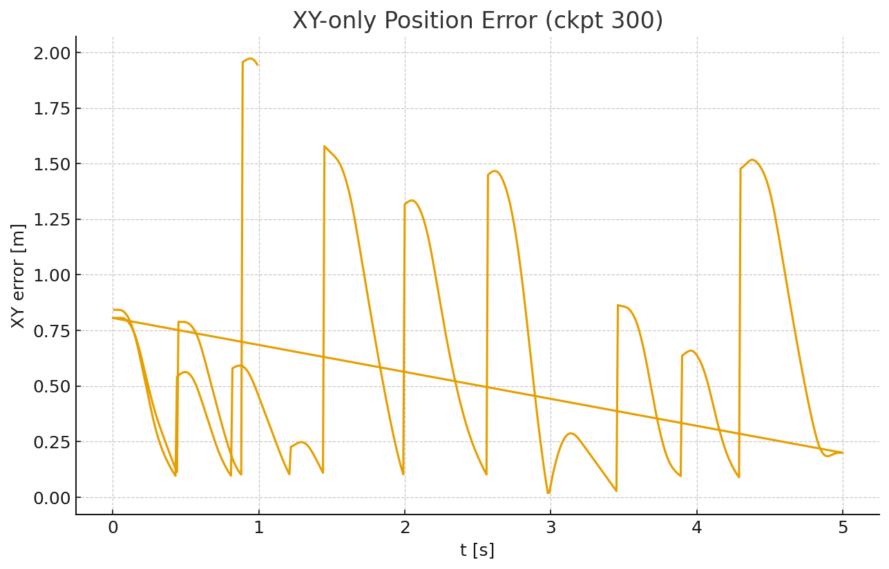
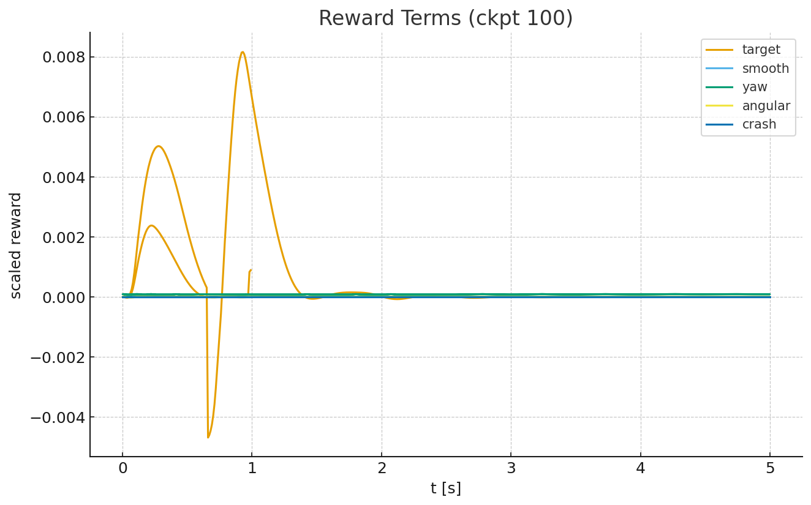
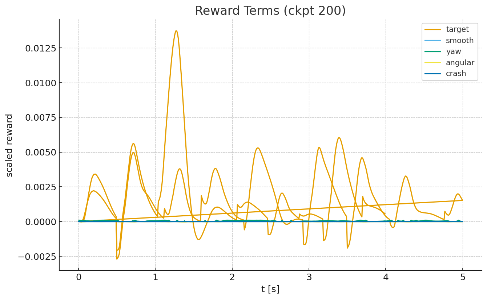
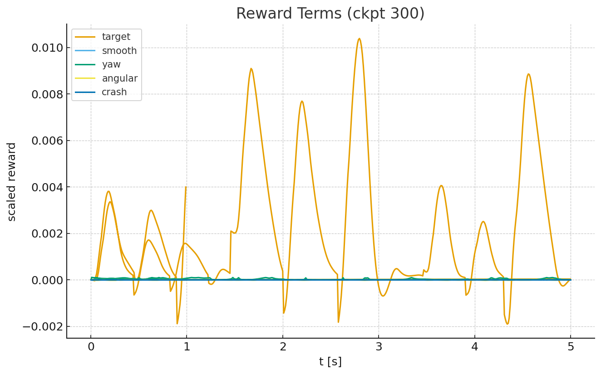

# Z추종(cmd_z vs pos_z)
- 목표 높이(cmd_z)와 실제 높이(pos_z)의 시간 변화
- x축은 시간(s), y축은 높이(m)
- 시간이 지남에 따라 실제 높이가 목표 높이를 얼마나 빨리 부드럽게 따라 붙는지 확인하는 그래프

# 오차(norm)
- 목표점과 실제 위치 사이 3D 거리(작을 수록 good)
- x축=시간(s), y축은 거리(m)
- 즉 값이 지속적으로 낮고 스파이크(갑작스러운 튐)가 거의 없는 게 good

# 보상 항목(target/smooth/yaw/angular/crash)
- 학습에 쓰인 보상 구성요소들이 시간에 따라 얼마나 기여했는지
- x축:시간(s), y축: 보상 값
## 각 항목의 의미
1. target: 목표에 가까워질수록 +인 값, 클수록/지속될수록 좋음
2. smooth: 행동 변화(액션 차이) 페널티, 너무 크면 제어가 거칠다는 뜻
3. yaw/angular: 회전(자세)관련 안전성, 값이 너무 크면 불안정한 경향을 띔
4. crash: 충돌 이벤트 표시, 즉 항상 0인 것이 이상적
- target이 전반적으로 +이고, crash가 0이며, smooth/angular가 과도하게 커지지 않는 것이 가장 이상적

